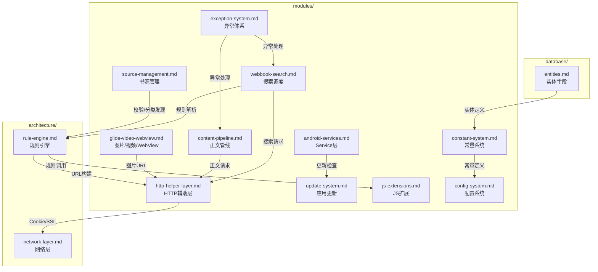

# 项目文档导航

> Legado（阅读M）项目 Wiki 文档体系。按任务类型或模块快速定位到对应文档。

---

## 快速路径

| 我要做什么 | 看哪个文档 |
|-----------|-----------|
| 了解整体架构 | [architecture/overview.md](./architecture/overview.md) |
| 了解前端页面布局 | [architecture/frontend.md](./architecture/frontend.md) |
| 理解前后端数据流 | [architecture/api-dataflow.md](./architecture/api-dataflow.md) |
| 查看核心实体字段 | [database/entities.md](./database/entities.md) |
| 新增/修改书源规则 | [architecture/rule-engine.md](./architecture/rule-engine.md) |
| 理解搜索并发逻辑 | [modules/webbook-search.md](./modules/webbook-search.md) |
| 修改正文后处理 | [modules/content-pipeline.md](./modules/content-pipeline.md) |
| 新增阅读功能 | [modules/reading-engine.md](./modules/reading-engine.md) |
| 新增数据库表/字段 | [modules/data-layer.md](./modules/data-layer.md) |
| 新增 Web API | [modules/web-service-api.md](./modules/web-service-api.md) |
| 优化 TXT/EPUB 解析 | [modules/local-book.md](./modules/local-book.md) |
| 了解 WebDAV/TTS/RSS | [modules/service-layer.md](./modules/service-layer.md) |
| 修改 UI/Activity | [architecture/android-ui-core.md](./architecture/android-ui-core.md) |
| 了解 Android 页面布局交互 | [architecture/android-ui-pages.md](./architecture/android-ui-pages.md) |
| 修改网络层/SSL | [architecture/network-layer.md](./architecture/network-layer.md) |
| 修改配置项 | [modules/config-system.md](./modules/config-system.md) |
| 新增后台 Service | [modules/android-services.md](./modules/android-services.md) |
| 修改备份/恢复 | [modules/backup-restore.md](./modules/backup-restore.md) |
| 集成第三方库 | [modules/remote-third-party.md](./modules/remote-third-party.md) |
| 速查命令/版本/文件 | [quick-reference.md](./quick-reference.md) |
| 了解启动流程 | [architecture/app-init.md](./architecture/app-init.md) |
| 了解 Model 单例 | [modules/model-layer.md](./modules/model-layer.md) |
| 编写书源 JS 规则 | [modules/js-extensions.md](./modules/js-extensions.md) |
| 管理书源/导入导出 | [modules/source-management.md](./modules/source-management.md) |
| 了解 MVVM/Base | [architecture/base-layer.md](./architecture/base-layer.md) |
| 开发 RSS 订阅 | [modules/rss-subsystem.md](./modules/rss-subsystem.md) |
| 修改工具类/协程/加密 | [modules/tools-infrastructure.md](./modules/tools-infrastructure.md) |
| 了解 help/ 辅助工具层 | [modules/help-layer.md](./modules/help-layer.md) |
| 开发MOBI/WebDAV/主题 | [modules/custom-libraries.md](./modules/custom-libraries.md) |
| 了解安全模型/SSL/JS沙箱 | [architecture/security-model.md](./architecture/security-model.md) |
| 查看CI/CD流程 | [architecture/ci-cd-pipeline.md](./architecture/ci-cd-pipeline.md) |
| 理解Intent/Deep Link | [architecture/intent-deep-links.md](./architecture/intent-deep-links.md) |
| 修改核心UI页面 | [modules/ui-core-pages.md](./modules/ui-core-pages.md) |
| 修改次要UI页面 | [modules/ui-secondary-pages.md](./modules/ui-secondary-pages.md) |
| 理解关联导入体系 | [modules/association-import.md](./modules/association-import.md) |
| 了解广播接收器 | [modules/tools-infrastructure.md](./modules/tools-infrastructure.md) §4 |
| 查看工具/扩展函数 | [modules/tools-infrastructure.md](./modules/tools-infrastructure.md) §1 |
| 了解构建配置 | [architecture/build-configuration.md](./architecture/build-configuration.md) |
| 理解多模块架构 | [architecture/multi-module-architecture.md](./architecture/multi-module-architecture.md) |

---

## 文档结构

``` 
docs/project-flow/
├── README.md                          ← 你在这里
├── INDEX.md                           ← 全局关键词索引（210+条目）
├── quick-reference.md                 ← 命令/文件/版本锁定速查
├── architecture/
│   ├── overview.md                    ← 四层架构+数据流+设计模式
│   ├── multi-agent-analysis-spec.md    ← 🔴 AI方法论（强制遵循：五阶段流水线+单代理≤12文件）
│   ├── rule-engine.md                 ← 规则引擎（SourceRule状态机+五种解析+JS环境+WebJs模式+ruleType常量）
│   ├── rule-engine-js-env.md          ← JS环境绑定（AnalyzeRule+AnalyzeUrl绑定+Rhino缓存+@put/@get变量）
│   ├── rule-engine-algorithms.md      ← 规则引擎算法（SourceRule初始化+RuleAnalyzer完整算法+前缀检测）
│   ├── frontend.md                    ← Vue3 MPA架构（config/types等9模块+路由+组件树+功能）
│   ├── frontend-refactor-plan.md      ← Vue3 Web重构方案（⚠️未实施存档：路由+组件树+阅读器核心+Store/API，store落地3/5，并入原components/stores两册）
│   ├── api-dataflow.md                ← 接口数据流（HTTP/WS/Beacon完整链路+API表）
│   ├── android-ui-core.md             ← Android UI核心框架册（MainActivity主框架+Activity/Fragment体系+Base+导航+启动+N1顶栏+N2 Compose现状）
│   ├── android-ui-pages.md            ← Android UI页面详解册（页面布局交互+调试+搜索+发现+导入+工具+N3订阅双模式+N4发现页缓存加固）
│   ├── android-ui-media-theme.md      ← Android UI阅读媒体与主题册（阅读界面+排版+漫画+音频+Widget+主题+布局资源+横屏+N5 EPUB高亮+N6画质增强）
│   ├── android-ui-changelog.md        ← Android UI统计与变更记录册（UI层源码统计+时敏优化记录）
│   ├── network-layer.md               ← 网络层（OkHttp拦截器链+SSL+Cookie+Cronet+代理）
│   ├── app-init.md                    ← App初始化（50步启动+常量+EventBus+异常+监控）
│   ├── base-layer.md                  ← ⭐ Base类与MVVM（BaseActivity/VM/Service+RecyclerAdapter+Diff）
│   ├── security-model.md              ← ⭐ 安全模型（SSL全信任+Rhino沙箱4层防护+AES/ECB加密+权限模型+ProGuard）
│   ├── ci-cd-pipeline.md              ← ⭐ CI/CD流程（5个GitHub Actions workflow+dependabot+发布渠道矩阵）
│   ├── intent-deep-links.md           ← ⭐ Intent体系（Deep Link注册+URL Scheme+文件关联+分享接收+IntentData）
│   ├── build-configuration.md         ← 构建配置（Gradle配置+版本目录+依赖清单+ProGuard+版本锁定）
│   ├── multi-module-architecture.md   ← 多模块架构（3+1模块+依赖关系+rhino/book/web模块详解）
│   └── skill-architecture.md          ← Skill体系架构（陷阱体系+JVM仿真器+Python客户端）
├── database/
│   ├── overview.md                    ← 数据库概览（AppDatabase定义+版本+迁移清单）
│   ├── entities.md                    ← 实体与字段详解（BookSource+Book+5组规则字段）
│   ├── entities-extensions.md         ← 扩展实体清单（v90-v108新增35实体：AI能力/朗读BGM/阅读增强/系统管理）
│   └── tables.md                      ← 表结构DDL（核心21表DDL+新增表速览+索引+约束，当前v108）
├── modules/
    ├── webbook-search.md              ← WebBook双版本+搜索调度+四分类去重
    ├── content-pipeline.md            ← ContentProcessor八步管线+替换规则引擎
    ├── reading-engine.md              ← ReadBook状态机+三章缓存+预下载
    ├── reading-engine-media.md        ← 阅读引擎媒体层（BookType位标志+ReadManga+AudioPlay）
    ├── reading-engine-pagination.md   ← 阅读引擎排版层（durChapterPos+TextChapter+翻页动画）
    ├── data-layer.md                  ← 56实体+43DAO+1视图（BookSourcePart）+AutoMigration
    ├── web-service.md                 ← Web服务索引页（详情分见web-service-api/web-service-lifecycle两册）
    ├── web-service-api.md             ← Web服务REST API规范（HttpServer路由+端点+WebSocket+Beacon+静态服务+Vue3前端对照）
    ├── web-service-lifecycle.md       ← Web服务生命周期（WebService+ReaderProvider+快捷方式+WiFi传书+安全模型）
    ├── local-book.md                  ← TXT编码检测+目录规则+EPUB
    ├── service-layer.md               ← WebDAV+TTS+RSS+JS扩展
    ├── config-system.md               ← 配置系统（AppConfig+ReadBookConfig+ThemeConfig+字段类型修正）
    ├── android-services.md            ← Service层（11个Service+WebSocketServer+CustomExporter+ExoPlayer+朗读状态机+WakeLock）
    ├── backup-restore.md              ← 备份恢复（21数据源JSON导出+AES+WebDAV同步）
    ├── remote-third-party.md          ← 远程书+第三方库（Glide/GSYVideo/ExoPlayer+更新）
    ├── model-layer.md                 ← ⭐ Model层单例（ReadAloud/VideoPlay/BookCover/CheckSource等）
    ├── js-extensions.md               ← ⭐ JS扩展函数（30+方法：ajax/webView/cache/file/encode）
    ├── source-management.md           ← 书源管理（导入/导出/校验/调试/登录/18+全链路）
    ├── rss-subsystem.md               ← ⭐ RSS子系统（Rss调度+规则解析+标准解析+文章流UI）
    ├── tools-infrastructure.md         ← ⭐ 工具与辅助层（utils+协程+加密+广播接收器）
    ├── help-layer.md                   ← ⭐ Help辅助层（监控三件套+数据传递+渲染优化+规则辅助+缓存系统+默认数据）
    ├── exception-system.md              ← 异常体系（NoStackTraceException+7种业务异常+使用场景）
    ├── constant-system.md               ← 常量系统（13个常量模块+位标志+@IntDef+预编译正则+事件总线）
    ├── glide-video-webview.md            ← Glide·视频·WebView索引页（详情分见glide/video/webview-pool三册）
    ├── glide.md                          ← Glide图片加载（ModelLoader+Fetcher体系+OkHttpStreamFetcher+注册中心+模糊变换+异步回收）
    ├── video.md                          ← 视频播放（四层架构+VideoPlayer/FloatingPlayer+弹幕+ExoPlayer引擎层+画质增强+手势体系）
    ├── webview-pool.md                   ← WebView池化（对象池+动态Context+WebJsExtensions桥接）
    ├── http-helper-layer.md              ← HTTP辅助层（okHttpClient拦截器链+Cookie分层+SSL+BackstageWebView+Cronet封装）
    ├── update-system.md                  ← 应用更新系统（策略模式+GitHub/Gitee双源+AppVariant变体匹配）
    ├── custom-libraries.md             ← ⭐ 自定义库层（MOBI解析引擎+WebDAV+主题引擎+阿里云TTS+Cronet+权限+对话框+偏好控件）
    ├── rhino-module.md                   ← ⭐ Rhino模块（沙箱体系+协程桥接+递归保护+Continuation机制）
    ├── widget-system.md                  ← ⭐ 自定义控件体系（70+控件8子包+主题感知+阅读界面控件组合）
    ├── ui-core-pages.md                  ← ⭐ 核心UI页面（ReadBookActivity 1857行+MainActivity+搜索/书源/设置/欢迎页）
    ├── ui-secondary-pages.md             ← ⭐ 次要UI页面（替换规则+字典+代码编辑+视频+浏览器+文件+登录+二维码+字体）
    ├── association-import.md             ← ⭐ 关联导入体系（8种ImportDialog+FileAssociationActivity+Deep Link路由）
    └── tools-infrastructure.md           ← ⭐ 工具与辅助层（utils工具类+协程封装+加密+广播接收器，含原广播接收器体系与工具扩展函数两册内容）
├── python-ref/                        ← Python重构参考外迁区（权威业务文档仍在modules/与architecture/）
│   ├── README.md                      ← 目录用途+6件清单+权威源声明
│   ├── reading-engine.md              ← 阅读引擎Python参考（ReadBook状态+三章缓存+翻页跳章）
│   ├── web-service.md                 ← Web服务Python参考（REST API+数据模型）
│   ├── local-book.md                  ← 本地书籍解析Python参考（TXT/EPUB）
│   ├── service-layer.md               ← 服务层Python参考（WebDAV/TTS/RSS）
│   ├── webbook-search.md              ← WebBook搜索Python参考（并发调度+四分类）
│   └── config-system.md               ← 配置系统Python参考（AppConfig/ReadBookConfig）
```

---

## 文档覆盖的源码模块关系



---

## 文档设计原则

1. **任务导向** — 每个文档对应一个开发任务领域
2. **深度 + 行号** — 算法伪代码+数据模型+状态机+精确代码锚点
3. **模块独立** — 可独立阅读，减少交叉引用
4. **大小控制** — 单文档 ≤ 400行，AI Agent 一次性加载不压缩
5. **可迭代扩展** — 新增文档无需重构现有结构

---

## 关联文件

| 文件 | 说明 |
|------|------|
| [AGENTS.md](../../AGENTS.md) | 项目根 AI Agent 指南（任务导航表） |
| docs/README.md | 项目文档总入口（索引与导航） |