# 接口数据流 — 前后端交互全链路

> Vue3 前端 → HTTP/WebSocket → HttpServer 路由分发 → Controller 业务处理 → 数据层。

---

## 通信架构时序图

```mermaid
%%{init: {'themeVariables': {'fontFamily': 'Microsoft YaHei, SimHei, sans-serif'}}}%%
sequenceDiagram
    participant FE as "Vue3前端<br/>Hash路由SPA"
    participant AX as "Axios<br/>HTTP客户端"
    participant WS as "WebSocket<br/>实时通道"
    participant BE as "HttpServer<br/>NanoHTTPD :1122"
    participant WSS as "WebSocketServer<br/>:1123"
    participant CTL as "Controller<br/>业务处理"
    participant MDL as "Model<br/>业务逻辑"
    participant DB as "Room<br/>数据库"

    rect rgb(40, 60, 80)
        Note over FE, DB: HTTP 请求响应流程
        FE->>AX: HTTP GET/POST
        AX->>BE: /api/xxx?params
        BE->>BE: "路由匹配<br/>HttpServer.kt:25-146"
        BE->>CTL: "分发到对应Controller"
        CTL->>MDL: "调用业务逻辑"
        MDL->>DB: "数据库操作"
        DB-->>MDL: "查询结果"
        MDL-->>CTL: "业务结果"
        CTL-->>BE: ReturnData JSON
        BE-->>AX: HTTP Response
        AX-->>FE: {isSuccess, errorMsg, data}
    end

    rect rgb(60, 40, 80)
        Note over FE, DB: WebSocket 实时推送流程
        FE->>WS: new WebSocket("ws://host:1123/searchBook")
        WS->>WSS: "WebSocket连接建立"
        FE->>WS: send({searchKey, bookSources})
        WSS->>CTL: "解析消息"
        CTL->>MDL: SearchModel.search
        loop 每个书源搜索完成
            MDL-->>WSS: "搜索结果"
            WSS-->>WS: "JSON推送"
            WS-->>FE: "onMessage实时更新UI"
        end
    end

    rect rgb(80, 60, 40)
        Note over FE, BE: Beacon 可靠发送流程
        FE->>BE: navigator.sendBeacon<br/>/saveBookProgress
        Note over FE, BE: 页面关闭时也能发送<br/>不阻塞页面卸载
    end
```



---

## 1. 通信架构

```
前端 (Vue3)                   后端 (Kotlin NanoHTTPD)
    │                                │
    ├─ HTTP (Axios) ────────→ port 1122 ──→ HttpServer.serve()
    │   GET / POST                    │
    │                                ├─ 路由匹配
    │                                ├─ Controller 处理
    │                                │   ├─ BookController
    │                                │   ├─ BookSourceController
    │                                │   ├─ RssSourceController
    │                                │   └─ ReplaceRuleController
    │                                ├─ 业务逻辑层 (model/)
    │                                └─ ReturnData JSON 响应
    │                                     │
    │  ←── { isSuccess, errorMsg, data } ┘
    │
    ├─ WebSocket ──────────→ port 1123 ──→ WebSocketServer (/searchBook)
    │                                            (/bookSourceDebug)
    │                                            (/rssSourceDebug)
    │                                ├─ 实时推送搜索/调试结果
    │                                └─ 流式日志输出
    │
    └─ Beacon ────────────→ port 1122 ──→ /saveBookProgress
         (navigator.sendBeacon)             页面关闭可靠发送
```

**端口规则：** HTTP 默认 1122，WebSocket = HTTP端口 + 1 (默认 1123)

---

## 2. 统一响应格式

```typescript
// 前端 TypeScript 类型定义
type LegadoApiResponse<T> = {
  isSuccess: boolean   // true=成功, false=错误
  errorMsg: string     // 成功为空, 失败为错误描述
  data: T              // 响应数据体
}
```

```kotlin
// 后端 ReturnData.kt
class ReturnData {
    var isSuccess: Boolean = false
    var errorMsg: String = "未知错误,请联系开发者!"
    var data: Any? = null
}
```

**前端拦截器自动校验：** 每个 HTTP 响应的 `isSuccess` 字段被 [api/index.ts 拦截器](file:///f:/myself/github/WeAgentChat/temp/legado/modules/web/src/api/index.ts#L23-L48) 校验，失败则显示错误通知。

---

## 3. 完整数据流：以"阅读一本书"为例

### 3.1 书架→阅读 完整链路

```
用户从书架点击一本书
    │
    ▼
前端: BookShelf.vue → 点击 BookItems 卡片
    │  router.push('/chapter')
    │
    ▼
前端: BookChapter.vue 组件 mounted()
    │
    ├─ 步骤1: 获取目录
    │    API.getChapterList(bookUrl)
    │    ↓ GET /getChapterList?url=xxx
    │    ↓ HttpServer → BookController.getChapterList()
    │    ↓ db.bookChapterDao.getChapterList(bookUrl)
    │    ↓ 返回 List<BookChapter> → JSON
    │    ← { isSuccess:true, data: [{url,title,index,...}] }
    │
    ├─ 步骤2: 获取当前章节正文
    │    API.getBookContent(bookUrl, durChapterIndex)
    │    ↓ GET /getBookContent?url=xxx&index=N
    │    ↓ HttpServer → BookController.getBookContent()
    │    ↓ ReadBook.loadContent() → 三章缓存 → contentLoadFinish()
    │    ↓ ContentProcessor.getContent() 八步管线
    │    ↓ 返回处理后正文字符串
    │    ← { isSuccess:true, data: "<p>正文内容...</p>" }
    │
    └─ 步骤3: 正文渲染
         ChapterContent.vue → 设置 innerHTML

用户翻页 → 步骤2重复（获取新章节正文）

用户关闭页面:
  ── navigator.sendBeacon → POST /saveBookProgress
      { bookUrl, durChapterIndex, durChapterPos }
      HttpServer → BookController.saveBookProgress()
      → db.bookDao.update(book)
```

### 3.2 搜索完整链路

```
用户搜索关键词 "三体"
    │
    ▼
前端: SearchDialog.vue
    │
    ▼ WebSocket 连接 /searchBook
    │  socket.send('{"key":"三体"}')
    │
    ▼
后端: WebSocketServer → BookSearchWebSocket
    │  SearchModel.search("三体")
    │  ├─ Flow + mapParallelSafe(N)
    │  ├─ WebBook.searchBookAwait(每个书源)
    │  │   ├─ AnalyzeUrl → HTTP请求源站
    │  │   └─ BookList.analyzeBookList → 解析结果
    │  └─ 四分类聚合去重
    │
    ▼ 实时推送给前端
    socket.onmessage → JSON.parse → SearchBook[]
    │  直接发送 JSON 数组，每批一条推送
    │
    ▼
前端: SearchDialog → 渲染搜索结果列表
    点击结果 → router.push('/chapter') 进入阅读
```

### 3.3 书源编辑保存链路

```
用户编辑书源表单 (SourceTabForm.vue)
    │
    ├─ 编辑搜索规则 SearchRule 各字段
    ├─ 编辑详情规则 BookInfoRule 各字段
    ├─ 编辑目录规则 TocRule 各字段
    ├─ 编辑正文规则 ContentRule 各字段
    │
    ▼ 保存
前端: SourceEditor.vue →
    API.saveSource(sourceJson)
    ↓ POST /saveBookSource
    ↓ HttpServer → BookSourceController.saveSource()
    ↓ db.bookSourceDao.insertOrUpdate(source)
    ↓ 返回
    ← { isSuccess:true, data:null }
    │
    ▼
前端: SourceList.vue → 刷新列表

调试:
  输入关键词 → API.debug(sourceUrl, key, onReceive, onFinish)
  ↓ WebSocket /bookSourceDebug
  ↓ 服务端实时执行规则 → 流式推送日志
  ↓ onReceive → SourceDebug 组件显示调试结果
```

---

## 4. 完整 API 对照表

> **唯一权威约定**：本节为前端 ↔ 后端 Web API 对照的唯一权威版本（frontend.md §6 仅留指针）。表中"前端调用"列与 `modules/web/src/api/api.ts` 实际导出函数一一对应（2026-08 逐函数核验，共 19 个 HTTP/WS 函数 + 2 个备份函数）。**禁止在无 api.ts 实证的情况下向本表追加前端调用行**（历史上曾出现 7 行虚构调用，已清除）。

### 4.1 Books 相关

| 前端调用 | HTTP方法 | 路由路径 | Controller方法 | 入参 | 返回 |
|----------|----------|----------|---------------|------|------|
| `API.getBookShelf()` | GET | `/getBookshelf` | `BookController.bookshelf` | — | `Book[]` |
| `API.getChapterList(url)` | GET | `/getChapterList?url=` | `BookController.getChapterList` | url | `BookChapter[]` |
| `API.getBookContent(url, idx)` | GET | `/getBookContent?url=&index=` | `BookController.getBookContent` | url,index | `string` |
| `API.saveBook(book)` | POST | `/saveBook` | `BookController.saveBook` | Book JSON | `null` |
| `API.deleteBook(book)` | POST | `/deleteBook` | `BookController.deleteBook` | Book JSON | `null` |
| `API.saveBookProgress(p)` | POST | `/saveBookProgress` | `BookController.saveBookProgress` | BookProgress | `null` |
| `API.saveBookProgressWithBeacon(p)` | sendBeacon (POST) | `/saveBookProgress` | `BookController.saveBookProgress` | BookProgress | — （页面关闭可靠发送） |
| `API.getReadConfig()` | GET | `/getReadConfig` | `BookController.getWebReadConfig` | — | `webReadConfig` |
| `API.saveReadConfig(c)` | POST | `/saveReadConfig` | `BookController.saveWebReadConfig` | config | `null` |
| `API.getProxyCoverUrl(url)` | GET | `/cover?path=` | `BookController.getCover` | path | 图片二进制 |
| `API.getProxyImageUrl(u,s,w)` | GET | `/image?path=&url=&width=` | `BookController.getImg` | path,url,width | 图片二进制 |

### 4.2 书源/RSS源 相关

| 前端调用 | HTTP方法 | 路由路径 | Controller方法 | 说明 |
|----------|----------|----------|---------------|------|
| `API.getSources()` | GET | `/getBookSources` 或 `/getRssSources` | `sources` | isBookSource 判断 |
| `API.saveSource(data)` | POST | `/saveBookSource` 或 `/saveRssSource` | `saveSource` | 单个保存 |
| `API.saveSources(data)` | POST | `/saveBookSources` 或 `/saveRssSources` | `saveSources` | 批量保存 |
| `API.deleteSource(data)` | POST | `/deleteBookSources` 或 `/deleteRssSources` | `deleteSources` | 批量删除 |

> ⚠️ **历史勘误（2026-08）**：本表曾包含 `API.getBookSource(url)` / `API.getRssSource(url)` / `API.refreshToc(url)` / `API.addLocalBook(book)` / `API.saveReplaceRule(rule)` / `API.deleteReplaceRule(rule)` / `API.testReplaceRule(rule)` 共 7 行，经与 `modules/web/src/api/api.ts` 全量函数清单比对，**这些前端函数并不存在（0 命中），属虚构调用，已全部删除**。替换规则/本地书籍的导入链路见 [modules/association-import.md](../modules/association-import.md) 与 [modules/web-service.md](../modules/web-service.md)，勿在本表凭后端端点反推前端调用。

### 4.3 WebSocket 端点

| 前端调用 | WS路径 | 方向 | 消息格式 |
|----------|--------|------|----------|
| `API.search(key, onRcv, onFinish)` | `/searchBook` | 客户端→服务端 | `{"key":"搜索词"}` |
| | | 服务端→客户端 | `[SearchBook, ...]` JSON 数组分批推送，完成时关闭连接 |
| `API.debug(sourceUrl,key,onRcv,onFinish)` | `/bookSourceDebug` / `/rssSourceDebug` | 客户端→服务端 | `{"tag":"sourceUrl","key":"关键词"}` |
| | | 服务端→客户端 | JSON 日志（state=10/20/30/40 不输出, -1 错误关闭, 1000 完成关闭） |

### 4.4 备份相关（Web 前端 BackupManager 页）

| 前端调用 | HTTP方法 | 路由路径 | 服务端处理 | 返回 | 说明 |
|----------|----------|----------|-----------|------|------|
| `API.getBackupPreview()`（api.ts 封装，实际视图层用裸 `fetch`） | GET | `/backupPreview` | `BackupController.getBackupPreview()` | `BackupOverview` JSON（fileName/totalSize/createTime/items[]） | 备份内容预览 |
| `API.getBackupUrl()`（api.ts 封装，实际视图层用裸 `fetch`） | GET | `/backup` | HttpServer 特判（`HttpServer.kt` `if (uri == "/backup")` 分支） | ZIP 文件二进制流 | 非 ReturnData JSON 封装；前端以 Blob + `<a download="backup.zip">` 触发下载 |

---

## 5. 错误处理流程

```
前端: Axios 响应拦截器 → responseCheckInterceptor()
    │
    ├─ resp.data 包含 {isSuccess, errorMsg} ?
    │   ├─ YES → isSuccess=true 且 data 存在 → 正常返回
    │   ├─ YES → isSuccess=false → 显示 errorMsg
    │   └─ NO  → ElMessage.warning("后端返回内容格式错误")
    │
    ├─ HTTP 48X/50X → axiosErrorInterceptor()
    │   └─ ElMessage.error("后端连接失败...")
    │
    └─ WebSocket error → wsOnError → 同上处理

连接状态:
  Pinia Store → useConnectionStore()
    ├─ 成功: setConnectType('primary') + setConnectStatus('已连接')
    └─ 失败: setConnectType('danger')  + setConnectStatus('连接异常')
```

---

## 6. API 端点发现规则

前端自动发现后端 API 入口：

[api/index.ts parseLeagdoHttpUrlWithDefault()](file:///f:/myself/github/WeAgentChat/temp/legado/modules/web/src/api/index.ts#L72-L104)

```
规则:
1. 默认使用当前页面 origin
2. 如果 baseURL 是有效 URL → 使用 baseURL
3. WebSocket 端口 = HTTP 端口 + 1
4. WebSocket 协议 = HTTP 是 https? → wss:// 否则 ws://

示例:
  HTTP  http://192.168.1.5:1122  →  WS  ws://192.168.1.5:1123
  HTTP  https://host:1443        →  WS  wss://host:1444
  HTTP  http://host (无端口)     →  WS  ws://host:81
  HTTP  https://host (无端口)    →  WS  wss://host:444
```

---

## 7. WebSocket 数据流详细规范

### 7.1 搜索 WebSocket 数据流 (`/searchBook`)

```
时序:
  1. 前端建立 WebSocket 连接 ws://host:1123/searchBook
  2. 前端发送: {"key": "搜索关键词"}
  3. 后端解析 JSON:
     ├─ 非 JSON → 发送 "数据必须为Json格式" → 关闭连接
     └─ key 为空 → 发送 "不能为空" → 关闭连接
  4. 后端启动搜索: SearchModel.search(key)
     ├─ Flow + mapParallelSafe(N) 并发搜索多个书源
     ├─ 每个书源搜索完成 → 立即推送 JSON 数组
     └─ 四分类聚合去重
  5. 后端逐批推送搜索结果:
     → [SearchBook, SearchBook, ...]  (JSON 数组)
  6. 搜索完成 → NormalClosure(1000, "Search finish")
  7. 搜索取消 → NormalClosure(1000, 异常信息)
```

**搜索结果数据结构**：

```json
{
    "bookUrl": "书籍URL",
    "origin": "书源URL",
    "originName": "书源名称",
    "type": 0,
    "name": "书名",
    "author": "作者",
    "kind": "分类",
    "coverUrl": "封面URL",
    "intro": "简介",
    "wordCount": "字数",
    "latestChapterTitle": "最新章节",
    "tocUrl": "目录URL",
    "time": 1700000000000,
    "variable": null,
    "originOrder": 0,
    "respondTime": 500
}
```

### 7.2 书源调试 WebSocket 数据流 (`/bookSourceDebug`)

```
时序:
  1. 前端建立 WebSocket 连接 ws://host:1123/bookSourceDebug
  2. 前端发送: {"tag": "书源URL", "key": "调试关键词"}
  3. 后端根据 key 前缀选择调试模式:
     ├─ 普通文本 → 搜索调试
     ├─ 绝对 URL → 详情页调试
     ├─ 含 "::" → 发现页调试
     ├─ "++" 开头 → 目录页调试
     └─ "--" 开头 → 正文页调试
  4. 后端逐行推送调试日志:
     → "[mm:ss.SSS] 开始搜索..."
     → "[mm:ss.SSS] 搜索URL: ..."
     → "[mm:ss.SSS] ≡获取成功:..."
     → "[mm:ss.SSS] ┌获取正文内容"
  5. 状态码控制:
     ├─ state=10/20/30/40 → 内部状态，不发送给客户端
     ├─ state=-1 → 调试出错，关闭连接
     └─ state=1000 → 调试完成，关闭连接
  6. 调试结束 → Debug.cancelDebug(true) → NormalClosure(1000, "调试结束")
```

**调试日志特殊符号**：

| 符号 | 含义 |
|------|------|
| `≡` | 跳过了某步骤 |
| `┌`/`└` | 获取正文内容开始/结束 |
| `◇` | 章节信息提示 |

### 7.3 RSS 源调试 WebSocket 数据流 (`/rssSourceDebug`)

```
时序:
  1. 前端建立 WebSocket 连接 ws://host:1123/rssSourceDebug
  2. 前端发送: {"tag": "RSS源URL"}  (无 key 字段)
  3. 后端查找 RSS 源 → Debug.startDebug(rssSource)
  4. 后端逐行推送调试日志:
     → "[mm:ss.SSS] ︾开始解析"
     → "[mm:ss.SSS] ⇒列表页解析成功"
     → "[mm:ss.SSS] ︽列表页解析完成"
  5. 调试结束 → NormalClosure(1000, "调试结束")
```

**RSS 调试日志特殊符号**：

| 符号 | 含义 |
|------|------|
| `︾` | 开始某一阶段解析 |
| `︽` | 完成某一阶段解析 |
| `⇒` | 信息提示/状态更新 |
| `≡` | 跳过了某步骤 |

### 7.4 WebSocket 通用行为

- **心跳 Ping**：服务端每 30 秒发送一次 ping 帧
- **连接超时**：30 秒无通信超时
- **编码**：所有消息为 UTF-8 文本帧
- **单例管理**：Debug 对象是单例，`Debug.callback` 指向当前 WebSocket 实例

---

## 8. HTTP 服务器配置与数据流影响

### 端口配置

| 配置项 | 默认值 | 说明 |
|--------|--------|------|
| `webPort`（PreferKey） | `1122` | HTTP 服务端口，有效范围 `1024~65530` |
| WebSocket 端口 | HTTP端口 + 1 | 自动计算，不可独立配置 |

### CORS 对数据流的影响

```
CORS 头:
  Access-Control-Allow-Origin: <请求来源>  (动态回显)
  Access-Control-Allow-Methods: GET, POST
  Access-Control-Allow-Headers: content-type

影响:
  - OPTIONS 预检请求自动响应，不进入 Controller
  - Origin 动态回显，支持任意来源的 Web 前端
  - 仅允许 GET/POST 方法
```

### 特殊响应类型对数据流的影响

| 条件 | Content-Type | 数据流处理 |
|------|-------------|-----------|
| `data is Bitmap` | `image/png` | 封面/图片直接返回二进制流，不走 ReturnData JSON 封装 |
| `data is List && size > 3000` | `application/json`（chunked） | 大数据量使用 Pipe 分块传输，减少内存峰值 |
| 其他正常响应 | `application/json` | 标准 ReturnData JSON 响应 |
| 异常响应 | `text/plain` | 直接返回 `e.message` 纯文本，非 JSON 格式 |

### 日志记录

每条请求记录日志：

```
${METHOD} - ${URI} - ${QueryParams} - Start($timestamp)
${METHOD} - ${URI} - ${QueryParams} - End($timestamp)        // 成功
${METHOD} - ${URI} - ${QueryParams} - Error End($timestamp)   // 失败
```