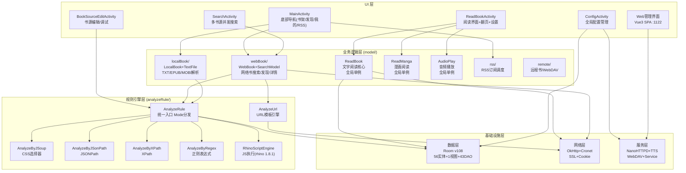

# 架构全景图

## 项目定位

**Legado（阅读M）** 是一款面向 Android 平台的开源电子书阅读器（原版仓库 [gedoor/legado](https://github.com/gedoor/legado)）。**本项目为 fork 版本**：fork 自 [legado-E](https://github.com/Luoyacheng/legado-E)，私有仓 `github.com/syq17496152/legado`。与市场上大多数阅读器不同，Legado 的核心设计理念是**用户驱动的书源规则引擎**——用户通过编写自定义规则，即可将任意网页转化为结构化的书籍资源。

### 核心特征

| 特征 | 说明 |
|------|------|
| **自定义书源规则引擎** | 核心差异化能力，支持 CSS 选择器、JSONPath、XPath、正则表达式、JavaScript 五种解析方式 |
| **多格式本地支持** | TXT / EPUB / MOBI / PDF / UMD 等本地书籍解析与阅读 |
| **多内容类型** | 文字阅读、漫画阅读、音频播放（TTS + 在线音频） |
| **RSS 订阅** | 内置 RSS 订阅源管理，支持自定义订阅规则 |
| **Web 管理界面** | Vue3 SPA，端口 1122，支持远程书架管理 |
| **WebDAV 同步** | 书架、配置、书源跨设备同步 |

### 技术栈

| 层次 | 技术 |
|------|------|
| 语言 | Kotlin 2.3.x / Java 17 |
| UI | Android Activity + Fragment + ViewModel |
| 规则引擎 | jsoup 1.16.2（CSS）/ JSONPath / JsoupXpath（XPath） / Rhino 1.8.1（JS） |
| 网络 | OkHttp 3.x + Cronet（可选） |
| 数据库 | Room v108（56 实体 + 1 视图 + 43 DAO，版本以 AppDatabase.kt version 字段为准） |
| Web 服务 | NanoHTTPD + Vue3 |
| 加密 | hutool 5.8.22（书源加解密） |

### 一句话定位

> Legado = **规则引擎驱动**的 Android 电子书阅读器。用户编写规则 → 规则引擎解析网页 → 结构化书籍数据 → 多种阅读模式消费。

---

> Legado 四层架构：UI → 业务逻辑 → 规则引擎 → 数据/网络/服务层。

---

## 四层架构 Mermaid 图



---

## 分层架构

```
┌─────────────────────────────────────────────────────┐
│ UI 层 (Activity/Fragment/ViewModel)                  │
│  SearchActivity / ReadBookActivity / Web管理界面      │
├─────────────────────────────────────────────────────┤
│ 业务逻辑层 (model/)                                   │
│  ├── webBook/    (WebBook/SearchModel/BookList)      │
│  ├── localBook/  (LocalBook/TextFile/EpubFile)       │
│  ├── ReadBook    (阅读核心 全局单例)                  │
│  ├── ReadManga   (漫画阅读 全局单例)                  │
│  ├── AudioPlay   (音频播放 全局单例)                  │
│  ├── rss/        (RSS订阅管理)                        │
│  ├── remote/     (远程书/WebDAV)                      │
│  └── Download/CacheBook (下载/缓存)                   │
├─────────────────────────────────────────────────────┤
│ 规则引擎层 (analyzeRule/)                             │
│  ├── AnalyzeRule     (统一入口 Mode分发)              │
│  ├── AnalyzeByJSoup  (CSS选择器 jsoup 1.16.2)        │
│  ├── AnalyzeByJSonPath (JSONPath)                    │
│  ├── AnalyzeByXPath  (XPath JsoupXpath)              │
│  ├── AnalyzeByRegex  (正则表达式)                     │
│  ├── AnalyzeUrl      (URL模板引擎)                    │
│  └── RhinoScriptEngine (JS执行 rhino 1.8.1)         │
├─────────────────────────────────────────────────────┤
│ 基础设施层                                            │
│  ├── 数据层 (Room 56实体+1视图+43DAO v108)            │
│  ├── 网络层 (OkHttp + Cronet)                        │
│  └── 服务层 (NanoHTTPD + WebDAV + TTS)               │
└─────────────────────────────────────────────────────┘
```

---

## 数据流

### 搜索数据流
```
UI 输入关键词
  → SearchModel.search(key)
    → Flow.mapParallelSafe(并发)
      → WebBook.searchBookAwait(bookSource)
        → AnalyzeUrl → HTTP 请求
        → BookList.analyzeBookList → 解析结果
      → 四分类聚合去重
    → UI 更新搜索结果
```

### 阅读数据流
```
用户点击书籍
  → ReadBook.resetData(book)
    → loadContent(三章)
      → WebBook.getContentAwait() / LocalBook.getContent()
        → ContentProcessor.getContent() 八步管线
    → TextChapter 创建 → UI 渲染
```

### 本地书导入数据流
```
用户选择文件
  → LocalBook.importFile(path)
    → 扩展名检测 → 分发到 TextFile/EpubFile/...
    → 编码检测 (TXT)
    → 目录规则自动选择 (TXT)
    → Book + Chapters 写入数据库
```

---

## 设计模式总结

| 模式 | 应用场景 |
|------|----------|
| **全局单例 (object)** | ReadBook, ReadManga, AudioPlay, WebBook, AppWebDav |
| **门面模式 (Facade)** | LocalBook (按文件类型分发) |
| **双版本方法** | WebBook.xxx() + xxxAwait() |
| **WeakReference 缓存** | ContentProcessor (防内存泄漏) |
| **状态机** | SourceRule (规则预处理), SearchModel (搜索调度) |
| **位标志 (Bit Flags)** | Book.type, Book.group |
| **模板引擎** | AnalyzeUrl ({{key}}/{{page}} 变量替换) |
| **管线模式** | ContentProcessor 八步处理管线 |
| **REPLACE 策略** | Room Entity 持久化（OnConflictStrategy.REPLACE） |

---

## 关键版本锁定

| 依赖 | 版本 | 原因 |
|------|------|------|
| jsoup | 1.16.2 | 新版 select() 破坏性变更（jsoup#2017） |
| rhino | 1.8.1 | API 33 以下不可用的 VarHandle（desugaring 不覆盖） |
| hutool | 5.8.22 | 书源加解密依赖 |
| commons-text | 1.13.1 | API 24 以下不可用的 Arrays.setAll（desugaring 不覆盖） |
| protobuf | 4.26.1 | 兼容性锁定 |
| Kotlin | 2.3.x | 项目语言 |
| Java | 17 | 编译目标 |

---

## 架构阅读路线图

> 本文档集与 [INDEX.md](../INDEX.md)（150+ 条目关键词索引）、[README.md](../README.md) 存在收录重叠，本表仅按**阅读顺序**组织导航；速查请直接用 [quick-reference.md](../quick-reference.md)。

### 主线路线（建议按序阅读）

| 序 | 文档 | 一句话说明 |
|----|------|-----------|
| 1 | [architecture/rule-engine.md](architecture/rule-engine.md) | 规则引擎：SourceRule 状态机+五种解析+JS 环境（核心差异化，先读） |
| 2 | [architecture/api-dataflow.md](architecture/api-dataflow.md) | HTTP/WebSocket/Beacon 完整链路+API 对照表 |
| 3 | [../database/entities.md](../database/entities.md) | BookSource/Book/SearchBook 等核心实体字段详解 |
| 4 | [architecture/android-ui-core.md](architecture/android-ui-core.md) | UI 四册之核心册：MainActivity 导航+Activity/Fragment 体系+N1 顶栏（姊妹册：pages/media-theme/changelog） |
| 5 | [architecture/network-layer.md](architecture/network-layer.md) | OkHttp 拦截器链+SSL+Cookie+Cronet+AnalyzeUrl 请求管线 |
| 6 | [architecture/app-init.md](architecture/app-init.md) | 50 步启动流程+常量系统+EventBus+异常体系 |
| 7 | [architecture/base-layer.md](architecture/base-layer.md) | Base 类与 MVVM：Activity/ViewModel/Adapter |
| 8 | [architecture/frontend.md](architecture/frontend.md) | Vue3 单入口 SPA（main.ts）：config/types 等 9 模块+路由+组件树 |
| 9 | [architecture/multi-agent-analysis-spec.md](architecture/multi-agent-analysis-spec.md) | AI 方法论（强制遵循）：五阶段流水线+单代理≤12文件+交叉验证 |

### 模块文档（按需查阅）

| 文档 | 一句话说明 |
|------|-----------|
| [modules/webbook-search.md](../modules/webbook-search.md) | WebBook 双版本+并发搜索+四分类去重 |
| [modules/content-pipeline.md](../modules/content-pipeline.md) | ContentProcessor 八步管线+替换规则引擎 |
| [modules/reading-engine.md](../modules/reading-engine.md) | ReadBook 状态机+三章缓存+预下载+漫画+音频 |
| [modules/data-layer.md](../modules/data-layer.md) | Room 实体/DAO/AutoMigration+位标志+TypeConverter |
| [modules/web-service.md](../modules/web-service.md) | NanoHTTPD 路由+控制器+WebSocket+静态服务 |
| [modules/local-book.md](../modules/local-book.md) | TXT 编码检测+目录规则+EPUB+MOBI+PDF+UMD |
| [modules/config-system.md](../modules/config-system.md) | AppConfig/ReadBookConfig/ThemeConfig/SourceConfig 配置体系 |
| [modules/android-services.md](../modules/android-services.md) | Service 层：朗读状态机+音频焦点+WebSocket+ExoPlayer+通知 |
| [modules/backup-restore.md](../modules/backup-restore.md) | 备份 JSON 导出+AES 加密+WebDAV 同步 |
| [modules/remote-third-party.md](../modules/remote-third-party.md) | 远程书/WebDAV 浏览+Glide/GSYVideo/ExoPlayer+更新系统 |
| [modules/model-layer.md](../modules/model-layer.md) | Model 层单例：ReadAloud/VideoPlay/BookCover/CheckSource 等 |
| [modules/js-extensions.md](../modules/js-extensions.md) | 30+ JS 可调用方法（ajax/file/encode 等） |
| [modules/source-management.md](../modules/source-management.md) | 书源导入/导出/校验/调试/登录全链路 |
| [modules/rss-subsystem.md](../modules/rss-subsystem.md) | RSS 调度+规则解析+文章流 UI |
| [modules/tools-infrastructure.md](../modules/tools-infrastructure.md) | utils 工具类+协程封装+加密+广播接收器 |
| [modules/custom-libraries.md](../modules/custom-libraries.md) | MOBI 解析引擎+WebDAV 客户端+主题引擎+阿里云 TTS |
