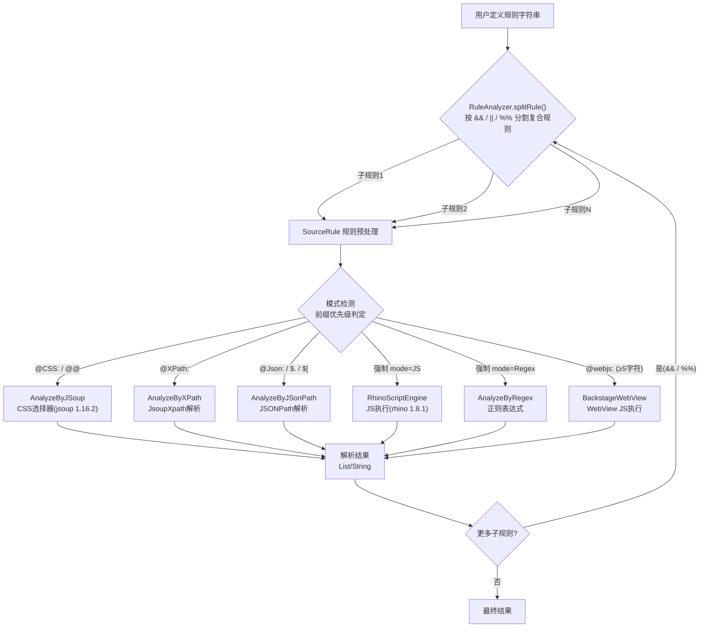
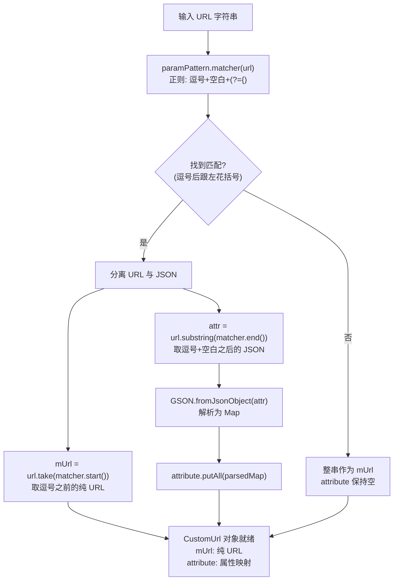
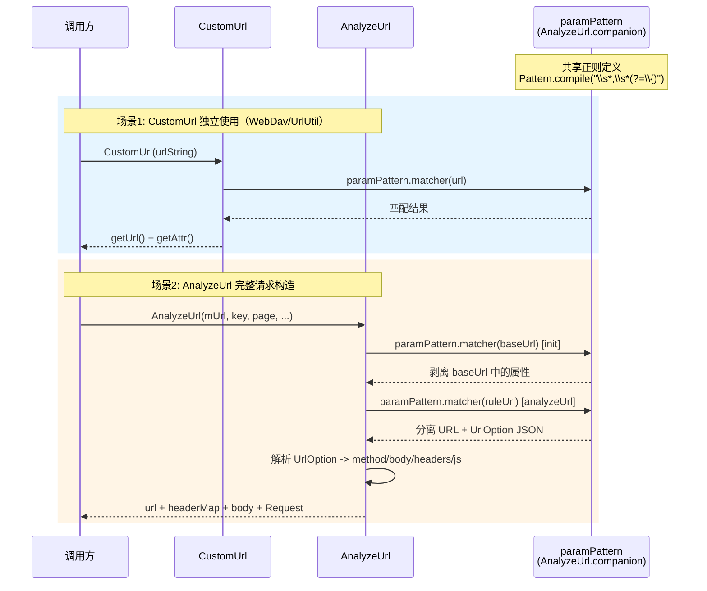

# 规则引擎详解

> Legado 核心竞争壁垒——五种解析方式统一入口，SourceRule 是规则预处理状态机，AnalyzeUrl 处理模板变量注入。

---

## 子文档索引

| 文档 | 内容 |
|------|------|
| [规则引擎算法详解](./rule-engine-algorithms.md) | SourceRule 完整规范、RuleAnalyzer 完整算法、五种解析器算法细节、Mode 枚举 |
| [JS 执行环境与变量机制](./rule-engine-js-env.md) | AnalyzeRule/AnalyzeUrl 环境绑定、ajax 跨域请求、Rhino 编译缓存、共享作用域、@put/@get 变量机制 |

---

## 规则解析全流程



---

## 1. 架构总览

```
书源规则字符串（用户在 BookSource 中定义）
    │
    ▼
RuleAnalyzer.splitRule()  ← 按 && / || / %% 分割复合规则
    │
    ▼
SourceRule(ruleStr, mode) ← 规则预处理：模式检测 + putMap/@get/{{}}/$N/## 分离
    │
    ▼
AnalyzeRule.getString(ruleStr) / getElements(ruleStr)
    │  (根据 SourceRule.mode 分发到具体解析器)
    │
    ├─ mode=Default  → AnalyzeByJSoup   (CSS选择器 jsoup 1.16.2)
    ├─ mode=Json     → AnalyzeByJSonPath (JSONPath)
    ├─ mode=XPath    → AnalyzeByXPath    (JsoupXpath)
    ├─ mode=JS       → RhinoScriptEngine (Mozilla Rhino 1.8.1)
    ├─ mode=Regex    → AnalyzeByRegex   (Java Regex)
    └─ mode=WebJs    → BackstageWebView (WebView JS执行)
```

---

## 2. SourceRule — 规则预处理状态机

[AnalyzeRule.kt SourceRule 内部类](file:///f:/myself/github/WeAgentChat/temp/legado/app/src/main/java/io/legado/app/model/analyzeRule/AnalyzeRule.kt#L585)

### 2.1 Mode 枚举

**六种模式，按优先级检测：**

```
enum Mode:
    Default  # CSS选择器（默认）
    Json     # JSONPath
    XPath    # JsoupXpath
    JS       # Rhino JavaScript
    Regex    # 正则表达式
    WebJs    # WebView JS (BackstageWebView)
```

各模式与子解析器的对应关系：

| Mode | 子解析器 | getString 调用 | getElements 调用 |
|------|----------|----------------|------------------|
| DEFAULT | AnalyzeByJSoup | `.getString(rule)` | `.getElements(rule)` |
| XPATH | AnalyzeByXPath | `.getString(rule)` | `.getElements(rule)` |
| JSON | AnalyzeByJSonPath | `.getString(rule)` | `.getList(rule)` / `.getObject(rule)` |
| JS | Rhino | `evalJS(rule, result)` | `evalJS(rule, result)` |
| REGEX | AnalyzeByRegex | `.getElement(res, regs)` | `.getElements(res, regs)` |
| WEBJS | BackstageWebView | `getWebJsResult(rule, result)` | `getWebJsResult(rule, result)` |

### 2.2 规则模式检测算法

[AnalyzeRule.kt 前缀解析](file:///f:/myself/github/WeAgentChat/temp/legado/app/src/main/java/io/legado/app/model/analyzeRule/AnalyzeRule.kt#L601-L631)

```mermaid
%%{init: {'themeVariables': {'fontFamily': 'Microsoft YaHei, SimHei, sans-serif'}}}%%
stateDiagram-v2
    [*] --> ModeDetect: "规则输入"
    ModeDetect --> URL: "无前缀"
    ModeDetect --> JS: "@js: 或 <js>"
    ModeDetect --> JSON: "$. 或 $["
    ModeDetect --> REGEX: "##"
    ModeDetect --> REPLACE: "@replace:"
    ModeDetect --> NONE: "空规则"
    URL --> Default: "isJSON=false"
    URL --> JSON: "isJSON=true"
    Default --> CSS: "jsoup选择器"
```

```
规则前缀检测（按优先级从高到低）：

1. JS/Regex 强制模式：如果外部传入 mode=JS 或 mode=Regex → 直接赋值 rule=ruleStr，跳过检测
2. "@CSS:" 开头 → mode=Default，**不剥离前缀**，rule 保留原始 ruleStr（前缀由 AnalyzeByJSoup.SourceRule 在内部剥离）
3. "@@": 开头  → mode=Default，剥离前缀 "@@"
4. "@XPath:" 开头 → mode=XPath，剥离前缀 "XPath:"
5. "@Json:" 开头 → mode=Json，剥离前缀 "Json:"
6. "$." 或 "$[" 开头 → mode=Json，保留原字符串
7. isJSON()=true (内容以 [ 或 { 开头) → mode=Json
8. "/" 开头 → mode=XPath
9. 其他 → 保持 mode=Default（由外部传入的默认模式）

> ⚠️ **@webjs: 前缀**：不在 SourceRule.init 中处理，而是在 `AnalyzeRule.splitSourceRule()` 中通过 `WebJS_PATTERN = @webjs:([\w\W]{5,})` 正则匹配（最少5字符），匹配后创建 `SourceRule(group(1), Mode.WebJs)`，此时 mode 已设为 WebJs，跳过上述检测。注意：`AnalyzeRule.splitSourceRule()` 与 `RuleAnalyzer.splitRule()` 是两个不同的方法——前者负责 JS/WebJS 片段的分割和 SourceRule 创建，后者负责按 `&&`/`||`/`%%` 分隔符切分规则字符串。
```

### 2.3 初始化四步流程

```
SourceRule.__init__(rule_str, mode)
      ├─ Step 1: mode 检测
      │   JS/Regex → 直接赋值 rule = rule_str
      │   @CSS: → mode=Default, 剥离前缀
      │   @@ → mode=Default, 剥离@@
      │   @XPath: → mode=XPath, 剥离前缀
      │   @Json: → mode=Json, 剥离前缀
      │   $./$[ → mode=Json, 保留原文
      │   isJSON=true → mode=Json
      │   /开头 → mode=XPath
      │   否则 → 保持传入的模式
      ├─ Step 2: splitPutRule()
      │   正则 @put:(\{[^}]+\}) 匹配
      │   移除匹配文本，JSON 解析加入 putMap
      ├─ Step 3: evalPattern 拆分 (@get:{} 和 {{}})
      │   evalPattern = @get:\{[^}]+\}|\{\{[\w\W]*?\}\}
      │   ├─ 匹配到 @get:{key} → ruleType.append(-2), param = key
      │   ├─ 匹配到 {{js}} → ruleType.append(-1), param = js_code
      │   └─ 中间和尾部文本 → splitRegex
      └─ Step 4: splitRegex（拆分 $0-$99 和 ##）
               ├─ 按 ## 分割
               ├─ 第一部分搜索 $\d{1,2}
               │   若找到且非 JS/Regex 模式，mode 强制切换为 Regex
               │   $N 前文本 type=0, $N type=N
               ├─ 第二部分 → replace_regex
               ├─ 第三部分 → replacement
               └─ 第四部分存在 → replace_first = True
```

> **完整 SourceRule 类结构、makeUpRule 运行流程、isRule 检测等算法细节** → [规则引擎算法详解 - SourceRule 完整规范](./rule-engine-algorithms.md#1-sourcerule-内部类完整规范)

### 2.4 makeUpRule — 运行时规则拼装

**在规则执行时（运行时）调用，将占位符替换为实际值：**

```
执行顺序（从后往前 insert 到 buf开头）：
1. $N 模式 → 从 List 结果中取第 N 个元素
2. {{js}} 块 → 判断是规则（@/$.开头）还是纯JS
   - 是规则 → 递归 getString(js)
   - 是JS → evalJS(js, result)，结果转字符串
3. @get:{key} → 从变量池取值（getFn(key)）
4. 普通文本 → 直接拼接

最终 ## 再次分割（第一次 init 时可能未完全分割）
```

### 2.5 putMap 变量系统

**@put 机制：** 在规则执行过程中，通过 `@put:{key:rule}` 将中间结果存入变量池。

```python
# 规则示例
"class.book@put:{bid:$.id}@get:{bid}"

# 执行流程：
# 1. "class.book" → 提取 book 元素
# 2. "@put:{bid:$.id}" → 从 book 元素提取 $.id，存入变量池 key="bid"
# 3. "@get:{bid}" → 从变量池取出 "bid" 的值
```

> **@put/@get 完整变量机制、4 级查找优先级、RuleDataInterface 大变量存储** → [JS 执行环境与变量机制 - @put/@get 变量机制](./rule-engine-js-env.md#4-putget-变量机制)

---

## 3. 五种解析器概览

### 3.1 AnalyzeByJSoup — CSS 选择器

[AnalyzeByJSoup.kt:72-123](file:///f:/myself/github/WeAgentChat/temp/legado/app/src/main/java/io/legado/app/model/analyzeRule/AnalyzeByJSoup.kt#L72-L123)

使用 **jsoup 1.16.2** 解析 HTML：

```
核心方法：
- getString(rule)    → 返回第一个匹配元素的 text()/attr()/html()
- getStringList(rule) → 返回所有匹配元素列表
- getElements(rule)  → 返回 Elements 集合

CSS规则后缀语法（用 @ 分隔）：
- "div.content@text"      → 取 text()
- "div.content@textNodes" → 取子文本节点拼接
- "div.content@html"      → 取 innerHtml()
- "div.content@href"      → 取 attr("href")
- "div.content@src"       → 取 attr("src")
- "a@href##\d+##"         → 取 attr("href") 然后用正则 \d+ 提取
- "img@src@js:..."        → 取 attr("src") 然后用 JS 加工
- "div@ownText"           → 取 ownText()（不含子元素文本）
- "div@allOwnText"        → 取所有子节点的 ownText 连接
```

**版本锁定：** jsoup 必须停留在 1.16.2，新版 `select()` 行为变更会破坏已有书源规则（jsoup#2017）。

> **getStringList 核心算法、getResultList 多级 @selection、getResultLast 属性提取、ElementsSingle 索引筛选算法** → [规则引擎算法详解 - AnalyzeByJSoup 完整解析引擎](./rule-engine-algorithms.md#4-analyzebyjsoup-完整解析引擎)

### 3.2 AnalyzeByJSonPath — JSONPath

[AnalyzeByJSonPath.kt:31-71](file:///f:/myself/github/WeAgentChat/temp/legado/app/src/main/java/io/legado/app/model/analyzeRule/AnalyzeByJSonPath.kt#L31-L71)

使用 **json-path 2.x** 库：

```
规则格式：
- "$.data.name"     → 标准 JSONPath
- "$.items[0].title" → 数组索引
- "$..author"       → 递归搜索
- "$.data[*].id"    → 通配符

JSON源自动检测：
- 如果 content 以 '[' 或 '{' 开头 → 自动识别为 JSON 模式
```

> **code_balanced=True 初始化、innerRule 内嵌 {$.xxx} 替换、getStringList/getObject/getList 完整规范** → [规则引擎算法详解 - AnalyzeByJsonPath 完整规范](./rule-engine-algorithms.md#6-analyzebyjsonpath-完整规范)

### 3.3 AnalyzeByXPath — XPath

[AnalyzeByXPath.kt:52-133](file:///f:/myself/github/WeAgentChat/temp/legado/app/src/main/java/io/legado/app/model/analyzeRule/AnalyzeByXPath.kt#L52-L133)

使用 **JsoupXpath** 库，在 jsoup Document 上执行 XPath 查询：

```
规则前缀：// (以 / 开头自动识别为 XPath)

示例：
- "//div[@class='content']/text()"
- "//h1/text()"
- "//a/@href"
```

> **strToJXDocument 自动补充父标签** → [规则引擎算法详解 - AnalyzeByXPath 完整规范](./rule-engine-algorithms.md#5-analyzebyxpath-完整规范)

### 3.4 AnalyzeByRegex — 正则表达式

使用 Java 标准正则（`java.util.regex`）：

```
规则格式灵活，支持分组引用：
- "(\\d+)"                     → 直接提取匹配
- "name=(\\w+)"                → 带上下文提取
- "##正则##替换文本##"           → 用于替换场景（## 是代码层分隔符，非正则语法）

在 RuleAnalyzer.splitRule 中：
- %% 连接符：正则替换模式专用
- ## 在 SourceRule 中用于分离"匹配正则 + 替换内容"
```

> **递归正则匹配 regex_get_element/regex_get_elements、多级正则嵌套** → [规则引擎算法详解 - AnalyzeByRegex 完整规范](./rule-engine-algorithms.md#7-analyzebyregex-完整规范)

### 3.5 JS 执行 — RhinoScriptEngine

[RhinoScriptEngine.kt](file:///f:/myself/github/WeAgentChat/temp/legado/modules/rhino/src/main/java/com/script/rhino/RhinoScriptEngine.kt)

使用 **Mozilla Rhino 1.8.1**：

```
JS 规则模式触发条件：
- ruleStr 以 "<js>" 或 "@js:" 开头
- 或 SourceRule.mode = Mode.JS

JS 执行环境绑定：
- java 对象 → 可调用 JsExtensions 中所有方法
- result → 当前解析结果（上一个规则的输出）
- baseUrl → 当前页面的 base URL
- book → 当前书籍对象（仅在特定上下文中）

JS 环境中的特殊方法（通过 java 对象调用）：
- `java.reGetBook()` → 重新搜索并获取书籍信息，超时 1800000ms（30 分钟）。用于书源规则执行过程中需要刷新书籍元数据的场景。
- `java.refreshTocUrl()` → 刷新目录 URL。用于正文解析时需要重新获取目录地址的场景。
```

**版本锁定：** Rhino 必须停留在 1.8.1（Android 6 以下缺少新版需要的 `Arrays.setAll`）。

> **完整 JS 环境绑定（12 变量）、Rhino 编译缓存、共享作用域 topScopeRef** → [JS 执行环境与变量机制](./rule-engine-js-env.md)

---

## 4. RuleAnalyzer — 规则分割引擎

[RuleAnalyzer.kt:165-237](file:///f:/myself/github/WeAgentChat/temp/legado/app/src/main/java/io/legado/app/model/analyzeRule/RuleAnalyzer.kt#L165-L237)

### 4.1 三种连接符

```
&& — "然后"连接符：顺序执行，上一个规则的输出作为下一个规则的输入
   例: "div.list@html&&$.data.name" → 先CSS提取HTML，再用JSONPath从HTML中提取

|| — "或"连接符：短路求值，取第一个非空结果
   例: "div.title@text||h1@text" → 优先title，没有则h1

%% — "替换"连接符：正则替换模式
   例: "div.content@text%%<[^>]+>%%" → 先提取文本，再用正则清除HTML标签
```

### 4.2 chompCodeBalanced — 双平衡组算法

[RuleAnalyzer.kt:91-126](file:///f:/myself/github/WeAgentChat/temp/legado/app/src/main/java/io/legado/app/model/analyzeRule/RuleAnalyzer.kt#L91-L126)

用于正确处理嵌套的 `{}` 和 `()` 结构，防止提前截断。核心设计：

```
chompCodeBalanced 与 chompRuleBalanced 的区别：
- 引号内 **不支持** 转义字符（chompRuleBalanced 支持）
- 处理两个独立的平衡组：
    - 主平衡组：[ ] （depth）
    - 次平衡组：open_char/close_char（otherDepth）
- 当 depth=0 时，默认嵌套全部闭合，此时才匹配 otherDepth
- 当 otherDepth=0 且 depth=0 时，平衡组完全闭合

用途：
- JSONPath 中 {$.xxx} 内嵌规则提取
- JavaScript 代码段中 {} 的平衡匹配
```

```
输入: "@put:{key:{value:$.a.b}}&&$.data"
检测: 跳过第一个 {} 块内的内容，直到括号平衡才识别外层的 &&
```

> **trim/consumeTo/chompRuleBalanced/chompCodeBalanced 完整算法、splitRule 三阶段分割、innerRule 内嵌规则替换** → [规则引擎算法详解 - RuleAnalyzer 完整算法](./rule-engine-algorithms.md#3-ruleanalyzer-完整算法)

---

## 5. AnalyzeUrl — URL 模板引擎

[AnalyzeUrl.kt](file:///f:/myself/github/WeAgentChat/temp/legado/app/src/main/java/io/legado/app/model/analyzeRule/AnalyzeUrl.kt#L81)

### 5.1 模板变量注入

AnalyzeUrl 负责将书源配置中的 URL 模板转换为实际请求参数：

```
输入模板示例:
  searchUrl: "https://example.com/search?key={{key}}&page={{page}}"

处理流程:
1. 解析 URL 中的 {{key}} 模板变量
2. 从 RuleData 中取值替换
3. 执行 urlProcessJs（JS URL重写）
4. 构造 OkHttp Request（header/body/cookie/method）
5. 登录检测 JS（loginCheckJs）
```

### 5.2 变量来源

```
可用的模板变量：
- {{key}}        → 搜索关键词
- {{page}}       → 当前页码
- {{baseUrl}}    → 书源 base URL
- {{bookUrl}}    → 书籍 URL（正文/目录场景）
- 自定义变量     → RuleData.variable (HashMap)
```

### 5.3 `<value1,value2,...,valueN>` 翻页语法

URL 模板中支持尖括号翻页参数，按页码索引选取对应值：

```
语法: <value1,value2,...,valueN>
- 尖括号内为逗号分隔的值列表
- page=1 时使用 value1, page=2 时使用 value2, 依此类推
- page 超出列表长度时，使用最后一个值（valueN）
- 匹配模式: Pattern.compile("<(.*?)>")

源码逻辑 (AnalyzeUrl.kt):
  val pages = matcher.group(1)!!.split(",")
  if (page < pages.size) → pages[page - 1]   // 页码在列表范围内
  else → pages.last()                         // 页码超出列表，取最后一个值

示例:
  "https://example.com/list/<0,20,40,60>.html"
  → 第1次请求(page=1): .../list/0.html
  → 第2次请求(page=2): .../list/20.html
  → 第3次请求(page=3): .../list/40.html
  → 第4次请求(page=4): .../list/60.html
  → 第5次请求(page=5): .../list/60.html  (超出列表，取最后一个值60)

  "https://example.com/page/<1,2,3,4,5>.html"
  → 第1次请求: .../page/1.html
  → 第5次请求: .../page/5.html
  → 第6次请求: .../page/5.html  (超出列表，取最后一个值5)
```

### 5.4 HTTP 配置支持

```kotlin
// 每个书源可配置：
- header: String?         // 自定义请求头 JSON
- loginUrl: String?       // 登录地址/JS
- loginUi: String?        // 登录 UI 配置
- enabledCookieJar: Boolean? // 启用 Cookie 自动保存
- concurrentRate: String? // 并发率控制
```

> **AnalyzeUrl 环境绑定（11 变量）** → [JS 执行环境与变量机制 - AnalyzeUrl 环境绑定](./rule-engine-js-env.md#2-analyzeurl-环境绑定)

---

## 6. CustomUrl — URL 模板属性解析器

[CustomUrl.kt](file:///f:/myself/github/WeAgentChat/temp/legado/app/src/main/java/io/legado/app/model/analyzeRule/CustomUrl.kt#L7)

CustomUrl 是 AnalyzeUrl 的轻量配套类，负责从 URL 字符串中分离纯 URL 部分与 JSON 属性映射。两者共享同一个 `paramPattern` 正则（定义于 AnalyzeUrl.companion），实现一致的 URL+属性语法。

### 6.1 类结构

```kotlin
// CustomUrl.kt L7-L49
class CustomUrl(url: String) {
    private val mUrl: String                          // 分离后的纯 URL
    private val attribute = hashMapOf<String, Any>()  // 属性映射表

    init {
        val urlMatcher = AnalyzeUrl.paramPattern.matcher(url)
        mUrl = if (urlMatcher.find()) {
            // 匹配到 ",{" -> 逗号之前是 URL，之后是 JSON 属性
            val attr = url.substring(urlMatcher.end())  // L16: 跳过 ",{" 取 JSON 部分
            GSON.fromJsonObject<Map<String, Any>>(attr).getOrNull()?.let {
                attribute.putAll(it)
            }
            url.take(urlMatcher.start())  // L19: 取逗号之前的纯 URL
        } else {
            url  // 无属性部分，整串即为 URL
        }
    }

    fun putAttribute(key: String, value: Any?): CustomUrl  // 链式添加/删除属性
    fun getUrl(): String                                     // 获取纯 URL
    fun getAttr(): Map<String, Any>                          // 获取属性映射
    override fun toString(): String                          // 重构 URL + 属性 JSON
}
```

### 6.2 URL 模板语法：`url,{"key":"value",...}`

CustomUrl 与 AnalyzeUrl 共享同一套 URL 模板语法，核心分隔符为 `paramPattern`：

```
语法格式:
  <纯URL>,{"key1":"value1","key2":"value2",...}

分隔规则 (AnalyzeUrl.kt L768):
  paramPattern = Pattern.compile("\\s*,\\s*(?=\\{)")
  -> 匹配逗号 + 可选空白 + 后跟左花括号的位置

解析逻辑:
  1. 在 URL 字符串中查找 ",{" 模式（逗号后紧跟左花括号）
  2. 匹配成功 -> 逗号之前为纯 URL，逗号+空白之后为 JSON 属性
  3. 匹配失败 -> 整串视为纯 URL，无属性

示例:
  "https://example.com/api"                                    -> URL=整串, 属性={}
  "https://example.com/api,{"method":"POST"}"                  -> URL=.../api, 属性={method:POST}
  "https://example.com/api, {"method":"POST","retry":3}"       -> URL=.../api, 属性={method:POST,retry:3}
  "https://example.com/list,0,20"                              -> URL=整串(第二个逗号后非{,不匹配)
```

### 6.3 解析流程



### 6.4 与 AnalyzeUrl 的交互关系

CustomUrl 与 AnalyzeUrl 共享 `paramPattern` 分隔语义，但定位不同：

| 维度 | CustomUrl | AnalyzeUrl |
|------|-----------|------------|
| 定位 | 轻量 URL 解析器（仅分离 URL + 属性） | 完整 URL 模板引擎（变量注入 + 请求构造） |
| 属性模型 | `Map<String, Any>` 通用键值对 | `UrlOption` data class（method/body/headers/js 等强类型字段） |
| 属性用途 | 存储自定义元数据（如 serverID） | 驱动 HTTP 请求构造（method/charset/body/webView 等） |
| 输出 | `getUrl()` + `getAttr()` | `url` + `headerMap` + `body` + OkHttp Request |
| 调用场景 | WebDav 路径解析、URL 后缀提取、书源 origin 标记 | 书源所有 URL 模板解析（searchUrl/bookUrl/tocUrl/contentUrl） |



### 6.5 实际使用场景

| 调用位置 | 用途 | 关键代码 |
|----------|------|----------|
| [WebDav.kt L84](file:///f:/myself/github/WeAgentChat/temp/legado/app/src/main/java/io/legado/app/lib/webdav/WebDav.kt#L84) | 从 WebDav 路径中提取纯 URL | `URL(CustomUrl(path).getUrl())` |
| [RemoteBookWebDav.kt L79](file:///f:/myself/github/WeAgentChat/temp/legado/app/src/main/java/io/legado/app/model/remote/RemoteBookWebDav.kt#L79) | 构建 WebDav 书籍 origin 标识（含 serverID 属性） | `BookType.webDavTag + CustomUrl(putUrl).putAttribute("serverID", serverID).toString()` |
| [UrlUtil.kt L155](file:///f:/myself/github/WeAgentChat/temp/legado/app/src/main/java/io/legado/app/utils/UrlUtil.kt#L155) | 去除 URL 中的属性 JSON，提取纯路径以获取文件后缀 | `CustomUrl(str).getUrl()` |
| [RemoteBookViewModel.kt L141](file:///f:/myself/github/WeAgentChat/temp/legado/app/src/main/java/io/legado/app/ui/book/import/remote/RemoteBookViewModel.kt#L141) | 从远程书籍路径中提取纯 URL 用于 origin | `BookType.webDavTag + CustomUrl(remoteBook.path)` |

### 6.6 toString() 逆向重构

CustomUrl 的 `toString()` 方法可将对象还原为 `url,{"key":"value"}` 格式字符串：

```kotlin
// CustomUrl.kt L42-L48
override fun toString(): String {
    if (attribute.isEmpty()) return mUrl
    return mUrl + "," + GSON.toJson(attribute)
}

// 实际效果：
// CustomUrl("https://example.com/api,{"method":"POST"}").toString()
// -> "https://example.com/api,{"method":"POST"}"

// 链式添加属性后：
// CustomUrl("https://example.com/api").putAttribute("serverID", 123).toString()
// -> "https://example.com/api,{"serverID":123}"
```

> **AnalyzeUrl 完整 UrlOption 字段与请求构造流程** -> [第5章 AnalyzeUrl - URL 模板引擎](#5-analyzeurl--url-模板引擎)

---

## 7. 规则执行完整链路

```
用户定义的规则字符串
    │
    ▼
RuleAnalyzer.splitRule(ruleStr)  → 按 &&/||/%% 拆分为 List<SourceRule>
    │
    ▼
遍历每个 SourceRule:
    │
    ├─ makeUpRule(result, getFn, evalJsFn)  ← 替换 @get/{{}}/$N 占位符
    │
    ├─ 根据 SourceRule.mode 分发:
    │    ├─ Default → AnalyzeByJSoup.SourceRule 剥离 @CSS: 前缀 → jsoup.select(rule).applySuffix()
    │    ├─ Json    → JsonPath.read(content, rule)
    │    ├─ XPath   → JsoupXpath.evaluate(content, rule)
    │    ├─ JS      → Rhino.eval(rule, bindings)
    │    ├─ Regex   → Pattern.compile(rule).matcher(content)
    │    └─ WebJs   → BackstageWebView.evalJS(rule)
    │
    ├─ 应用 ## 替换（若存在）
    │
    └─ 将 putMap 中的变量存入变量池

最终返回结果字符串/列表
```

---

## 8. JS 扩展函数概览

[JS 扩展函数详见 modules/js-extensions.md](../modules/js-extensions.md) | [JsExtensions接口](file:///f:/myself/github/WeAgentChat/temp/legado/app/src/main/java/io/legado/app/help/JsExtensions.kt)

书源JS可调用的 Java 方法分类：

| 分类 | 数量 | 核心函数 |
|------|------|----------|
| 网络请求 | 8 | `ajax(url)`, `ajaxAll(urls)`, `connect(url, header, timeout)` |
| WebView执行 | 5 | `webView(html, url, js)`, `webViewGetSource(...)` |
| 浏览器验证 | 6 | `startBrowser(url, title)`, `getVerificationCode(imageUrl)` |
| Cookie操作 | 3 | `getCookie(tag)`, `getCookie(tag, key)` |
| 编解码 | 15+ | `base64Decode/Encode`, `md5`, `sha1`, `hexDecode` |
| 字符串处理 | 10+ | `trim`, `replace`, `split`, `substring` |

> **JsExtensions 完整接口方法表、ajax 跨域请求实现** → [JS 执行环境与变量机制](./rule-engine-js-env.md#3-ajax-跨域请求)

---

## 9. 版本锁定与陷阱

| 项目 | 锁定版本 | 原因 |
|------|----------|------|
| jsoup | 1.16.2 | 新版 select() 行为变更破坏 CSS规则 (jsoup#2017) |
| rhino | 1.8.1 | 新版使用 Arrays.setAll，Android 6 以下不支持 |
| json-path | 2.x | JSONPath 标准库 |
| JsoupXpath | - | 为 Legado 定制的 jsoup XPath 实现 |

---

## 10. 相关代码锚点速查

| 功能 | 文件 | 行号 |
|------|------|------|
| 前缀解析逻辑 | [AnalyzeRule.kt](file:///f:/myself/github/WeAgentChat/temp/legado/app/src/main/java/io/legado/app/model/analyzeRule/AnalyzeRule.kt) | L601-631 |
| SourceRule 内部类 | [AnalyzeRule.kt](file:///f:/myself/github/WeAgentChat/temp/legado/app/src/main/java/io/legado/app/model/analyzeRule/AnalyzeRule.kt) | L585-L785 |
| 规则分割(&&/\|\|/\%\%) | [RuleAnalyzer.kt](file:///f:/myself/github/WeAgentChat/temp/legado/app/src/main/java/io/legado/app/model/analyzeRule/RuleAnalyzer.kt) | L165-237 |
| 平衡括号检测 | [RuleAnalyzer.kt](file:///f:/myself/github/WeAgentChat/temp/legado/app/src/main/java/io/legado/app/model/analyzeRule/RuleAnalyzer.kt) | L91-126 |
| CSS选择器解析 | [AnalyzeByJSoup.kt](file:///f:/myself/github/WeAgentChat/temp/legado/app/src/main/java/io/legado/app/model/analyzeRule/AnalyzeByJSoup.kt) | L72-123 |
| JSONPath解析 | [AnalyzeByJSonPath.kt](file:///f:/myself/github/WeAgentChat/temp/legado/app/src/main/java/io/legado/app/model/analyzeRule/AnalyzeByJSonPath.kt) | L31-71 |
| XPath解析 | [AnalyzeByXPath.kt](file:///f:/myself/github/WeAgentChat/temp/legado/app/src/main/java/io/legado/app/model/analyzeRule/AnalyzeByXPath.kt) | L52-133 |
| JS引擎入口 | [RhinoScriptEngine.kt](file:///f:/myself/github/WeAgentChat/temp/legado/modules/rhino/src/main/java/com/script/rhino/RhinoScriptEngine.kt) | L88-125 |
| URL模板解析 | [AnalyzeUrl.kt](file:///f:/myself/github/WeAgentChat/temp/legado/app/src/main/java/io/legado/app/model/analyzeRule/AnalyzeUrl.kt) | L81 |
| URL属性分离 | [CustomUrl.kt](file:///f:/myself/github/WeAgentChat/temp/legado/app/src/main/java/io/legado/app/model/analyzeRule/CustomUrl.kt) | L7-L49 |
| paramPattern 共享正则 | [AnalyzeUrl.kt](file:///f:/myself/github/WeAgentChat/temp/legado/app/src/main/java/io/legado/app/model/analyzeRule/AnalyzeUrl.kt) | L768 |
| 书源规则字段 | [BookSource.kt](file:///f:/myself/github/WeAgentChat/temp/legado/app/src/main/java/io/legado/app/data/entities/BookSource.kt) | L32-98 |
| 搜索规则定义 | [SearchRule.kt](file:///f:/myself/github/WeAgentChat/temp/legado/app/src/main/java/io/legado/app/data/entities/rule/SearchRule.kt) | L12-25 |
| 正文规则定义 | [ContentRule.kt](file:///f:/myself/github/WeAgentChat/temp/legado/app/src/main/java/io/legado/app/data/entities/rule/ContentRule.kt) | L12-24 |
