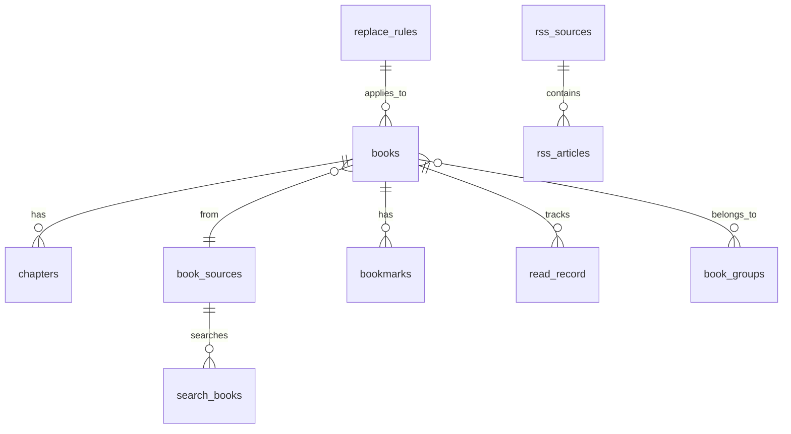

# 数据库表结构 DDL

> Legado 数据库（版本号以 `AppDatabase.kt` 的 `version` 字段为准，**文档禁止硬编码快照**）。本文为**核心 21 张表**的完整 CREATE TABLE 语句、索引定义和约束说明（2026-08 前既有表）。
>
> **全量 56 张表**（v90-v108 扩展期新增 35 表）的权威 DDL 见 `app/schemas/io.legado.app.data.AppDatabase/108.json`；新增表速览与代表性 DDL 摘要见本文 §5，实体说明见 [entities-extensions.md](entities-extensions.md)。

---

## 1. 核心表关系图



---

## 2. 表结构详解

### 2.1 books — 书籍表

核心书籍表，存储书架中每本书的完整信息。

**DDL**：

```sql
CREATE TABLE IF NOT EXISTS books (
    bookUrl             TEXT    NOT NULL DEFAULT '',         -- 书籍唯一 URL / 本地文件路径 (PK)
    tocUrl              TEXT    NOT NULL DEFAULT '',         -- 目录页 URL
    origin              TEXT    NOT NULL DEFAULT 'loc_book', -- 书源 URL（默认本地书源）
    originName          TEXT    NOT NULL DEFAULT '',         -- 书源名称 / 本地文件名
    name                TEXT    NOT NULL DEFAULT '',         -- 书籍名称
    author              TEXT    NOT NULL DEFAULT '',         -- 作者
    kind                TEXT,                               -- 分类（逗号分隔）
    customTag           TEXT,                               -- 用户自定义标签
    coverUrl            TEXT,                               -- 封面 URL
    customCoverUrl      TEXT,                               -- 用户自定义封面 URL
    intro               TEXT,                               -- 简介
    customIntro         TEXT,                               -- 用户自定义简介
    charset             TEXT,                               -- 字符编码（本地书籍）
    type                INTEGER NOT NULL DEFAULT 0,          -- 类型（位标志，见 BookType）
    "group"             INTEGER NOT NULL DEFAULT 0,          -- 分组 ID（位掩码，对应 book_groups.groupId）
    latestChapterTitle  TEXT,                               -- 最新章节标题
    latestChapterTime   INTEGER NOT NULL DEFAULT 0,          -- 最新章节更新时间（毫秒时间戳）
    lastCheckTime       INTEGER NOT NULL DEFAULT 0,          -- 最后检查更新时间（毫秒时间戳）
    lastCheckCount      INTEGER NOT NULL DEFAULT 0,          -- 最后检查发现的新章节数
    totalChapterNum     INTEGER NOT NULL DEFAULT 0,          -- 总章节数
    durChapterTitle     TEXT,                               -- 当前阅读章节标题
    durChapterIndex     INTEGER NOT NULL DEFAULT 0,          -- 当前阅读章节索引
    durVolumeIndex      INTEGER NOT NULL DEFAULT 0,          -- 当前卷索引
    chapterInVolumeIndex INTEGER NOT NULL DEFAULT 0,         -- 卷内章节索引
    durChapterPos       INTEGER NOT NULL DEFAULT 0,          -- 当前阅读位置（首行字符索引）
    durChapterTime      INTEGER NOT NULL DEFAULT 0,          -- 最近阅读时间（毫秒时间戳）
    wordCount           TEXT,                               -- 字数（如 "12.3万字"）
    canUpdate           INTEGER NOT NULL DEFAULT 1,          -- 是否可更新（1=是，0=否）
    "order"             INTEGER NOT NULL DEFAULT 0,          -- 手动排序序号
    originOrder         INTEGER NOT NULL DEFAULT 0,          -- 书源排序序号
    variable            TEXT,                               -- 自定义变量（JSON 格式）
    readConfig          TEXT,                               -- 阅读配置（JSON，ReadConfig 结构）
    syncTime            INTEGER NOT NULL DEFAULT 0,          -- 同步时间（毫秒时间戳）
    PRIMARY KEY (bookUrl)
);
```

> **注意**：`group` 和 `order` 是 SQLite 保留字，需要加双引号转义。

**字段详解**：

| 字段 | 类型 | 说明 |
|------|------|------|
| `bookUrl` | TEXT PK | 书籍唯一标识。网络书籍为详情页 URL；本地书籍为完整文件路径 |
| `tocUrl` | TEXT | 目录页 URL（Table of Contents） |
| `origin` | TEXT | 书源 URL。默认值 `"loc_book"` 标识本地书籍；WebDav 书籍以 `"webDav::"` 开头 |
| `originName` | TEXT | 书源显示名称，本地书籍则为文件名 |
| `name` | TEXT | 书名（从书源获取） |
| `author` | TEXT | 作者（从书源获取） |
| `kind` | TEXT? | 分类标签，用逗号或换行分隔 |
| `customTag` | TEXT? | 用户自定义分类（独立于 `kind`） |
| `coverUrl` | TEXT? | 封面图片 URL |
| `customCoverUrl` | TEXT? | 用户手动设置的封面 URL，优先级高于 `coverUrl` |
| `intro` | TEXT? | 书籍简介原文 |
| `customIntro` | TEXT? | 用户编辑的简介，优先级高于 `intro` |
| `charset` | TEXT? | 仅本地书籍使用，指定文件编码（如 `"UTF-8"`） |
| `type` | INTEGER | 类型位标志，见 [BookType 位标志（overview.md）](overview.md#booktype--书籍类型位标志) |
| `group` | INTEGER | 分组位掩码，对应 `book_groups.groupId`。0 表示未分组。支持位运算多分组 |
| `latestChapterTitle` | TEXT? | 最新章节的标题文字 |
| `latestChapterTime` | INTEGER | 最新章节发布/更新时间（毫秒时间戳） |
| `lastCheckTime` | INTEGER | 最后一次检查书籍更新的时间 |
| `lastCheckCount` | INTEGER | 最后一次检查时发现的新章节数量 |
| `totalChapterNum` | INTEGER | 总章节数量 |
| `durChapterTitle` | TEXT? | 当前正在阅读的章节标题 |
| `durChapterIndex` | INTEGER | 当前阅读的章节序号（从 0 开始） |
| `durVolumeIndex` | INTEGER | 当前阅读的卷序号 |
| `chapterInVolumeIndex` | INTEGER | 当前章节在卷内的序号 |
| `durChapterPos` | INTEGER | 当前阅读进度（字符偏移位置） |
| `durChapterTime` | INTEGER | 最近一次打开正文阅读的时间戳 |
| `wordCount` | TEXT? | 字数统计（字符串形式，如 `"12.3万字"`） |
| `canUpdate` | INTEGER | 刷新书架时是否检查更新（1=是，0=否） |
| `order` | INTEGER | 书架手动排序序号 |
| `originOrder` | INTEGER | 书源排序序号 |
| `variable` | TEXT? | 自定义变量 JSON（`HashMap<String,String>`），用于书源规则检索 |
| `readConfig` | TEXT? | 阅读配置 JSON，见 ReadConfig 结构 |
| `syncTime` | INTEGER | 同步时间戳（用于 WebDav 等多设备同步） |

**索引**：

```sql
CREATE UNIQUE INDEX IF NOT EXISTS index_books_name_author ON books (name, author);
```

**ReadConfig JSON 结构**（存储在 `readConfig` 字段）：

```json
{
  "reverseToc": false,
  "pageAnim": null,
  "reSegment": false,
  "imageStyle": null,
  "useReplaceRule": null,
  "delTag": 0,
  "ttsEngine": null,
  "splitLongChapter": true,
  "readSimulating": false,
  "startDate": null,
  "startChapter": null,
  "dailyChapters": 3,
  "openCredits": 0,
  "closeCredits": 0,
  "playMode": 0,
  "playSpeed": 1.0
}
```

| ReadConfig 字段 | 类型 | 说明 |
|-----------------|------|------|
| `reverseToc` | Boolean | 反向目录（倒序排列） |
| `pageAnim` | Int? | 翻页动画类型（null=跟随全局设置） |
| `reSegment` | Boolean | 重新分章（对合并章节文件重新分割） |
| `imageStyle` | String? | 图片显示样式：`DEFAULT`/`FULL`/`TEXT`/`SINGLE` |
| `useReplaceRule` | Boolean? | 正文是否使用替换净化规则（null=跟随全局） |
| `delTag` | Long | 去除 HTML 标签的位标志（hTag=2, rubyTag=4） |
| `ttsEngine` | String? | 朗读引擎名称 |
| `splitLongChapter` | Boolean | 是否拆分长章节 |
| `readSimulating` | Boolean | 模拟阅读模式 |
| `startDate` | String? | 模拟阅读开始日期（LocalDate ISO 格式） |
| `startChapter` | Int? | 模拟阅读起始章节 |
| `dailyChapters` | Int | 模拟阅读每日章节数（默认 3） |
| `openCredits` | Int | 音频片头时长 |
| `closeCredits` | Int | 音频片尾时长 |
| `playMode` | Int | 音频播放模式 |
| `playSpeed` | Float | 音频播放速度（默认 1.0） |

---

### 2.2 book_groups — 分组表

书籍自定义分组配置。

**DDL**：

```sql
CREATE TABLE IF NOT EXISTS book_groups (
    groupId         INTEGER NOT NULL,  -- 分组 ID（PK）
    groupName       TEXT    NOT NULL,  -- 分组名称
    cover           TEXT,              -- 分组封面图片 URL
    "order"         INTEGER NOT NULL,  -- 排序序号
    enableRefresh   INTEGER NOT NULL DEFAULT 1,  -- 是否启用刷新
    "show"          INTEGER NOT NULL DEFAULT 1,  -- 是否在书架显示
    bookSort        INTEGER NOT NULL DEFAULT -1, -- 书籍排序方式（-1=跟随全局设置）
    onlyUpdateRead  INTEGER NOT NULL DEFAULT 0,  -- 仅更新已读书籍
    PRIMARY KEY (groupId)
);
```

**字段详解**：

| 字段 | 类型 | 说明 |
|------|------|------|
| `groupId` | INTEGER PK | 分组 ID。负数为系统内置分组，正数为用户自定义分组（2 的幂次方，如 1/2/4/8…） |
| `groupName` | TEXT | 分组显示名称 |
| `cover` | TEXT? | 分组封面图片 |
| `order` | INTEGER | 排序序号 |
| `enableRefresh` | INTEGER | 刷新书架时是否对此分组内的书籍执行更新检查 |
| `show` | INTEGER | 是否在书架界面上显示此分组 |
| `bookSort` | INTEGER | 分组内书籍排序方式：-1=跟随全局，0=手动排序，其他值见 AppConfig.bookshelfSort |
| `onlyUpdateRead` | INTEGER | 仅更新已读章节（0=更新所有，1=仅更新已读） |

**内置分组**：

| groupId | 名称 | 说明 |
|---------|------|------|
| `-100` | — | 根分组（代码内部使用，不显示） |
| `-1` | 全部 | 所有书籍 |
| `-2` | 本地 | 本地导入的书籍 |
| `-3` | 音频 | 音频类书籍 |
| `-4` | 网络未分组 | 网络书籍中未归类到任何分组的 |
| `-5` | 本地未分组 | 本地书籍中未归类到任何分组的 |
| `-6` | 视频 | 视频类书籍 |
| `-11` | 更新失败 | 最近一次检查更新失败的书籍 |

---

### 2.3 book_sources — 书源表

书源配置表，记录了每个书源的完整规则定义。

**DDL**：

```sql
CREATE TABLE IF NOT EXISTS book_sources (
    bookSourceUrl       TEXT    NOT NULL,  -- 书源 URL / 地址 (PK)
    bookSourceName      TEXT    NOT NULL,  -- 书源名称
    bookSourceGroup     TEXT,              -- 书源分组（逗号分隔）
    bookSourceType      INTEGER NOT NULL,  -- 书源类型（0=文本，1=音频，2=图片，3=文件，4=视频）
    bookUrlPattern      TEXT,              -- 详情页 URL 匹配正则
    customOrder         INTEGER NOT NULL DEFAULT 0,  -- 手动排序序号
    enabled             INTEGER NOT NULL DEFAULT 1,  -- 是否启用
    enabledExplore      INTEGER NOT NULL DEFAULT 1,  -- 是否启用发现
    jsLib               TEXT,              -- JS 库代码
    enabledCookieJar    INTEGER DEFAULT 0, -- 启用 OkHttp CookieJar（DDL DEFAULT 0 仅用于迁移兼容，运行时默认 true）
    concurrentRate      TEXT,              -- 并发率配置
    header              TEXT,              -- 自定义请求头（JSON）
    loginUrl            TEXT,              -- 登录 URL（支持 `@js:` 或 `<js>` 前缀）
    loginUi             TEXT,              -- 登录 UI 配置（JSON）
    loginCheckJs        TEXT,              -- 登录检测 JS
    coverDecodeJs       TEXT,              -- 封面解密 JS
    bookSourceComment   TEXT,              -- 书源注释
    variableComment     TEXT,              -- 自定义变量说明
    lastUpdateTime      INTEGER NOT NULL,  -- 最后更新时间
    respondTime         INTEGER NOT NULL,  -- 响应时间（毫秒，默认 180000）
    weight              INTEGER NOT NULL,  -- 智能排序权重
    exploreUrl          TEXT,              -- 发现 URL
    exploreScreen       TEXT,              -- 发现筛选规则
    ruleExplore         TEXT,              -- 发现规则（JSON，ExploreRule）
    searchUrl           TEXT,              -- 搜索 URL
    ruleSearch          TEXT,              -- 搜索规则（JSON，SearchRule）
    ruleBookInfo        TEXT,              -- 书籍信息规则（JSON，BookInfoRule）
    ruleToc             TEXT,              -- 目录规则（JSON，TocRule）
    ruleContent         TEXT,              -- 正文规则（JSON，ContentRule）
    ruleReview          TEXT,              -- 段评规则（JSON，ReviewRule）
    eventListener       INTEGER NOT NULL DEFAULT 0,  -- 是否监听事件执行回调
    customButton        INTEGER NOT NULL DEFAULT 0,   -- 是否启用书源自定义按钮
    PRIMARY KEY (bookSourceUrl)
);
```

> **enabledCookieJar 默认值不一致**：DDL 中 `DEFAULT 0` 仅用于数据库迁移兼容，Kotlin 源码中实际默认值为 `Boolean? = true`。新建书源运行时默认启用 CookieJar。

**字段详解**：

| 字段 | 类型 | 说明 |
|------|------|------|
| `bookSourceUrl` | TEXT PK | 书源唯一标识，通常是网址或 API 地址 |
| `bookSourceName` | TEXT | 书源显示名称 |
| `bookSourceGroup` | TEXT? | 分组标签，多个用逗号分隔（如 `"小说,精品"`） |
| `bookSourceType` | INTEGER | 0=文本, 1=音频, 2=图片, 3=文件（仅下载）, 4=视频 |
| `bookUrlPattern` | TEXT? | 正则表达式，用于匹配该书源可处理的书籍 URL |
| `customOrder` | INTEGER | 用户手动设置的排序值 |
| `enabled` | INTEGER | 书源是否启用 |
| `enabledExplore` | INTEGER | 是否在发现页中显示 |
| `jsLib` | TEXT? | 书源共享的 JavaScript 库代码，可被各规则调用 |
| `enabledCookieJar` | INTEGER? | 是否使用 OkHttp 的 CookieJar 自动管理 Cookie |
| `concurrentRate` | TEXT? | 并发控制参数（数字或 JSON），如 `"1"` 表示单线程 |
| `header` | TEXT? | 自定义 HTTP 请求头 JSON（支持 `@js:` 动态执行） |
| `loginUrl` | TEXT? | 登录地址。支持 `@js:code` 或 `<js>code</js>` 执行 JS |
| `loginUi` | TEXT? | 登录界面配置 JSON（RowUi 数组） |
| `loginCheckJs` | TEXT? | 检查登录状态的 JS，返回 true/false |
| `coverDecodeJs` | TEXT? | 封面图片解密 JS |
| `bookSourceComment` | TEXT? | 书源注释/说明 |
| `variableComment` | TEXT? | 自定义变量字段的说明文档 |
| `lastUpdateTime` | INTEGER | 书源最后更新时间戳 |
| `respondTime` | INTEGER | 书源响应时间（毫秒），用于智能排序 |
| `weight` | INTEGER | 智能排序权重值 |
| `exploreUrl` | TEXT? | 发现页 URL，可用 `{{key}}` 作为变量 |
| `exploreScreen` | TEXT? | 发现页筛选规则配置 |
| `ruleExplore` | TEXT? | 发现规则 JSON（ExploreRule 对象） |
| `searchUrl` | TEXT? | 搜索 URL，支持 `{{key}}` / `{{page}}` 等占位符 |
| `ruleSearch` | TEXT? | 搜索规则 JSON（SearchRule 对象） |
| `ruleBookInfo` | TEXT? | 书籍详情页规则 JSON（BookInfoRule 对象） |
| `ruleToc` | TEXT? | 目录页规则 JSON（TocRule 对象） |
| `ruleContent` | TEXT? | 正文页规则 JSON（ContentRule 对象） |
| `ruleReview` | TEXT? | 段评规则 JSON（当前版本未启用，TypeConverter 返回 null） |
| `eventListener` | INTEGER | 是否通过事件监听触发规则回调 |
| `customButton` | INTEGER | 是否启用书源自定义按钮 |

**规则字段的结构说明**：

各规则字段（`ruleSearch`、`ruleExplore`、`ruleBookInfo`、`ruleToc`、`ruleContent`）以 JSON 格式存储，分别对应：

- **SearchRule**：搜索请求规则（searchUrl, checkKeyWord, 各解析规则）
- **ExploreRule**：发现页规则（各发现类型的 bookListRule）
- **BookInfoRule**：书籍详情规则（各字段解析规则）
- **TocRule**：目录规则（chapterList, chapterName, chapterUrl 等）
- **ContentRule**：正文规则（content, replaceRegex, webJs 等）
- **ReviewRule**：段评规则（当前版本 TypeConverter 固定返回 null）

**索引**：

```sql
CREATE INDEX IF NOT EXISTS index_book_sources_bookSourceUrl ON book_sources (bookSourceUrl);
```

---

### 2.4 chapters — 章节表

存储每本书的目录章节信息。

**DDL**：

```sql
CREATE TABLE IF NOT EXISTS chapters (
    url             TEXT    NOT NULL,  -- 章节 URL（当前章节的唯一标识）
    title           TEXT    NOT NULL,  -- 章节标题
    isVolume        INTEGER NOT NULL,  -- 是否为卷名（0=章节，1=卷）
    baseUrl         TEXT    NOT NULL,  -- 基础 URL（用于拼接相对地址）
    bookUrl         TEXT    NOT NULL,  -- 所属书籍 URL（FK → books CASCADE）
    "index"         INTEGER NOT NULL,  -- 章节序号（从 0 开始）
    isVip           INTEGER NOT NULL,  -- 是否 VIP 章节
    isPay           INTEGER NOT NULL,  -- 是否已购买
    resourceUrl     TEXT,              -- 音频/视频真实资源 URL
    tag             TEXT,              -- 附加标签（更新时间等）
    wordCount       TEXT,              -- 本章字数（字符串）
    "start"         INTEGER,           -- 章节起始位置（TXT 文件偏移量）
    "end"           INTEGER,           -- 章节结束位置（TXT 文件偏移量）
    startFragmentId TEXT,              -- EPUB 起始 Fragment ID
    endFragmentId   TEXT,              -- EPUB 结束 Fragment ID
    variable        TEXT,              -- 自定义变量（JSON）
    imgUrl          TEXT,              -- 标题段评图或视频封面
    PRIMARY KEY (url, bookUrl),
    FOREIGN KEY (bookUrl) REFERENCES books(bookUrl) ON DELETE CASCADE
);
```

**字段详解**：

| 字段 | 类型 | 说明 |
|------|------|------|
| `url` | TEXT (复合 PK) | 章节页面 URL，与 `bookUrl` 组成复合主键 |
| `title` | TEXT | 章节标题 |
| `isVolume` | INTEGER | 是否为卷/分卷（用于有卷结构的书籍） |
| `baseUrl` | TEXT | 基础 URL，用于将相对路径解析为绝对路径 |
| `bookUrl` | TEXT (复合 PK/FK) | 关联的书籍 URL，外键级联删除 |
| `index` | INTEGER | 章节在目录中的序号（从 0 递增） |
| `isVip` | INTEGER | 是否需要付费/VIP |
| `isPay` | INTEGER | 当前账户是否已购买 |
| `resourceUrl` | TEXT? | 音频/视频的资源直链 |
| `tag` | TEXT? | 附加信息，如章节更新时间 |
| `wordCount` | TEXT? | 章节字数统计 |
| `start` | INTEGER? | 在 TXT 文件中的起始字节偏移 |
| `end` | INTEGER? | 在 TXT 文件中的结束字节偏移 |
| `startFragmentId` | TEXT? | EPUB 格式当前章节的 Fragment ID |
| `endFragmentId` | TEXT? | EPUB 格式下一章节的 Fragment ID |
| `variable` | TEXT? | 章节级别自定义变量 JSON |
| `imgUrl` | TEXT? | 标题关联的图片 URL（段评图/视频封面） |

**索引**：

```sql
CREATE INDEX IF NOT EXISTS index_chapters_bookUrl ON chapters (bookUrl);
CREATE UNIQUE INDEX IF NOT EXISTS index_chapters_bookUrl_index ON chapters (bookUrl, "index");
```

> 第二个唯一索引确保同一本书内章节序号不重复。

---

### 2.5 bookmarks — 书签表

存储书签和笔记。

**DDL**：

```sql
CREATE TABLE IF NOT EXISTS bookmarks (
    time            INTEGER NOT NULL,  -- 创建时间（毫秒时间戳，PK）
    bookName        TEXT    NOT NULL,  -- 书签所属书籍名
    bookAuthor      TEXT    NOT NULL,  -- 书签所属书籍作者
    chapterIndex    INTEGER NOT NULL,  -- 章节索引
    chapterPos      INTEGER NOT NULL,  -- 章节内位置
    chapterName     TEXT    NOT NULL,  -- 章节名称
    bookText        TEXT    NOT NULL,  -- 书签处的原文内容
    content         TEXT    NOT NULL,  -- 书签/笔记内容
    PRIMARY KEY (time)
);
```

**字段详解**：

| 字段 | 类型 | 说明 |
|------|------|------|
| `time` | INTEGER PK | 书签创建时间（毫秒时间戳），用作唯一标识 |
| `bookName` | TEXT | 书籍名称（逻辑关联 `books.name`） |
| `bookAuthor` | TEXT | 作者名称（逻辑关联 `books.author`） |
| `chapterIndex` | INTEGER | 书签所在章节索引号 |
| `chapterPos` | INTEGER | 书签在章节内的字符偏移位置 |
| `chapterName` | TEXT | 章节名称 |
| `bookText` | TEXT | 书签处的原文（高亮文本） |
| `content` | TEXT | 书签/笔记内容（书签时与 bookText 相同，笔记时为用户输入） |

> **笔记支持**：当用户对书签添加额外文字时，`content` 存储用户输入内容，`bookText` 保持原文不变。通过 `type` 字段（当前未使用字段）或 `content != bookText` 区分书签和笔记。

**索引**：

```sql
CREATE INDEX IF NOT EXISTS index_bookmarks_bookName_bookAuthor ON bookmarks (bookName, bookAuthor);
```

---

### 2.6 replace_rules — 替换净化规则表

用于正文/标题的文本替换净化规则。

**DDL**：

```sql
CREATE TABLE IF NOT EXISTS replace_rules (
    id                  INTEGER PRIMARY KEY AUTOINCREMENT NOT NULL,  -- 自增主键
    name                TEXT    NOT NULL DEFAULT '',   -- 规则名称
    "group"             TEXT,                          -- 分组（可为书名逗号列表，限定到特定书籍）
    pattern             TEXT    NOT NULL DEFAULT '',   -- 匹配内容 / 正则表达式
    replacement         TEXT    NOT NULL DEFAULT '',   -- 替换内容
    scope               TEXT,                          -- 作用范围（书名逗号列表，限定到特定书籍）
    scopeTitle          INTEGER NOT NULL DEFAULT 0,    -- 作用于标题（0=否，1=是）
    scopeContent        INTEGER NOT NULL DEFAULT 1,    -- 作用于正文（0=否，1=是）
    excludeScope        TEXT,                          -- 排除范围（书名逗号列表）
    isEnabled           INTEGER NOT NULL DEFAULT 1,    -- 是否启用
    isRegex             INTEGER NOT NULL DEFAULT 1,    -- 是否为正则表达式（0=普通文本替换）
    timeoutMillisecond  INTEGER NOT NULL DEFAULT 3000, -- 正则匹配超时时间（毫秒）
    sortOrder           INTEGER NOT NULL DEFAULT 0,    -- 排序序号
);
```

**字段详解**：

| 字段 | 类型 | 说明 |
|------|------|------|
| `id` | INTEGER PK AUTO | 自增长主键 |
| `name` | TEXT | 规则显示名称 |
| `group` | TEXT? | 分组名称（用于分组管理，区别于 `scope`） |
| `pattern` | TEXT | 匹配模式。`isRegex=1` 时为正则表达式，`isRegex=0` 时为普通文本 |
| `replacement` | TEXT | 替换为的内容 |
| `scope` | TEXT? | 作用范围，书名逗号列表。如 `"斗破苍穹,大奉打更人"` |
| `scopeTitle` | INTEGER | 是否作用于章节标题 |
| `scopeContent` | INTEGER | 是否作用于正文内容 |
| `excludeScope` | TEXT? | 排除范围，书名逗号列表 |
| `isEnabled` | INTEGER | 是否启用 |
| `isRegex` | INTEGER | 是否为正则匹配 |
| `timeoutMillisecond` | INTEGER | 正则匹配超时（默认 3000ms），超时后自动禁用 |
| `sortOrder` | INTEGER | 执行顺序（数值越小优先级越高） |

**索引**：

```sql
CREATE INDEX IF NOT EXISTS index_replace_rules_id ON replace_rules (id);
```

---

### 2.7 rssSources — RSS 源表

RSS/Atom 订阅源配置表。

**DDL**：

```sql
CREATE TABLE IF NOT EXISTS rssSources (
    sourceUrl                   TEXT    NOT NULL,  -- RSS 源 URL (PK)
    sourceName                  TEXT    NOT NULL,  -- 订阅源名称
    sourceIcon                  TEXT    NOT NULL,  -- 订阅源图标 URL
    sourceGroup                 TEXT,              -- 分组（逗号分隔）
    sourceComment               TEXT,              -- 注释说明
    enabled                     INTEGER NOT NULL,  -- 是否启用
    variableComment             TEXT,              -- 变量说明
    jsLib                       TEXT,              -- JS 库
    enabledCookieJar            INTEGER DEFAULT 0, -- 启用 CookieJar（DDL DEFAULT 0 仅用于迁移兼容，运行时默认 true）
    concurrentRate              TEXT,              -- 并发率
    header                      TEXT,              -- 请求头 JSON
    loginUrl                    TEXT,              -- 登录 URL
    loginUi                     TEXT,              -- 登录 UI
    loginCheckJs                TEXT,              -- 登录检测 JS
    coverDecodeJs               TEXT,              -- 封面解密 JS
    sortUrl                     TEXT,              -- 分类 URL
    singleUrl                   INTEGER NOT NULL,  -- 是否单 URL 源（0=多文章，1=单文章）
    articleStyle                INTEGER NOT NULL DEFAULT 0,  -- 文章列表样式（0-4）
    ruleArticles                TEXT,              -- 文章列表规则
    ruleNextPage                TEXT,              -- 下一页规则
    ruleTitle                   TEXT,              -- 标题规则
    rulePubDate                 TEXT,              -- 发布日期规则
    ruleDescription             TEXT,              -- 描述规则
    ruleImage                   TEXT,              -- 图片规则
    ruleLink                    TEXT,              -- 链接规则
    ruleContent                 TEXT,              -- 正文规则
    contentWhitelist            TEXT,              -- 正文 URL 白名单
    contentBlacklist            TEXT,              -- 正文 URL 黑名单
    shouldOverrideUrlLoading    TEXT,              -- URL 跳转拦截 JS
    style                       TEXT,              -- WebView 样式 CSS
    enableJs                    INTEGER NOT NULL DEFAULT 1,  -- 启用 JS
    loadWithBaseUrl             INTEGER NOT NULL DEFAULT 1,  -- 使用 Base URL 加载
    injectJs                    TEXT,              -- 注入 JS
    preloadJs                   TEXT,              -- 预注入 JS
    startHtml                   TEXT,              -- 起始 HTML
    startStyle                  TEXT,              -- 起始样式
    startJs                     TEXT,              -- 起始 JS
    showWebLog                  INTEGER NOT NULL DEFAULT 0,  -- 输出 WebView 日志
    lastUpdateTime              INTEGER NOT NULL DEFAULT 0,  -- 最后更新时间
    customOrder                 INTEGER NOT NULL DEFAULT 0,  -- 手动排序
    type                        INTEGER NOT NULL DEFAULT 0,  -- 类型（0=网页，1=图片，2=视频）
    preload                     INTEGER NOT NULL DEFAULT 0,  -- 启用预加载
    cacheFirst                  INTEGER NOT NULL DEFAULT 0,  -- 优先加载缓存
    searchUrl                   TEXT,              -- 搜索 URL
    PRIMARY KEY (sourceUrl)
);
```

**字段详解**（仅列出关键字段）：

| 字段 | 类型 | 说明 |
|------|------|------|
| `sourceUrl` | TEXT PK | RSS 订阅源 URL |
| `sourceName` | TEXT | 订阅源显示名称 |
| `sourceIcon` | TEXT | 图标的 URL |
| `sourceGroup` | TEXT? | 分组标签（逗号分隔） |
| `enabled` | INTEGER | 是否启用 |
| `singleUrl` | INTEGER | 0=多文章列表源，1=单文章页（直接显示正文） |
| `articleStyle` | INTEGER | 文章列表 UI 样式（0-4 五种布局） |
| `ruleArticles` | TEXT? | 文章列表提取规则（CSS/JSON/XPath/JS） |
| `ruleContent` | TEXT? | 正文提取规则 |
| `contentWhitelist` | TEXT? | 正文 URL 白名单（正则匹配） |
| `contentBlacklist` | TEXT? | 正文 URL 黑名单（正则匹配） |
| `enableJs` | INTEGER | 加载文章页时是否启用 JavaScript |
| `type` | INTEGER | 0=网页文章，1=图片源，2=视频源 |
| `preload` | INTEGER | 是否在进入列表时预加载下一页 |
| `cacheFirst` | INTEGER | 是否优先显示已缓存内容 |
| `searchUrl` | TEXT? | 搜索 URL |

**索引**：

```sql
CREATE INDEX IF NOT EXISTS index_rssSources_sourceUrl ON rssSources (sourceUrl);
```

---

### 2.8 rssArticles — RSS 文章表

每个 RSS 源的文章列表缓存。

**DDL**：

```sql
CREATE TABLE IF NOT EXISTS rssArticles (
    origin      TEXT    NOT NULL,  -- 所属 RSS 源 URL
    sort        TEXT    NOT NULL,  -- 分类标识
    title       TEXT    NOT NULL,  -- 文章标题
    "order"     INTEGER NOT NULL,  -- 排序序号
    link        TEXT    NOT NULL,  -- 文章链接
    pubDate     TEXT,              -- 发布日期
    description TEXT,              -- 文章摘要
    content     TEXT,              -- 全文内容
    image       TEXT,              -- 文章封面图
    "group"     TEXT    NOT NULL DEFAULT '默认分组', -- 分组
    "read"      INTEGER NOT NULL,  -- 是否已读
    variable    TEXT,              -- 自定义变量 JSON
    type        INTEGER NOT NULL DEFAULT 0,  -- 类型（0=网页，1=图片，2=视频）
    durPos      INTEGER NOT NULL DEFAULT 0,  -- 阅读进度
    PRIMARY KEY (origin, link, sort)
);
```

**字段详解**：

| 字段 | 类型 | 说明 |
|------|------|------|
| `origin` | TEXT (复合 PK) | 关联的 RSS 源 URL |
| `sort` | TEXT (复合 PK) | 分类/栏目标识 |
| `title` | TEXT | 文章标题 |
| `order` | INTEGER | 在列表中的排序序号（从高到低） |
| `link` | TEXT (复合 PK) | 文章原文链接 |
| `pubDate` | TEXT? | 发布日期字符串 |
| `description` | TEXT? | 文章摘要/简介 |
| `content` | TEXT? | 已缓存的全文内容 |
| `image` | TEXT? | 文章缩略图/封面 |
| `group` | TEXT | 分组名称（默认 "默认分组"） |
| `read` | INTEGER | 是否已读（0=未读，1=已读） |
| `variable` | TEXT? | 自定义变量 JSON |
| `type` | INTEGER | 文章内容类型 |
| `durPos` | INTEGER | 阅读进度位置 |

---

### 2.9 rssStars — RSS 收藏表

用户收藏的 RSS 文章。

**DDL**：

```sql
CREATE TABLE IF NOT EXISTS rssStars (
    origin      TEXT    NOT NULL,  -- 所属 RSS 源 URL
    sort        TEXT    NOT NULL,  -- 分类标识
    title       TEXT    NOT NULL,  -- 文章标题
    starTime    INTEGER NOT NULL,  -- 收藏时间（毫秒时间戳）
    link        TEXT    NOT NULL,  -- 文章链接
    pubDate     TEXT,              -- 发布日期
    description TEXT,              -- 文章摘要
    content     TEXT,              -- 全文内容
    image       TEXT,              -- 文章封面图
    "group"     TEXT    NOT NULL DEFAULT '默认分组', -- 分组
    variable    TEXT,              -- 自定义变量 JSON
    type        INTEGER NOT NULL DEFAULT 0,  -- 类型
    durPos      INTEGER NOT NULL DEFAULT 0,  -- 阅读进度
    PRIMARY KEY (origin, link)
);
```

**索引**：无显式索引（复合主键已覆盖查询）。

---

### 2.10 rssReadRecords — RSS 阅读记录表

记录用户阅读过的 RSS 文章，支持跨设备同步阅读状态。

**DDL**：

```sql
CREATE TABLE IF NOT EXISTS rssReadRecords (
    record      TEXT    NOT NULL,  -- 文章链接（PK）
    title       TEXT,              -- 文章标题
    readTime    INTEGER,           -- 阅读时间（毫秒时间戳）
    "read"      INTEGER NOT NULL,  -- 是否已读
    origin      TEXT    NOT NULL DEFAULT '', -- RSS 源 URL
    sort        TEXT    NOT NULL DEFAULT '', -- 分类标识
    image       TEXT,              -- 文章封面图
    type        INTEGER NOT NULL DEFAULT 0,  -- 类型
    durPos      INTEGER NOT NULL DEFAULT 0,  -- 阅读进度
    pubDate     TEXT,              -- 发布日期
    PRIMARY KEY (record)
);
```

**索引**：

```sql
CREATE INDEX IF NOT EXISTS index_rssReadRecords_origin ON rssReadRecords (origin);
```

---

### 2.11 httpTTS — HTTP TTS 引擎表

在线朗读引擎（TTS）配置。

**DDL**：

```sql
CREATE TABLE IF NOT EXISTS httpTTS (
    id                  INTEGER NOT NULL,  -- 引擎 ID (PK)
    name                TEXT    NOT NULL,  -- 引擎名称
    url                 TEXT    NOT NULL,  -- API URL
    contentType         TEXT,              -- 内容类型（返回音频的 MIME 类型）
    concurrentRate      TEXT    DEFAULT '0',  -- 并发率
    loginUrl            TEXT,              -- 登录 URL
    loginUi             TEXT,              -- 登录 UI
    header              TEXT,              -- 请求头 JSON
    jsLib               TEXT,              -- JS 库
    enabledCookieJar    INTEGER DEFAULT 0, -- 启用 CookieJar（DDL DEFAULT 0 仅用于迁移兼容，运行时默认 false；与 book_sources/rssSources 的 true 不同）
    loginCheckJs        TEXT,              -- 登录检测 JS
    lastUpdateTime      INTEGER NOT NULL DEFAULT 0,  -- 最后更新时间
    PRIMARY KEY (id)
);
```

**字段详解**：

| 字段 | 类型 | 说明 |
|------|------|------|
| `id` | INTEGER PK | 引擎唯一标识（通常使用时间戳毫秒值） |
| `name` | TEXT | 引擎显示名称 |
| `url` | TEXT | TTS API 请求 URL，支持 `{{text}}` 或 `{{content}}` 占位符 |
| `contentType` | TEXT? | 返回的音频内容类型（如 `"audio/mpeg"`），用于判断 GET/POST 方式 |
| `concurrentRate` | TEXT? | 并发请求数控制（默认 `"0"`） |
| `loginUrl` | TEXT? | 登录/鉴权 URL |
| `loginUi` | TEXT? | 登录界面配置 |
| `header` | TEXT? | 自定义请求头 JSON |
| `jsLib` | TEXT? | JS 库（预处理文本） |
| `enabledCookieJar` | INTEGER? | 是否使用 CookieJar |
| `loginCheckJs` | TEXT? | 登录状态检测 JS |
| `lastUpdateTime` | INTEGER | 最后更新时间 |

---

### 2.12 searchBooks — 搜索结果缓存表

书籍搜索结果缓存，外键关联 `book_sources`。

**DDL**：

```sql
CREATE TABLE IF NOT EXISTS searchBooks (
    bookUrl             TEXT    NOT NULL,  -- 书籍 URL (PK)
    origin              TEXT    NOT NULL,  -- 书源 URL（FK → book_sources CASCADE）
    originName          TEXT    NOT NULL,  -- 书源名称
    type                INTEGER NOT NULL,  -- 书籍类型（BookType）
    name                TEXT    NOT NULL,  -- 书名
    author              TEXT    NOT NULL,  -- 作者
    kind                TEXT,              -- 分类
    coverUrl            TEXT,              -- 封面 URL
    intro               TEXT,              -- 简介
    wordCount           TEXT,              -- 字数
    latestChapterTitle  TEXT,              -- 最新章节标题
    tocUrl              TEXT    NOT NULL,  -- 目录页 URL
    time                INTEGER NOT NULL,  -- 搜索结果时间戳
    variable            TEXT,              -- 自定义变量 JSON
    originOrder         INTEGER NOT NULL,  -- 书源排序
    chapterWordCountText TEXT,             -- 章节字数文本
    chapterWordCount    INTEGER NOT NULL DEFAULT -1,  -- 实际章节字数
    respondTime         INTEGER NOT NULL DEFAULT -1,  -- 响应时间（毫秒）
    PRIMARY KEY (bookUrl),
    FOREIGN KEY (origin) REFERENCES book_sources(bookSourceUrl) ON DELETE CASCADE
);
```

**字段详解**：与 `books` 表对应字段含义相同，额外字段：

| 字段 | 类型 | 说明 |
|------|------|------|
| `time` | INTEGER | 搜索结果生成时间 |
| `originOrder` | INTEGER | 书源排序值 |
| `chapterWordCountText` | TEXT? | 章节字数显示文本 |
| `chapterWordCount` | INTEGER | 章节实际字数（默认 -1） |
| `respondTime` | INTEGER | 搜索响应耗时（毫秒，默认 -1） |

**索引**：

```sql
CREATE UNIQUE INDEX IF NOT EXISTS index_searchBooks_bookUrl ON searchBooks (bookUrl);
CREATE INDEX IF NOT EXISTS index_searchBooks_origin ON searchBooks (origin);
```

---

### 2.13 search_keywords — 搜索关键词历史表

记录用户搜索过的关键词。

**DDL**：

```sql
CREATE TABLE IF NOT EXISTS search_keywords (
    word        TEXT    NOT NULL,  -- 搜索关键词 (PK)
    usage       INTEGER NOT NULL DEFAULT 1,  -- 使用次数
    lastUseTime INTEGER NOT NULL,  -- 最后使用时间（毫秒时间戳）
    PRIMARY KEY (word)
);
```

**索引**：

```sql
CREATE UNIQUE INDEX IF NOT EXISTS index_search_keywords_word ON search_keywords (word);
```

---

### 2.14 readRecord — 阅读时间记录表

记录每本书在各设备上的阅读时长。

**DDL**：

```sql
CREATE TABLE IF NOT EXISTS readRecord (
    deviceId    TEXT    NOT NULL,  -- 设备 ID
    bookName    TEXT    NOT NULL,  -- 书名
    readTime    INTEGER NOT NULL DEFAULT 0,  -- 累计阅读时长（秒/毫秒）
    lastRead    INTEGER NOT NULL DEFAULT 0,  -- 最后阅读时间戳
    PRIMARY KEY (deviceId, bookName)
);
```

**字段详解**：

| 字段 | 类型 | 说明 |
|------|------|------|
| `deviceId` | TEXT (复合 PK) | 设备唯一标识（用于多设备阅读统计） |
| `bookName` | TEXT (复合 PK) | 书名 |
| `readTime` | INTEGER | 累计阅读时间 |
| `lastRead` | INTEGER | 最近一次阅读的时间戳 |

---

### 2.15 cookies — Cookie 存储表

按域名存储的 Cookie。

**DDL**：

```sql
CREATE TABLE IF NOT EXISTS cookies (
    url     TEXT    NOT NULL,  -- 域名 / URL (PK)
    cookie  TEXT    NOT NULL,  -- Cookie 内容
    PRIMARY KEY (url)
);
```

**索引**：

```sql
CREATE UNIQUE INDEX IF NOT EXISTS index_cookies_url ON cookies (url);
```

---

### 2.16 dictRules — 字典规则表

在线字典查询规则配置。

**DDL**：

```sql
CREATE TABLE IF NOT EXISTS dictRules (
    name        TEXT    NOT NULL,  -- 字典名称 (PK)
    urlRule     TEXT    NOT NULL,  -- 查询 URL 规则（支持 {{key}} 占位符）
    showRule    TEXT    NOT NULL,  -- 结果提取/显示规则
    enabled     INTEGER NOT NULL DEFAULT 1,  -- 是否启用
    sortNumber  INTEGER NOT NULL DEFAULT 0,  -- 排序序号
    PRIMARY KEY (name)
);
```

**字段详解**：

| 字段 | 类型 | 说明 |
|------|------|------|
| `name` | TEXT PK | 字典名称，如"百度百科" |
| `urlRule` | TEXT | 查询 URL 模板，如 `"https://baike.baidu.com/item/{{key}}"` |
| `showRule` | TEXT | 结果提取规则（XPath/JSON/CSS/JS）。为空则直接显示返回内容 |
| `enabled` | INTEGER | 是否启用 |
| `sortNumber` | INTEGER | 排序序号 |

---

### 2.17 txtTocRules — TXT 目录规则表

用于解析 TXT 文本文件的目录结构。

**DDL**：

```sql
CREATE TABLE IF NOT EXISTS txtTocRules (
    id           INTEGER NOT NULL,  -- 规则 ID (PK)
    name         TEXT    NOT NULL,  -- 规则名称
    rule         TEXT    NOT NULL,  -- 正则表达式（匹配目录行）
    replacement  TEXT    NOT NULL DEFAULT '',  -- 替换/提取内容（替换正则匹配结果）
    example      TEXT,              -- 示例文本
    serialNumber INTEGER NOT NULL,  -- 排序序号
    enable       INTEGER NOT NULL,  -- 是否启用
    PRIMARY KEY (id)
);
```

**字段详解**：

| 字段 | 类型 | 说明 |
|------|------|------|
| `id` | INTEGER PK | 规则 ID（通常使用时间戳毫秒值） |
| `name` | TEXT | 规则显示名称，如"第一章 xxx" |
| `rule` | TEXT | 匹配目录行的正则表达式，如 `"第[0-9一二三四五六七八九十百千]+章"` |
| `replacement` | TEXT | 对匹配结果进行替换（可选），用于提取纯净章节名 |
| `example` | TEXT? | 示例文本，帮助用户理解规则作用 |
| `serialNumber` | INTEGER | 排序序号 |
| `enable` | INTEGER | 是否启用 |

---

### 2.18 ruleSubs — 规则订阅表

用于在线更新书源/RSS/替换规则等。

**DDL**：

```sql
CREATE TABLE IF NOT EXISTS ruleSubs (
    id              INTEGER PRIMARY KEY AUTOINCREMENT NOT NULL,  -- 自增主键
    name            TEXT    NOT NULL,  -- 订阅名称
    url             TEXT    NOT NULL,  -- 订阅 URL
    type            INTEGER NOT NULL,  -- 类型（0=书源，1=订阅源，3=替换规则，4=TXT目录规则，5=HTTP TTS，6=字典规则；注意：2被跳过）
    customOrder     INTEGER NOT NULL,  -- 手动排序
    autoUpdate      INTEGER NOT NULL,  -- 是否自动更新
    update          INTEGER NOT NULL,  -- 最近更新时间戳
    updateInterval  INTEGER NOT NULL DEFAULT 0,  -- 更新间隔（小时，0=每次启动）
    silentUpdate    INTEGER NOT NULL DEFAULT 0,  -- 静默更新（不通知）
    js              TEXT,              -- 访问 URL 前执行的 JS
    showRule        TEXT,              -- 显示/过滤规则
    sourceUrl       TEXT,              -- 绑定的源链接
);
```

**字段详解**：

| 字段 | 类型 | 说明 |
|------|------|------|
| `id` | INTEGER PK AUTO | 自增长主键 |
| `name` | TEXT | 订阅名称 |
| `url` | TEXT | 订阅源 URL（返回 JSON 格式的规则列表） |
| `type` | INTEGER | 订阅类型枚举：0=书源，1=订阅源，3=替换规则，4=TXT目录规则，5=HTTP TTS，6=字典规则（注意：2被跳过） |
| `customOrder` | INTEGER | 手动调整的顺序 |
| `autoUpdate` | INTEGER | 是否自动检查更新 |
| `update` | INTEGER | 最近一次更新的时间戳 |
| `updateInterval` | INTEGER | 更新间隔（小时），0=每次 App 启动时更新 |
| `silentUpdate` | INTEGER | 静默更新：不弹出更新结果通知 |
| `js` | TEXT? | 在访问 URL 前执行的 JS 规则，用于动态构建 URL |
| `showRule` | TEXT? | 显示规则，用于过滤/排序规则列表 |
| `sourceUrl` | TEXT? | 绑定的源链接 |

**type 枚举值**：

| 值 | 含义 |
|----|------|
| 0 | 书源（BookSource） |
| 1 | 订阅源（RssSource） |
| 3 | 替换规则（ReplaceRule） |
| 4 | TXT 目录规则（TxtTocRule） |
| 5 | HTTP TTS 引擎（HttpTTS） |
| 6 | 字典规则（DictRule） |

> **注意**：type=2 被跳过，源码中直接从 1 跳到 3。

---

### 2.19 caches — 缓存键值表

通用缓存存储。

**DDL**：

```sql
CREATE TABLE IF NOT EXISTS caches (
    "key"     TEXT    NOT NULL,  -- 缓存键 (PK)
    value     TEXT,              -- 缓存值
    deadline  INTEGER NOT NULL,  -- 过期时间（毫秒时间戳，0=永不过期）
    PRIMARY KEY ("key")
);
```

**字段详解**：

| 字段 | 类型 | 说明 |
|------|------|------|
| `key` | TEXT PK | 缓存键 |
| `value` | TEXT? | 缓存值（任意序列化文本） |
| `deadline` | INTEGER | 过期截止时间戳。当前时间超过此值时缓存失效，0 表示永不过期 |

**索引**：

```sql
CREATE UNIQUE INDEX IF NOT EXISTS index_caches_key ON caches ("key");
```

---

### 2.20 keyboardAssists — 键盘辅助表

快捷输入辅助配置。

**DDL**：

```sql
CREATE TABLE IF NOT EXISTS keyboardAssists (
    type        INTEGER NOT NULL DEFAULT 0,  -- 辅助类型
    "key"       TEXT    NOT NULL DEFAULT '',  -- 触发键
    value       TEXT    NOT NULL DEFAULT '',  -- 辅助值
    serialNo    INTEGER NOT NULL DEFAULT 0,   -- 排序序号
    PRIMARY KEY (type, "key")
);
```

**字段详解**：

| 字段 | 类型 | 说明 |
|------|------|------|
| `type` | INTEGER (复合 PK) | 辅助类型分组 |
| `key` | TEXT (复合 PK) | 触发键（如快捷键） |
| `value` | TEXT | 辅助内容（如输出文本） |
| `serialNo` | INTEGER | 排序序号 |

---

### 2.21 servers — 远程服务器配置表

远程同步服务器配置（当前仅支持 WebDAV）。

**DDL**：

```sql
CREATE TABLE IF NOT EXISTS servers (
    id          INTEGER NOT NULL,  -- 服务器 ID (PK)
    name        TEXT    NOT NULL,  -- 服务器名称
    type        TEXT    NOT NULL,  -- 服务器类型（当前仅 "WEBDAV"）
    config      TEXT,              -- 配置 JSON
    sortNumber  INTEGER NOT NULL,  -- 排序序号
    PRIMARY KEY (id)
);
```

**字段详解**：

| 字段 | 类型 | 说明 |
|------|------|------|
| `id` | INTEGER PK | 服务器唯一标识（时间戳毫秒值） |
| `name` | TEXT | 显示名称 |
| `type` | TEXT | 服务器类型枚举。当前仅支持 `WEBDAV`。Room 通过 enum converter 将枚举值存储为 TEXT |
| `config` | TEXT? | 配置 JSON。WebDAV 配置包含：`url`、`username`、`password` |
| `sortNumber` | INTEGER | 排序序号 |

**WebDavConfig JSON 结构**：

```json
{
  "url": "https://example.com/remote.php/dav/files/",
  "username": "user",
  "password": "password"
}
```

---

## 3. 索引设计总览

| 表名 | 索引名 | 类型 | 列 | 用途 |
|------|--------|------|----|------|
| `books` | `index_books_name_author` | UNIQUE | `name, author` | 防止重复添加同一本书 |
| `chapters` | `index_chapters_bookUrl` | 普通 | `bookUrl` | 按书籍查询章节 |
| `chapters` | `index_chapters_bookUrl_index` | UNIQUE | `bookUrl, index` | 确保章节序号不重复 |
| `book_sources` | `index_book_sources_bookSourceUrl` | 普通 | `bookSourceUrl` | 按 URL 查询书源 |
| `replace_rules` | `index_replace_rules_id` | 普通 | `id` | 规则排序 |
| `searchBooks` | `index_searchBooks_bookUrl` | UNIQUE | `bookUrl` | 搜索结果去重 |
| `searchBooks` | `index_searchBooks_origin` | 普通 | `origin` | 按书源查询搜索结果 |
| `search_keywords` | `index_search_keywords_word` | UNIQUE | `word` | 关键词唯一 |
| `cookies` | `index_cookies_url` | UNIQUE | `url` | Cookie 按域名唯一 |
| `rssSources` | `index_rssSources_sourceUrl` | 普通 | `sourceUrl` | 按 URL 查询 RSS 源 |
| `rssReadRecords` | `index_rssReadRecords_origin` | 普通 | `origin` | 按源查询阅读记录 |
| `bookmarks` | `index_bookmarks_bookName_bookAuthor` | 普通 | `bookName, bookAuthor` | 按书籍查询书签 |
| `caches` | `index_caches_key` | UNIQUE | `key` | 缓存键唯一 |

---

## 4. 视图

### book_sources_part

书源的部分字段视图，用于书源列表的高效查询。

```sql
CREATE VIEW book_sources_part AS
SELECT
    bookSourceUrl,
    bookSourceName,
    bookSourceGroup,
    customOrder,
    enabled,
    enabledExplore,
    (loginUrl is not null and trim(loginUrl) <> '') hasLoginUrl,
    lastUpdateTime,
    respondTime,
    weight,
    (exploreUrl is not null and trim(exploreUrl) <> '') hasExploreUrl,
    eventListener,
    bookSourceType
FROM book_sources;
```

---

## 5. 新增表速览（v90-v108 扩展期，35 张）

> v108 全量 56 张表的权威 DDL 见 `app/schemas/io.legado.app.data.AppDatabase/108.json`；35 张新增表的完整清单按领域分组见 [entities-extensions.md](entities-extensions.md)。以下摘录 5 张代表性新表的建表 DDL（对照 `DatabaseMigrations.kt` 与 108.json 核实）。

**① highlights — 高亮表（v92，migration_91_92，BookHighlight）**

```sql
CREATE TABLE IF NOT EXISTS `highlights` (
    `time` INTEGER NOT NULL,            -- 高亮时间戳 (PK)
    `bookName` TEXT NOT NULL,
    `bookAuthor` TEXT NOT NULL,
    `chapterIndex` INTEGER NOT NULL,
    `chapterPos` INTEGER NOT NULL,      -- 起始字符偏移
    `chapterPosEnd` INTEGER NOT NULL,   -- 结束字符偏移
    `chapterName` TEXT NOT NULL,
    `bookText` TEXT NOT NULL,           -- 高亮原文
    `style` TEXT NOT NULL,              -- 样式 JSON
    `note` TEXT NOT NULL,               -- 笔记
    PRIMARY KEY(`time`)
);
CREATE INDEX IF NOT EXISTS `index_highlights_bookName_bookAuthor` ON `highlights` (`bookName`, `bookAuthor`);
```

**② playHistories — 播放历史表（v101，migration_100_101，PlayHistory）**

```sql
CREATE TABLE IF NOT EXISTS playHistories(
    articleUrl TEXT NOT NULL,           -- 订阅文章 URL（复合 PK 之一）
    videoUrl TEXT NOT NULL,             -- 视频 URL（复合 PK 之二）
    position INTEGER NOT NULL DEFAULT 0,    -- 已播放位置（毫秒）
    duration INTEGER NOT NULL DEFAULT 0,    -- 总时长（毫秒）
    lastPlayTime INTEGER NOT NULL DEFAULT 0,-- 最后播放时间戳
    rssSourceId TEXT NOT NULL DEFAULT '',   -- 所属订阅源
    PRIMARY KEY(articleUrl, videoUrl)
);
```

**③ source_recycle_bin — 源回收站表（v102，migration_101_102，SourceRecycleBin）**

```sql
CREATE TABLE IF NOT EXISTS source_recycle_bin(
    id INTEGER PRIMARY KEY AUTOINCREMENT NOT NULL,
    type TEXT NOT NULL DEFAULT '',      -- 源类型（书源/订阅源/替换规则等）
    key TEXT NOT NULL DEFAULT '',       -- 源唯一键
    name TEXT NOT NULL DEFAULT '',      -- 快照名称
    groupName TEXT,                     -- 原分组
    payload TEXT NOT NULL DEFAULT '',   -- 完整 JSON 快照
    deletedAt INTEGER NOT NULL DEFAULT 0, -- 删除时间戳
    expireAt INTEGER NOT NULL DEFAULT 0   -- 过期时间戳（自动清理）
);
CREATE INDEX IF NOT EXISTS index_source_recycle_bin_type ON source_recycle_bin(type);
CREATE INDEX IF NOT EXISTS index_source_recycle_bin_key ON source_recycle_bin(key);
CREATE INDEX IF NOT EXISTS index_source_recycle_bin_expireAt ON source_recycle_bin(expireAt);
```

**④ ai_memory_items — AI 长期记忆表（v106，migration_105_106，AiMemoryItem）**

```sql
CREATE TABLE IF NOT EXISTS `ai_memory_items` (
    `memoryId` TEXT NOT NULL,           -- 记忆 ID (PK, UUID)
    `scope` TEXT NOT NULL DEFAULT '',   -- 作用域：global/book/session/character/roleplay
    `bookKey` TEXT NOT NULL DEFAULT '',
    `sessionId` TEXT NOT NULL DEFAULT '',
    `type` TEXT NOT NULL DEFAULT '',    -- 类型：note/user_preference/plot_fact/character_fact/relation_state/world_state
    `subject` TEXT NOT NULL DEFAULT '', -- SPO 三元组：主语
    `predicate` TEXT NOT NULL DEFAULT '',-- SPO：谓语
    `objectValue` TEXT NOT NULL DEFAULT '',-- SPO：宾语
    `content` TEXT NOT NULL DEFAULT '', -- 完整内容
    `confidence` INTEGER NOT NULL DEFAULT 50,
    `importance` INTEGER NOT NULL DEFAULT 50,
    `fingerprint` TEXT NOT NULL DEFAULT '', -- 指纹（唯一索引，防重复记忆）
    `createdAt` INTEGER NOT NULL DEFAULT 0,
    `updatedAt` INTEGER NOT NULL DEFAULT 0,
    `lastUsedAt` INTEGER NOT NULL DEFAULT 0,
    /* 另有 sourceIds/sourceChapterIndex 等字段 */
    PRIMARY KEY(`memoryId`)
);
-- 索引：(scope,updatedAt) (bookKey,updatedAt) (sessionId,updatedAt) (type,updatedAt)，fingerprint UNIQUE
```

**⑤ download_tasks — 下载任务表（v107 创建，v108 重建终版，DownloadTaskEntity）**

```sql
-- v108 终版（migration_107_108 重建，清除 errorMsg/resumePointJson/segmentsJson 僵尸列）
CREATE TABLE IF NOT EXISTS `download_tasks` (
    `id` INTEGER PRIMARY KEY AUTOINCREMENT NOT NULL,
    `url` TEXT NOT NULL,
    `fileName` TEXT NOT NULL,
    `taskType` TEXT NOT NULL,           -- DIRECT/M3U8 等
    `headersJson` TEXT,
    `status` TEXT NOT NULL,             -- WAITING/RUNNING/PAUSED/DONE/ERROR
    `progress` INTEGER NOT NULL,
    `totalSize` INTEGER NOT NULL,
    `downloadedSize` INTEGER NOT NULL,
    `speed` INTEGER NOT NULL,
    `errorCode` TEXT,
    `localPath` TEXT,
    `targetDir` TEXT,
    `startTime` INTEGER NOT NULL
);
```

---

