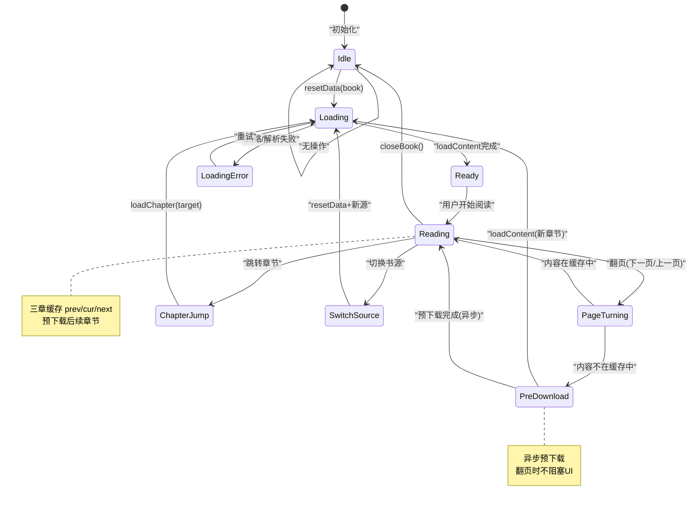
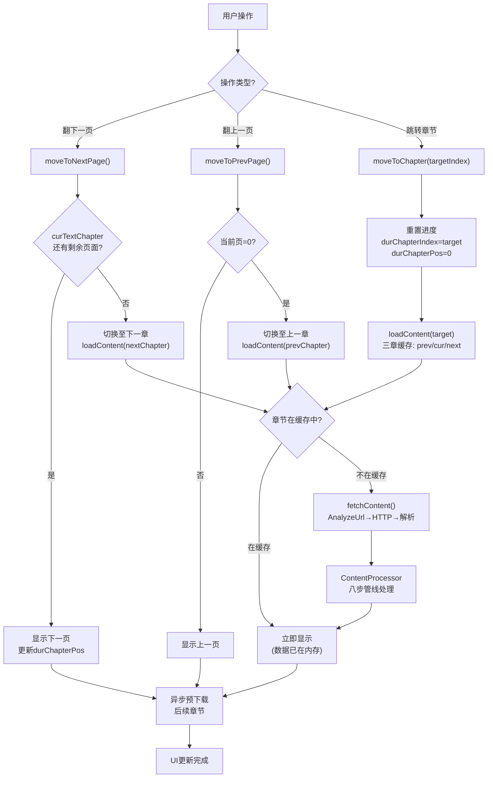

# 阅读引擎模块

> ReadBook/ReadManga/AudioPlay 三态全局单例架构，三章缓存 + 预下载 + 翻页跳章完整流程。
> 对应源码：`io.legado.app.model.ReadBook`（核心单例 1064 行）
> 🐍 本模块的 Python 重构参考实现已迁移至 [python-ref/reading-engine.md](../python-ref/reading-engine.md)（原位各章节留有链接）

---

## ReadBook 生命周期状态机



> **多 Activity 共享保护**：ReadBook 是全局单例 `object`，多 Activity 共享状态。修改状态需 `@Synchronized` 或 `Mutex` 保护，防止并发竞态。

---

## 翻页/跳章流程图



---

## 1. 三态阅读架构

```
全局单例（object）:
  ├── ReadBook   — 文字阅读核心
  ├── ReadManga  — 漫画阅读（图片模式）
  └── AudioPlay  — 音频播放（TTS + 有声书）

设计思想:
  - 全局单例 → 多 Activity 共享状态，换页面不丢失阅读进度
  - 双版本方法 → xxx() 加 xxxAwait()，满足同步和协程两种调用模式
  - 三章缓存 → prev/cur/next 三个 TextChapter 预加载
  - 预下载机制 → 翻页后自动预下载后续章节
```

---

## 2. ReadBook 核心状态

[ReadBook.kt:61-96](file:///f:/myself/github/WeAgentChat/temp/legado/app/src/main/java/io/legado/app/model/ReadBook.kt#L61-L96)

> 🐍 Python 参考实现（ReadBook 状态字段全景：书籍/章节分页/三章缓存/并发控制/进度跳转/预下载/回调 7 组字段）：[python-ref/reading-engine.md §2](../python-ref/reading-engine.md#2-readbook-核心状态)

### 2.2 Book / BookChapter / BookProgress 数据模型

> 🐍 Python 参考实现（Book / BookChapter / BookProgress dataclass）：[python-ref/reading-engine.md §2.2](../python-ref/reading-engine.md#22-book--bookchapter--bookprogress-数据模型)

---

## 3. openBook / resetData / upData

### 3.1 resetData — 打开书籍

[ReadBook.kt:98-126](file:///f:/myself/github/WeAgentChat/temp/legado/app/src/main/java/io/legado/app/model/ReadBook.kt#L98-L126)

> 🐍 Python 参考实现（reset_data 释放资源→设置书籍→加载章节数→持久化进度→识别书源→清空缓存→回调→触发加载 13 步流程）：[python-ref/reading-engine.md §3.1](../python-ref/reading-engine.md#31-resetdata--打开书籍)

### 3.2 upData vs resetData

```
upData: 更新数据（目录刷新场景）— 不清空三章缓存，仅更新复用部分
resetData: 完全重置（切换书籍场景）— 清空所有状态，重新加载
```

> 🐍 Python 参考实现（up_data）：[python-ref/reading-engine.md §3.2](../python-ref/reading-engine.md#32-updata-vs-resetdata)

### 3.3 _up_web_book — 书源与图片样式识别

[ReadBook.kt 内部方法](file:///f:/myself/github/WeAgentChat/temp/legado/app/src/main/java/io/legado/app/model/ReadBook.kt)

> 🐍 Python 参考实现（_up_web_book 本地/在线分支 + imageStyle 识别 + 单页模式联动）：[python-ref/reading-engine.md §3.3](../python-ref/reading-engine.md#33-_up_web_book--书源与图片样式识别)

---

## 4. 三章缓存机制

### 4.1 缓存窗口

```
当前阅读位置 durChapterIndex = 50

  [prev_text_chapter]  ← index=49（上一章，已解析）
  [cur_text_chapter]   ← index=50（当前章，正在显示）
  [next_text_chapter]  ← index=51（下一章，预加载完成）

移动:
  翻到下一章 → prev ← cur, cur ← next, next ← 重新加载 index=52
  翻到上一章 → next ← cur, cur ← prev, prev ← 重新加载 index=48
```

### 4.2 加载流程

[ReadBook.kt:534-596](file:///f:/myself/github/WeAgentChat/temp/legado/app/src/main/java/io/legado/app/model/ReadBook.kt#L534-L596)

> 🐍 Python 参考实现（load_content 缓存优先→未命中下载 / load_or_up_content 懒加载 / load_content_triple 三章并发）：[python-ref/reading-engine.md §4.2](../python-ref/reading-engine.md#42-加载流程)

---

## 5. contentLoadFinish — 内容加载完成核心

[ReadBook.kt:693-783](file:///f:/myself/github/WeAgentChat/temp/legado/app/src/main/java/io/legado/app/model/ReadBook.kt#L693-L783)

> 🐍 Python 参考实现（_content_load_finish：loading 队列移除 → N±1 范围检查 → 异步排版 → 按 offset=-1/0/1 分支赋值三章并逐页回调 UI）：[python-ref/reading-engine.md §5](../python-ref/reading-engine.md#5-contentloadfinish--内容加载完成核心)

### 5.1 下载方法（缓存未命中时）

> 🐍 Python 参考实现（_download 委托 CacheBook / _download_index 预下载单章 / _add_loading _remove_loading 防重复加载）：[python-ref/reading-engine.md §5.1](../python-ref/reading-engine.md#51-下载方法缓存未命中时)

---

## 6. 翻页与跳章

[ReadBook.kt:304-419](file:///f:/myself/github/WeAgentChat/temp/legado/app/src/main/java/io/legado/app/model/ReadBook.kt#L304-L419)

### 6.1 durChapterPos 的含义

`durChapterPos` 是 **字符偏移量**（char offset），不是页面索引号。
- 每页拥有 `chapterPosition` 属性，表示该页起始位置的字符偏移
- `getNextPageLength(pos)`：返回下一页的起始字符偏移，没有下一页返回 -1
- `getPrevPageLength(pos)`：返回上一页的起始字符偏移，没有上一页返回 -1
- `getPageIndexByCharIndex(pos)`：将字符偏移转换为页面索引

> 分页算法与翻页动画的详细实现见 [reading-engine-pagination.md](./reading-engine-pagination.md)

### 6.2 moveToNextPage / moveToPrevPage（同章翻页）

> 🐍 Python 参考实现（move_to_next_page / move_to_prev_page 同章内按字符偏移翻页）：[python-ref/reading-engine.md §6.2](../python-ref/reading-engine.md#62-movetonextpage--movetoprevpage同章翻页)

### 6.3 moveToNextChapter / moveToPrevChapter（跨章翻页）

> 🐍 Python 参考实现（move_to_next_chapter 三章引用左移 / move_to_prev_chapter 右移 + to_last 定位末页）：[python-ref/reading-engine.md §6.3](../python-ref/reading-engine.md#63-movetonextchapter--movetoprevchapter跨章翻页)

### 6.4 openChapter / skipToPage / setPageIndex

> 🐍 Python 参考实现（open_chapter 清空缓存重载 / skip_to_page / set_page_index / dur_page_index 计算属性）：[python-ref/reading-engine.md §6.4](../python-ref/reading-engine.md#64-openchapter--skiptopage--setpageindex)

### Await 版本方法

ReadBook 提供了以下 Await 挂起函数版本，与 Coroutine 版本功能一致但可直接在协程中挂起调用：

| 方法 | 返回类型 | 说明 |
|------|---------|------|
| contentLoadFinishAwait() | Unit | contentLoadFinish() 的挂起版本，等待内容加载完成 |
| moveToNextChapterAwait() | Unit | moveToNextChapter() 的挂起版本，等待章节切换完成 |

> 设计模式：Legado 的双版本方法模式（xxx() 返回 Coroutine + xxxAwait() 挂起函数），ReadBook 遵循此约定。

### 辅助方法

| 方法 | 说明 |
|------|------|
| clearSearchResult() | 清除三章缓存的搜索结果高亮 |
| setCharset(charset: String) | 设置本地书籍字符编码并重新加载章节列表 |
| recycleRecorders() | 根据 optimizeRender 配置回收前后页 Recorder 对象以优化内存 |

### 关键计算属性

| 属性 | 类型 | 说明 |
|------|------|------|
| isLayoutAvailable | Boolean | 排版是否已到达当前阅读位置 |
| isScroll | Boolean | 是否为滚动模式 |

---

## 7. 预下载策略

[ReadBook.kt:938-967](file:///f:/myself/github/WeAgentChat/temp/legado/app/src/main/java/io/legado/app/model/ReadBook.kt#L938-L967)

### 7.1 触发时机

每次 `curPageChanged()` 被调用时触发预下载检查。

```
翻页 → curPageChanged()
         │
         ▼
    preDownload()
         │
         ├── 本地书籍 → 跳过（return）
         ├── AppConfig.preDownloadNum < 2 → 仅 upToc（目录更新）
         └── 正常模式 →
               ├── 向后: 从 index+2 到 index+preDownloadNum（默认 10 章）
               └── 向前: 从 index-2 回到 index-min(5, preDownloadNum)
```

### 7.2 完整实现

> 🐍 Python 参考实现（_pre_download 向后 index+2~+10 / 向前 index-2~-5 双向并行 + 3 次失败熔断 / cancel_pre_download_task）：[python-ref/reading-engine.md §7.2](../python-ref/reading-engine.md#72-完整实现)

### 7.3 目录更新（upToc）

当预下载发现章节数不足时，触发目录更新检查：

> 🐍 Python 参考实现（_up_toc 四条件触发 + 新章节列表落库 + 三章缓存联动）：[python-ref/reading-engine.md §7.3](../python-ref/reading-engine.md#73-目录更新uptoc)

---

## 8. 阅读进度保存

[ReadBook.kt:908-933](file:///f:/myself/github/WeAgentChat/temp/legado/app/src/main/java/io/legado/app/model/ReadBook.kt#L908-L933)

### 8.1 保存时机

阅读进度在每次翻页时通过 `saveRead()` 保存到数据库，通过 `Executor` 在后台线程执行（非协程，使用全局线程池）。

> 🐍 Python 参考实现（_save_read 去抖规则 + _do_save_read 跨章标题更新 + SourceCallBack SAVE_READ 事件）：[python-ref/reading-engine.md §8.1](../python-ref/reading-engine.md#81-保存时机saveread)

### 8.2 阅读时长统计

> 🐍 Python 参考实现（_up_read_time / _do_up_read_time 心跳累计）：[python-ref/reading-engine.md §8.2](../python-ref/reading-engine.md#82-阅读时长统计)

### 8.3 进度跳转快照

> 🐍 Python 参考实现（save_current_book_progress 首跳快照 / restore_last_book_progress / set_progress 范围检查）：[python-ref/reading-engine.md §8.3](../python-ref/reading-engine.md#83-进度跳转快照)

---

## 9. 章节标题处理

> 🐍 Python 参考实现（get_display_title 标题替换规则 + 简繁转换）：[python-ref/reading-engine.md §9](../python-ref/reading-engine.md#9-章节标题处理)

---

## 10. 内容处理管线（ContentProcessor）

> **权威源**：[content-pipeline.md](./content-pipeline.md) — ContentProcessor 八步管线 + ReplaceAnalyzer 替换规则引擎 + HTML 格式化 + Python 重构参考，全部以该文档为准（本节原内嵌实现已收敛为索引，避免双源漂移）。
>
> 要点速览：
> - 每本书独立实例，按 `bookName + bookOrigin` WeakReference 缓存；`upReplaceRules()` 全局刷新
> - 八步管线：去重标题 → 重新分段 → 简繁转换 → useHtml 占位 → 替换规则净化（正则/字面量/@js:）→ 恢复 useHtml → 重新添加标题 → 段落缩进
> - ReadBook 侧消费点：`_content_load_finish` 中 `ContentProcessor.get(book.name, book.origin).get_content(...)`（见 §5 / python-ref §5）

---

## 11. 回调接口（CallBack）

[ReadBook.kt:1034-1062](file:///f:/myself/github/WeAgentChat/temp/legado/app/src/main/java/io/legado/app/model/ReadBook.kt#L1034-L1062)

ReadBook 通过 `CallBack` 接口与前端（Activity）通信，所有 UI 更新都通过回调进行。

> 🐍 Python 参考实现（CallBack 接口 13 方法定义：up_menu_view / up_content / page_changed / content_load_finish / on_layout_* 等）：[python-ref/reading-engine.md §11](../python-ref/reading-engine.md#11-回调接口callback)

### SourceCallBack 事件回调

ReadBook 在关键操作节点通过 SourceCallBack 向书源发送事件回调：

| 事件 | 触发时机 | 回调参数 |
|------|---------|---------|
| SAVE_READ | saveRead() 保存阅读进度时 | bookSource, book, chapter, durTime |

> SourceCallBack 是书源与阅读引擎的双向通信机制，允许书源在用户阅读过程中接收事件通知并执行自定义逻辑。

---

## 12. 生命周期管理

> 🐍 Python 参考实现（register / unregister / _release_and_cancel 资源释放 7 项 / _clear_expired_chapter_loading_job / _on_chapter_list_updated）：[python-ref/reading-engine.md §12](../python-ref/reading-engine.md#12-生命周期管理)

---

## 13. 翻页动画模式

> 🐍 Python 参考实现（page_anim 属性：book.getPageAnim() → ReadBookConfig.pageAnim 优先级）：[python-ref/reading-engine.md §13](../python-ref/reading-engine.md#13-翻页动画模式)

### 动画模式对照

| 代码 | 名称 | 对应实现类 | 说明 |
|:---:|------|-----------|------|
| 0 | 无动画 | NoAnimPageDelegate.kt | 直接切换，适合快速阅读 |
| 1 | 仿真 | SimulationPageDelegate.kt | 模拟纸质书卷曲翻页效果 |
| 2 | 滑动 | SlidePageDelegate.kt | 左右滑动，类似电子书阅读器 |
| 3 | 滚动 | ScrollPageDelegate.kt | 纵向连续滚动，不分页 |
| 4 | 覆盖 | CoverPageDelegate.kt | 新页面从右侧滑入覆盖旧页 |
| 5 | 水平翻页 | HorizontalPageDelegate.kt | 横向逐页翻动 |

> 翻页动画的详细实现见 [reading-engine-pagination.md](./reading-engine-pagination.md)（翻页动画唯一权威源）

---

## 14. 重构注意事项

### 14.1 核心差异（Android → Python）

| 维度 | Android (Kotlin) | Python (FastAPI) |
|------|-----------------|------------------|
| 排版引擎 | Android Canvas + Paint + StaticLayout（精确像素级） | 前端 Vue3 CSS columns / 后端字符估算 |
| 并发模型 | CoroutineScope(MainScope) + Coroutine.async | asyncio + create_task |
| 线程安全 | @Synchronized 注解 + Mutex | asyncio.Lock + threading.Lock |
| 缓存模型 | 文件系统（`book_cache/{folder}/{filename}.nb`） | 文件系统 / Redis |
| 单例 | `object ReadBook` Kotlin 对象单例 | Python 模块级单例 |
| 回调 | Kotlin 接口（CallBack） | 协议/回调函数 |
| 配置 | ReadBookConfig（Preference） | 数据库配置表 |
| 字体 | Typeface（TTF 文件） | CSS font-face |

### 14.2 关键实现点

1. **分页方案选择**：推荐纯前端分页（Vue3 CSS column-count 或 canvas 渲染），服务端只返回原始内容和估算元数据
2. **三章缓存策略**：前端浏览器缓存也应遵循 prev/cur/next 三章策略，避免内存过度消耗
3. **预下载**：基于 HTTP Range / 流式下载，服务端提供批量缓存 API
4. **进度保存**：Web 端需要 `beforeunload` 事件触发最终保存 + 定期心跳保存（30秒间隔）
5. **并行请求限制**：使用 `asyncio.Semaphore(2)` 控制预下载并发，避免过多连接
6. **章节加载取消**：前端翻页/跳转时需要取消正在加载的章节，避免过时数据覆盖正确缓存

### 14.3 边界情况处理

| 场景 | 处理方式 |
|------|---------|
| 加载过程中切换章节 | 取消当前加载任务，新章节优先 |
| 章节加载失败 | 显示错误信息，保留当前章节不变 |
| 本地书籍没有缓存 | 从本地文件系统读取（LocalBook.getContent） |
| 模拟阅读模式 | chapterIndex 映射到真实章节索引 |
| 目录更新后章节偏移 | 使用 JaccardSimilarity 算法匹配章节名 |
| 预下载网络错误 | 重试最多 3 次，超过标记为失败 |
| 双页模式排版 | 可见区域宽度减半，行高自适应 |

---

## 15. 相关代码锚点

| 功能 | 文件 | 行号 |
|------|------|------|
| ReadBook object 定义 | [ReadBook.kt](file:///f:/myself/github/WeAgentChat/temp/legado/app/src/main/java/io/legado/app/model/ReadBook.kt) | L61 |
| 核心状态字段 | [ReadBook.kt](file:///f:/myself/github/WeAgentChat/temp/legado/app/src/main/java/io/legado/app/model/ReadBook.kt) | L62-96 |
| resetData() | [ReadBook.kt](file:///f:/myself/github/WeAgentChat/temp/legado/app/src/main/java/io/legado/app/model/ReadBook.kt) | L98-126 |
| moveToNextPage() | [ReadBook.kt](file:///f:/myself/github/WeAgentChat/temp/legado/app/src/main/java/io/legado/app/model/ReadBook.kt) | L304-318 |
| moveToNextChapter() | [ReadBook.kt](file:///f:/myself/github/WeAgentChat/temp/legado/app/src/main/java/io/legado/app/model/ReadBook.kt) | L334-360 |
| moveToPrevChapter() | [ReadBook.kt](file:///f:/myself/github/WeAgentChat/temp/legado/app/src/main/java/io/legado/app/model/ReadBook.kt) | L393-419 |
| loadContent(index) | [ReadBook.kt](file:///f:/myself/github/WeAgentChat/temp/legado/app/src/main/java/io/legado/app/model/ReadBook.kt) | L568-596 |
| contentLoadFinish() | [ReadBook.kt](file:///f:/myself/github/WeAgentChat/temp/legado/app/src/main/java/io/legado/app/model/ReadBook.kt) | L693-783 |
| saveRead() | [ReadBook.kt](file:///f:/myself/github/WeAgentChat/temp/legado/app/src/main/java/io/legado/app/model/ReadBook.kt) | L908-933 |
| preDownload() | [ReadBook.kt](file:///f:/myself/github/WeAgentChat/temp/legado/app/src/main/java/io/legado/app/model/ReadBook.kt) | L938-967 |
| CallBack 接口 | [ReadBook.kt](file:///f:/myself/github/WeAgentChat/temp/legado/app/src/main/java/io/legado/app/model/ReadBook.kt) | L1034-1062 |
| ReadManga 核心 | [ReadManga.kt](file:///f:/myself/github/WeAgentChat/temp/legado/app/src/main/java/io/legado/app/model/ReadManga.kt) | L45, L154-240 |
| AudioPlay 核心 | [AudioPlay.kt](file:///f:/myself/github/WeAgentChat/temp/legado/app/src/main/java/io/legado/app/model/AudioPlay.kt) | L38, L171-222 |

---

## 16. BookType 位标志系统

> **权威源**：[constant-system.md §4 BookType — 位标志枚举](./constant-system.md)（位标志定义、allBookType 组合关系图、位运算操作，以及 §5 BookSourceType 书源单一内容类型与 BookType 位标志组合的关系辨析）。
>
> 本节原内嵌位标志表已收敛为指针，避免双源漂移。要点：`bookType` 是**位标志组合**（多种类型可同时标记），类型判断使用位运算 `bookType and BookType.xxx != 0`；书源侧的 `BookSourceType` 则是**单一内容类型**声明。

---

## 17. BookHelp — 书籍辅助核心

**文件**：[BookHelp.kt](file:///f:/myself/github/WeAgentChat/temp/legado/app/src/main/java/io/legado/app/help/book/BookHelp.kt)

BookHelp 是书籍操作的**归一入口**，被 ReadBook、CacheBook、DownloadService、ContentProcessor 到处调用。

> Help 辅助层全景（`help/` 目录 20+ 辅助类、`help/book/` 包定位）见 [help-layer.md](./help-layer.md)；其 §7「缓存系统」覆盖的是 CacheManager 三级缓存（内存 LRU + Room + 文件），与本章 BookHelp 的 `book_cache` 文件缓存布局互补、不重复。

### 章节内容管理

```python
class BookHelp:
    @staticmethod
    def has_content(book: Book, chapter: BookChapter) -> bool:
        """检查章节内容是否已缓存"""
        # 检查两个地方：
        # 1. content.source(书源URL) 路径下的缓存文件
        # 2. durChapter 的 cacheDir()

    @staticmethod
    def get_content(book: Book, chapter: BookChapter) -> str:
        """获取章节内容"""
        # 缓存文件路径: {bookDir}/{chapter.getFileName()}
        # 读取失败 → return ""

    @staticmethod
    def save_content(book: Book, chapter: BookChapter, content: str):
        """保存章节内容到缓存"""
        # 缓存路径: bookDir = book_cache/{book.getFolderName()}/
        # 文件名: chapter.getFileName()（非固定 {index}.nb）
        # ⚠️ saveImages() 调用在源码中已被注释掉
        # 图片不再随章节内容保存时自动下载
        # 图片下载由 CacheBook 服务单独处理

    @staticmethod
    def del_content(book: Book, chapter: BookChapter):
        """删除章节缓存"""
```

### 图片管理

```python
    @staticmethod
    def save_images(book_source, book, chapter, content, download_type) -> str:
        """
        下载并替换章节内容中的图片
        @param download_type: 0=离线下载, 1=缓存下载
        @return: 替换图片 URL 为本地路径后的内容
        """
        # 1. 从内容中提取所有  标签
        # 2. 对每一个 img，调用 save_image()
        # 3. 将 src 替换为本地路径
        # 4. download_type==1 时并发下载（max_thread）
        # 5. 缓存前5章图片（preNum 参数）

    @staticmethod
    def get_image(book_url: str, img_url: str) -> bytes | None:
        """获取已缓存的图片"""

    @staticmethod
    def is_image_exist(book_url: str, img_url: str) -> bool:
        """检查图片是否已缓存"""
```

### 缓存清理

```python
    @staticmethod
    def clear_cache(book: Book):
        """清理书籍所有缓存（章节+图片+封面）"""
        # 删除 {bookDir} 整个目录

    @staticmethod
    def clear_invalid_cache(book: Book):
        """清理无效缓存（章节索引不在 chapterList 中的缓存文件）"""
```

### 进度恢复（Jaccard 相似度）

```python
    @staticmethod
    def get_dur_chapter(book: Book, chapters: list[BookChapter]) -> BookChapter | None:
        """
        获取当前阅读章节（用于换源后的进度恢复）

        算法流程：
        1. 根据比例估算初始位置
           estimated = int(durChapterIndex * chapters.size / oldChapterSize)
        2. 在估算位置 ±10 章范围内搜索
        3. 使用 Jaccard 相似度匹配章节标题：
           Jaccard(title1, title2) = |intersection| / |union|
           阈值：> 0.96 即匹配 → 取交集最大的
        4. 若相似度不足，回退到章节索引匹配
           直接返回 chapters[durChapterIndex]（若索引有效）
        """
```

### 缓存目录结构

> `book_cache/` 文件缓存布局以本节为权威描述；应用级缓存（CacheManager 三级缓存）见 [help-layer.md §7 缓存系统](./help-layer.md)。

```python
# 缓存目录完整结构
book_cache/
├── {folderName}/              # = bookDir，由 book.getFolderName() 决定
│   ├── {fileName}             # 章节内容，fileName 由 bookChapter.getFileName() 决定（非固定 {index}.nb）
│   ├── {fileName}
│   ├── ...
│   ├── images/                # 图片缓存目录（非 img/）
│   │   ├── {md5(imgUrl)}      # 图片缓存文件
│   │   ├── ...
│   └── cover.jpg              # 封面缓存
```

---

## 18. 子文档索引

| 子文档 | 内容 |
|--------|------|
| [reading-engine-pagination.md](./reading-engine-pagination.md) | 分页算法详解：durChapterPos 字符偏移分页机制、TextChapter 数据结构、页面计算算法、6 种翻页动画实现（翻页动画唯一权威源） |
| [reading-engine-media.md](./reading-engine-media.md) | 多媒体阅读：ReadManga 漫画阅读实现、AudioPlay 音频播放实现（BookType 位标志权威定义见 [constant-system.md](./constant-system.md)） |
| [../python-ref/reading-engine.md](../python-ref/reading-engine.md) | 🐍 Python 重构参考：ReadBook 单例全量参考实现（原主文档 §2-§13 内嵌代码迁移归档） |
