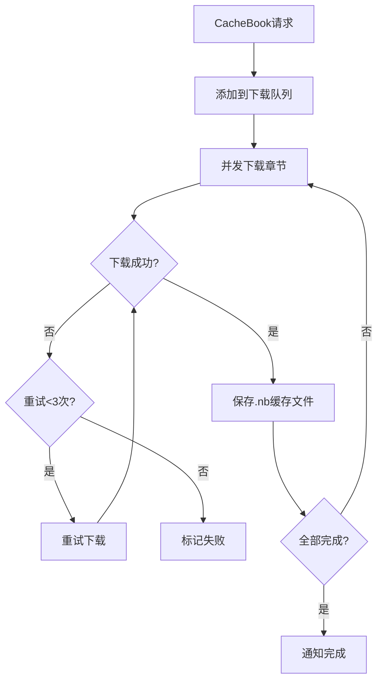

# 服务层与辅助模块

> App 初始化、WebDAV 同步、下载缓存、TTS 朗读、RSS 子系统、JS 扩展函数。

---

## 1. App.kt — 应用初始化

[App.kt:70-127](file:///f:/myself/github/WeAgentChat/temp/legado/app/src/main/java/io/legado/app/App.kt#L70-L127)

### 1.1 初始化流程

```
App.onCreate():
  主线程同步初始化:
    1. CrashHandler 注册 + LogUtils 初始化（全局崩溃处理器 + 日志系统）
    2. AppConfig SP 监听器注册（SharedPreferences 变更监听）

  异步初始化（在 IO 协程中顺序执行）:
    3. Cronet 引擎初始化（OkHttp HTTP/2 支持）
    4. 通知渠道创建（3个渠道: 下载/朗读/Web服务）
    5. Room 数据库初始化（appDb 懒加载触发）
    6. Rhino JS 引擎初始化（WrapFactory 注册）
    7. 缓存大小检查（超出限制则清理）
    8. 简繁转换库初始化
    9. WebDAV 自动同步检测

  延迟初始化:
    10. Web 服务器启动（用户首次打开 Web 管理时）
```

### 1.2 通知渠道

[App.kt:178-221](file:///f:/myself/github/WeAgentChat/temp/legado/app/src/main/java/io/legado/app/App.kt#L178-L221)

```
3 个通知渠道:
  1. 下载通知   — DownloadService 进度
  2. 朗读通知   — TTS 朗读 / 后台播放 (channelIdReadAloud)
  3. Web服务通知 — 更新检查、同步状态 (channelIdWeb)
```

### 1.3 Rhino 初始化

[App.kt:223-234](file:///f:/myself/github/WeAgentChat/temp/legado/app/src/main/java/io/legado/app/App.kt#L223-L234)

```
initRhino():
  注册自定义 Rhino WrapFactory
  使得 JS 可通过 java 对象调用 JsExtensions 中的所有方法
```

---

## 2. AppWebDav — WebDAV 同步

[AppWebDav.kt:40](file:///f:/myself/github/WeAgentChat/temp/legado/app/src/main/java/io/legado/app/help/AppWebDav.kt#L40)

### 2.1 同步机制

```
WebDAV 同步内容:
  - 书架数据 (books.json)
  - 书源数据 (bookSources.json)
  - RSS 源数据 (rssSources.json)
  - 阅读进度 (bookProgress.json)
  - 替换规则 (replaceRules.json)

同步策略:
  - 比较本地和远程的时间戳
  - 时间戳更新的 → 覆盖旧的
  - 冲突时以远程为准
```

### 2.2 核心方法

| 方法 | 功能 |
|------|------|
| `upConfig()` | 配置 WebDAV 连接参数并验证 |
| `uploadBookProgress()` | 上传当前阅读进度 |
| `getBookProgress()` | 获取指定书的远程进度 |
| `downloadAllBookProgress()` | 下载全部书籍进度（比较时间戳） |
| `exportBookSources()` | 导出书源到 WebDAV |
| `importBookSources()` | 从 WebDAV 导入书源 |

---

## 3. DownloadService — 文件下载

基于 Android `DownloadManager` 系统服务：

```
功能: 通用文件下载（APK/ZIP/图片等），非书籍章节缓存
特性:
  - 去重检测（相同URL不重复下载）
  - 进度通知（每秒轮询 DownloadManager 状态）
  - 自动打开下载完成的文件
  - 支持暂停/取消
```

---

## 4. CacheBook — 章节缓存服务

```
功能: 书籍章节离线缓存（"离线缓存"按钮触发）
流程:
  1. 获取书籍目录
  2. 按章节逐个下载并保存到本地文件系统
  3. 多线程并发下载（Semaphore 控制并发数）
  4. 下载进度通知
  5. 失败重试机制
```

### CacheBook 完整架构

```
CacheBook 单例
├── cacheBookMap: ConcurrentHashMap<String, CacheBookModel>
│   └── CacheBookModel(bookSource, book)
│       ├── waitDownloadSet: LinkedHashSet<Int>      # 待下载章节索引
│       ├── onDownloadSet: LinkedHashSet<Int>         # 正在下载的章节索引
│       ├── tasks: CompositeCoroutine                 # 协程集合
│       ├── isStopped: Boolean
│       └── waitingRetry: Boolean
├── workingState: MutableStateFlow<Boolean>           # 暂停/恢复
├── successDownloadSet: Set<String>                   # 下载成功的 chapter.primaryStr()
├── errorDownloadMap: Map<String, Int>                # 下载失败次数 (< 3 次重试)
├── mutex: Mutex                                      # 启动锁
└── 下载统计: downloadSummary / isRun / waitCount / onDownloadCount
```

### 核心下载流程



```python
# CacheBookModel.download() — 从 waitDownloadSet 取一个章节下载
def download(scope, context):
    chapter_index = waitDownloadSet.first_or_null()
    chapter = db.get_chapter(book.book_url, chapter_index)

    if BookHelp.has_content(book, chapter):
        # 已有缓存 → 只下载图片
        content = BookHelp.get_content(book, chapter)
        BookHelp.save_images(book_source, book, chapter, content, 1)
    else:
        # 从网络获取 → WebBook.getContent()
        content = await WebBook.get_content_await(book_source, book, chapter)

    # 错误处理：3 次重试
    on_error(chapter, error):
        if error_download_map[chapter.primary_str()] < 3:
            wait_download_set.add(chapter.index)  # 重新入队
```

### .nb 缓存文件格式

```python
# .nb 文件格式
# 纯文本 UTF-8 编码
# 文件名: {chapterIndex}.nb
# 内容: 经过 ContentProcessor 处理后的文本
# 目录: /cache/book_{md5(bookUrl)}/
# 连续读取时使用 mmap 优化
```

> **重构方案**：使用 SQLite BLOB 或文件系统缓存均可。推荐文件系统：`cache/books/{book_hash}/{chapter_index}.txt`

---

## 5. TTS 朗读服务

### 5.1 三种朗读引擎

| 引擎 | 类 | 说明 |
|------|-----|------|
| 系统TTS | `TTSReadAloudService` | 调用 Android TextToSpeech API |
| HTTP TTS | `HttpReadAloudService` | 配置 HTTP TTS 服务端点 |
| 基类 | `BaseReadAloudService` | 朗读状态管理+前后章节切换 |

### 5.2 朗读状态

```
BaseReadAloudService 状态:
  playState: READY / PLAYING / PAUSED / STOPPED
  chapterIndex: 当前朗读章节索引
  chapterPos: 当前朗读位置（字符偏移）
  sentenceList: 分词后的句子列表
```

---

## 6. RSS 子系统

> 本节为索引入口（原文为占位空壳，2026-09-11 修正）。完整内容见 **[rss-subsystem.md](rss-subsystem.md)**：Rss 调度 + `RssParserByRule` 规则解析 + `RssParserDefault` 标准解析 + 文章流 UI。

### 6.1 架构概览

```
RssSource (源管理)
    │
    ├── ruleArticles 为空 → RssParserDefault (XML PullParser 解析标准 RSS/Atom)
    │
    └── ruleArticles 非空 → RssParserByRule (规则引擎解析)
         │
         ├── AnalyzeUrl → HTTP请求
         ├── AnalyzeRule → 规则提取字段
         │    ├── ruleTitle → 标题
         │    ├── rulePubDate → 时间
         │    ├── ruleDescription → 描述
         │    ├── ruleImage → 图片
         │    ├── ruleLink → 链接
         │    └── ruleContent → 正文
         └── ruleNextPage → 翻页
              ├── "PAGE" → 使用当前排序URL
              └── 其他规则 → 提取下一页URL
```

### 6.2 RSS 调试

```
Debug 单例管理调试会话:
  startDebug(scope, rssSource, key):
    key 格式:
      "name::url" → 访问分类页
      纯 URL      → 直接访问内容页
      搜索关键字   → 使用 searchUrl 搜索
      空          → 使用第一个排序URL

  调试日志通过 WebSocket 实时推送:
    state=1      → 普通日志
    state=-1     → 错误，调试结束
    state=1000   → 成功完成
```

---

## 7. JS 扩展函数清单

> 本节为索引入口（原文为占位空壳，2026-09-11 修正）。完整内容见 **[js-extensions.md](js-extensions.md)**：30+ 个 JS 可调用方法（ajax/ajaxAll/connect/webView/cache/file/encode/python 等）。

书源 JS 可通过 `java` 对象调用 70+ 个 Java 方法：

### 7.1 网络请求（8个）

| 函数 | 说明 |
|------|------|
| `ajax(url)` | 访问网络，返回 response body |
| `ajax(url, timeout)` | 带超时的网络访问 |
| `ajaxAll(urls)` | 并发访问多个 URL |
| `ajaxAll(urls, skipRateLimit)` | 跳过并发率限制 |
| `ajaxTestAll(urls, timeout)` | 测试模式并发访问 |
| `connect(urlStr)` | 返回完整响应对象（含 header） |
| `connect(urlStr, header, timeout)` | 自定义 header 的连接 |

### 7.2 WebView 执行（5个）

| 函数 | 说明 |
|------|------|
| `webView(html, url, js)` | 无头 WebView 执行 JS 取返回值 |
| `webViewGetSource(html, url, js, sourceRegex)` | 提取页面中特定资源 URL |
| `webViewGetOverrideUrl(html, url, js, overrideUrlRegex)` | 监控 WebView 中的 URL 跳转 |

### 7.3 编解码（15+）

| 函数 | 说明 |
|------|------|
| `base64Decode(str)` / `base64Encode(str)` | Base64 编解码 |
| `md5(str)` / `sha1(str)` | 哈希 |
| `hexDecode(str)` / `hexEncode(str)` | 十六进制 |
| `unicodeDecode(str)` / `unicodeEncode(str)` | Unicode |
| `urlDecode(str)` / `urlEncode(str, charset)` | URL 编解码 |

### 7.4 字符串处理（10+）

| 函数 | 说明 |
|------|------|
| `trim(str)` / `replace(str, regex, replacement)` | 字符串处理 |
| `split(str, separator)` / `substring(str, start, end)` | 分割/截取 |
| `indexOf(str, sub)` / `lastIndexOf(str, sub)` | 查找 |
| `parseInt(str)` / `parseFloat(str)` | 解析数字 |

---

## 8. 相关代码锚点

| 功能 | 文件 | 行号 |
|------|------|------|
| App 类定义 | [App.kt](file:///f:/myself/github/WeAgentChat/temp/legado/app/src/main/java/io/legado/app/App.kt) | L66 |
| App.onCreate 初始化 | [App.kt](file:///f:/myself/github/WeAgentChat/temp/legado/app/src/main/java/io/legado/app/App.kt) | L70-127 |
| 通知渠道创建 | [App.kt](file:///f:/myself/github/WeAgentChat/temp/legado/app/src/main/java/io/legado/app/App.kt) | L178-221 |
| Rhino 初始化 | [App.kt](file:///f:/myself/github/WeAgentChat/temp/legado/app/src/main/java/io/legado/app/App.kt) | L223-234 |
| WebDAV object | [AppWebDav.kt](file:///f:/myself/github/WeAgentChat/temp/legado/app/src/main/java/io/legado/app/help/AppWebDav.kt) | L40 |
| WebDAV 配置更新 | [AppWebDav.kt](file:///f:/myself/github/WeAgentChat/temp/legado/app/src/main/java/io/legado/app/help/AppWebDav.kt) | L74-92 |
| 上传阅读进度 | [AppWebDav.kt](file:///f:/myself/github/WeAgentChat/temp/legado/app/src/main/java/io/legado/app/help/AppWebDav.kt) | L242-261 |
| 下载全部进度 | [AppWebDav.kt](file:///f:/myself/github/WeAgentChat/temp/legado/app/src/main/java/io/legado/app/help/AppWebDav.kt) | L306-336 |
| JsExtensions 接口 | [JsExtensions.kt](file:///f:/myself/github/WeAgentChat/temp/legado/app/src/main/java/io/legado/app/help/JsExtensions.kt) | L1 |
| JS 扩展完整清单 | 参见本文档第 7 节 | — |
| RSS 完整链路 | 参见本文档第 6 节 | — |

---

## Python 重构参考（已迁移）

> 7 个 Android Service 的 Python 伪代码实现（下载/缓存/书源检测/WebService/TTS 朗读/音频播放/导出书籍，原 §9.1-9.8）已迁移至 [../python-ref/service-layer.md](../python-ref/service-layer.md)，该文件为唯一权威源。


---

## 10. 网络性能与稳定性优化 + 延伸版本功能借鉴（2026-07）

> 本节汇总 2026-07 服务层相关的缓存优化 + 延伸版本功能借鉴。Spec：[specs/network-perf-stability/](../../specs/network-perf-stability/)。

### 10.1 缓存定期清理（LRU 化）

网络层与服务层多处无界 Map 缓存改为 LRU，避免内存泄漏：

| 缓存 | 文件 | 上限 | 说明 |
|------|------|------|------|
| BookSource 内存缓存 | `SourceHelp.kt` | — | 新增内存缓存，减少数据库查询（热路径优化） |
| failUrl 缓存 | `OkHttpStreamFetcher.kt` | 200 | 图片加载失败 URL 缓存 |
| stringRuleCache | `AnalyzeRule.kt` | 64 | 规则解析缓存 |
| 代理客户端缓存 | `HttpHelper.kt` | 20 | 代理 OkHttpClient 复用 |
| DNS IP 缓存 | `HttpHelper.kt` | 100 | 自定义 DNS 解析缓存 |
| ConcurrentRateLimiter | `ConcurrentRateLimiter.kt` | — | 新增 `clearRecord` 方法，删源时清理限流记录 |

> 网络层细节详见 [network-layer.md](../architecture/network-layer.md) 第 13 节。

### 10.2 调试工具集（F-P0-1）

借鉴来源：阅读Sigma / 喵公子阅读。新增 7 个调试 Activity，全部采用 Jetpack Compose 构建：

| Activity | 功能 |
|----------|------|
| 编码转换 | Base64 / URL / Unicode / Hex 互转 |
| HTTP 请求 | 自定义 URL / Header / Body 发起请求 |
| curl 转换 | curl 命令解析与转换 |
| ping 工具 | 网络连通性检测 |
| 正则测试 | 正则表达式匹配测试 |
| 时间戳转换 | Unix 时间戳与日期互转 |
| 辅助工具 | 其他调试辅助功能 |

### 10.3 备份选择器（F-P0-2）

借鉴来源：蛋蛋Max。支持选择性备份指定数据类型，避免全量备份：

- **BackupSelectorConfig**：备份选择器配置，控制各数据类型的勾选状态
- **新增 3 个实体**：
  - `CoverGalleryGroup`：书封画廊分组
  - `Image`：图片资源
  - `ReadRecordDetail`：阅读记录明细
- **BackupController**：备份控制器，按选择配置导出对应数据
- **HttpServer 路由**：Web 端备份选择 API（与 10.4 联动）

### 10.4 Web 端备份管理（F-P0-3）

借鉴来源：蛋蛋Max。Vue3 Web 端新增备份管理页面：

- 新增 Vue 组件：备份选择、导出、导入
- 新增路由：`/backup`
- 新增 API：与 `BackupController` 对接，支持选择性备份的 Web 操作

### 10.5 订阅源页面选择器（F-P0-4）

借鉴来源：阅读Sigma。订阅源列表菜单中新增页码选择器，可直接跳转到指定页码，无需逐页翻页。

### 10.6 自动任务系统（F-P1-1）

借鉴来源：阅读Sigma。支持 cron 表达式定时执行 JS 脚本：

- cron 表达式调度（分 / 时 / 日 / 月 / 周）
- JS 脚本通过 `JsExtensions` 执行，可调用 ajax / 文件 / 缓存等扩展
- 任务管理：增删改查、启用 / 禁用
- 后台执行 + 通知提醒

### 10.7 高亮规则系统（F-P1-2）

借鉴来源：阅读Sigma。正文内容高亮规则系统：

- **9 通道样式**：支持 9 种独立的高亮样式配置（颜色 / 背景 / 粗体 / 斜体 / 下划线）
- **手动高亮**：阅读时手动选中文本添加高亮
- **分组管理**：规则分组，支持启用 / 禁用整组
- **预设规则**：内置常用高亮预设
- **导入导出**：规则 JSON 导入导出，支持分享

### 10.8 调试日志悬浮球（F-P1-3）

借鉴来源：阅读NG。调试日志悬浮球，方便实时查看日志：

- **DebugFloatBallManager**：悬浮球管理器，支持拖拽 / 显示 / 隐藏
- **AppLog 日志级别**：新增日志级别分类（VERBOSE / DEBUG / INFO / WARN / ERROR）
- **AppLogDialog**：日志查看对话框，支持分类过滤、关键字搜索

### 10.9 其他优化

| 优化项 | 说明 |
|--------|------|
| 资源配置优化 | `resourceConfigurations` 仅保留已翻译语言，减小 APK 体积 |
| 文件夹视图 | 书源 / 订阅源 / ExploreFragment / RssFragment 支持文件夹 / 列表视图切换 |
| Cronet 149 升级 | 补全 `httpengine_native_provider_java.jar`，修复 Cronet 加载问题 |

### 10.10 验证状态

- ✅ P0 功能（F-P0-1 ~ F-P0-4）：4 项全部实施完成
- ✅ P1 功能（F-P1-1 ~ F-P1-3）：3 项全部实施完成
- ⚠️ 待真机验证：上述功能需在真机上验证可用性与稳定性
