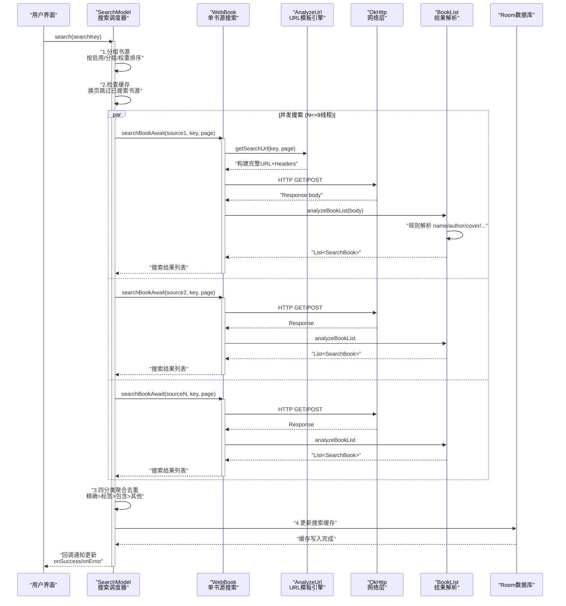
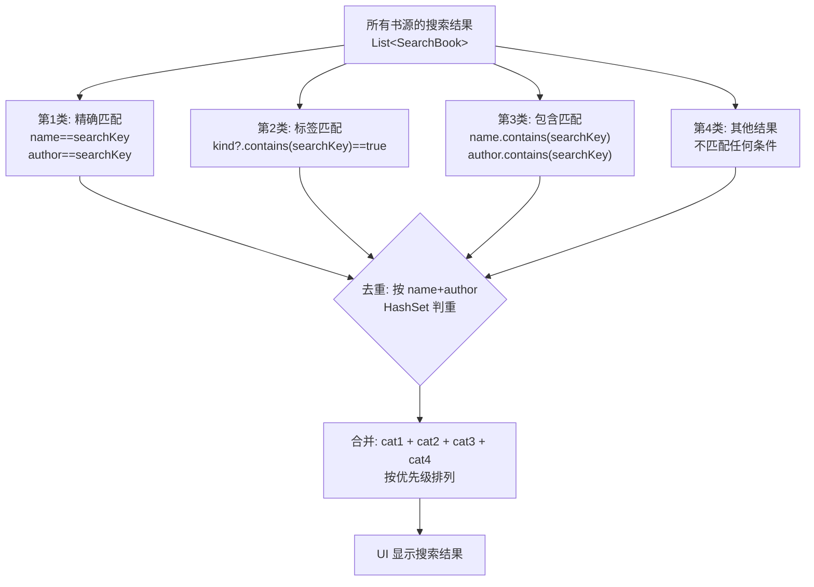
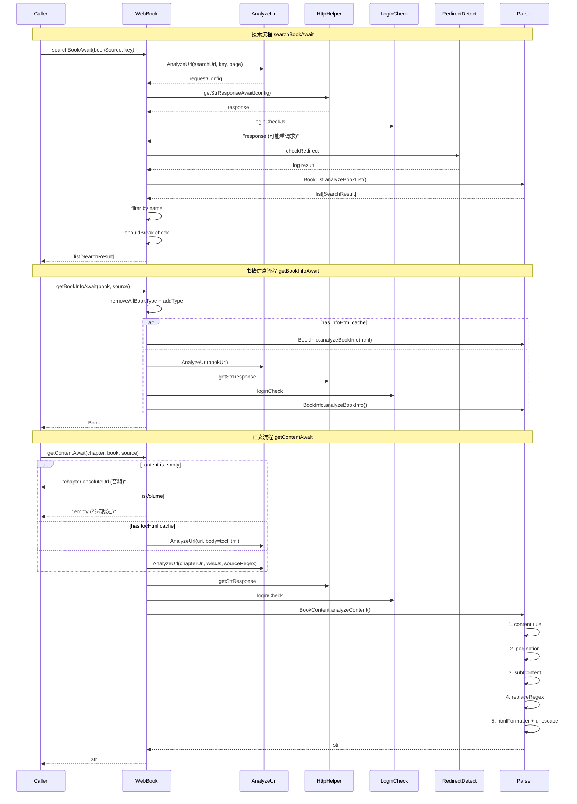
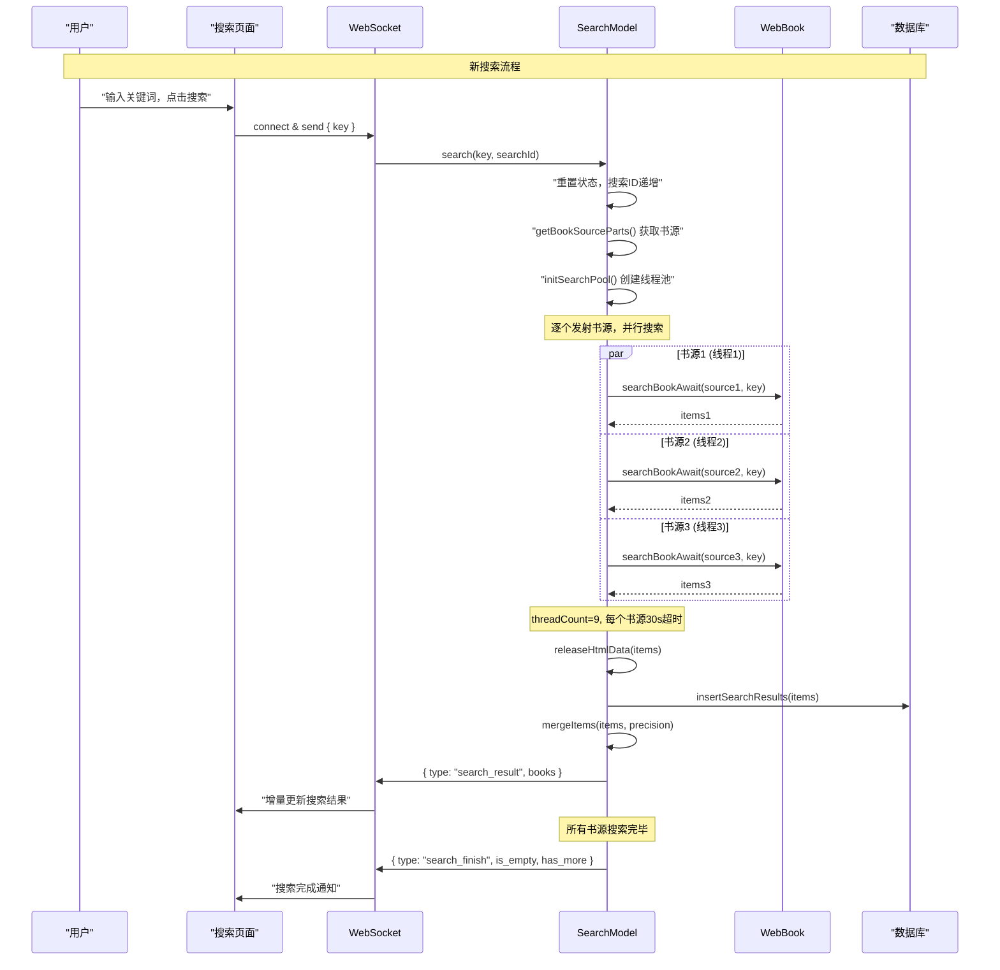

# WebBook 搜索与网络书模块

> 网络书籍获取的核心模块——WebBook 单例处理所有网络书操作，SearchModel 负责多书源并发搜索调度。

---

## 搜索全链路流程图



---

## 四分类去重流程图



---

## 1. 架构总览

```
用户搜索请求
    │
    ▼
SearchModel.search(searchKey)          ← 搜索调度器
    │
    ├─ 书源分组 (bookSourceParts)       ← 按启用/分组/权重排列
    │
    ├─ Flow + mapParallelSafe(N)       ← 固定并发数(N≤9)执行搜索
    │    │
    │    └─ WebBook.searchBookAwait()   ← 单书源搜索
    │         │
    │         ├─ AnalyzeUrl → 构建请求
    │         ├─ loginCheckJs → 登录检测
    │         ├─ checkRedirect → 重定向检测
    │         └─ BookList.analyzeBookList() → 解析结果
    │
    ├─ 四分类聚合去重 (mergeItems)      ← 精确 > 标签 > 包含 > 其他
    │
    └─ 回调通知 UI 更新
```

---

## 2. WebBook 双版本模式

[WebBook.kt:30](file:///f:/myself/github/WeAgentChat/temp/legado/app/src/main/java/io/legado/app/model/webBook/WebBook.kt#L30)

每个功能提供两个版本：

```kotlin
// async 封装版 — ViewModel/UI 直接调用
fun searchBook(scope, source, key, page) { ... }

// 纯挂起版 — 其他 model 层内部调用
suspend fun searchBookAwait(scope, source, key, page) { ... }
```

| 功能 | async版 | await版 | 说明 |
|------|---------|---------|------|
| 搜索 | `searchBook()` | `searchBookAwait()` | 按关键词搜索 |
| 发现 | `exploreBook()` | `exploreBookAwait()` | 发现页浏览 |
| 详情 | `getBookInfo()` | `getBookInfoAwait()` | 获取书籍详情 |
| 目录 | `getChapterList()` | `getChapterListAwait()` | 获取章节列表 |
| 正文 | `getContent()` | `getContentAwait()` | 获取章节正文 |
| 精准搜索 | `preciseSearch()` | `preciseSearchAwait()` | 精确书名搜索 |

**核心约定**：
- 统一通过 `currentCoroutineContext()` 传递协程上下文
- `searchBookAwait` 系列使用 `CoroutineScope(SupervisorJob() + currentCoroutineContext())` 创建独立作用域
- 所有网络请求最终调用 `HttpHelper.getStrResponseAwait()`

---

## 3. 搜索完整链路

[WebBook.kt:49-107](file:///f:/myself/github/WeAgentChat/temp/legado/app/src/main/java/io/legado/app/model/webBook/WebBook.kt#L49-L107)

### 3.1 searchBookAwait 流程

```
searchBookAwait(bookSource, key, page, filter):
  1. 检查 searchUrl 是否为空 → 空则抛异常
  2. 构建 RuleData(sourceUrl=searchUrl, baseUrl=bookSourceUrl, key, page)
  3. AnalyzeUrl → 模板变量注入 ({{key}}/{{page}})
  4. 发起 HTTP 请求 (OkHttp + Cronet)
  5. loginCheckJs → 登录状态检测JS（如果配置了loginUrl）
  6. checkRedirect → 重定向检测
  7. BookList.analyzeBookList(ruleSearch, html, baseUrl, source)
     → 使用搜索规则解析 HTML → 返回 List<SearchBook>
  8. 精确搜索过滤 (filter_):
     若 filter 中有 name 参数 → 仅保留 name 包含该关键词的结果
  9. 精准搜索提前终止 (shouldBreak):
     精确搜索结果命中 → 不再搜索后续书源
 10. 返回 SearchBook 列表
```

### 3.2 搜索页面支持

```
searchUrl 模板变量:
  {{key}}   → 搜索关键词
  {{page}}  → 页码（多页搜索时递增）

多页搜索:
  通过 page 参数控制，书源需支持分页参数
  或通过 ruleNextPage 规则提取"下一页"链接
```

---

## 4. SearchModel 并发调度

[SearchModel.kt:34](file:///f:/myself/github/WeAgentChat/temp/legado/app/src/main/java/io/legado/app/model/webBook/SearchModel.kt#L34)

### 4.1 核心状态

```kotlin
class SearchModel {
    var searchKey: String            // 当前搜索关键词
    var searchPage: Int = 0          // 当前页码
    var searchId: Long = 0           // 搜索会话ID（外部传入，0=取消）
    // searchId 由调用方传入，非 SearchModel 自行生成
    // searchId 变化 → 新搜索开始；searchId 不变 → searchPage 递增（换页）

    // 书源分组列表
    var bookSourceParts: List<BookSourcePart>

    // 搜索结果（四分类聚合后的最终结果）
    val searchBooks = arrayListOf<SearchBook>()

    // 并发控制
    var threadCount: Int             // 用户配置的并发数
    val MAX_THREAD = 9               // 硬上限
    var workingState = MutableStateFlow(true)  // 暂停/恢复控制
}
```

### 4.2 搜索流核心循环

[SearchModel.kt:52-114](file:///f:/myself/github/WeAgentChat/temp/legado/app/src/main/java/io/legado/app/model/webBook/SearchModel.kt#L52-L114)

```
search(searchKey):
  1. 初始化:
     - 判断关键词是否变化 (sameKey)
     - 若关键词变化 → 重置 page=0, 清空 searchBooks
     - searchId 由外部调用方传入（非 SearchModel 自行生成）
     - searchId 变化 → 新搜索开始；searchId 不变 → 换页

  2. 若 sameKey → 加载下一页 (page++)
     若 needMerge → 需要合并模式（搜索前不清空已有结果）

  3. 启动搜索流 (_search_flow):
     for 每个 BookSourcePart 中的每个 BookSource:
       ├─ await _wait_if_paused()         ← workingState 检查
       ├─ search_one_source(source)       ← 异步超时30s
       ├─ _release_html_data(items)       ← 释放 HTML 缓存
       ├─ _insert_search_results(items)   ← 写入 searchBook 表
       ├─ _merge_items(items, precision)  ← 四分类聚合去重
       └─ callback.on_search_success()    ← 通知 UI 更新
```

### 4.3 并发控制

```
并发策略:
  1. threadCount = min(用户配置, MAX_THREAD=9)
  2. 使用 flow{}.mapParallelSafe(threadCount){} 控制并发度
     - mapParallelSafe 基于 Channel 实现，非 Semaphore
     - 线程池: Executors.newFixedThreadPool(min(threadCount, AppConst.MAX_THREAD)).asCoroutineDispatcher()
  3. 每个书源超时 30000ms（硬编码）

暂停/恢复:
  - workingState = MutableStateFlow(true)
  - 每个书源搜索前检查 workingState
  - false 时阻塞等待，直到 resume() 设为 true

取消:
  - searchId = 0 → 所有协程检测到后自动返回
```

---

## 5. 四分类聚合去重

[SearchModel.kt:116-197](file:///f:/myself/github/WeAgentChat/temp/legado/app/src/main/java/io/legado/app/model/webBook/SearchModel.kt#L116-L197)

### 5.1 去重键

```
去重依据: 直接字符串相等（name + author）
具体规则: 对新旧书籍的 name 和 author 做直接字符串比较（pBook.name == nBook.name && pBook.author == nBook.author）
若同名同作者 → 视为同一本书，调用 pBook.addOrigin(nBook.origin) 合并书源列表
```

### 5.2 四分类排序

搜索结果按匹配质量分为四类：

```
优先级从高到低:
  1. 精确匹配 (equalData) — name == searchKey || author == searchKey
  2. 标签匹配 (tagsData)  — kind?.contains(searchKey) == true
  3. 包含匹配 (containsData) — name.contains(searchKey) || author.contains(searchKey)
  4. 其他 (otherData)      — 都不满足
```

当 `precision=True`（精确搜索）时，`otherData` 组被丢弃。

### 5.3 合并算法

```
_merge_items(newItems, precision):
  对每个 newItem:
    1. 在已有 searchBooks 中查找同名同作者的书
    2. 找到 → 更新 originList（合并书源列表）+ 保留最优条目
    3. 未找到 → 添加到对应分类列表

  最终排序: [精确匹配] + [标签匹配] + [包含匹配] + [其他]
  各类内部: 按 originList.size 降序（书源越多的排越前）
```

### 5.4 合并效果示例

```
搜索关键词："三体"

▼ 来自 A 书源的结果：
  { name: "三体", author: "刘慈欣", origin: "sourceA" }
  { name: "三体X", author: "宝树", origin: "sourceA" }

▼ 来自 B 书源的结果：
  { name: "三体", author: "刘慈欣", origin: "sourceB" }
  { name: "三体·死神永生", author: "刘慈欣", origin: "sourceB" }

▼ 合并后：
  equalData:     [{ name: "三体", author: "刘慈欣", origin: "sourceA,sourceB", origin_list: 2 }]
  containsData:  [{ name: "三体X", author: "宝树", origin: "sourceA", origin_list: 1 }]
                 [{ name: "三体·死神永生", author: "刘慈欣", origin: "sourceB", origin_list: 1 }]

▼ 排序（按 origin 数量降序）：
  [
    { name: "三体", origin: "sourceA,sourceB" },           # 2 个书源找到
    { name: "三体X", origin: "sourceA" },                   # 1 个书源
    { name: "三体·死神永生", origin: "sourceB" },           # 1 个书源
  ]
```

---

## 6. 其他核心操作

### 6.1 发现页 — exploreBookAwait

[WebBook.kt:124-175](file:///f:/myself/github/WeAgentChat/temp/legado/app/src/main/java/io/legado/app/model/webBook/WebBook.kt#L124-L175)

```
与搜索的区别:
  - 使用 sourceUrl + exploreInfoMap（而非 searchUrl）
  - exploreInfoMap 从 BookSource.exploreInfoMapList 获取
  - 不传递 filter/shouldBreak 参数
  - 使用 ruleExplore 规则解析
```

### 6.2 书籍详情 — getBookInfoAwait

[WebBook.kt:192-252](file:///f:/myself/github/WeAgentChat/temp/legado/app/src/main/java/io/legado/app/model/webBook/WebBook.kt#L192-L252)

```
流程:
  1. book.removeAllBookType() + addType(source.getBookType())
  2. 检查缓存的 infoHtml → 有则跳过网络请求直接解析
  3. 无缓存 → AnalyzeUrl(bookUrl, baseUrl=bookSourceUrl) → HTTP请求
  4. loginCheckJs 登录检测
  5. BookInfo.analyzeBookInfo(book, ruleBookInfo, html)
```

### 6.3 目录获取 — getChapterListAwait

[WebBook.kt:284-351](file:///f:/myself/github/WeAgentChat/temp/legado/app/src/main/java/io/legado/app/model/webBook/WebBook.kt#L284-L351)

```
流程:
  1. 可选: runPreUpdateJs() — 更新前执行 JS
  2. 检查缓存的 tocHtml → 有则跳过网络请求
  3. 无缓存 → AnalyzeUrl(tocUrl, baseUrl=bookUrl) → HTTP请求
  4. BookChapterList.analyzeChapterList(book, ruleToc, html)
```

### 6.4 正文获取 — getContentAwait

[WebBook.kt:379-455](file:///f:/myself/github/WeAgentChat/temp/legado/app/src/main/java/io/legado/app/model/webBook/WebBook.kt#L379-L455)

```
流程:
  1. AnalyzeUrl(chapter.url, baseUrl=baseUrl) → HTTP请求
  2. loginCheckJs 登录检测
  3. checkRedirect 重定向检测
  4. ruleContent 规则解析 HTML → 正文字符串
  5. ContentProcessor.getContent() → 八步管线处理
  6. 返回 BookContent(textList, ...)

分页支持:
  - 单页模式: ruleNextPage 不为空 → 顺序翻页获取
  - 多页并发: webJs 不为空 → 并发获取所有分页
```

### 6.5 精准搜索 — preciseSearch / preciseSearchAwait

[WebBook.kt:460-499](file:///f:/myself/github/WeAgentChat/temp/legado/app/src/main/java/io/legado/app/model/webBook/WebBook.kt#L460-L499)

```
用途:
  导入书籍时自动匹配书源——按书名+作者精确匹配，找到即停

preciseSearch(scope, bookSourceParts, name, author):
  遍历 bookSourceParts 中的每个书源:
    1. source = part.getBookSource() ?: continue
    2. book = preciseSearchAwait(source, name, author).getOrNull()
    3. book != null → 返回 Pair(book, source)
  全部未命中 → 抛出 NoStackTraceException("没有搜索到<name>author")

preciseSearchAwait(bookSource, name, author):
  1. ensureActive() 检查协程活性
  2. searchBookAwait(bookSource, name,
       filter = { fName, fAuthor, _ -> fName == name && fAuthor == author },
       shouldBreak = { it > 0 })
     → filter: 仅保留书名+作者完全匹配的结果
     → shouldBreak: 命中即提前终止，不再搜索后续书源
  3. firstOrNull()?.toBook() → 转为 Book 对象
  4. 未找到 → 抛出 NoStackTraceException
  5. onFailure → ensureActive() 确保取消传播

返回值:
  - preciseSearch: Coroutine<Pair<Book, BookSource>>
  - preciseSearchAwait: Result<Book>

典型调用场景:
  - 书籍导入时自动匹配书源
  - 本地书籍关联在线书源
```

### 6.6 预更新 JS — runPreUpdateJs（内部方法）

[WebBook.kt:270-282](file:///f:/myself/github/WeAgentChat/temp/legado/app/src/main/java/io/legado/app/model/webBook/WebBook.kt#L270-L282)

```
用途:
  getChapterListAwait 内部调用，在获取目录前执行书源配置的 preUpdateJs

runPreUpdateJs(bookSource, book, isFromBookInfo=false):
  1. 读取 bookSource.ruleToc?.preUpdateJs
  2. 若为空 → 跳过，返回 Result.success
  3. 非空 → AnalyzeRule(book, bookSource, true, isFromBookInfo)
       .setCoroutineContext(currentCoroutineContext())
       .evalJS(preUpdateJs)
  4. 失败 → AppLog.put("执行preUpdateJs规则失败") + ensureActive()

注意:
  - 非外部 API，由 getChapterListAwait 通过 runPerJs 参数控制是否执行
  - preUpdateJs 可修改 book 对象状态（如动态设置 tocUrl）
  - 执行失败不阻断目录获取流程，仅记录日志
```

---

## 7. BookList 搜索结果解析

[BookList.kt:35-151](file:///f:/myself/github/WeAgentChat/temp/legado/app/src/main/java/io/legado/app/model/webBook/BookList.kt#L35-L151)

```
analyzeBookList(ruleSearch, html, baseUrl, source):
  1. 用 ruleSearch.bookList 规则提取每个书籍条目
  2. 对每个条目依次提取: name/author/intro/kind/lastChapter/
     updateTime/bookUrl/coverUrl/wordCount
  3. 每个字段的提取规则独立，支持五种解析模式
  4. 返回 List<SearchBook>
```

---

## 8. 数据模型

### 8.1 Book / Chapter / SearchResult

```python
@dataclass
class Book:
    book_url: str                    # 书籍唯一 URL
    toc_url: str                     # 目录 URL
    origin: str                      # 书源 URL
    name: str                        # 书名
    author: str                      # 作者
    cover_url: str                   # 封面 URL
    intro: str                       # 简介
    kind: str                        # 分类
    word_count: str                  # 字数
    latest_chapter_title: str        # 最新章节标题

    # 运行时的状态字段
    info_html: str | None = None     # 缓存的信息页 HTML
    toc_html: str | None = None      # 缓存的目录页 HTML
    chapter_list: list[Chapter] | None = None

    def add_type(self, book_type: str):
        """标记书籍类型（来源于 bookSource.getBookType()）"""

    def remove_all_book_type(self):
        """清除所有书籍类型标记"""


@dataclass
class Chapter:
    url: str                         # 章节 URL（绝对或相对）
    title: str                       # 章节标题
    is_volume: bool = False          # 是否是一级卷标
    is_vip: bool = False             # 是否付费
    update_time: str | None = None   # 更新时间
    absolute_url: str = ""           # 绝对 URL（由 getAbsoluteURL() 计算）


@dataclass
class SearchResult:
    name: str
    author: str
    kind: str
    cover_url: str
    intro: str
    book_url: str
    latest_chapter_title: str
    word_count: str
    source: BookSource
```

### 8.2 BookSource 及规则结构

```python
@dataclass
class BookSource:
    book_source_url: str             # 书源 URL
    source_url: str                  # 发现页 URL (explore)
    search_url: str                  # 搜索 URL 模板
    login_check_js: str             # 登录检测 JS
    book_type: int                   # 书籍类型
    rule_search: SearchRule
    rule_explore: ExploreRule
    rule_book_info: BookInfoRule
    rule_toc: TocRule
    rule_content: ContentRule


@dataclass
class SearchRule:
    book_list: str; name: str; author: str; kind: str
    cover_url: str; intro: str; book_url: str
    last_chapter: str; word_count: str

@dataclass
class ExploreRule:
    book_list: str; name: str; author: str; kind: str
    cover_url: str; intro: str; book_url: str
    last_chapter: str; word_count: str

@dataclass
class BookInfoRule:
    init: str                        # 初始化 JS
    name: str; author: str; cover_url: str; intro: str
    kind: str; last_chapter: str; toc_url: str; word_count: str

@dataclass
class TocRule:
    pre_update_js: str              # 预更新 JS
    chapter_list: str; chapter_url: str; chapter_name: str
    is_volume: str; is_vip: str; update_time: str

@dataclass
class ContentRule:
    content: str                     # 正文规则
    web_js: str                      # 页面内嵌 JS
    source_regex: str                # 源正则
    next_content_url: str            # 下一页 URL 规则
    replace_regex: str              # 替换正则列表
    sub_content: str                # 副文本规则

@dataclass
class RuleData:
    source_url: str = ""
    base_url: str = ""
    key: str = ""
    page: int = 0
```

---

## 9. BookInfo 九字段解析

[BookInfo.kt](file:///f:/myself/github/WeAgentChat/temp/legado/app/src/main/java/io/legado/app/model/webBook/BookInfo.kt)

```
analyzeBookInfo(book, ruleBookInfo, html, canRename=True):
  字段解析顺序（与 Legado 源码一致）:
    1. init (初始化 JS，在解析前执行)
    2. name
    3. author
    4. coverUrl
    5. intro
    6. kind
    7. lastChapter
    8. tocUrl
    9. wordCount

  canRename 参数:
    - True（默认）: 分析结果覆盖 Book 现有字段
    - False: 仅填充 Book 中为空的字段（不覆盖已有值）

  init JS 执行:
    1. 执行 rule.init JS
    2. JS 可能修改 DOM，重新获取 HTML
    3. 再用新 HTML 解析后续字段
```

---

## 10. BookChapterList 五字段提取

[BookChapterList.kt](file:///f:/myself/github/WeAgentChat/temp/legado/app/src/main/java/io/legado/app/model/webBook/BookChapterList.kt)

```
analyzeChapterList(book, ruleToc, html):
  1. 执行 tocRule.preUpdateJs（若存在）
  2. 使用 tocRule.chapterList 规则提取章节元素列表
  3. 遍历每个元素提取:
     - chapterUrl（必须）
     - chapterName（必须）
     - isVolume（可选）
     - isVip（可选）
     - updateTime（可选）
  4. 调用 chapter.getAbsoluteURL() 将相对 URL 转为绝对 URL
```

---

## 11. BookContent 五步管线

[BookContent.kt](file:///f:/myself/github/WeAgentChat/temp/legado/app/src/main/java/io/legado/app/model/webBook/BookContent.kt)

```
analyzeContent(html, ruleContent, chapter, book, source):
  处理步骤（按顺序）:
    1. content 规则提取正文
    2. nextContentUrl 分页处理
       - 串行模式: pageUrlCount（有限页数，串行请求）
       - 并行模式: pageUrl（无限制，并行请求）
    3. subContent 副文本处理
       - 歌词（LRC 格式）、弹幕、评论区/段评、脚注
       - 提取到的副文本追加到正文末尾
    4. replaceRegex 替换
       - 支持 $1、$2 等反向引用
       - 正则编译失败则跳过
    5. htmlFormatter + unescapeHtml
       - 移除 <script>、<style> 标签
       - 将 <br>、<p>、<div> 等块级标签转为换行
       - 保留 <a> 标签（提取 href + 文本）
       - 处理  标签（提取 src）
       - HTML 实体反转义
```

---

## 12. AnalyzeRule 概览

Legado 规则引擎的核心，所有字段提取最终收敛到此：

```
AnalyzeRule 支持规则类型（自动检测）:
  - @js: — JavaScript 表达式
  - CSS 选择器 — 如 div.title、.book-name a
  - XPath — 如 //div[@class='title']
  - JSONPath — 如 $.data.name
  - 正则 — 如 <title>(.*?)</title>

rule 前缀约定:
  - "@js:" → 执行 JavaScript
  - "//" 或 "/" → XPath
  - "$." → JSONPath
  - 其他 → CSS 选择器 / 正则自动检测

JS 执行环境注入对象:
  - book — 当前 Book 对象
  - bookSource — 当前 BookSource
  - java — 某些 Java API 的桥接
  - result — 当前的 HTML 文档
```

---

## 13. 异常处理策略

| 场景 | 异常类型 | 处理方式 |
|------|----------|----------|
| searchUrl 为空 | `NoStackTraceException` | 静默返回空列表 |
| 网络请求失败 | `IOException` | 上层捕获，显示网络错误 |
| 规则解析失败（单个字段） | `Exception` | 跳过该字段，继续解析 |
| 规则解析失败（整个条目） | `Exception` | 跳过该条目，继续处理其余 |
| 登录检测 JS 抛出 | `Exception` | 跳过登录检测，使用原始响应 |
| 分页请求失败 | `IOException` | 已获取的正文依然返回，缺失分页 |
| JS 执行异常 | `ScriptException` | 规则视为无效，返回空字符串 |

---

## 14. SearchModel 状态机

### 14.1 搜索生命周期

```
状态转换:
  IDLE → SEARCHING → FINISHED
                 ↘ CANCELLED
  SEARCHING ⇄ PAUSED (workingState 控制)

search(key, searchId):
  - 新搜索（searchId != mSearchId）: 重置所有状态，获取书源列表，初始化线程池
  - 继续搜索（searchId == mSearchId）: 页码 +1，复用已有线程池和书源列表

pause():   workingState = false → 阻塞搜索循环
resume():  workingState = true  → 恢复搜索循环
cancel():  close() + onSearchCancel()
close():   searchJob.cancel() + searchPool.close() + mSearchId = 0
```

### 14.2 CallBack 接口

```python
class CallBack(ABC):
    def get_search_scope(self) -> SearchScope: ...
    def on_search_start(self): ...
    def on_search_success(self, search_books: list[SearchBook]): ...
    def on_search_finish(self, is_empty: bool, has_more: bool): ...
    def on_search_cancel(self, exception: Exception = None): ...
```

### 14.3 SearchScope 搜索范围

```
SearchScope 枚举:
  - ALL (0):     搜索所有分组
  - CURRENT (1): 只搜索当前分组
  - MANUAL (2):  手动选择分组

BookSourcePart:
  - group: int = 0
  - book_sources: list[BookSource]
```

---

## 15. 搜索效率分析

### 15.1 并发控制参数

| 参数 | 值 | 说明 |
|------|-----|------|
| 最大线程数 | 9 | `MAX_THREAD = 9`，硬编码上限 |
| 默认线程数 | `AppConfig.threadCount` | 用户可在设置中配置 |
| 书源超时 | 30 秒 | 每个书源独立超时，互不影响 |
| 暂停机制 | `MutableStateFlow(true)` | 挂起而非取消，可恢复 |

### 15.2 合并算法复杂度

| 操作 | 复杂度 | 说明 |
|------|--------|------|
| 四组分类 | O(N) | N = searchBooks 当前数量 |
| 新数据插入去重 | O(N·M) | M = newData 数量，每组内遍历查重 |
| 组内排序 | O(K·logK) | K = 每组元素数，按 origin 数量排序 |
| **整体** | O(N·M + K·logK) | 在合理范围内，N 通常 < 500 |

### 15.3 内存管理

- 每个搜索结果的 `releaseHtmlData()` 在入库后立即释放 HTML 字符串
- `searchBooks` 仅保留元数据（字段字符串），不保留原始 HTML
- 数据库中的 `searchBook` 表在每次新搜索前清空（或覆盖）

---

## 16. WebSocket 搜索结果推送

在 Python 后端重构中，SearchModel 的 CallBack 接口可通过 WebSocket 替代，实现实时搜索结果推送。

> 本节仅描述搜索结果推送的消息约定；WebSocket 服务端完整实现（三通道协议/心跳/HttpServer 与 WebSocketServer 集成）见 [web-service-api.md §5 WebSocket 协议完整规范](web-service-api.md)（单向引用，web-service 册为本主题唯一权威源）。

### 16.1 WebSocket 消息协议

```
消息类型:
  search_start:    { search_id, key, total_sources, page }
  search_progress: { search_id, source_url, source_name, results_count, completed, total }
  search_result:   { search_id, books: [SearchBookDTO], total_count }
  search_finish:   { search_id, is_empty, has_more }
  search_cancel:   { search_id, reason }

SearchBookDTO:
  name, author, kind, cover_url, intro, origin, origin_count,
  latest_chapter_title, word_count
```

### 16.2 前端消费示例（Vue3）

```typescript
interface SearchState {
  searchId: number
  key: string
  books: SearchBookDTO[]
  status: 'idle' | 'searching' | 'finished' | 'cancelled'
  progress: { completed: number; total: number }
  hasMore: boolean
}

// WebSocket onmessage 按 msg.type 分发:
// search_start   → 重置状态，显示搜索中
// search_result  → 增量更新结果列表
// search_progress → 更新进度
// search_finish  → 显示"搜索完成"状态
// search_cancel  → 显示取消状态
```

---

## 17. 完整调用链时序图

### 17.1 WebBook 核心操作时序图



### 17.2 搜索并发时序图



---

## 18. 关键配置

| 配置项 | 默认值 | 说明 |
|--------|--------|------|
| threadCount | 4 | 并发搜索线程数，最大9 |
| timeout | 30s | 单个书源搜索超时 |
| page 初始值 | 0 | 搜索起始页 |
| needMerge | false | 是否合并模式（追加结果不清空） |

---

## 19. 相关代码锚点

| 功能 | 文件 | 行号 |
|------|------|------|
| WebBook object 定义 | [WebBook.kt](file:///f:/myself/github/WeAgentChat/temp/legado/app/src/main/java/io/legado/app/model/webBook/WebBook.kt) | L30 |
| searchBookAwait | [WebBook.kt](file:///f:/myself/github/WeAgentChat/temp/legado/app/src/main/java/io/legado/app/model/webBook/WebBook.kt) | L49-107 |
| exploreBookAwait | [WebBook.kt](file:///f:/myself/github/WeAgentChat/temp/legado/app/src/main/java/io/legado/app/model/webBook/WebBook.kt) | L124-175 |
| getBookInfoAwait | [WebBook.kt](file:///f:/myself/github/WeAgentChat/temp/legado/app/src/main/java/io/legado/app/model/webBook/WebBook.kt) | L192-252 |
| getChapterListAwait | [WebBook.kt](file:///f:/myself/github/WeAgentChat/temp/legado/app/src/main/java/io/legado/app/model/webBook/WebBook.kt) | L284-351 |
| getContentAwait | [WebBook.kt](file:///f:/myself/github/WeAgentChat/temp/legado/app/src/main/java/io/legado/app/model/webBook/WebBook.kt) | L379-455 |
| preciseSearch / preciseSearchAwait | [WebBook.kt](file:///f:/myself/github/WeAgentChat/temp/legado/app/src/main/java/io/legado/app/model/webBook/WebBook.kt) | L460-499 |
| runPreUpdateJs | [WebBook.kt](file:///f:/myself/github/WeAgentChat/temp/legado/app/src/main/java/io/legado/app/model/webBook/WebBook.kt) | L270-282 |
| SearchModel 类定义 | [SearchModel.kt](file:///f:/myself/github/WeAgentChat/temp/legado/app/src/main/java/io/legado/app/model/webBook/SearchModel.kt) | L34 |
| 并发搜索核心 | [SearchModel.kt](file:///f:/myself/github/WeAgentChat/temp/legado/app/src/main/java/io/legado/app/model/webBook/SearchModel.kt) | L52-114 |
| 四分类聚合去重 | [SearchModel.kt](file:///f:/myself/github/WeAgentChat/temp/legado/app/src/main/java/io/legado/app/model/webBook/SearchModel.kt) | L116-197 |
| BookList 解析 | [BookList.kt](file:///f:/myself/github/WeAgentChat/temp/legado/app/src/main/java/io/legado/app/model/webBook/BookList.kt) | L35-151 |
| BookInfo 解析 | [BookInfo.kt](file:///f:/myself/github/WeAgentChat/temp/legado/app/src/main/java/io/legado/app/model/webBook/BookInfo.kt) | L1 |
| BookChapterList 解析 | [BookChapterList.kt](file:///f:/myself/github/WeAgentChat/temp/legado/app/src/main/java/io/legado/app/model/webBook/BookChapterList.kt) | L1 |
| BookContent 解析 | [BookContent.kt](file:///f:/myself/github/WeAgentChat/temp/legado/app/src/main/java/io/legado/app/model/webBook/BookContent.kt) | L1 |

---

## Python 重构参考（已迁移）

> WebBook/BookInfo/BookContent/SearchModel 的 Python 重构实现（原 P1-P5）已迁移至 [../python-ref/webbook-search.md](../python-ref/webbook-search.md)，该文件为唯一权威源。
