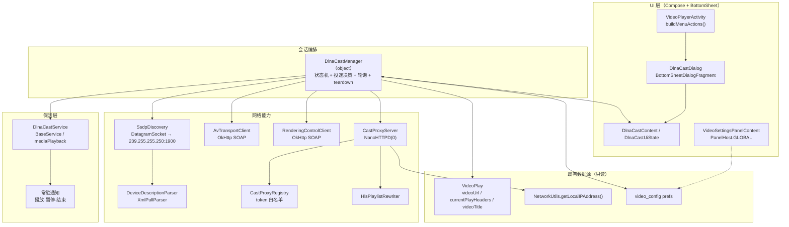
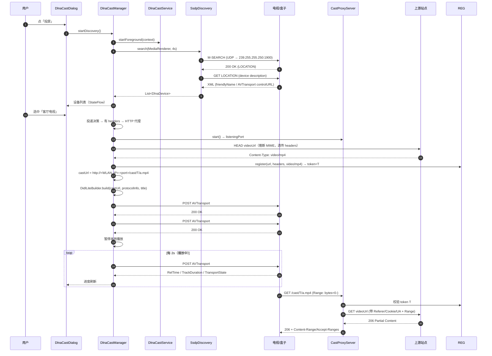
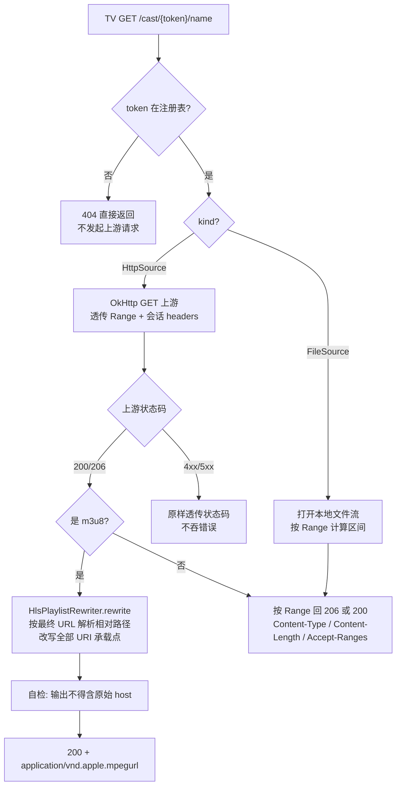
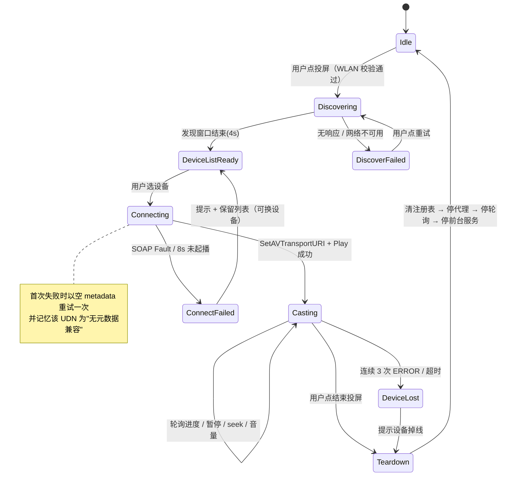

# design.md — 内置视频播放器 DLNA/UPnP 投屏

> 前置阅读：[spec.md](./spec.md)（REQ-01~REQ-13 / E2E-1~E2E-6）
> 本文所有"既有"引用均已 Grep/Read 核实存在；标「新建」的为本次新增文件。

---

## Technical Approach

### 分层

```
┌──────────────────────────────────────────────────────────────┐
│ UI 层（Compose + BottomSheetDialogFragment）                  │
│  DlnaCastDialog / DlnaCastContent / DlnaCastUiState  ← 新建   │
│  入口：VideoPlayerActivity.buildMenuActions()        ← 修改   │
│  设置：VideoSettingsPanelContent GLOBAL 分支         ← 修改   │
└────────────────────────┬─────────────────────────────────────┘
                         │ 读状态（StateFlow）+ 调指令
┌────────────────────────▼─────────────────────────────────────┐
│ 会话编排         DlnaCastManager（object 单例）      ← 新建   │
│  状态机 / 发现调度 / 投递决策 / 轮询 / 降级链                  │
└───┬──────────────┬───────────────┬───────────────┬───────────┘
    │              │               │               │
┌───▼────┐  ┌──────▼──────┐  ┌─────▼──────┐  ┌─────▼─────────┐
│ SSDP   │  │ UPnP 控制    │  │ 拉流代理    │  │ 元数据/嗅探    │
│ 发现    │  │ SOAP 客户端  │  │ NanoHTTPD   │  │ MIME/DIDL     │
│ (新建)  │  │ (新建)       │  │ (新建)      │  │ (新建)        │
└────────┘  └──────────────┘  └─────────────┘  └───────────────┘
                         │
┌────────────────────────▼─────────────────────────────────────┐
│ 保活             DlnaCastService : BaseService      ← 新建   │
│  前台服务（mediaPlayback）+ 常驻通知（播放/暂停/结束）          │
└──────────────────────────────────────────────────────────────┘
```

**关键切分原则**：所有**纯解析/构造**逻辑（SSDP 报文、SOAP 信封、DIDL、m3u8 重写、MIME 推断）做成**不依赖 Android API 的纯函数或 object**，直接进 `app/src/test/`（JVM 单测）；只有 socket、HTTP、Service、UI 依赖 Android 的部分留给真机验证。这样把功能主体纳入可自动化验证范围，而不是全押真机。

### 数据来源（不改采集链）

投屏只读 `VideoPlay` 单例（`app/src/main/java/io/legado/app/model/VideoPlay.kt`）的既有字段，**不新增采集逻辑**：

| 字段 | 行号 | 用途 |
|------|------|------|
| `videoUrl` | `VideoPlay.kt:314` | 投递地址来源 |
| `currentPlayHeaders` | `VideoPlay.kt:329` | 防盗链头，决定是否走代理 |
| `videoTitle` | `VideoPlay.kt:327` | DIDL `dc:title` + 面板标题 |
| `durChapterPos` / `videoManager.duration` | `VideoPlay.kt:406` | 结束后"回到手机续播"的位置 |
| `videoPrefs`（`VIDEO_PREF_NAME = "video_config"`） | `VideoPlay.kt:81,83` | 偏好持久化载体 |

### 术语约定（红队第 4 轮统一）

| 术语 | 含义 | 备注 |
|------|------|------|
| 投递地址 / `castUrl` | 交给 `SetAVTransportURI` 的最终 URL | 直投时 = 原 `videoUrl`；代理时 = 本机代理 URL。代码中统一命名 `castUrl`，文档中两者等价 |
| 上游 / 上游地址 | 代理去取流的原始地址（= `VideoPlay.videoUrl`） | 与"投递地址"严格区分 |
| 渲染端 / 设备 | UPnP `MediaRenderer`（电视/投影/盒子） | 不用"接收端" |
| 会话 | 一次投屏的完整生命周期（连接 → 投屏 → teardown） | `Idle` 之外的连续状态段 |
| `kind` | 代理条目的数据源类型：`HttpSource` / `FileSource` | 决定代理走哪个分支 |

### UI 实现约定（红队第 1 轮补）

- 面板状态**唯一来源**是 `DlnaCastManager` 暴露的 `StateFlow<DlnaCastUiState>`；Dialog 只是渲染者，不持有会话状态——因此 Activity 重建、退出面板再进入、从通知回到播放页都能恢复到同一状态（对应 REQ-03「投屏中重新打开面板」）。
- Dialog 生命周期与会话生命周期**解耦**：`dismiss()` 不触发 `teardown()`（只有用户显式点「结束投屏」或发生失败才终止会话）。
- 所有可点击项在 `Connecting` 态禁用（防重复投递），在 `Casting` 态转为控制语义。

---

## Architecture Decisions

### AD-01: 自研轻量 UPnP 客户端，不引入 Cling/JUPnP

- **Version**: v1.0
- **UpdateTime**: 2026-09-12
- **Context**: 项目有严格的依赖锁定文化（`gradle/libs.versions.toml` 内 Landmines 清单 + `GradleDependency` 标注），任何新增依赖都要走审查。本功能只需要 UPnP 栈的一小块：SSDP 发现 + AVTransport/RenderingControl 共约 10 个 action。
- **Concern**: Cling 2.1.2 自 2016 年停更、依赖 `java.beans`/`javax.*`（Android 缺失需排除与 hack）、传递引入 Jetty/seamless（APK +≈1MB）；jUPnP 同样重且接入需自组装 `UpnpServiceConfiguration`；`media3-cast` 只覆盖 Chromecast，国产电视不支持。
- **Decision**: 自研。SSDP 用 `java.net.DatagramSocket`（发送 + unicast 接收，**绑临时端口而非 1900**）；SOAP 用项目已锁 `OkHttp 5.4.0` 发 POST；**XML 解析用 jsoup 1.16.2 的 XML 解析器**（`Jsoup.parse(xml, "", Parser.xmlParser())`）；DIDL/SOAP 构造用字符串模板 + XML 转义。**零新增依赖**。
- **Goal**: 以 <1500 行新增代码覆盖目标场景，且不触碰依赖锁；纯解析逻辑可进 JVM 单测。
- **Tradeoff**: 需自维护 SSDP 超时/去重/设备离线判定；不支持 GENA 事件订阅（见 AD-06）；不支持 `MediaServer`/`InternetGatewayDevice` 等非渲染设备类型。
- **Status**: Accepted
- **Superseded-by**: —
- **ChangeLog**:
  - 2026-09-12 初版
  - 2026-09-12 红队第 3 轮 javap 实证相关补充
  - 2026-09-12 **实施期修正（AOAdapt，见 tasks.md AOAdapt 日志）**：原设计写"XML 解析用 Android 内建 `XmlPullParser`"。实施时发现该 API 只在 Android 运行时可用，**纯解析逻辑无法进 JVM 单测**，与 AD-01 自身"把解析逻辑纳入自动化验证"的目标自相矛盾（`XmlPullParserFactory` 在 JVM 上不存在）。改为 **jsoup 的 XML 解析器**：① jsoup 1.16.2 是项目**已锁定**依赖，不新增任何东西；② jsoup XML 模式不解析外部实体，天然规避 XXE，比 `DocumentBuilderFactory` 少一堆安全配置；③ 已落地为 `DeviceDescriptionParser`。**代价**：jsoup XML 模式标签名保留原大小写（厂商会写 `devicetype`/`CONTROLURL`），需按大小写不敏感遍历，已用私有扩展 `childOf()` 统一处理并加单测覆盖。
  - 2026-09-12 实施期新增 `DlnaHttp.kt`（不在原文件清单内）：投屏专用 OkHttp 客户端。原因见该文件 KDoc —— 项目共享 `okHttpClient` 挂了 Cookie/DoH/UA 注入等拦截器，而 SOAP 打的是局域网设备、代理转发要求**精确控制请求头**，复用会导致不可预期的头改写；且 SOAP（10s 快速失败）与代理流（`callTimeout=0` 不能中途掐断）对超时诉求相反，必须两个客户端。

### AD-02: 独立 `CastProxyServer`（NanoHTTPD 临时端口），不复用 `WebService`/`HttpServer`

- **Version**: v1.0
- **UpdateTime**: 2026-09-12
- **Context**: 项目已有 NanoHTTPD 2.3.1（`gradle/libs.versions.toml`）与现成服务端实现 `io.legado.app.web.HttpServer : NanoHTTPD`（`web/HttpServer.kt:23`），由 `WebService`（`service/WebService.kt:36`，端口 `webPort` 默认 1122，`WebService.kt:186`）承载。
- **Concern**: `WebService` 是用户可开关的「Web 书源管理服务」，端口用户可改。若投屏代理搭它的车：① 用户关掉 Web 服务 → 投屏断流；② `webPort` 冲突；③ 书源管理 API 与视频代理混在同一端点，扩大暴露面；④ 生命周期纠缠（书源管理不需要跟着投屏开合）。
- **Decision**: 新建独立 `CastProxyServer : NanoHTTPD(0)`——端口 0 让系统分配，`start(timeout, daemon)` 后读 `listeningPort`（`getListeningPort()`）回填投递地址；与 `WebService` 零耦合，独立生命周期。仅复用 NanoHTTPD 这一依赖（`gradle/libs.versions.toml:173` → `org.nanohttpd:nanohttpd:2.3.1`，`app/build.gradle:410`）与 `NetworkUtils.getLocalIPAddress()`（`utils/NetworkUtils.kt:231`）。

  **NanoHTTPD 2.3.1 API 已实证**（`javap` 反查 jar：`F:\gh\caches\modules-2\files-2.1\org.nanohttpd\nanohttpd\2.3.1\...\nanohttpd-2.3.1.jar`，非凭印象）：

  | 能力 | 实证结论 | 用法约束 |
  |------|---------|---------|
  | 动态端口 | `NanoHTTPD(int)` + `public final int getListeningPort()` ✅ | `NanoHTTPD(0)` → `start()` → 读 `listeningPort` |
  | 超时 | `SOCKET_READ_TIMEOUT` 是 `public static final int`（编译期常量 5000ms，**不可改**），但 `start(int timeout, boolean daemon)` 提供**每实例覆盖** | 必须用 `start(<大值>, false)` 显式覆盖；不能指望默认值 |
  | 206 响应 | `Status.PARTIAL_CONTENT` ✅ + `Response.setStatus(IStatus)` ✅ + `addHeader(String,String)` ✅ | 用 `newFixedLengthResponse(Status.PARTIAL_CONTENT, mime, stream, rangeLen)` 后 `addHeader("Content-Range", ...)` |
  | 未知长度 | `newChunkedResponse(IStatus, String, InputStream)` ✅ + `setChunkedTransfer(boolean)` ✅ | 上游无 `Content-Length`（直播/未知长度）时走 chunked |
  | **504/502** | `Status` 枚举**没有** `GATEWAY_TIMEOUT`/`BAD_GATEWAY`；但有 `public static Status lookup(int)` ✅ 与 `RANGE_NOT_SATISFIABLE`/`TOO_MANY_REQUESTS`/`SERVICE_UNAVAILABLE` | 回 504 必须用 `Status.lookup(504)`，**不能**写 `Status.GATEWAY_TIMEOUT`（不存在，会编译不过） |
  | HEAD | `Method.HEAD` 在枚举中 ✅ | 可正常分支处理 |
  | 并发上限 | `DefaultAsyncRunner` 内部仅一个 `List` + 每请求一线程，**无上限** ✅（红队判断成立） | 自定义 `AsyncRunner`（`ThreadPoolExecutor(16)`）或拒绝超限连接 |
  | gzip | `protected boolean useGzipWhenAccepted(Response)` 可覆写 ✅；`Response.setGzipEncoding(boolean)` ✅ | 覆写为 `false`，避免 NanoHTTPD 自行压包造成 m3u8/视频体变形 |

  并发与资源约束（HLS 分片会被渲染端并发拉取）：
  - 用自定义 `AsyncRunner` 把并发上限钉在 16，超限请求回 `503`（`Status.SERVICE_UNAVAILABLE`），而不是无限起线程
  - 覆写 `useGzipWhenAccepted(...) = false`
  - 每请求独立向上游取流，**不缓存、不落盘、不复用上游连接**；因此长视频与直播无本地累积增长（直播仅流量放大）
  - **任何返回/异常/客户端中断路径都必须关闭上游 `ResponseBody` 与 `Response.close()`**（Kotlin `use {}`），否则连接与线程泄漏
  - 上游 **SHALL NOT 自动重试**：防盗链源收到重试风暴可能封 IP；失败即原样回给渲染端（红队 P1-7）
- **Goal**: 代理与既有 Web 服务互不影响，端口冲突概率归零，会话结束即销毁；异常客户端无法打爆线程。
- **Tradeoff**: 多一个 NanoHTTPD 实例（一个监听线程，成本可忽略）；需自己实现 Range/流式响应（`HttpServer` 的 `serve()` 不支持 Range，无法直接借用）；同一路径重复请求会重复打上游（无缓存换取零磁盘写入与零一致性负担）。
- **Status**: Accepted
- **Superseded-by**: —
- **ChangeLog**: 2026-09-12 初版；2026-09-12 红队第 2/3/5 轮补并发上限、资源释放铁律、无重试；**补 javap 实证 API 表并纠正"回 504 要 lookup"**

### AD-03: 三态媒体投递策略（直投 / HTTP 头代理 / 本地文件代理）

- **Version**: v1.0
- **UpdateTime**: 2026-09-12
- **Context**: 投递地址必须由电视自己拉取。Legado 的 `currentPlayHeaders`（`VideoPlay.kt:329`）在很多源上非空（Referer/Cookie/UA 防盗链），电视无法携带；`videoUrl` 也可能是 `file://`（已下载视频，`VideoFragment.kt:692`、`VideoPlayerActivity.kt:657` 均有该判定）。
- **Concern**: 一律走代理最简单，但手机上行带宽会成为 4K 源的瓶颈（流量翻倍、功耗上升）；一律直投则带鉴权头与本地文件场景直接不可用。
- **Decision**: 决策优先级——

  | 序 | 条件 | 模式 | 投递地址 |
  |----|------|------|---------|
  | 1 | `videoUrl` 以 `file://` 开头 | 文件代理 | `http://<WLAN_IP>:<port>/cast/{token}/<name>` |
  | 2 | `currentPlayHeaders` 存在非空值项 | HTTP 代理 | 同上 |
  | 3 | 否则 | 直投 | 原 `videoUrl` |
  | 4 | 设置项「强制走代理」= true | 覆盖 2/3 → HTTP 代理 | 代理地址 |

- **Goal**: 默认路径不浪费手机带宽，必需场景不失败。
- **Tradeoff**: 三条路径都要测（E2E-1/2/4）；直投时无法注入自定义头，若源站同时校验 UA 且设备 UA 不符则失败——由降级链（AD-11）与「强制走代理」设置项兜底。
- **Status**: Accepted
- **Superseded-by**: —
- **ChangeLog**: 2026-09-12 初版

### AD-04: m3u8 走「清单重写代理」，v1 内实现

- **Version**: v1.0
- **UpdateTime**: 2026-09-12
- **Context**: m3u8（HLS）在 Legado 视频源中占比高。带鉴权头的 m3u8 直投必失败；即便无头，渲染端对 HLS 支持度参差。
- **Concern**: 代理 m3u8 不是"转发一个文件"——清单里的每个 URI 都要改写成代理地址，否则分片请求会绕过代理（无头 → 403）。漏改一处即整条链断。
- **Decision**: 实现 `HlsPlaylistRewriter`（纯函数），覆盖 HLS 规范内全部 URI 承载点：

  | 承载点 | 是否 URI 承载 | 处理 |
  |--------|:------------:|------|
  | 普通行（非 `#` 开头） | ✅ | 相对/绝对 → 改写为代理路径 |
  | `#EXT-X-KEY:URI="..."` | ✅ | 改写 URI 属性（保留 `METHOD`/`IV` 等其余属性与引号有无） |
  | `#EXT-X-SESSION-KEY:URI="..."` | ✅ | 改写（红队第 4 轮补，原表漏） |
  | `#EXT-X-MAP:URI="..."` | ✅ | 改写 |
  | `#EXT-X-MEDIA:...URI="..."` | ✅ | 改写（属性值可能无引号，需容错） |
  | `#EXT-X-I-FRAME-STREAM-INF:URI="..."` | ✅ | 改写 |
  | `#EXT-X-PART:...URI="..."` / `#EXT-X-PRELOAD-HINT:...URI="..."` | ✅ | 改写（LL-HLS；红队第 4 轮补） |
  | `#EXT-X-DATERANGE:...X-ASSET-URI="..."` | ✅ | 改写（红队第 4 轮补） |
  | `#EXT-X-STREAM-INF` **行内 `URI="..."`** | ✅ | **改写**——HLS 允许变体地址写在同行 `URI=` 属性（红队第 4 轮抓到的**真实漏改写缺陷**，漏改会让分片绕过代理直接 403） |
  | `#EXT-X-STREAM-INF` 的**下一行** | ✅ | 按普通行处理（最常见形态） |
  | `#EXT-X-BYTERANGE:<n>[@<o>]` | ❌ | **不是 URI 承载点**——它描述的是「前一条 URI 的字节区间」。红队提出的"漏改写"判断**不成立**（已纠正）；但要求代理的 Range 支持必须覆盖该场景（同一 URL 多次不同 Range 请求） |

  相对路径解析基准：**上游清单的最终响应 URL（跟随重定向后的 URL）**，取其**目录**作为相对路径基准（RFC 8216 §4.1）。OkHttp 取最终 URL 必须用 `response.request.url`（已跟随重定向），**不可**用 `response.networkResponse`（红队第 4 轮补）。改写后自检：输出中不得再出现原始 host（单测断言）。

  **避免 URL 长度膨胀**（红队 P2-2）：重写时对每个原始 URI 在 `CastProxyRegistry` 中**惰性登记短 ID**，输出短路径 `/cast/{token}/s/{id}`（id 为递增整数或 6 字符短串），而不是把原 URI base64 塞进路径。播放列表分片数量级为 10²~10³，登记表随会话销毁，内存可控；同时解决了"直播清单无法预登记"的问题——登记发生在**重写时**，天然覆盖新出现的分片。

  投递判定：上游 `Content-Type` ∈ {`application/vnd.apple.mpegurl`, `application/x-mpegURL`, `audio/mpegurl`, `audio/x-mpegurl`} 或 URL 路径末段为 `.m3u8`。
- **Goal**: 带鉴权 HLS 源可投（E2E-3）。
- **Tradeoff**: 直播清单每次刷新都过手机（流量放大），面板给「代理转发中」标识；自定义 `#EXT-X-*` 标签内的非标准 URI 不覆盖（Drawbacks 已记录）。**降级预案**：若真机验证不过，改为「m3u8 仅直投」（tasks T7.4 判定点）。
- **Status**: Accepted
- **Superseded-by**: —
- **ChangeLog**: 2026-09-12 初版；2026-09-12 红队第 4 轮补 `EXT-X-STREAM-INF` 行内 `URI=`（真缺陷）、`SESSION-KEY`/`PART`/`PRELOAD-HINT`/`X-ASSET-URI`，纠正 `EXT-X-BYTERANGE` 误判，补短 ID 登记表与 `response.request.url`

### AD-05: `DlnaCastService` 前台服务承载会话

- **Version**: v1.0
- **UpdateTime**: 2026-09-12
- **Context**: 项目已有 `BaseService : LifecycleService`（`base/BaseService.kt:24`），自动处理首帧 `startForegroundNotification()`（`BaseService.kt:50-53`）与 `POST_NOTIFICATIONS` 权限申请（`BaseService.kt:98-114`）。`WebService`（前台服务 + 通知 + `NetworkChangedListener`）是现成范式。
- **Concern**: 息屏/切后台后：代理要持续转发（否则电视断流）、轮询要持续（否则 UI 状态冻结）；纯 Activity 内实现会被系统限制。
- **Decision**: 新建 `DlnaCastService : BaseService()`，`AndroidManifest.xml` 声明 `android:foregroundServiceType="mediaPlayback"`（与 `VideoPlayService` 同型，`AndroidManifest.xml:726-728` 为样板）。职责：持有 `CastProxyServer` 与轮询协程的生命周期、发常驻通知（动作：暂停/继续、结束投屏、点击回到播放页）。覆写 `stopSelfOnTaskRemoved = false`（对齐 `BaseService.kt:61` 的设计意图）——用户从最近任务划掉 App 后投屏继续，通知是回入口。

  **为什么选 `mediaPlayback` 而不是 `dataSync`**（红队第 3 轮补）：代理在语义上像"数据同步/转发"，直觉会选 `dataSync`；但 Android 15（API 35，本项目 `targetSdk = 36`）对 `dataSync` 前台服务施加了**每 24 小时累计 6 小时**的运行上限，长时间投屏会被系统强停。`mediaPlayback` 无此限制，且本功能本质是"控制一路媒体播放会话"，语义也站得住。`FOREGROUND_SERVICE_MEDIA_PLAYBACK` 权限已存在（`AndroidManifest.xml:26`），零新增权限。
- **Goal**: 息屏/后台不中断；会话结束彻底清理。
- **Tradeoff**: 多一个前台服务；需新增通知渠道（`channelIdCast`）。
- **防"孤儿会话"**（红队第 1/5 轮补）：`stopSelfOnTaskRemoved = false` 的代价是「用户划掉 App 后投屏继续」。兜底三条：① 通知必须 `setOngoing(true)`（对齐 `WebService.kt:200` 的 `setOngoing(true)` 样板）——**不可划掉**，因此"通知没了但会话还在"不成立；② 播放页顶部显示"正在投屏：XXX"状态条，即使面板被关用户也能看到并结束；③ 每次 Activity `onResume` 检查活动会话，若通知曾被系统清理（部分 ROM 行为）则重建通知。若三条都失效（极端 ROM），最少保证 `onDestroy` 无条件释放端口。
- **Status**: Accepted
- **Superseded-by**: —
- **ChangeLog**: 2026-09-12 初版；2026-09-12 红队第 3 轮补 `mediaPlayback` vs `dataSync` 决策依据；红队第 1/5 轮补孤儿会话三兜底

### AD-06: 状态与进度用轮询，不做 GENA 事件订阅

- **Version**: v1.0
- **UpdateTime**: 2026-09-12
- **Context**: UPnP 原生状态同步机制是 GENA：控制器需提供局域网可达的 HTTP 回调端点，向设备 `SUBSCRIBE`，设备以 `NOTIFY` 推送变更，订阅默认 1800s 过期需续订。
- **Concern**: GENA 需在手机上再起一个事件接收服务 + NOTIFY 解析 + 续订调度 + 订阅丢失恢复。收益仅为"进度延迟从 2s 降到亚秒级"。
- **Decision**: 轮询。播放中每 **2s** `GetPositionInfo`（顺带拿到 `TransportState`）；暂停中降为每 **10s** `GetTransportInfo`；本地操作后立即乐观更新 UI，轮询结果回来再校正。轮询协程挂 `DlnaCastService.lifecycleScope`，随服务停止而终止。
- **Goal**: 以可忽略的局域网开销换取实现与维护复杂度的大幅下降。
- **Tradeoff**: 进度显示有 ≤2s 延迟；用户用物理遥控器改变状态时发现延迟同上（Drawbacks 已记录）。
- **Status**: Accepted
- **Superseded-by**: —
- **ChangeLog**: 2026-09-12 初版

### AD-07: 投屏即暂停本地播放，保留进度用于续播

- **Version**: v1.0
- **UpdateTime**: 2026-09-12
- **Context**: 投屏是"把手机正在看的搬到电视上"，用户语义上不期望手机继续出声。
- **Concern**: 双路播放 → 流量翻倍（代理模式下手机要同时拉两路）+ 声音重叠。
- **Decision**: `SetAVTransportURI` + `Play` 成功后立即暂停本地播放器（复用现有 player 实例的 pause 能力），**不动** `VideoPlay.durChapterPos` 等进度字段；结束投屏后本地保持暂停，提示"已在手机暂停，可继续播放"。
  反向约束（红队第 1 轮补）：**投屏期间不得出现第二路播放**。任何会让本地播放恢复的入口——悬浮窗播放、播放页返回后自动起播、切集——SHALL 先走 `DlnaCastManager.teardown()` 终止投屏会话，再执行本地播放。落地方式：在投屏态下拦截悬浮窗入口并对切集路径前置 teardown（对应 REQ-08 的三个 Scenario）。
- **Goal**: 语义正确、无重复流量、回到手机可无缝续播。
- **Tradeoff**: 若投屏失败在暂停之后，需恢复本地播放（置于失败回退分支）。
- **Status**: Accepted
- **Superseded-by**: —
- **ChangeLog**: 2026-09-12 初版；2026-09-12 红队第 1 轮补"禁止第二路播放"约束

### AD-08: 代理白名单 token 安全模型

- **Version**: v1.0
- **UpdateTime**: 2026-09-12
- **Context**: 代理监听在局域网可达端口上。
- **Concern**: 若做成"传 URL 即转发"的开放代理，同一网段任何设备都能把用户手机当跳板（消耗流量、放大概暴露面）。
- **Decision**: `CastProxyRegistry` 维护 `token → Entry(url, headers, mime, kind)`；token 为 32 位随机串（`SecureRandom`），仅在投屏会话内有效。`CastProxyServer` 只接受 `/cast/{token}/...`，token 不在表内一律 `404` 且**不发起任何上游请求**；`...` 段只是命名卫生，真正的上游地址来自注册表（不经由 URL 参数传递），避免参数注入。会话结束 `registry.clear()`。
  线程安全与输入卫生（红队第 2 轮补）：
  - 注册表用 `ConcurrentHashMap`——NanoHTTPD 每请求一线程，HLS 分片并发读不可避免
  - 路径末段 `{name}` 仅取文件名并截断（≤64 字符）用于响应命名，**不参与任何上游地址拼接**；含路径穿越字符（`..`/`%2e%2e`）一律丢弃
  - 不做 referer 白名单校验之外的额外信任假设：请求方 IP 不参与鉴权（局域网内 IP 可伪造/共享），唯一凭据就是 token
  - **上游响应头不回传客户端**（只挑必要项回），避免泄漏 `Set-Cookie`/`Authorization` 等
- **Goal**: 代理端点在有会话时也只服务会话内已注册的资源。
- **Tradeoff**: 同网段他人若拿到完整 URL 仍可在会话有效期内访问（引入期短、内容为用户自选视频，风险可接受）。
- **Status**: Accepted
- **Superseded-by**: —
- **ChangeLog**: 2026-09-12 初版；2026-09-12 红队第 2/5 轮补线程安全、路径卫生、响应头过滤

### AD-09: MIME / protocolInfo 三级推断 + 必发 DIDL-Lite

- **Version**: v1.0
- **UpdateTime**: 2026-09-12
- **Context**: `SetAVTransportURI` 的 `CurrentURIMetaData` 需要 DIDL-Lite，其中 `res@protocolInfo` 形如 `http-get:*:<mime>:<DLNA 特性>`。设备对 mime 与特性的容忍度不同。
- **Concern**: MIME 猜错会让部分严格设备拒播；不发元数据则另一批设备不认（`SetAVTransportURI` 返回 402/714）。
- **Decision**:
  - MIME 三级推断：① URL 路径扩展名映射表（mp4/mkv/webm/ts/m3u8/flv/mov/avi…）→ ② HTTP `HEAD` 的 `Content-Type`（本地文件用 `MediaMetadataRetriever`）→ ③ 兜底 `video/mp4`。
  - **`HEAD` 必须带会话 headers**（红队第 3 轮补）：探测请求不加防盗链头会拿到 403/404，从而误判 MIME。`HEAD` 失败（403/405/超时 5s）时**直接降级到扩展名推断**，不阻塞投屏主流程、不视为投屏失败。
  - `protocolInfo` = `http-get:*:<mime>:DLNA.ORG_OP=01;DLNA.ORG_CI=0;DLNA.ORG_FLAGS=01700000000000000000000000000000`（`OP=01` 声明支持 seek）。
  - DIDL-Lite 必发，`<dc:title>` 取 `VideoPlay.videoTitle`（空则用"视频"），`<res>` 的 URL 做 XML 转义（`&`→`&amp;` 等，代理地址虽无 `&` 但直投地址可能有）。
- **Goal**: 覆盖面最大化；不因元数据缺失被拒。
- **Tradeoff**: 一次额外 `HEAD` 请求（可接受，失败即降级）；老设备拒收元数据时靠 AD-11 降级。
- **Status**: Accepted
- **Superseded-by**: —
- **ChangeLog**: 2026-09-12 初版；2026-09-12 红队第 3 轮补 HEAD 带头与失败降级

### AD-10: 零数据库变更，偏好落 `video_config`

- **Version**: v1.0
- **UpdateTime**: 2026-09-12
- **Context**: 项目有 Room 库与 `database-migration-safety.md` 规范；视频域偏好已有独立载体 `video_config`（`VideoPlay.kt:81` `VIDEO_PREF_NAME`，`VideoPlay.kt:83` `videoPrefs`），布尔范式样板见 `VideoPlay.kt:85-89`（`autoPlay` 默认 true）。
- **Concern**: 为几个开关动数据库 schema 属过度设计，且触发迁移风险。
- **Decision**: 全部偏好落 `video_config`，在 `VideoPlay` 内以 `var xxx: Boolean get() = videoPrefs.getBoolean(key, default) / set { videoPrefs.edit { putBoolean(key, value) } }` 形式新增：

  | 键 | 类型 | 默认 | 对应 REQ |
  |----|------|------|---------|
  | `dlnaCastEnabled` | Boolean | true | REQ-12 |
  | `dlnaForceProxy` | Boolean | false | REQ-12 |
  | `dlnaLastDeviceUdn` | String | null | REQ-10 |
  | `dlnaLastDeviceName` | String | null | REQ-10 |
  | `dlnaNoMetaDevices` | String（UDN 逗号分隔，**LRU 上限 10 条**） | null | REQ-04 降级记忆 |

  覆盖安装读不到键即取默认值，天然向后兼容。`dlnaNoMetaDevices` 需设上限（红队第 2 轮补）：追加时去重并按最近使用淘汰，防止字符串无限增长。
- **Goal**: 零迁移风险。
- **Tradeoff**: 偏好不参与备份/同步体系（`video_config` 不在书源备份范围）。可接受——投屏是设备本地行为。
- **Status**: Accepted
- **Superseded-by**: —
- **ChangeLog**: 2026-09-12 初版；2026-09-12 红队第 2 轮补 LRU 上限

### AD-11: 失败降级链与设备离线判定

- **Version**: v1.0
- **UpdateTime**: 2026-09-12
- **Context**: DLNA 渲染端兼容性碎片化，同一套指令在不同设备上返回不同 SOAP Fault。
- **Concern**: 单点失败若直接抛错，用户看到的是"投屏不好用"，而不是"这台电视不支持 X"。
- **Decision**: 三层降级：

  ```
  SetAVTransportURI(带 DIDL)
    ├─ 成功 → Play
    └─ SOAP Fault(402/714/501 等) → 以空 CurrentURIMetaData 重试一次
         ├─ 成功 → 记录该 UDN 到 dlnaNoMetaDevices（后续对该设备跳过 DIDL）
         └─ 失败 → 结束会话，提示"电视无法访问该播放地址" + 「用浏览器打开」兜底

  Play 成功但 8s 内 GetTransportInfo 仍 STOPPED
    → 判拉流失败 → 结束会话（同上提示）

  运行中 GetTransportInfo 连续 3 次 ERROR_OCCURRED 或连续 3 次请求超时
    → 设备离线 → 结束会话 → 提示"投屏已断开，设备可能已关闭"

  Seek 返回 Fault 或 TrackDuration 恒为 00:00:00
    → 隐藏进度条，保留播放/暂停/停止

  无 RenderingControl 服务（描述文档中缺失）
    → 隐藏音量控件

  结束投屏时 Stop 失败
    → 忽略错误，照常清理本地资源（不阻塞用户退出）

  网络断开 / 切到移动网络（NetworkChangedListener 上报，复用 receiver/NetworkChangedListener.kt）
    → 立即 teardown，提示"网络已切换，投屏已中断"（不等 3 次轮询失败）
  ```

  **统一超时常量表**（红队第 2 轮补，全部落 `DlnaConstants`，禁散落魔数）：

  | 项 | 值 | 说明 |
  |----|----|------|
  | SSDP 等待窗口 | 4s | M-SEARCH 后收集 unicast 响应的时长 |
  | SSDP `MX` | 2 | 请求设备在 0~2s 内随机延迟响应，避免风暴 |
  | 描述文档拉取 | 5s | GET `LOCATION` |
  | SOAP 请求 | 10s | 单次 AVTransport/RenderingControl 调用 |
  | `HEAD` 探测 | 5s | 失败即降级扩展名推断 |
  | 上游取流首包 | 15s | 超时回 `504` |
  | 首帧判定 | 8s | `SetAVTransportURI` 后仍 `STOPPED` 即判失败 |
  | 轮询间隔 | 2s（播放中）/ 10s（暂停中） | AD-06 |

  **`teardown()` 顺序铁律**（红队第 2 轮补，防竞态）：① 取消轮询协程并等待其退出 → ② `registry.clear()`（阻断新请求）→ ③ 停 `CastProxyServer`（等待监听线程结束）→ ④ 停前台服务与通知 → ⑤ 复位 `DlnaCastManager` 状态为 `Idle`。顺序不可颠倒：若先停服务再取消轮询，轮询可能对已停服务写入状态。

  **异常路径端口释放**（红队第 5 轮补，蓝队印证）：`CastProxyServer` 持 `started` 标志；`start()` 整体包 `runCatching`，失败分支与 `finally` 都执行 `stop()`；`DlnaCastService.onDestroy` **无条件**再调一次 `stop()`（幂等）。否则一次启动失败会留下占位端口，导致下次投屏绑不上端口而莫名失败。

  **单例残留复位**（红队第 5 轮补，蓝队印证）：`DlnaCastManager` 是 `object`，进程存活而服务重启时会残留 registry/token/状态。`DlnaCastService.onCreate` 第一件事调 `DlnaCastManager.resetOnServiceCreate()`：状态复位 `Idle` + `registry.clear()` + 停掉任何遗留代理实例。token 与 castUrl **只存内存**（registry），不落 object 字段、不落偏好。
- **Goal**: 每条失败路径都有用户可懂的中文提示，且绝不残留代理/服务/通知。
- **Tradeoff**: `dlnaNoMetaDevices` 是启发式记忆，设备固件升级后可能"本可发元数据却被跳过"——影响面小（无元数据仍可播放），可接受。
- **Status**: Accepted
- **Superseded-by**: —
- **ChangeLog**: 2026-09-12 初版；2026-09-12 红队第 2/5 轮补超时常量表、teardown 顺序、网络切换分支、端口释放与单例复位

### AD-12: 日志与敏感信息脱敏

- **Version**: v1.0
- **UpdateTime**: 2026-09-12
- **Context**: 项目有网络日志脱敏规范与既有回归测试（`app/src/test/java/io/legado/app/help/http/NetworkLogRedactRegressionTest.kt`、`UrlRecordInterceptorTest.kt`）。投屏会接触到代理 token、上游播放地址、防盗链请求头。
- **Concern**: token 与上游地址被写进 `AppLog` 后随日志导出外流；防盗链 Cookie 值入日志等于泄漏会话凭据。
- **Decision**: 投屏全链日志复用既有脱敏通道；规则：① castUrl 仅记录形状（`/cast/{token}/***`）；② 上游 URL 走既有站点代号脱敏；③ **headers 只记键名与数量，绝不记值**；④ 通知与 UI 文案不含任何 URL/token。对应 REQ-14，审计项并入 tasks T5.7 与 T7.7。
- **Goal**: 排查能力不下降的前提下零凭据外泄。
- **Tradeoff**: 排查"某个头是否带上了"时需靠键名+计数推断，不能直读值——可用测试包的键值审计日志在受控下临时开启（不入正式日志）。
- **Status**: Accepted
- **Superseded-by**: —
- **ChangeLog**: 2026-09-12 初版（红队第 5 轮补）

### AD-13: 本机局域网 IP 的选择策略（P0，红队第 2 轮击穿点）

- **Version**: v1.0
- **UpdateTime**: 2026-09-12
- **Context**: 代理投递地址形如 `http://<本机IP>:<port>/...`，这个 IP 必须**是渲染端能回连的地址**。
- **Concern**: 原设计只说"取 `NetworkUtils.getLocalIPAddress()`（`utils/NetworkUtils.kt:231`）返回的本机 WLAN IP"。实际该方法把**所有网卡**的非回环 IPv4 全塞进 `List<InetAddress>` 返回（含蜂窝 `rmnet*`、VPN `tun*`、虚拟网卡、`169.254.*` 链路本地地址），**没有任何 WLAN 偏好、也没有排序保证**。既有 `WebService.kt:104` 就是直接 `.first()` 用的——这个隐患在 Web 服务场景下只是"地址显示错"，但**在投屏场景下等于投递了一个电视永远连不上的地址，功能 100% 失败且没有任何报错**。这是阻断级缺陷（红队 P0-1）。
- **Decision**: 新增 `CastNetworkHelper.pickLanAddress(context): InetAddress?`，按优先级挑选：
  1. 用 `ConnectivityManager.getLinkProperties(activeNetwork).linkAddresses` 取**当前活动网络**（先校验 `NetworkCapabilities` 具备 `TRANSPORT_WIFI` 或 `TRANSPORT_ETHERNET`）的 IPv4 地址 —— **首选**
  2. 回退：遍历 `NetworkInterface`，取接口名匹配 `^(wlan|eth|ap)\d*` 且地址非 `169.254.*` 的 IPv4
  3. 再回退：`getLocalIPAddress()` 中首个非 `169.254.*` 的 IPv4，并**在 UI 上显式提示"检测到多个网络接口，使用的是 X.X.X.X，若电视连接失败请检查网络"**
  4. 全部失败 → 返回 null，投屏前置校验直接拦下并提示（不允许"猜一个"）
  附加校验：投递前校验所选地址与渲染端 `LOCATION` 的 host **同 /24 网段**；不同网段时不直接拒绝，而是在 `AppLog` 记一条诊断（AP 隔离 / 双频分离场景）并在 UI 给出"手机与电视可能不在同一网络"的提示。
- **Goal**: 多网卡环境下投递地址一次选对；选不对时给出可诊断的提示而不是静默失败。
- **Tradeoff**: 需要 `ConnectivityManager` 相关调用（项目已在 `service/relay/RelayService.kt:64` 与 `help/exoplayer/VideoPreloader.kt:22` 使用，非新领域）；同网段校验对新版 AP 隔离场景只能提示不能解决（属环境问题）。
- **Status**: Accepted
- **Superseded-by**: —
- **ChangeLog**: 2026-09-12 初版（红队第 2 轮 P0-1 击穿点驱动）

### AD-14: `DlnaCastManager` → 本地播放器的控制接线

- **Version**: v1.0
- **UpdateTime**: 2026-09-12
- **Context**: AD-07 要求"投屏成功后暂停本地播放、失败时恢复"，但 `DlnaCastManager` 是 `object` 单例，**够不到**播放器实例。
- **Concern**: 已核实播放器句柄路径：`VideoPlayerActivity.currentFragment: VideoFragment?`（`VideoPlayerActivity.kt:173`）→ `currentFragment?.playerView?.currentPlayer`（`VideoPlayerActivity.kt:1085`、`:1946` 等既有用法），暂停/恢复靠 `currentPlayer.onVideoPause()` / `onVideoResume()`（`VideoFragment.kt:328` 使用 `currentPlayer.release()` 等，属 `GSYBaseVideoPlayer` API）。由一个全局单例直接持有 Activity/Fragment 引用会内存泄漏，且悬浮窗/双布局（ViewPager2 与 Legacy）下句柄来源不同。
- **Decision**: 用**注册回调**而非直接持引用：
  - `DlnaCastManager` 暴露 `var playerControl: PlayerControl?`，其中 `PlayerControl` 是接口 `{ fun pauseLocal(); fun resumeLocal(); fun currentPositionMs(): Long }`
  - `VideoPlayerActivity` 在 `onResume` 注册实现（内部只持有 `WeakReference<VideoFragment>` 或直接读取 `currentFragment`），在 `onPause`（或 `onDestroy`）注销
  - `DlnaCastManager` 所有需要本地播放器的地方一律经 `playerControl ?: return`，**允许为空**（无 Activity 时不暂停——例如从通知启动投屏，此时本地本来就没在播）
  - 投屏期间的"禁止第二路播放"拦截同理：Activity 侧在恢复播放前先问 `DlnaCastManager.isCastingActive()`
- **Goal**: 零引用泄漏、双布局/悬浮窗都能命中同一个接线点。
- **Tradeoff**: 多一层间接；若 Activity 未注册（用户已退出播放页）则暂停/恢复语义退化为 no-op——可接受，因为此时本地确实没有播放。
- **Status**: Accepted
- **Superseded-by**: —
- **ChangeLog**: 2026-09-12 初版（红队第 1 轮 P1 + 蓝队第 3 节印证）

### AD-15: 网络监听必须自建 `NetworkCallback`

- **Version**: v1.0
- **UpdateTime**: 2026-09-12
- **Context**: REQ-08/REQ-11 要求"投屏中网络切换立即终止会话"。原设计说"复用 `receiver/NetworkChangedListener.kt`"。
- **Concern**: 蓝队核实：`NetworkChangedListener` 的回调签名是 `() -> Unit`，且其实现只在**新网络可用**（`onAvailable`）时触发。**纯断网（WLAN 关闭、走出信号范围、没有新网络接管）不会触发回调**——恰恰是最需要 teardown 的那一种情况会被漏掉。
- **Decision**: `DlnaCastService` 自行 `connectivityManager.registerDefaultNetworkCallback(NetworkCallback)`，重写 `onLost(Network)` 与 `onUnavailable()`：回调内用 AD-13 的 `pickLanAddress()` 复核"当前是否还有可用的 WLAN/以太网地址"——若没有，立即 `teardown()` 并提示"网络已切换，投屏已中断"。服务 `onDestroy` 注销。既有的 `NetworkChangedListener` 不再依赖。
- **Goal**: 断网/切网在秒级被感知，不依赖轮询的 3 次失败兜底（那是 6 秒起的延迟）。
- **Tradeoff**: 服务内多一个 `NetworkCallback` 注册（成本可忽略）；`registerDefaultNetworkCallback` 在 API 24+ 可用，`minSdk 23` 需 `runCatching` 兜底（API 23 上退化为依赖轮询 3 次失败判定）。
- **Status**: Accepted
- **Superseded-by**: —
- **ChangeLog**: 2026-09-12 初版（红队第 5 轮 P1 + 蓝队风险清单第 2 条印证）

---

## 协议与 HTTP 实现铁律（红队第 1/2/4 轮补）

以下各项原设计**未写死**，实施时凭直觉写必错，故提升为铁律。

### UPnP / SOAP

| 项 | 铁律 |
|----|------|
| `SOAPACTION` 头 | 值**必须带双引号**：`"urn:schemas-upnp-org:service:AVTransport:1#SetAVTransportURI"`。老三星/松下收到无引号值会直接忽略 |
| 服务 URN 版本 | 用 **`:service:AVTransport:1`** 与 **`:service:RenderingControl:1`**（**不是 `:2`**）。设备描述文档里若只暴露 `:1` 而控制点发 `:2`，会得到 401/500 |
| 设备发现 ST | `urn:schemas-upnp-org:device:MediaRenderer:1` |
| `Content-Type` | `text/xml; charset="utf-8"`（引号是规范要求） |
| DIDL-Lite | 必须含 `<upnp:class>object.item.videoItem</upnp:class>`（严格设备按 class 判可否播放；原设计漏，红队 P1-2） |
| "XML 里的 XML" | DIDL 作为 `CurrentURIMetaData` 的**文本节点**嵌入 SOAP：内层 URL 的 `&`→`&amp;` 做**单层**转义即可（红队已确认无双重转义需求，此点原设计正确） |
| `InstanceID` | 恒为 `0`（单实例，红队确认正确） |
| `Seek` | `Unit=REL_TIME` + `Target=HH:MM:SS`；**已知限制**：REL_TIME 上限 24h 且无毫秒精度（红队 P2-1，写入 Drawbacks，不做补偿） |
| `protocolInfo` | `http-get:*:<mime>:DLNA.ORG_OP=01;DLNA.ORG_CI=0;DLNA.ORG_FLAGS=01700000000000000000000000000000`（红队已核验该 32 位十六进制串格式合法） |

### HTTP 代理

| 场景 | 铁律 |
|------|------|
| `bytes=start-end` | `206` + `Content-Range: bytes start-end/total` + **`Content-Length` = 区间长度**（**不是**全文件长度，红队 P1-4） |
| `bytes=start-` | 同 206，`end = total-1` |
| `bytes=-suffix` | 后缀区间：`start = total-suffix`，其余同上 |
| **多区间** `bytes=a-b,c-d` | **不做 multipart/byteranges**：按 RFC 7233 允许**忽略 Range**，回 `200` + 全量。理由：电视播放器基本只用单区间；实现 multipart 收益为零、出错面大（红队 P1-3 采纳但降级处理） |
| 区间越界 | 回 `416`（`Status.RANGE_NOT_SATISFIABLE`） |
| **上游忽略 Range 回了 200** | 代理**必须本地切片**：跳过 `start` 字节、只回 `end-start+1` 字节、状态改 `206`。否则电视 seek 会拿到全量流而错位（红队 P1-5，原设计未定义） |
| `HEAD` 请求 | **必须支持**（`Method.HEAD`，jar 已实证存在）：有 `Content-Length` 来源时回头部不带 body；本地文件可直接算；上游 HEAD 失败则退化为「GET + 立即关闭」。否则设备探测阶段就失败（红队 P1-6） |
| 客户端 `Accept-Encoding` | **不透传**。必须剥掉后再向上游请求，让 OkHttp 走透明解压；响应侧同时**丢弃 `Content-Encoding`/`Transfer-Encoding`**。若原样透传 `Accept-Encoding: gzip`，OkHttp 不再透明解压，压缩体直接喂给电视必花屏（红队 A/B 两轮交叉点，correctness bug） |
| 上游压缩体 | 同上一条；代理输出恒为 identity |
| 响应头白名单 | 只回 `Content-Type`/`Content-Length`/`Content-Range`/`Accept-Ranges`/`Connection`；**不回传** `Set-Cookie`/`Authorization`/`Location`/`Content-Encoding` |
| 未知长度 | 上游无 `Content-Length` → `newChunkedResponse`；不得用 `newFixedLengthResponse` 猜长度 |
| 上游错误 | 4xx/5xx **原样透传**状态码，不吞、不重试 |
| 上游首包超时 | 15s → `Status.lookup(504)`（**枚举里没有 GATEWAY_TIMEOUT，必须 lookup**） |

---

## Data Flow

### 组件与依赖关系



### 投屏建立时序（E2E-2 代理路径）



### 代理请求处理流程（含 m3u8 分支）



### 会话状态机



---

## File Changes

### 新建（生产代码）

| 文件 | 职责 | 可 JVM 单测 |
|------|------|:----------:|
| `app/src/main/java/io/legado/app/help/dlna/DlnaConstants.kt` | SSDP 地址/端口、UPnP service URN、超时常量、DLNA 特性串 | — |
| `app/src/main/java/io/legado/app/help/dlna/DlnaDevice.kt` | 设备数据类：`udn` / `friendlyName` / `modelName` / `location` / `controlUrlAvTransport` / `controlUrlRenderingControl` | — |
| `app/src/main/java/io/legado/app/help/dlna/SsdpMessageParser.kt` | 解析 SSDP 响应文本 → `SsdpResponse`（大小写不敏感头、`LOCATION` 必填、`USN` 提取 UDN） | ✅ |
| `app/src/main/java/io/legado/app/help/dlna/SsdpDiscovery.kt` | `DatagramSocket` 发 M-SEARCH、收集 unicast 响应、4s 窗口、按 UDN 去重、组播锁持有与释放 | — |
| `app/src/main/java/io/legado/app/help/dlna/DeviceDescriptionParser.kt` | `XmlPullParser` 解析 device description XML → `DlnaDevice`；`controlURL` 相对路径按 `LOCATION` 归一化；筛 `MediaRenderer` | ✅ |
| `app/src/main/java/io/legado/app/help/dlna/SoapEnvelope.kt` | SOAP 1.1 信封构造与响应解析（`UPnPError` 码提取）、XML 转义工具 | ✅ |
| `app/src/main/java/io/legado/app/help/dlna/DidlLiteBuilder.kt` | DIDL-Lite 元数据构造（`dc:title` + `res@protocolInfo` + XML 转义） | ✅ |
| `app/src/main/java/io/legado/app/help/dlna/AvTransportClient.kt` | `SetAVTransportURI` / `Play` / `Pause` / `Stop` / `Seek` / `GetPositionInfo` / `GetTransportInfo` / `GetMediaInfo` | 部分（信封可测） |
| `app/src/main/java/io/legado/app/help/dlna/RenderingControlClient.kt` | `GetVolume` / `SetVolume` | 部分 |
| `app/src/main/java/io/legado/app/help/dlna/MimeSniffer.kt` | 扩展名映射表 + `HEAD` 探测 + `MediaMetadataRetriever` 兜底；输出 `mime` 与 `protocolInfo` | ✅（映射表单测） |
| `app/src/main/java/io/legado/app/help/dlna/CastProxyRegistry.kt` | `token → Entry(url, headers, mime, kind)` 白名单；`register` / `lookup` / `clear` | ✅ |
| `app/src/main/java/io/legado/app/help/dlna/CastProxyServer.kt` | `NanoHTTPD(0)`；`/cast/{token}/{name}` 与 `/cast/{token}/s/{id}` 路由；HttpSource / FileSource 两分支；Range（单区间全形态 + 越界 416 + 上游忽略 Range 时本地切片）；`HEAD`；未知长度 chunked；响应头白名单；覆写 `useGzipWhenAccepted=false`；自定义 `AsyncRunner(16)` | — |
| `app/src/main/java/io/legado/app/help/dlna/CastNetworkHelper.kt` | AD-13：`pickLanAddress(context)` 多网卡选择 + 与渲染端同网段校验（红队 P0-1 修复点） | 部分（纯筛选逻辑可测） |
| `app/src/main/java/io/legado/app/help/dlna/PlayerControl.kt` | AD-14：`interface PlayerControl { pauseLocal(); resumeLocal(); currentPositionMs() }` + `DlnaCastManager.playerControl` 注册位 | — |
| `app/src/main/java/io/legado/app/help/dlna/HlsPlaylistRewriter.kt` | m3u8 重写（普通行 / `EXT-X-KEY` / `EXT-X-MAP` / `EXT-X-MEDIA` / `I-FRAME-STREAM-INF`）；相对路径解析；自检断言 | ✅ |
| `app/src/main/java/io/legado/app/help/dlna/DlnaCastManager.kt` | `object` 单例：状态机（StateFlow）、发现调度、投递决策、轮询、降级链、`teardown()` | — |
| `app/src/main/java/io/legado/app/service/DlnaCastService.kt` | `BaseService` 前台服务；持代理与轮询生命周期；常驻通知（暂停/继续、结束投屏、回播放页） | — |
| `app/src/main/java/io/legado/app/ui/video/cast/DlnaCastUiState.kt` | UI 状态数据类（`phase` / `devices` / `currentDevice` / `positionMs` / `durationMs` / `volume` / `supportSeek` / `supportVolume` / `errorMsg`） | — |
| `app/src/main/java/io/legado/app/ui/video/cast/DlnaCastContent.kt` | Compose 内容：发现态 / 列表态 / 控制态 三视图（复用 `SettingsToggleRow` 同族样式与 `LegadoTheme`） | — |
| `app/src/main/java/io/legado/app/ui/video/cast/DlnaCastDialog.kt` | `BottomSheetDialogFragment` 壳（对标 `VideoSettingsPanel.kt:55` 的 `ComposeView` + `LegadoTheme` + `UiCorner.panelRadius` 写法） | — |

### 新建（测试）

| 文件 | 覆盖 |
|------|------|
| `app/src/test/java/io/legado/app/help/dlna/SsdpMessageParserTest.kt` | 大小写混杂头 / 缺 `LOCATION` / 多响应去重 / 非 UTF-8 字节 |
| `app/src/test/java/io/legado/app/help/dlna/DeviceDescriptionParserTest.kt` | `MediaRenderer` 识别 / `MediaServer` 排除 / 相对 `controlURL` 归一化 / 缺 AVTransport 服务 / 畸形 XML |
| `app/src/test/java/io/legado/app/help/dlna/SoapEnvelopeTest.kt` | 信封构造 / `UPnPError` 码提取 / 命名空间 / XML 转义 |
| `app/src/test/java/io/legado/app/help/dlna/DidlLiteBuilderTest.kt` | `&`/`<`/`>` 转义 / 空标题兜底 / `protocolInfo` 组装 |
| `app/src/test/java/io/legado/app/help/dlna/HlsPlaylistRewriterTest.kt` | 绝对行 / 相对行 / `EXT-X-KEY` / `EXT-X-MAP` / `EXT-X-MEDIA` / `I-FRAME-STREAM-INF` / master 变体 / 无原始 host 自检 / 空白与注释行保留 |
| `app/src/test/java/io/legado/app/help/dlna/MimeSnifferTest.kt` | 扩展名映射表全项 / 未知扩展名兜底 / 大小写与 query 干扰（`a.MP4?x=1`） |
| `app/src/test/java/io/legado/app/help/dlna/CastProxyRegistryTest.kt` | 注册/命中/未命中/clear；并发注册读取不抛异常；路径末段含 `..` 被丢弃；LRU 上限（`dlnaNoMetaDevices`）裁剪 |
| `app/src/test/java/io/legado/app/help/dlna/CastNetworkHelperTest.kt` | `pickLanAddress` 三级策略：Wi-Fi 优先于 VPN/蜂窝/`169.254.*`；空列表返回 null；同网段校验（同段 / 跨段） |

### 修改

| 文件 | 变更 | 对应 |
|------|------|------|
| `app/src/main/java/io/legado/app/ui/video/VideoPlayerActivity.kt` | `buildMenuActions()`（`:1192`）追加「投屏」`MenuAction`（`AppMenuSheet.kt:52` 数据类），受 `dlnaCastEnabled` 与 `videoUrl` 非空双重门控；新增投屏动作方法与 `onNewIntent`/恢复时的状态回读 | REQ-01, REQ-08 |
| `app/src/main/java/io/legado/app/ui/video/VideoSettingsPanelContent.kt` | 在 `host == PanelHost.GLOBAL` 分支（`:272`）新增「投屏」分组，复用 `SettingsToggleRow`（`:275` 同族） | REQ-12 |
| `app/src/main/java/io/legado/app/model/VideoPlay.kt` | 在 `videoPrefs` 区域（`:84` 起）追加 `dlnaCastEnabled` / `dlnaForceProxy` / `dlnaLastDeviceUdn` / `dlnaLastDeviceName` / `dlnaNoMetaDevices`（AD-10 范式） | REQ-10, REQ-12 |
| `app/src/main/java/io/legado/app/constant/AppConst.kt` | 追加 `channelIdCast = "channel_cast"`（`AppConst.kt:21` 同族） | REQ-09 |
| `app/src/main/java/io/legado/app/constant/NotificationId.kt` | 追加 `DlnaCast` 常量 | REQ-09 |
| `app/src/main/java/io/legado/app/App.kt` | `createNotificationChannels()`（`:366`）注册新渠道（`:391` 为 `channelIdWeb` 样板） | REQ-09 |
| `app/src/main/AndroidManifest.xml` | 追加 `<uses-permission android:name="android.permission.CHANGE_WIFI_MULTICAST_STATE" />`（权限区 `:10-32`）；追加 `<service android:name=".service.DlnaCastService" android:foregroundServiceType="mediaPlayback" />`（`:726-728` 为样板） | REQ-13 |
| `app/src/main/res/values/strings.xml` | 新增投屏相关中文文案（默认语言文件，`:1642` `config_settings` 为中文条目样板） | 全部 UI |
| `app/src/main/assets/updateLog.md` | 编译前按 `git diff` 补写用户视角日志条目 | AGENTS.md 规则 1 |
| `docs/INDEX.md` | 新增本条 spec 到「设计中」 | OpenSpec 步骤 3 |

### 明确不改

| 对象 | 理由 |
|------|------|
| `gradle/libs.versions.toml` / `app/build.gradle` | 零新增依赖（AD-01/AD-02） |
| Room 实体 / `AppDatabase.kt` / `app/schemas/` | 零 DB 变更（AD-10） |
| `help/video/VideoUrlExtractor.kt` / `VideoPlaybackPipeline.kt` | 采集链零改动（spec Scope「不做什么」） |
| `help/gsyVideo/*` / `help/exoplayer/*` | 播放内核零改动；投屏复用既有 pause 能力 |
| `service/WebService.kt` / `web/HttpServer.kt` | 不耦合（AD-02） |
| `service/VideoPlayService.kt` | 悬浮窗播放与投屏生命周期解耦（AD-05） |

---

## 回滚方案（红队第 5 轮补）

本功能**完全可逆**，且回退成本低：

| 项 | 回退动作 | 影响 |
|----|---------|------|
| 数据 | 无需回滚（零 DB 变更、零 schema 迁移） | 无 |
| 偏好 | 遗留 `video_config` 中的 `dlna*` 键无消费者，不影响任何既有逻辑 | 无 |
| 菜单入口 | 移除 `buildMenuActions()` 中的投屏项（或把 `dlnaCastEnabled` 默认值改为 false 即功能隐藏） | 秒级生效 |
| 服务与权限 | 移除 `DlnaCastService` 声明与 `CHANGE_WIFI_MULTICAST_STATE` 权限 | 无残留 |
| 代理 | 新建文件整体删除，无对外接口被引用 | 无 |

**最快降级路径**（线上出问题时的止损）：把 `dlnaCastEnabled` 默认值改为 `false` 并发布补丁包 —— 菜单入口消失，其余代码处于休眠态，不会被执行。

---

## 验证策略

| 级别 | 手段 | 覆盖 |
|------|------|------|
| L1 | `./gradlew assembleAppDebug` + `./gradlew testAppDebugUnitTest` | 编译 + 5 个纯逻辑测试类（SSDP/SOAP/DIDL/描述解析/m3u8 重写） |
| L2 | MEmu 模拟器 + PC 端最小 MediaRenderer（`ai_tests/scripts/dlna_fake_renderer.py`，记录被拉流请求与 SOAP 指令） | 发现 → 投递 → 代理 Range → m3u8 重写 → 控制指令 → teardown 全链路 |
| L3 | 真机 + 真实电视/盒子（用户验收） | 真实 DLNA 兼容性、息屏保活、长时间播放稳定性 |

**L2 前置条件与风险（红队第 5 轮 P0-2 击穿后重写）**：

原计划"PC 跑假渲染器 + MEmu 模拟器直接联调"**不可行**——MEmu 默认 NAT 模式下模拟器在宿主私网内，PC 上的假渲染端**无法反连**模拟器内手机起的代理端口（SSDP 出向可通，代理回连不通），代理投递路径根本测不了。

修订后的分级方案：

| 阶段 | 环境 | 可验证范围 |
|------|------|-----------|
| L2-a | PC 单机（无需安卓）| **SSDP 报文格式 / 描述文档解析 / SOAP 信封 / DIDL / m3u8 重写**——用假渲染器回环自测（PC 自己发 M-SEARCH、自己收）；这部分本就要靠 L1 单测覆盖，L2-a 只补端到端报文形态 |
| L2-b | MEmu + 假渲染器（NAT）| **发现链路 + 投递指令**（可验证：能看到设备、能下发 `SetAVTransportURI`/`Play`、能收到轮询）；**代理回连不可验** |
| L2-c | **首选**：真机 + PC 同 Wi-Fi（PC 跑假渲染器）| **全链路**（发现 → 投递 → 代理 Range/m3u8 → 控制 → teardown） |
| L2-d | 次选：MEmu 桥接网卡模式 + 显式端口转发 | 同 L2-c，取决于宿主机虚拟网络是否支持 |

**执行顺序**：优先争取 L2-c（用户已有真机）。可行时**跳过 L2-b**（避免在注定测不全的环境上耗时间）。若只有 MEmu 可用，则做 L2-b 并**显式记录"代理回连路径未验证"**到 `issues-found.md`，由 L3 真机补。

**测试脚本落位**：`ai_tests/scripts/`（遵循 AGENTS.md「禁止在 `temp/` 创建临时测试脚本」）。

**假渲染器已就绪并通过自检**（2026-09-12）：`ai_tests/scripts/dlna_fake_renderer.py`（纯标准库，无 pip 依赖），`--selftest` 模式已实测全绿 —— SSDP 发现 / 描述文档 / SOAP（SetAVTransportURI·Play·GetPositionInfo）/ 6 项 Range 判定（HEAD、单区间、后缀、开区间、多区间、越界 416）全部 PASS。

**L2 环境前置条件（实测踩坑，详见 `issues-found.md`）**：

| 条件 | 原因 | 做法 |
|------|------|------|
| **必须停掉 Windows SSDPSRV 服务** | 该服务（`svchost`）占用 UDP 1900；我们的进程 `SO_REUSEADDR` bind 能成功但报文被抢走 → 表现为"监听正常但体检不到设备" | 管理员执行 `net stop SSDPSRV`；测试后 `net start SSDPSRV` 恢复。工具已内置收包自检并在失败时打印该指引 |
| **必须显式 `--advertise-ip`** | 本机实测有 4 个非回环 IPv4（含 `192.168.64.1` / `192.168.153.1` 虚拟网卡），自动探测的出口 IP 未必是 Wi-Fi 地址 | 以 `ipconfig` 中 WLAN 适配器地址为准传入 |
| 放行 Python 入站 | 假渲染器需接收 M-SEARCH 与 SOAP | Windows 防火墙为 Python 放行 |

> 附带收获：本机"4 个 IP 且无排序保证"的实测环境，本身就是 **AD-13（本机 IP 选择策略）最好的验收用例** —— 若 `pickLanAddress` 实现成 `.first()` 必挂。

**Windows 防火墙注意**（红队 E 方向）：假渲染器（PC 侧）需接受模拟器/真机的 UDP 组播与 SOAP 入站，需为 Python 放行入站；手机侧代理端口是**出站发起的服务**，不受 PC 防火墙影响（但真机在移动网络/Wi-Fi 下的 AP 隔离会影响渲染端回连，属环境问题，靠 AD-13 的同网段提示暴露）。
