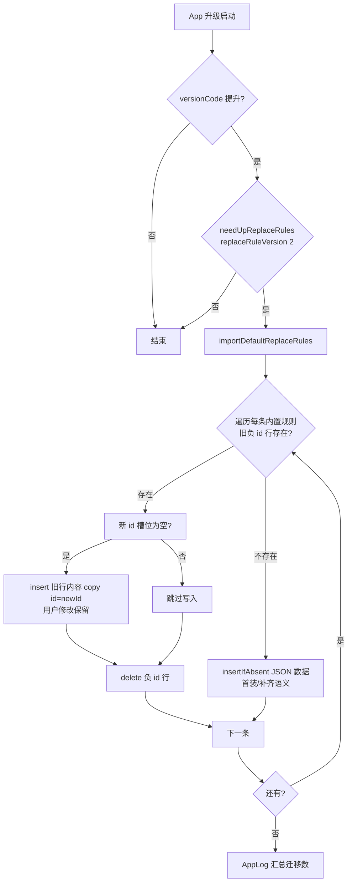

# design.md — builtin-replace-id-fix

## Technical Approach

三处改动，总计约 50 行：

1. **JSON**（`app/src/main/assets/defaultData/replaceRules.json`）：12 条规则 `"id"` 由 -1~-12 改为 1~12，其余字段不动。
2. **导入逻辑**（`DefaultData.importDefaultReplaceRules()`）：由单一 `insertIfAbsent` 升级为迁移+导入：

```kotlin
fun importDefaultReplaceRules() {
    runBlocking(IO) {
        val dao = appDb.replaceRuleDao
        var migrated = 0
        // 新 id 以 JSON 内写死的 builtin.id（1~12）为准，禁止用遍历序号推导——
        // 避免未来 JSON 中间插删规则导致存量 id 映射漂移（红队 R5 修复项）
        replaceRules.forEach { builtin ->
            val newId = builtin.id
            // 旧负 id 行：本次仅改 id 符号，-newId 与旧 JSON 顺序一一对应
            val old = dao.findById(-newId)
            if (old != null) {
                // 保数据换 id：保留用户对内置规则的修改（pattern/isEnabled 等）
                // 新 id 槽位被占（撞 id）时用户数据优先：跳过写入，负行修改丢弃（AD-01 tradeoff）
                if (dao.findById(newId) == null) {
                    dao.insert(old.copy(id = newId))
                }
                dao.delete(old)
                migrated++
            } else {
                // 无存量负行：首装或该规则此前未导入 → 按新 id 幂等追加
                dao.insertIfAbsent(builtin)
            }
        }
        AppLog.put("内置替换净化规则同步：迁移 $migrated 条（共 ${replaceRules.size} 条内置，id 1~${replaceRules.size}）")
    }
}
```

3. **旗标**（`LocalConfig.kt`）：`replaceRuleVersion` 1→2，让已装设备在下次版本升级时重新执行 `needUpReplaceRules` 分支。

## Architecture Decisions

### AD-01: 内置 id 采用正数段 1~12，而非保留负 id 改编辑页判断
- **Version**: v1.0
- **UpdateTime**: 2026-09-12
- **Context**: F7/4.10 用负 id 区分内置规则，但上游编辑链路以 `id > 0` 为查库依据、`-1` 为新建哨兵，负 id 与之系统性冲突。
- **Concern**: 负 id 是全局特例，除已发现的编辑 bug 外，未来 web 端、导入导出、第三方工具任何 `id > 0` 假设都会二次踩雷。
- **Decision**: 内置规则改用正数 id 1~12。用户规则 id 默认 `System.currentTimeMillis()`（约 1.7e12），小正数段与之天然隔离。
- **Goal**: 消除特例，编辑链路零改动即恢复正确行为。
- **Tradeoff**: 理论上用户导入的规则 JSON 若带 id 1~12 会被 `insertIfAbsent` 忽略（撞 id 不导入）；迁移时若新 id 槽位恰被此类规则占用，负行上的用户修改将被丢弃（用户数据优先）。接受理由：概率极低且与既有 id 冲突语义一致，IGNORE/查后插策略保证不覆盖用户数据。
- **Status**: Accepted
- **Superseded-by**: 空
- **ChangeLog**: 初版

### AD-02: 迁移采用「保数据换 id」，不重插 JSON
- **Version**: v1.0
- **UpdateTime**: 2026-09-12
- **Context**: 已装设备 DB 中负 id 行可能已被用户修改（改 pattern、关开关）或删除。
- **Concern**: 若迁移=「删负行 + 重插 JSON」，用户修改将丢失；若「删负行 + insertIfAbsent(JSON)」，修改丢失且行为与幂等语义混淆。
- **Decision**: 读出负 id 行整体内容，`copy(id = newId)` 后以 `insert`（REPLACE，仅作用于新 id 槽位，写前已确认槽位为空）写入，再删负 id 行。
- **Goal**: 用户对内置规则的一切修改在迁移后原样保留。
- **Tradeoff**: 迁移后该规则的「内置初始值」在 DB 中不可再还原（JSON 仍在 assets，重装可复原）。接受。
- **Status**: Accepted
- **Superseded-by**: 空
- **ChangeLog**: 初版

### AD-03: 替换净化同步每次启动无旗标幂等执行（v1.2 修订，旗标语义被实测证伪）
- **Version**: v1.2
- **UpdateTime**: 2026-09-12
- **Context**: v1.0 复用 versionCode 门禁；v1.1 移出门禁但保留 per-key 旗标。真机反馈后模拟器复现验证再曝缺陷：`isLastVersion` 为「读后即写回」语义——SP 值在被读取时立即写回目标版本，**评估与执行非原子**。
- **Concern**: 实测复现：启动后异步队列被 force-stop 打断，旗标已写回 2 但迁移未执行；下次启动旗标条件已消失，迁移机会永久丢失（DB 卡在负 id，编辑永远空数据）。versionCode 门禁场景同理：用户旗标可能被历史版本评估过。
- **Decision**: 删除 `needUpReplaceRules` 旗标，`importDefaultReplaceRules()` 改为每次启动无旗标幂等同步：负行迁移 + `insertIfAbsent(IGNORE)` 缺失追加，全程无变化时零写盘、静默不打日志。开销为每次启动 12 次 findById + 12 次 IGNORE 检查（微秒级）。
- **Goal**: 不依赖任何旗标/版本门禁，任何设备任何安装路径下启动即收敛到正确状态；新增内置规则也由 insertIfAbsent 自然推送。
- **Tradeoff**: 每次启动固定 12 次轻量 DB 读（可忽略）；放弃「仅版本升级执行一次」的省电优化。遗留 SP 键 `replaceRuleVersion` 不再读取（冗余无害）。
- **Status**: Accepted（Superseded v1.0/v1.1）
- **Superseded-by**: 空
- **ChangeLog**: v1.0 复用触发链；v1.1 移出门禁（真机证伪 versionCode 触发）；v1.2 删旗标改幂等每启（旗标原子性证伪）

## Data Flow



## File Changes

| 文件 | 变更 | 量级 |
|------|------|------|
| `app/src/main/assets/defaultData/replaceRules.json` | 12 条 id：-N → N | 12 行 |
| `app/src/main/java/io/legado/app/help/DefaultData.kt` | `importDefaultReplaceRules()` 迁移逻辑 + 注释 | ~25 行 |
| `app/src/main/java/io/legado/app/help/config/LocalConfig.kt` | `replaceRuleVersion` 1→2 + 注释 | 2 行 |
| `app/src/main/assets/updateLog.md` | 用户向变更条目 | ~4 行 |
