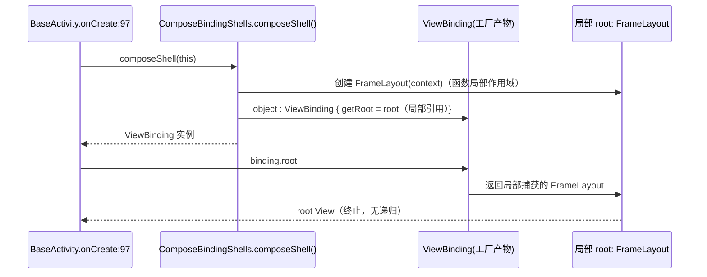

# design.md — compose-shell-binding-fix

## Technical Approach

### 根因分析（字节码实锤）

**崩溃现场**（crash-2026-09-12-11-34-19 / -11-34-48，构建 10293）：
`BaseActivity.onCreate:97` → `setContentView(binding.root)` → 匿名对象 `getRoot` 自递归，8839 帧完全相同的 `RssArticleInfoActivity$binding$2$1.getRoot(RssArticleInfoActivity.kt:49)` → StackOverflowError。

**字节码证据**（output/apk/test/legado_miss_app_3.26.091200.apk，classes10.dex，dexdump）：

```
RssArticleInfoActivity$binding$2$1.getRoot:()Landroid/view/View;
  invoke-virtual {v1}, RssArticleInfoActivity$binding$2$1;.getRoot:()Landroid/view/View;  // 调用自己
  move-result-object v0
  return-object v0
  positions: 0x0000 line=49
```

**语言层机制**：`androidx.viewbinding.ViewBinding` 是 Java 接口，Java getter `getRoot()` 在 Kotlin 中暴露为**合成属性 `root`**。在实现该接口的匿名对象内部，标识符 `root` 的解析遵循最近作用域——匿名对象的隐式接收者持有合成属性 `root`（= `getRoot()` 本身），**优先于**外层 Activity 的类级属性 `root`。于是源码 `= root` 编译为自调用。

**为什么同模式全仓只有 3 处炸**（红蓝对抗复审后的审计矩阵，`object : ViewBinding` 匿名对象 8 处 + 命名类 1 处，全部逐一核验）：

| Activity | getRoot 返回表达式 | root 来源 | 结论 |
|----------|-------------------|-----------|------|
| RelaySettingsActivity:95 | `= root` | lazy 块内局部变量 | ✅ 局部变量遮蔽合成属性 |
| ConfigActivity:95 | `= root` | lazy 块内局部变量 | ✅ |
| AiProviderEditActivity:86 | `= root` | lazy 块内局部变量 | ✅ |
| **RssArticleInfoActivity:49** | `= root` | **类级 `private val root by lazy`** | ❌ 已爆（统一搜索详情页必崩 ×2） |
| **AiImageProviderEditActivity:32** | `= root` | **类级 `private val root by lazy`** | ❌ 潜伏雷（日志期间 0 次打开） |
| **AiImageGalleryActivity:40** | `= root` | **类级 `private val root by lazy`** | ❌ 潜伏雷（日志期间 0 次打开；W6.2 同批引入） |
| BookInfoComposeActivity:115 | `= refreshLayout` | 类级属性，名字≠`root` | ✅ 合成属性名为 `root`，仅同名才遮蔽 |
| SpeakerGroupManageDialog:89 | `= composeView` | 局部变量，名字≠`root` | ✅ |
| SimpleViewBinding:9 | `= rootView` | 构造参数，名字≠`root` | ✅ |

> 审计结论：遮蔽仅当**标识符恰好叫 `root`**（`getRoot()` 的合成属性名）时发生。危险写法共 3 处，全部为类级 `root` 属性；修复必须覆盖 3 处而非 2 处（v1.0 初稿漏了 AiImageGalleryActivity，第 2 轮红队补强审计发现）。

**伴随证据**：日志期间 `AiImageGalleryActivity` / `AiImageProviderEditActivity` 均无 onCreate 记录（LifecycleHelp 0 命中）——"未爆"仅因页面未被打开，非写法安全。

### 修复调用链（mermaid）



### R4 日志节流设计

现状：`RssFreeGridLayoutManager` 全部 AppLog.put 调用点经源码核验共 **5 处**（红蓝对抗复审修正，原设计误写 3 处并虚构了部分白名单事件）：

| 调用点 | 位置 | 处理 |
|--------|------|------|
| `[布局]` onLayoutChildren | `:284` | 节流 |
| `[填充]` fill 主流程 | `:313` | 节流 |
| `[区间]` fill 区间 | `:341` | 节流 |
| `[填充] 提前返回` fill 异常路径 | `:305` | **全量** |
| `[回填] onRatiosUpdated` 比例回填 | `:529` | **全量** |
| footer 高度校准（layoutChild，现无日志） | `:386-402` | **新增 1 条全量诊断日志**（唯一新增点，一次性触发，符合诊断日志保留铁律） |

> rectsValid 翻转不设全量日志：数据变化后每次布局都可能翻转，全量反而刷屏。

节流策略（非删除，对齐 2026-09-10 诊断日志保留铁律）：

1. **全量白名单**（永不节流）：上表 3 项全量路径。
2. **节流窗口**：3 处常规状态行以 2000ms 时间窗合并；窗口结束后输出 1 条合并行（含 `suppressed=N` 抑制计数），非阻塞取时（`SystemClock.elapsedRealtime()`，布局路径禁 runBlocking 类调用）。
3. **开关读取防 ANR（红队 P1 修复）**：全量恢复开关**禁止每帧走 `LocalConfig` getter**（其底层 CacheManager.get 是 `runBlocking(IO)`，每帧调用必 ANR，铁证 `CacheManager.kt:114/127/159`）。开关值在 LayoutManager 实例内缓存（onAttachedToWindow 读取一次）。
4. **恢复开关**：`LocalConfig` 增加 debug 开关（默认关），实例级缓存后生效，供后续专项排查自由布局时打开。

## Architecture Decisions

### AD-01: 修复策略选公共工厂而非就地改局部变量
- **Version**: v1.0
- **UpdateTime**: 2026-09-12
- **Context**: 5 个 Compose 迁移页复制粘贴"合成 ViewBinding 空壳"模式，出现 3 种写法，其中类级属性写法编译期无任何告警地产生自递归
- **Concern**: 语言陷阱隐蔽（编译期不可见、只在运行期爆），复制粘贴模式下一个使用者仍会踩雷；需要结构级防护而非逐处修
- **Decision**: 新增 `base/ComposeBindingShells.kt` 工厂函数，root 创建收进函数局部作用域；本次迁移 2 个雷区页面，其余 3 个安全页面保持现状渐进迁移
- **Goal**: 危险写法结构上不可能通过工厂产生；Grep 审计可验证无残留
- **Tradeoff**: 短期内存在"工厂 + 局部变量"两种安全写法并存
- **Status**: Accepted
- **Superseded-by**: （空）
- **ChangeLog**: v1.0 初版

### AD-02: RssFree 诊断日志降频采用时间窗合并非删除
- **Version**: v1.0
- **UpdateTime**: 2026-09-12
- **Context**: RssFree 每帧 3 条诊断日志占单会话日志 43%~68%，日志文件膨胀（单会话最大 3.2MB），有效信息被淹没；但 2026-09-10 用户裁决测试期正式诊断日志禁止清理
- **Concern**: 直接删除违反诊断日志保留铁律；不处理则日志持续污染、AppLog 写入开销白耗
- **Decision**: 白名单事件全量 + 常规状态 2000ms 窗口合并（带 suppressed 计数）+ LocalConfig 开关恢复全量
- **Goal**: 崩溃/异常排查信息零丢失；稳态日志占比降至 ≤15%
- **Tradeoff**: 节流窗口内的逐帧数值不逐条保留（稳态值重复无诊断价值）
- **Status**: Accepted
- **Superseded-by**: （空）
- **ChangeLog**: v1.0 初版

## Data Flow

无数据模型/数据库变更。崩溃修复仅影响 View 层创建路径；日志节流仅影响 AppLog 写入频率。

## 日志全量深扫补充结论（logcat 全通道 + 26 appLog）

| 通道 | 结论 |
|------|------|
| AndroidRuntime FATAL | 共 6 次：09-11 ×4 自由布局 footer（已由 9e7d1fa 修复，10293 未复发）＋09-12 ×2 StackOverflow（本次主修） |
| **native SIGABRT ×2**（09-10 09:51 / 09-11 12:56，io.legado.miss.app.debug 进程） | `libstagefright MPEG4Writer::Track::threadEntry` ubsan mul-overflow。归属 `HlsDownloader.kt:400` 的 `MediaMuxer(MPEG_4)` HLS→MP4 重封装：长时间写视频轨（进程运行 4077s）触发系统库整数溢出。**独立链路，不在本 spec 修复**（见"后续立项"） |
| CrashReport tag 14863 行 | 本 app CrashHandler「上次会话崩溃栈回灌」输出，内容即上述崩溃，无新增信息 |
| MIUIScout APP_SCOUT_WARNING | 主线程 2501ms 卡顿警告，发生在 CrashHandler 写崩溃文件（Thread.sleep）期间，属崩溃伴随现象非独立问题 |
| System.err | MIUI contentcatcher 系统组件噪音，非本 app 问题 |
| OOM / StrictMode / Binder死亡 / ANR | 0 命中；GC 健康（63MB/159MB） |
| MediaCodec / HWUI / VideoCapabilities | E 级 0 命中（统计中的少量条目为 D/W 级系统噪音） |
| ImgDecrypt timeout ×420 / Canceled ×328 | 自由流图片场景站点慢超时+快速滚动取消，属源站环境因素 |
| 书源 JS 报错（Empty JSON string / 验证结果为空 / 解密失败） | 源规则问题，非 app 回归，不处理。已核实 `BaseSource.kt:123` 对 header 规则异常 catch 后降级（置默认 UA 继续请求），`Get('url')` 为源作者自定义函数取缓存为空所致，`Job was cancelled` 变体为 Glide 取消竞态的日志噪音，均不破坏请求链路 |
| **嗅探超时机制失效（app bug，新发现）** | `ExoPlayerHelper` 日志实测 `sniffVideoType: timeout (60006ms)`，而 `SNIFF_TIMEOUT_MS=5000L`。根因：`withTimeoutOrNull(5s){ withContext(IO){ videoStreamClient.newCall(request).execute() } }` 中 `execute()` 为阻塞调用，协程取消无法打断，实际超时退化为 `videoStreamClient` 继承的 OkHttp `callTimeout(60s)`（`HttpHelper.kt:91-92`，与日志 60s 精确吻合）。用户可感知：慢速视频源点击播放卡 ~60 秒才走后缀兜底。**独立链路，建议单独快速路径 spec 立项 `sniff-timeout-ineffective`（嗅探专用 client 设 callTimeout(5s) 或改 enqueue）** |
| 播放失败 403（08:13 会话） | `m3u8 preCheck rejected(403) → auth-retry 仍 403 → 正确报"播放失败"`，鉴权重试机制按设计工作，源站拒绝，非 app 回归 |
| ImgDecrypt 突发失败（峰值 34 次/秒） | 自由布局首屏并发图片请求遇慢站/404，属源站环境因素 + 高并发叠加；`Canceled` ×328 为快速滚动正常取消。与 RssFree 日志刷屏同列"自由布局体验观察项" |

**后续立项建议（不在本 spec 范围）**：`hls-download-muxer-overflow`（P1）——HlsDownloader 对写入 MediaMuxer 的 PTS/时长做钳制与异常值校正（超大/跳变 PTS 相乘溢出），并评估单文件分段上限；触发条件为长时间视频缓存，影响视频缓存功能稳定性。

## File Changes

| 文件 | 变更 |
|------|------|
| `app/src/main/java/io/legado/app/base/ComposeBindingShells.kt` | 新增：`composeShell(context)` 工厂（FrameLayout 局部创建 + 匿名 ViewBinding 局部捕获 + MATCH_PARENT LayoutParams 对齐 RelaySettings 范式），附注释说明 Kotlin 合成属性遮蔽陷阱 |
| `app/src/main/java/io/legado/app/ui/rss/search/RssArticleInfoActivity.kt` | 删除类级 `root` 属性与手写匿名对象，`binding` 改用工厂 |
| `app/src/main/java/io/legado/app/ui/config/AiImageProviderEditActivity.kt` | 同上（潜伏雷排除） |
| `app/src/main/java/io/legado/app/ui/main/ai/AiImageGalleryActivity.kt` | 同上（潜伏雷排除，全仓审计新发现） |
| `app/src/main/java/io/legado/app/ui/rss/article/free/RssFreeGridLayoutManager.kt` | 三处逐帧 AppLog.put 接入节流器；白名单路径不变；新增节流内部类（时间窗 + suppressed 计数） |
| `app/src/main/java/io/legado/app/help/config/LocalConfig.kt` | 新增 RssFree 全量日志 debug 开关 |
| `app/src/main/assets/updateLog.md` | 编译前按 git diff 更新 |

## 红队审查记录（v2：红蓝对抗代理复审 + 5 轮重验，问题均已修复闭环）

> v2 复审由红队/蓝队两个独立子代理并行执行，主代理裁决。红队 7 项发现全部采纳或记录，蓝队确认核心论断链（自递归根因/工厂局部变量修复/节流取时）源码层面站得住。

### 红蓝对抗发现与裁决

| 级别 | 发现 | 裁决 |
|------|------|------|
| P1 | 节流开关若每帧读 `LocalConfig` getter，底层 `CacheManager.get` 是 `runBlocking(IO)`，布局主线程每帧调用必 ANR | **采纳**：开关值实例级缓存（onAttachedToWindow 读一次），写入 design R4 与 tasks 2.5 |
| P1 | 白名单引用了不存在的日志事件（rectsValid 翻转/footer 校准/兜底 rebuild 均无 AppLog.put），实际仅 5 处调用点（蓝队补充第 5 处 `:529 [回填]`），tasks 3.5 验证永不可达 | **采纳**：白名单改为真实标签；footer 校准新增唯一 1 条全量日志；rectsValid 翻转明确不设全量（会刷屏） |
| P2 | 工厂 root 未置 LayoutParams，与 RelaySettings 范式不一致 | **采纳**：工厂内置 MATCH_PARENT |
| P2 | tasks 1.2 updateLog 位置描述缺"已有条目之前" | **采纳**：补全 |
| P2 | Grep 审计遗漏 `SimpleViewBinding`（命名类，非 `object:` 不命中），且审计应作为合入卡点 | **采纳**：tasks 3.1 补充并升格为合入卡点 |
| P2 | 缺 AGENTS.md 第 7 条 AskUserQuestion 门禁任务 | **采纳**：tasks 4.4 |
| P2 | "9 处使用点"表述与枚举方法矛盾（8 匿名 + 1 命名类） | **采纳**：全文改为"8 处匿名对象（3 危险 5 安全）+ 1 处命名类（安全）" |
| 增强 | BaseActivity 加 `open val binding` 默认工厂实现可彻底消灭手写模式 | **记录不采纳**：本次不动基类，作为 AD-01 备选留存；工厂 + 合入卡点已足够 |

### 正式 5 轮重验（修复后逐轮通过）

1. **需求覆盖**：R1~R5 在 design/tasks 均有落点；白名单/验证改为真实标签后闭环 ✅
2. **边界与异常**：取时 elapsedRealtime 非阻塞 ✅；开关读取实例缓存（本轮新增修复）✅；recreate 后工厂每实例新建 ✅；Compose 生命周期策略不受影响 ✅
3. **可落地性**：工厂签名满足 `BaseActivity<ViewBinding>` 泛型上界（蓝队 A 项证据 BaseActivity.kt:46/55）✅；两颗潜伏雷页面纳入真机验证 ✅
4. **完整性与一致性**：调用点 5 处枚举红蓝两队独立核验一致；"不做"清单与 File Changes 对齐；tasks 无悬空项 ✅
5. **对抗性破坏**：新雷无法经工厂产生（局部作用域结构保证）✅；合入卡点 Grep（含命名类）兜底手写模式回归 ✅；节流窗口空转不输出、崩溃前关键路径（提前返回/回填/校准）全量可追 ✅

**结论：设计可进入开发。**
