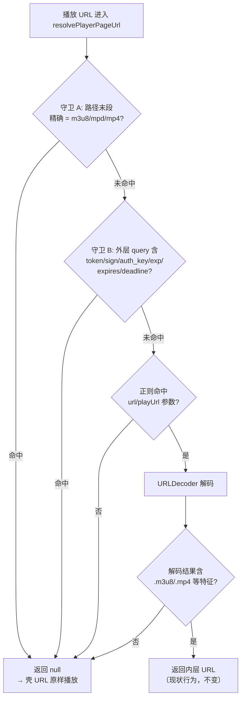
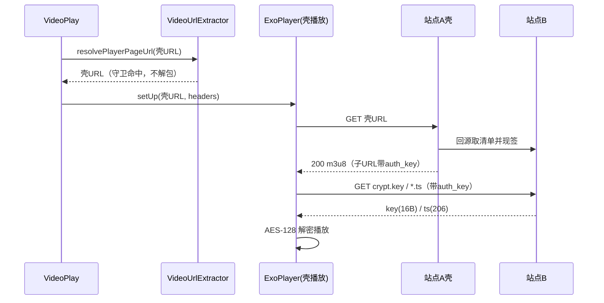

# design.md — video-proxy-m3u8-403

## Technical Approach

单点修改 `VideoUrlExtractor.extractPlayerPageUrl`：入口处先做守卫判断，命中则返回 `null`；未命中走原有解包逻辑（不变）。

## Architecture Decisions

### AD-01: 守卫前置于解包，而非失败后回退
- **Version**: v1.0
- **UpdateTime**: 2026-09-12
- **Context**: 壳解包后裸内层 URL 必 403（实测铁证）；8 个调用点收敛于 `extractPlayerPageUrl` 单点。备选是解包播放 403 后回退重试壳 URL。
- **Concern**: 回退方案每次失败增加一轮网络往返（连接+403 响应+重试），首帧延迟可感知；且回退逻辑需穿透到 ExoPlayer 错误回调层，与既有降级链耦合。
- **Decision**: 守卫在纯函数入口判断（零网络开销、零时序影响），命中即不解包；403 回退重试仅作为 P2 可选增强。
- **Goal**: 该类链接首次 prepare 即成功，不产生任何额外请求。
- **Tradeoff**: 牺牲极端形态（HTML 播放页自带外层 token）的自动纠错，接受 3003 降级失败并用日志观测。
- **Status**: Accepted
- **Superseded-by**: （空）
- **ChangeLog**: 初版

### AD-02: 守卫 A 用路径末段精确匹配，不用 contains
- **Version**: v1.0
- **UpdateTime**: 2026-09-12
- **Context**: 壳端点形态有 `/media/m3u8`（末段即媒体类型）；也存在 `/m3u8player/` 这类路径含 m3u8 字样的 HTML 播放页。
- **Concern**: `contains("m3u8")` 会把 m3u8player 类播放器页误判为媒体端点，导致本该解包的 HTML 壳被原样交给 ExoPlayer。
- **Decision**: 剥离 query/fragment 并剥离尾斜杠（`trimEnd('/')`）后取路径最后一段，与 `m3u8`/`mpd`/`mp4` 做**全等**比较（忽略大小写）。
- **Goal**: 精确区分「端点即媒体」与「路径恰好含关键字」，并覆盖尾斜杠形态（红队 R2-1）。
- **Tradeoff**: `/media/m3u8/list` 多级媒体端点不命中（无真实样本，守卫 B 兜底带鉴权参数的变体）。
- **Status**: Accepted
- **Superseded-by**: （空）
- **ChangeLog**: 初版

### AD-03: 守卫 B 检查外层 query 时必须排除被捕获参数值
- **Version**: v1.1
- **UpdateTime**: 2026-09-12
- **Context**: 壳的 `url=` 参数值是编码后的内层 URL，内层自身可能含 `exp=`/`token=` 等参数（编码为 `%26exp=%3D...`）。
- **Concern**: 若对整个 URL 做 `contains("exp=")`，编码形态 `exp%3D` 或内层解码前的字面量可能造成误判/漏判边界混乱。
- **Decision**: 先用与解包相同的正则移除 `[?&](?:url|playUrl)=<值>` 片段，再对剩余外层 query 部分匹配鉴权参数正则 `\b(?:token|sign|auth_key|exp|expires|deadline)=`。
- **Goal**: 守卫 B 只反映**壳自身**是否持有鉴权签名。
- **Tradeoff**: 正则两次执行，微小的 CPU 开销（纯字符串，纳秒级）。
- **Status**: Accepted
- **Superseded-by**: （空）
- **ChangeLog**: 初版

### AD-04: TLS 握手失败自动回退数据源（开发期迭代回流，2026-09-12 真机实测发现）
- **Version**: v1.1
- **UpdateTime**: 2026-09-12
- **Context**: 守卫生效后真机/模拟器实测（模拟器 MEmu SDK28，DNS 经 hosts bind-mount 修复）发现第二层故障：壳域名清单经 Cronet TLS 加载成功，但站点B 密钥域名请求报 `CronetUrlRequest: net::ERR_SSL_VERSION_OR_CIPHER_MISMATCH`（ERROR_CODE_IO_NETWORK_CONNECTION_FAILED, 2001）。与项目既有铁证（部分 CDN 拒 OkHttp/conscrypt、仅 Cronet/BoringSSL 能过，见 cacheDataSourceFactory 注释）**方向相反**——两类 CDN 各拒一种 TLS 栈，单栈无法全覆盖。
- **Concern**: 该链接类在 TLS 不兼容的 CDN 上依然播不出；用户可见问题（「这类都播放失败」）未完全解决。
- **Decision**: 新增 `TlsFallbackDataSourceFactory`（Cronet 优先 + OkHttp 回退），按请求粒度在 `open()` 抛出 TLS 握手类 IOException（ERR_SSL_* / SSLException）时自动用 OkHttp 重试同一 DataSpec；接入点为 `cacheDataSourceFactory` 的 upstreamFactory（`cronetDataFactory?.let { TlsFallbackDataSourceFactory(it, okhttpDataFactory) } ?: okhttpDataFactory`），覆盖清单/密钥/分片全部视频请求。
- **Goal**: 两类 CDN（分别只认 Cronet / OkHttp 之一）均可达；对既有「仅 Cronet 能过」的站点行为不变（Cronet 成功则零额外开销）。
- **Tradeoff**: 同主机每次请求仍先试 Cronet，被拒时多一次失败握手（无主机级记忆，换取无状态与实现简单）；仅覆盖 open() 阶段握手失败，传输中途 RST 不回退（交给 ExoPlayer 重试）。
- **Status**: Accepted
- **Superseded-by**: （空）
- **ChangeLog**: v1.1 开发期迭代回流（非重大架构变更，未重走检查点 1，随检查点 2 一并验收）

## Data Flow

修复前时序差异：`resolvePlayerPageUrl` 返回裸内层 URL → Exo→CDN 直取清单 → 403 → 降级链耗尽 → 播放失败。

## File Changes

| 文件 | 变更 | 规模 |
|------|------|------|
| `app/src/main/java/io/legado/app/help/video/VideoUrlExtractor.kt` | `extractPlayerPageUrl` 增加守卫 A/B；新增 2 个私有判定函数 + KDoc；同步纠正相关注释 | +40 行左右 |
| `app/src/main/java/io/legado/app/help/exoplayer/TlsFallbackDataSourceFactory.kt` | **新增**（AD-04）：TLS 握手失败自动回退数据源（Cronet→OkHttp） | +100 行左右 |
| `app/src/main/java/io/legado/app/help/exoplayer/ExoPlayerHelper.kt` | `cacheDataSourceFactory` 的 upstreamFactory 接线 TlsFallbackDataSourceFactory（cronetDataFactory 非空时） | +6 行 |
| `app/src/test/java/io/legado/app/help/video/VideoUrlExtractorTest.kt` | 新增守卫正反用例单测 | +120 行左右 |
| `app/src/test/java/io/legado/app/help/exoplayer/TlsFallbackDataSourceFactoryTest.kt` | **新增**：isTlsMismatch 判定逻辑单测 | +55 行左右 |
| `app/src/main/assets/updateLog.md` | 按 version-delivery-sync 规范追加用户可读条目 | 2 条 |
| `docs/specs/video-proxy-m3u8-403/*` | 本 spec 四文档 | — |

不改动：`VideoPlay.kt`（5 处调用）、`VideoPlaybackPipeline.kt`（2 处调用）、`ExoPlayerHelper.kt`、降级链逻辑。

## 已排查项（不再处理）

| 疑点 | 结论 |
|------|------|
| 壳对 HEAD 返回 404 | ExoPlayer HLS 清单请求默认 HTTP_METHOD_GET，chunkless preparation 亦走 GET，无影响 |
| key/TS 防盗链 | 实测裸请求 200/206，与 Referer/UA 无关 |
| TLS 指纹检测（OkHttp 被重置前科） | 本案壳与 CDN 对 curl（非浏览器 TLS）均放行，非本案根因；Cronet 链路保持现状 |
| AES-128 支持 | ExoPlayer 内置，P1-8 已有 key 注入管道，本案 key 无防盗链无需注入生效与否均不影响 |
| auth_key 短时效（约 6 分钟） | 壳每次请求现签子资源 URL，播放器取壳即得新鲜签名，无时效问题 |
