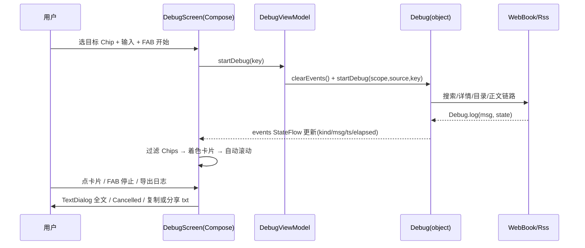

# design.md - 调试源页与调试日志重构

## 对标来源（Explore 结论）

- 合集页（用户提供）：阅读系 30+ fork；调试体验标杆 = **MD3阅读（HapeLee/legado-with-MD3）**，其 `ui/book/source/debug/` 已 MVI + Compose 全量重构（BookSourceDebugContract/Route/Screen/ViewModel），`model/Debug.kt` 为 Event(kind/timestamp/elapsedMillis) + Session + Channel Flow。
- 取其骨架（结构化事件/过滤/着色/Chips/FAB/上限），弃其全量 MVI 样板（本项目 VM 体系为 BaseViewModel + Coroutine 链，不引入 MVI Contract 层）；导出/分享为本项目独有（MD3 无），保留。

## Architecture Decisions

### AD-01: 结构化事件用 StateFlow 而非 Channel/Session 流
- **Version**: v1.0
- **UpdateTime**: 2026-09-11
- **Context**: MD3 用 Channel(UNLIMITED)+Flow+Session 对象；本项目 Debug 是 object 单例，现有 startDebug(scope,...) 链路 + tasks(CompositeCoroutine) + callback（校验链 CheckSource/withDebugSource 依赖）
- **Concern**: 全面 Session 化改动面大且要动校验链；但 UI 需要可观测的事件序列
- **Decision**: `object Debug` 内加 `private val _events = MutableStateFlow<List<DebugEvent>>(emptyList())`，`val events: StateFlow<List<DebugEvent>>`，log() 尾部追加 `(_events.value + event).takeLast(1000)`；`clearEvents()` 供新会话开始时清空。startDebug 签名/流程/callback 全部不动
- **Goal**: UI 侧 `collectAsState` 直接用；校验链零改动；StateFlow 天然去重 + 新订阅者立得当前列表（比 Channel 契合"进页回看"场景）
- **Tradeoff**: 每条日志复制一次列表（≤1000 条，调试期低频，可接受）；无会话隔离（同屏只能跑一个调试——与现状一致）
- **Status**: Accepted

### AD-02: kind 码沿用既有 state 码（不新造枚举迁移）
- **Version**: v1.0
- **UpdateTime**: 2026-09-11
- **Context**: 产生点已实证：BookList=10 / BookInfo=20 / BookChapterList=30 / BookContent=40 / RssParserByRule=10 / Rss=20；-1 错误、1000 完成、1 过程
- **Decision**: `DebugEvent.kind: Int` 直接用这些码，UI 层映射标题与配色（书源 10=搜索/发现响应，RSS 10=列表响应——两页各自映射，title 不同无关紧要）
- **Tradeoff**: Int 语义弱于 enum；换 MD3 式 enum 需改 6 个产生点+校验链，收益低
- **Status**: Accepted

### AD-03: 页面宿主 = VMBaseActivity + 布局瘦身为 compose_host
- **Version**: v1.0
- **UpdateTime**: 2026-09-11
- **Context**: 本仓 Compose 宿主既有模式 = Activity(VMBaseActivity) + binding.composeHost.setContent（AllBookmarkActivity/DownloadManageActivity 先例）；原调试布局含 SearchView/help TextViews/recyclerView/rotateLoading
- **Decision**: 两个调试布局瘦身为 `compose_top_bar + compose_host`（ComposeView）；Activity 保留 intent key/扫码（QrCodeResult）/showDialogFragment(TextDialog) 能力，全部 UI 进 Compose Screen（独立 Screen 文件）
- **Tradeoff**: 原 XML 帮助面板语义由示例 Chips 承接
- **Status**: Accepted

### AD-04: 目标 Chips 内部拼 key，魔法前缀只留在边界
- **Version**: v1.0
- **UpdateTime**: 2026-09-11
- **Context**: Debug.startDebug key 约定：搜索=关键字；发现=`name::url`（contains "::"）；详情=abs url；目录=`++url`；正文=`--url`；RSS：分类=`name::url`、搜索=关键字、内容=abs url
- **Decision**: Chips 选中 target 后由 Screen 拼装 key（MD3 同款：`"++" + query.removePrefix("++")` 防重复前缀）；Debug 不改
- **Status**: Accepted

### AD-05: 停止 = 既有 cancelDebug()；状态机挂 UI 层
- **Version**: v1.0
- **UpdateTime**: 2026-09-11
- **Context**: Debug.tasks(CompositeCoroutine) 收集全部调试协程；cancelDebug() 即 tasks.clear()
- **Concern**: tasks.clear() 是否真正 cancel 协程？CompositeCoroutine.clear 语义需实施时核实——若仅解引用不取消，停止后请求仍在跑
- **Decision**: FAB 停止调 `Debug.cancelDebug()`；**实施期核实 CompositeCoroutine.clear 的取消语义**，若不取消则改用其 cancel 能力（记录处置）
- **Status**: Accepted（含实施期核实点）

## Data Flow

## File Changes

| 文件 | 变更类型 | 内容 |
|------|---------|------|
| `model/Debug.kt` | 修改 | DebugEvent 数据类 + events StateFlow(1000) + clearEvents()；log() 尾部发射；其余不动 |
| `res/layout/activity_source_debug.xml` | 重写 | compose_top_bar + compose_host |
| `res/layout/activity_rss_source_debug.xml` | 重写 | 同上 |
| `ui/book/source/debug/BookSourceDebugScreen.kt` | 新增 | Compose Screen（控件卡/过滤/卡片列表/FAB/空态/自动滚动/导出） |
| `ui/book/source/debug/BookSourceDebugActivity.kt` | 重写 | 宿主：intent/扫码/VM 接线 + setContent；删 XML 交互逻辑 |
| `ui/book/source/debug/BookSourceDebugModel.kt` | 修改 | 去 Debug.Callback/printLog，保留加载与启动 |
| `ui/rss/source/debug/RssSourceDebugScreen.kt` | 新增 | RSS 版 Screen |
| `ui/rss/source/debug/RssSourceDebugActivity.kt` | 重写 | 宿主 |
| `ui/rss/source/debug/RssSourceDebugModel.kt` | 修改 | 去 Callback/printLog |
| `ui/book/source/debug/BookSourceDebugAdapter.kt` | 删除 | 被 Compose 列表取代 |
| `ui/rss/source/debug/RssSourceDebugAdapter.kt` | 删除 | 同上 |
| `app/src/main/assets/updateLog.md` | 修改 | 编译前同步 |

**复用不改**：Debug.startDebug 全链路、校验链、HelpSource、QrCodeResult、GlassTopAppBar/MenuAction、showComposeChoiceListDialog、sendToClip、TextDialog。

## 验证标准

- L1：编译 + `testAppDebugUnitTest` 通过
- L2：真机/模拟器：书源调试（搜索→详情→目录→正文全链出卡片、过滤、点击全文、停止、导出）、订阅源调试（分类/搜索/内容、导出）；`adb logcat -s sourceDebug` 采集核对
- 用户验收：页面体验对标确认
