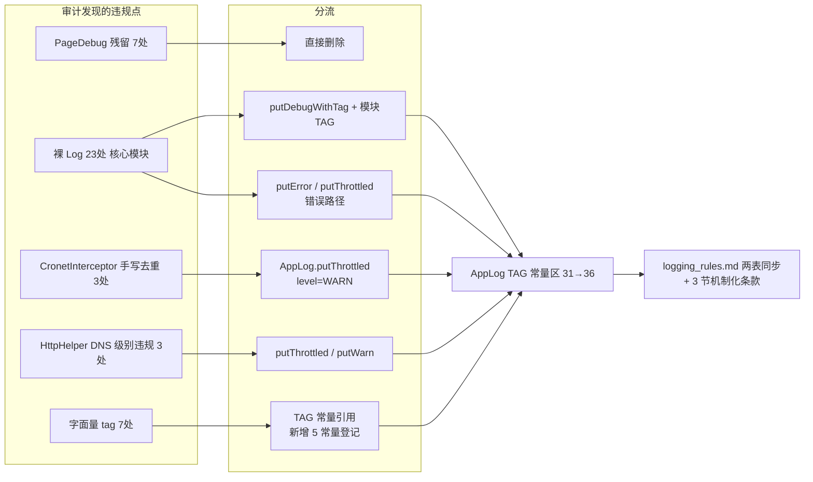
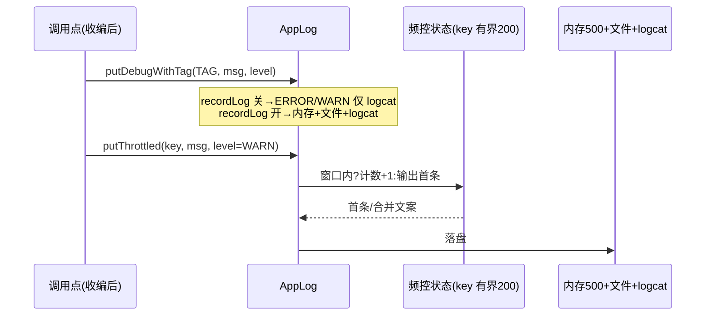

# design.md - 日志合规清理与规范机制化

## Technical Approach

不新增任何日志基础设施，全部复用 AppLog 现有能力（putDebugWithTag / putThrottled / putWarn / TAG 常量区）做**分流收编**：

## Architecture Decisions

### AD-01: 违规点三分法收编（删 / 降 / 改）
- **Version**: v1.0
- **UpdateTime**: 2026-09-11
- **Context**: 审计发现 40+ 处违规点语义各异——PageDebug 是验证期临时日志（F9 定性必删）；AnalyzeUrl network retry 等是永久状态路径（反模式"永久日志用 Log.d 不写文件"）；Cronet 降级是错误路径且高频
- **Concern**: 一刀切删除会丢失有价值的诊断链（HlsRemux/网络重试），一刀切收编会让临时噪音永久化
- **Decision**: 按语义三分类：验证临时→删除；过程状态→putDebugWithTag（recordLog 守卫零开销）；错误/降级→putError 或 putThrottled（频控+级别修正）
- **Goal**: 每条日志落在 F9 语义表的正确格子里，且回归 Grep 可机械验证
- **Tradeoff**: 分流判定依赖逐点人工语义判断（40+ 处），tasks.md 以逐文件清单+证据列控制
- **Status**: Accepted
- **Superseded-by**: 无
- **ChangeLog**: 初版

### AD-02: CronetInterceptor 收编为 putThrottled（实证无控制流耦合）
- **Version**: v1.0
- **UpdateTime**: 2026-09-11
- **Context**: 手写去重状态 lastLoggedError/lastLoggedErrorTime/lastCertError/lastCertErrorTime + LOG_DEDUP_INTERVAL_MS，仅被 logCertError/logNameNotResolved/协议错误打点三处读写；注释与代码实证这些状态不参与降级计数/选路（降级计数独立存在于 HostAccessStrategy/降级状态机）
- **Concern**: 误收编可能改变降级行为；但 putThrottled(key 前缀区分 `CERT:`/`NAME_NOT_RESOLVED:host`/协议错误) 与原"key 不同或窗口过期则输出"语义等价，且额外获得窗口累计合并
- **Decision**: 三处打点改 `AppLog.putThrottled(key, msg, level=WARN)`；删除 4 状态字段与常量；级别按 F9 条款二"降级/兜底=WARN"修正（原为 ERROR，属级别语义违规）
- **Goal**: 频控单点化（F9 条款三），key 空间受 AppLog LRU 200 有界保护
- **Tradeoff**: 日志级别 ERROR→WARN（logcat 输出不变，仅内存筛选归类变化）；putThrottled 走 AppLog 全局 @Synchronized（原手写为 @Volatile 无锁）——调用点在网络 IO 路径上，锁开销可忽略
- **⚠️ 实施期硬检查点（红队 R5 发现）**：协议错误主打点处，若**降级计数递增与日志输出同处一个"去重 if 块"内**，直接替换会改变计数增长频率（原 60s 内同错误整块跳过=计数也不增；收编后块可能每次执行）→ 行为变更。处置规则：实施时先划定"日志输出"与"状态递增"边界——计数逻辑保持原执行频率不变，仅日志输出走 putThrottled；若二者强耦合无法分离，该打点保留原去重结构、只把 `AppLog.put` 换为 `AppLog.putError`（级别仍修正），并在 tasks 2.10 记录处置证据
- **安全性补充**：MainActivity 崩溃上报路径（TAG_CRASH_REPORT）在极早期崩溃时 AppConfig 可能未初始化——`AppLog.recordLogOrOff()` 自带 try-catch 兜底 false，仅走 Log.e 输出，无崩溃风险
- **Status**: Accepted
- **Superseded-by**: 无
- **ChangeLog**: v1.0 初版；v1.1 红队 R5 增补计数耦合硬检查点与锁权衡、R2 增补早期崩溃安全性说明

### AD-03: 审计误报修正与「DebugLog 子串」审计纪律（原：上游遗留白名单）
- **Version**: v1.1
- **UpdateTime**: 2026-09-11
- **Context**: 实施期实证（tasks 1.2/2.9）：审计 Grep 模式 `Log\.(d|e|w|i|v)\(` 会把 `DebugLog.i(` 等**第三层合法调用**误报为违规——CronetHelper/NewCallBack/AbsCallBack/ACache/ZipUtils/ImageUtils/ExplosionView/DragSelectTouchHelper/UmdFile/ImportOldData/SymmetricCryptoAndroid/BookInfo 全部实为 DebugLog 合法用户，真实裸 Log 集合 = AnalyzeUrl×3 + AnalyzeRule×2 + OkHttpStreamFetcher×5 + AppDatabase×2 + HlsDownloader×9（21 处）+ VideoPlay.kt 未使用 import（0 调用点）
- **Concern**: 误报导致设计文档虚列 2 个无需改动文件与"上游白名单"概念；且后续审计若沿用该 Grep 模式会持续误报
- **Decision**: ①CronetHelper/NewCallBack 不改动（AOAdapt 登记）；②"上游遗留白名单"条款改为「**审计 Grep 必须排除 DebugLog/LogUtils/AppLog 前缀子串**」的审计纪律（仍写入 logging_rules.md）；③VideoPlay.kt 未使用 import 按反模式「清理后不移除未使用定义」删除
- **Goal**: 审计口径可信、违规集合清零可机械验证
- **Tradeoff**: 无（纯口径修正，不降低任何标准）
- **Status**: Accepted
- **Superseded-by**: 无
- **ChangeLog**: v1.0 初版（上游白名单）；v1.1 实施期实证推翻误报，改写为本条

### AD-04: 临时日志载体机制化（DebugLog 强制条款）
- **Version**: v1.0
- **UpdateTime**: 2026-09-11
- **Context**: 现行规则允许验证期临时使用裸 Log.d，靠人肉 Grep 清理——已两次失效（PageDebug 2110 条铁证、本次 7 处残留且 tasks.md 声称与代码矛盾）
- **Concern**: 纪律性条款依赖执行者自觉，无结构性兜底
- **Decision**: 规范增补：验证期临时日志统一用 `DebugLog`（自带 BuildConfig.DEBUG 守卫 + 统一功能性 tag）；裸 Log.d 不再是合法临时载体；tasks.md 勾 `[x]` 涉及"已删除/已清零"类声称时必须附 Grep 证据
- **Goal**: 忘清理的后果从"release 噪音"降为"零输出"；完成声称可机械复核
- **Tradeoff**: DebugLog 不进内存日志列表，真机排障需走 logcat/文件日志（与临时日志定位一致，可接受）
- **Status**: Accepted
- **Superseded-by**: 无
- **ChangeLog**: 初版

### AD-05: 新增 TAG 常量的登记闭环
- **Version**: v1.0
- **UpdateTime**: 2026-09-11
- **Context**: 收编 7 处字面量需 5 个新 TAG（ImgDecrypt/HlsRemux/RssSourceEdit/CrashReport/DeviceInfo）；logging_rules 条款四要求新增正式诊断 tag 必须登记
- **Concern**: 代码加常量而文档不同步 = 重蹈 31 vs 30 漂移覆辙
- **Decision**: 同一提交内完成：AppLog 常量区 → logging_rules 模块 Tag 表（值/归属/用途）→ 统计行更新（31→36）
- **Goal**: TAG 全集文档=代码，Grep 可机械验证
- **Tradeoff**: 无
- **Status**: Accepted
- **Superseded-by**: 无
- **ChangeLog**: 初版

### AD-06: 业务侧调试源日志独立第四通道 + 排障闭环补强
- **Version**: v1.0
- **UpdateTime**: 2026-09-11
- **Context**: 用户指出审计盲区——书源/订阅源「调试源」（`model/Debug.kt`）是业务侧日志通道，与 AppLog 体系不是一套（用户裁决：**不期望并入一套**，但必须登记进规范）；实施前痛点：调试日志仅存于 UI 内存列表（Activity 关闭即丢）+ logcat 被 `BuildConfig.DEBUG` 守卫（release 包用户调试书源失败后，AI 只能靠截图分析）
- **Concern**: 如何在不并入 AppLog 的前提下补齐"用户真机调试 → 日志可交付分析"的闭环；且不得让业务调试过程污染用户日志列表
- **Decision**: ①logging_rules.md 新增「第四通道」章节 + 四通道总表（定位/守卫/脱敏豁免/采集路径全登记）；②Debug 单例加会话环形缓冲（500 行）+ `getSessionLogs()`，`cancelDebug` 时清空防跨会话串日志；③两个调试页顶栏加「导出日志」（复制/分享 txt，FileProvider 复用 LogActivity 模式）；④logcat 守卫放宽为 `BuildConfig.DEBUG || AppLog.recordLogEnabled()`（AppLog 暴露 internal 只读快照）——调试是用户主动短时会话，recordLog 开启时 release 可采集，关闭时行为不变
- **Goal**: 用户真机调试失败的日志可一键交付 AI/他人分析；规范覆盖四通道无盲区
- **Tradeoff**: 会话缓冲仅保留最近 500 行（环形淘汰，调试会话有限时长足够）；recordLog 开启时调试日志进 logcat（主动行为，接受）；UI 列表本身仍无条数上限（通用 RecyclerAdapter 不动，单条已被 truncateSafely 限 2000 字符，登记为已知限制）
- **Status**: Accepted
- **Superseded-by**: 无
- **ChangeLog**: 初版（红队第 6 轮一致性重审通过）

## Data Flow

收编不改变 AppLog 对外契约（ai_tests 的 `adb logcat -s <TAG>` 采集链路不变，仅 tag 值更规范）。

## File Changes

| 文件 | 变更类型 | 内容 |
|------|---------|------|
| `ui/book/explore/ExploreShowViewModel.kt` | 修改 | 删 2 处 PageDebug AppLog.put |
| `ui/book/search/SearchViewModel.kt` | 修改 | 删 1 处 PageDebug AppLog.put |
| `ui/rss/article/RssArticlesViewModel.kt` | 修改 | 删 2 处 PageDebug AppLog.put |
| `model/analyzeRule/AnalyzeUrl.kt` | 修改 | 删 2 处 PageDebug putDebugWithTag；3 处裸 Log.d → putDebugWithTag(TAG_ANALYZE) |
| `model/analyzeRule/AnalyzeRule.kt` | 修改 | 2 处裸 Log.d → putDebugWithTag(TAG_ANALYZE, DEBUG) |
| `help/glide/OkHttpStreamFetcher.kt` | 修改 | 5 处裸 Log.e → putDebugWithTag(TAG_IMG_DECRYPT，值沿用既有 "ImgDecrypt" 采集链不变)；URL 改长度化脱敏 |
| `data/AppDatabase.kt` | 修改 | 2 处裸 Log → putDebugWithTag(TAG_DATA)（成功=INFO/失败=ERROR） |
| `help/download/HlsDownloader.kt` | 修改 | 9 处 Log.d("HlsRemux") → putDebugWithTag(TAG_HLS_REMUX) |
| `lib/cronet/CronetHelper.kt` / `NewCallBack.kt` | 不改动 | 审计误报修正（AD-03 v1.1）：实为 DebugLog 第三层合法调用，非裸 Log |
| `model/VideoPlay.kt` | 修改 | 删除未使用的 `import android.util.Log`（0 调用点） |
| `lib/cronet/CronetInterceptor.kt` | 修改 | 三处打点 → putThrottled(level=WARN)；删 4 状态字段+1 常量 |
| `help/http/HttpHelper.kt` | 修改 | DNS retry → putThrottled；negative cache hit/无效地址 → putWarn |
| `help/AppWebDav.kt` | 修改 | 3 处字面量 → TAG_WEBDAV_BACKUP |
| `ui/rss/source/edit/RssSourceEditViewModel.kt` | 修改 | 字面量 → TAG_RSS_SOURCE_EDIT（新增） |
| `ui/main/MainActivity.kt` | 修改 | 字面量 → TAG_CRASH_REPORT（新增） |
| `help/exoplayer/DeviceInfoHelper.kt` | 修改 | 2 处字面量 → TAG_DEVICE_INFO（新增） |
| `constant/AppLog.kt` | 修改 | 新增 5 个 TAG 常量（31→36）：TAG_IMG_DECRYPT("ImgDecrypt"，沿用既有值)/TAG_HLS_REMUX/TAG_RSS_SOURCE_EDIT/TAG_CRASH_REPORT/TAG_DEVICE_INFO；新增 `internal fun recordLogEnabled()`（Debug logcat 守卫用只读快照） |
| `model/Debug.kt` | 修改 | AD-06：会话环形缓冲（500 行）+ `getSessionLogs()`；logcat 守卫放宽 `BuildConfig.DEBUG || AppLog.recordLogEnabled()`；cancelDebug 清空缓冲 |
| `ui/book/source/debug/BookSourceDebugActivity.kt` | 修改 | AD-06：顶栏菜单「导出日志」（复制到剪贴板 sendToClip / 分享 txt FileProvider） |
| `ui/rss/source/debug/RssSourceDebugActivity.kt` | 修改 | AD-06：同上 |
| `docs/project-rules/logging_rules.md` | 修改 | TAG 表 31→36、字面量收编表清空、新增 3 节（DebugLog 强制/Grep 证据/上游白名单） |
| `AGENTS.md` | 修改 | 门禁第 4 条追加 Grep 证据要求（一句话） |
| `app/src/main/assets/updateLog.md` | 修改 | 编译前基于 git diff 同步 |
| `docs/INDEX.md` | 修改 | 本 spec 状态登记 |

**不动**：上游白名单 8 文件、DebugLog/Debug/AppLog 自身、LogActivity、Cronet 降级状态机与 HostAccessStrategy。

## 验证标准

- L1：`compileAppDebugKotlin` + `testAppDebugUnitTest` 通过
- L2：真机/模拟器安装测试包，触发搜索/下载/DNS 弱网路径，`adb logcat -s` 按 TAG 采集验证输出与节流行为
- 回归 Grep（机械验收，附证据）：PageDebug 调用=0；7 核心文件裸 Log=0；TAG 常量=36 且与文档表一致；字面量 tag=0
