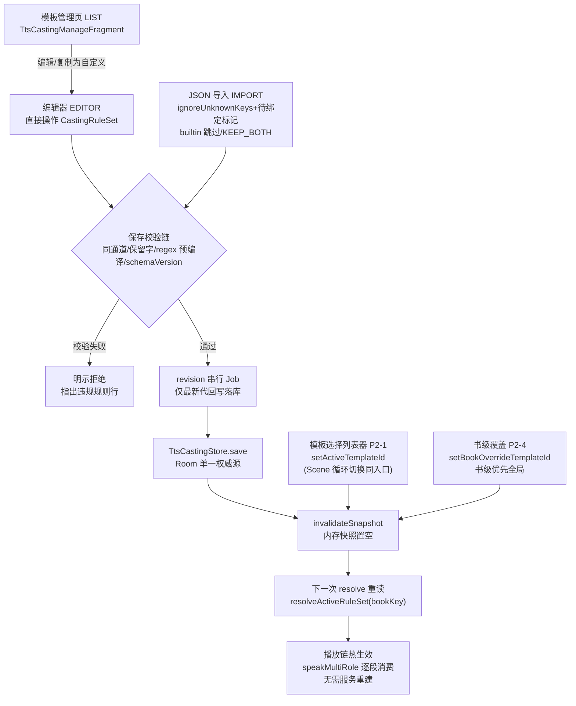
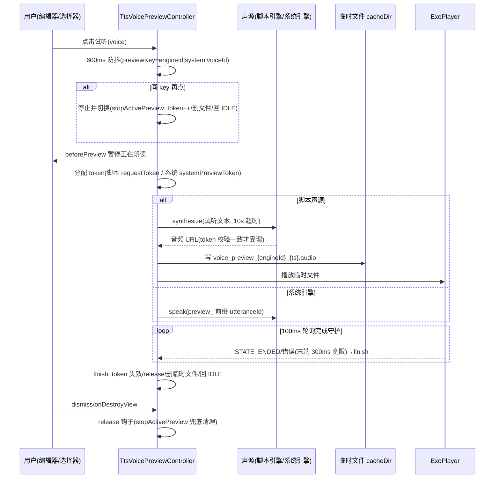

# design.md — TTS 多角色体验完善与生态扩展（optimize-tts-engine-phase2 · 期2 完整版）

> 版本：v2.0（重构定稿）｜更新时间：2026-09-09｜上游基线：`docs/specs/optimize-tts-engine/design.md`（v1.3 定稿，AD 编号自 AD-10 延续）｜输入：`temp/phase2-design-brief.md`（设计简报，§3.1-3.7 UI 交互流深挖=实施蓝本）+ 本仓源码核实（casting 4 文件 / SpeechVoiceRoutePicker / TTSReadAloudService / AiReadAloudRoleService / AudioCacheTaskManager / CacheBookService / CacheManageViewModel / ReadBookActivity 下载范式）
>
> 目标：补全期1 简化项 **S1-S7 全部**——模板列表选择器、管理页+编辑器（并发保存安全）、音色级声源+试听、书级覆盖 UI、AI 链 routeForCue 修复消费（L-d 完整）、批量预合成+缓存管理（S7 经检查点扩围纳入）。四层模型/同通道约束/定型项全部继承上游，Room v110 冻结不 bump（预合成队列内存态）。

---

## 0. 阅读指南（实施 AI 必读）

**阅读顺序**：本文 §1→§3（缺口与设计）→ 上游 design.md §3.5/§4（四层模型与 AD-01~09，本文契约的父集）→ 简报 §3.1-3.7（UI 蓝本，本文按"简报 3.x"引用）→ 同目录 spec.md（R 条款）→ tasks.md。实施时逐条对照本文契约与源码行号，不得凭经验臆测；与上游表述冲突处本文显式声明（唯一增量定型：AD-13 将期1 已实现的书级覆盖存储方案正式定型）。

### 0.1 术语表（继承上游 0.1 全部术语 + 本期新增，全文统一用词）

| 术语 | 定义 | 来源 |
|------|------|------|
| SpeechRoute | 引擎选择唯一协议的结构化路由模型（engineType/engineValue/speakerName/emotionTag），所有读方经 `resolveSpeechRoute` 统一取路由 | 上游继承 |
| resolveSpeechRoute | `SpeechModels.kt` 纯字符串同步 fast-path 路由解析（四态判定，不查库） | 上游继承 |
| 引擎模板 | httpTTS 表 `type=2` 的 JS 脚本模板（options()/voices()/synthesize() 三函数） | 上游继承 |
| 选角模板（casting 模板） | `TtsCastingTemplate` 范式模板：rules 按 tag 分段文本并映射声源+韵律，存于 ttsCastingTemplates 表 | 上游继承 |
| 范式模板配置层 | AD-09 四层架构 L-c 层，承载物即选角模板（声明式 JSON+幂等导入导出） | 上游继承 |
| tag 分段五元组 | `(text, tag, paragraphIndex, offsetInParagraph, length)` 分段产物契约，段落单元不变 | 上游继承 |
| 同通道约束 | 模板 rules 内全部声源 `engineType` 一致，跨通道组合拒绝保存/导入并明示 | 上游继承 |
| TtsVoiceSource / UtteranceResult | 适配层统一声源接口（voices/utterance/release）与产物 sealed（SpeakSubmitted/AudioFile/AudioStream） | 上游继承 |
| PendingSwitch / reInitTts / 降级链 | 续播意图上收数据层 / 引擎内重建 IntentAction / AD-08 三段式失败降级 | 上游继承 |
| 模板管理页 | 本期新增：单 Fragment 三态路由（LIST/EDITOR/IMPORT）的选角模板管理界面，类=TtsCastingManageFragment | 本期新增 |
| 规则行 | 编辑器内单条 CastingRule 的交互载体：tag×match 类型×表达式×声源行×prosody 滑条 | 本期新增 |
| CastingRuleSet 快照修订号（revision） | 编辑器保存链的代际令牌：保存 Job 串行 enqueue+revision 自增，仅最新代结果回写落库，旧代丢弃（防乱序覆盖） | 本期新增 |
| 试听 token | 试听请求代际令牌（双 token：脚本链 requestToken+系统链 systemPreviewToken），响应校验与资源清理的判据 | 本期新增 |
| 两段式选择器 | SpeechVoiceRoutePickerDialog 既有交互：先引擎组（EnginePickerList）后音色（SpeakerPickerList）两级选择 | 本期新增 |
| 预合成保留名单（prebuildReservedKeys） | Manager 持有的已落盘预合成文件名集合，removeCacheFile/清理跳过名单；按 rename 成功事实登记，仅缓存管理页清理/删书联动可移除 | 本期新增 |
| 任务代际 id | TtsPrebuildState 携带的任务代际令牌，服务实例轮询按代际过滤，防旧实例误渲染新任务 | 本期新增 |
| 门控三条件 | cacheSynthesizer 入口可用判定：①type∈{1,2} ②非流式模式 ③多角色模板未激活 | 本期新增 |
| 预合成四件套 | 并发防护组合：播放优先租约+temp/rename 原子提交+键单源+保留名单 | 本期新增 |
| 批量预合成 | 选章范围后台逐段合成音频落盘（缓存键与播放侧同源），播放时 has() 命中零等待；承载=TtsPrebuildManager（队列）+TtsPrebuildService（前台壳） | 本期新增 |
| cacheSynthesizer 能力接口 | 每引擎"能否落盘合成"的判定契约（上游 §3.6 定型项 9）：type=1 http / type=2 script 可落盘，系统 TTS 无落盘产物（SpeakSubmitted 流式）→ 预合成入口门控禁用并明示 | 本期新增 |
| 播放优先租约 | 预合成队列推进到正在实时朗读的章节时跳过延后（commitIfLeaseActive 插桩实装，上游 §1.8-D-1 契约 5），写缓存单一原子提交防写读竞争 | 本期新增 |

### 0.2 数字速查卡

| 数字 | 含义 |
|------|------|
| 600ms | 试听防抖时长（按 previewKey，同 key 再点=停止切换，简报 3.3 蓝本） |
| 10s | 脚本三函数 `withTimeout(10s)` 硬超时（上游 AD-04，试听脚本链同受保护） |
| 同通道约束 | 编辑器保存+JSON 导入双写入口强制 `sameChannel()` 校验（TtsCastingModel.kt:99） |
| Room v110 | 数据库版本冻结：本期零新表零新列零 bump（AD-13 前缀键方案规避） |
| revision 串行 | 编辑器保存单协程队列+快照修订号，仅最新代落库（蓝本 NG enqueueEngineSave） |
| 0.5~2.0 | prosody 三维（rate/pitch/volume）有效域，0=跟随全局不下发（CastingProsody，TtsCastingModel.kt:39-47） |
| 100ms+300ms | 试听播放完成守护：100ms 轮询+末端 300ms 宽限（简报 3.3） |
| ai: | AI 角色 tag 命名空间前缀（CastingTag.AI_PREFIX，TtsCastingModel.kt:28），编辑器自定义角色 tag 保存时规范化挂此命名空间 |
| dataSync | TtsPrebuildService 前台服务类型（仓库 10+ 同类先例：CacheBookService/DownloadService/CheckSourceService 等，AndroidManifest.xml:682-744） |
| 单线程串行 | 预合成队列并发模型（对齐 AudioCacheTaskManager daemon 单线程 audio-cache-worker 先例），逐单元 has() 幂等跳过 |
| KEY_VERSION | 缓存键代际参与哈希（上游 §3.6 契约 1 落地），键算法升级时整批失配重合成而非脏读旧格式 |

### 0.3 本文相对上游的增量契约声明（差异表）

| 契约点 | 上游表述 | 本文定型 |
|--------|---------|---------|
| 书级覆盖存储 | R11 语义+3.5.1 裁决序（未定存储形态） | AD-13：PreferKey 前缀键（期1 已实现，正式定型） |
| resolveSourceForTag 签名 | `resolveSourceForTag(bookKey, tag, ruleSet)`（期1） | 增可选 `characterId: Long = 0L`（前两级激活闸=ai: 前缀） |
| 编辑器自定义 tag 规范化 | 上游 3.5.1 仅约定 AI 角色统一 ai: 前缀 | 编辑器自定义角色保存时规范化 `ai:<名>`（与 AI 分镜 tag 精确匹配闭环） |
| invalidateSnapshot 触发面 | 期1 两处（切换/删除） | 四路写入口统一收敛（3.1 第 6 条唯一口径） |
| HttpReadAloudService 按段换源 | 上游期2 范围（3.5.2③） | 契约就绪、**换源主体改造**仍登记后续（3.6）；扩围后本文件承载缓存键收敛+合成纯函数/cacheSynthesizer 能力接口抽取（3.7，播放链对外行为零变化） |

---

## 1. 背景与缺口分析（五角度）

> 方法：按简报 §4 五角度框架逐项分析期1 简化项（S1-S7）的真实缺口。每小节末尾给"本期对策"。

### 1.1 产品角度：分层路径的发现性与折腾路径缺失

期1 交付了"小白零配置双声"最小闭环，但产品分层不完整：

- **循环切换的发现性问题**：期1 唯一入口=朗读设置"多人听书模板"行循环切换（`cycleTtsCastingTemplate`）——用户不知道内置 4 模板全集（双声/男女对读/MultiTTS 透传/单声）、看不到各模板规则语义摘要，误触一次即跳过目标模板需循环整轮才能找回；模板资产对用户近乎不可见。
- **折腾路径缺失**：模板不可编辑/新建/导入导出——爱折腾用户无法自定义规则（keyword 角色词库、regex 语气段、per-tag 韵律），上游 AD-09 Goal 声明的"规则级自定义与 JSON 分享分享"未落地；NG/C 与 tts-server 生态均有此能力面。
- **书级覆盖有脑无脸**：`setBookOverrideTemplateId`（TtsCastingStore.kt:68）能力就绪但零 UI（S4），用户无法表达"这本书用另一套模板"。

**本期对策**：P2-1 列表选择器（全集可见+规则摘要+单选激活）补发现性；P2-2 管理页+编辑器+JSON 导入导出补折腾路径；P2-4 书级覆盖行补表达式能力。

### 1.2 整体体验角度：盲选、不可见与无反馈

- **无试听的选型盲选**：声源/音色选择无试听（S5），用户只能靠朗读整章验证听感，选型漏斗断裂——NG 的试听控制器（防抖+token+临时文件）是成熟解法（简报 3.3），上游 §5.4 已将"音色试听"评为"选音色不能试听是选型硬伤"。
- **无管理页的模板不可见性**：模板资产（内置只读+自定义）无盘点入口，启停/删除/复制为自定义无从操作；导入的 JSON 模板无处落身。
- **切换后无反馈**：`setActiveTemplateId`→`invalidateSnapshot()` 链即时生效，但 Scene 闸位摘要（ReadAloudPlayerPanel）未联动显示当前模板名，用户切换后无"已生效"确认感；书级覆盖生效中全局切换无"实际生效=书级覆盖"标注。
- **空态未定义**：全部模板被删除/禁用时多人听书入口回退单声（激活哨兵空），无明示引导。

**本期对策**：试听进选型漏斗（P2-3 契约移植）；管理页资产全可见（P2-2）；Scene 摘要联动+切换明示+空态引导（P2-1/P2-4）。

### 1.3 功能完备角度：S1-S7 与 NG/C 功能面差距表

| # | 简化项 | 期1 形态 | NG/C 对照 | 本期处置 |
|---|--------|----------|-----------|---------|
| S1 | 模板选择入口 | 循环切换 | NG 列表选择器（名称+多 tag+单选） | ✅ P2-1 列表器 |
| S2 | 管理页/编辑器 | 无 | NG 单 Fragment 管理页+表单（简报 3.1/3.6） | ✅ P2-2 三态 Fragment |
| S3 | 音色级声源 | 声源仅引擎级（speakerName 空） | NG/C 音色级选择成熟 | ✅ P2-3 SpeechVoiceRoutePicker 接入 |
| S4 | 书级覆盖 UI | Store 能力就绪无 UI | C 书级绑定双 Tab（简报 3.5 MVP 版） | ✅ P2-4 覆盖行（模板级） |
| S5 | 试听 | 无 | NG TtsVoicePreviewController 完整契约 | ✅ P2-3 契约移植 |
| S6 | AI 链 routeForCue 消费 | 零消费（仅定义，AiReadAloudRoleService.kt:916） | NG 播放链逐段 route→fallback | ✅ 3.5 统一链修复 |
| S7 | 批量预合成/缓存管理 | 未实装（§1.8-D-1 定型项就绪） | C TtsCacheService/缓存管理页 | ✅ P2-7 扩围纳入（3.7） |

剩余差距（本期不做，登记后续）：书级角色绑定三页 dock（简报 3.5 完整版）、引擎排序/批量启停、SSE/WS 流式、WAV 截断检测、预合成任务持久化/音频跨设备迁移——均沿上游 §5.4 处置档位不变。

**本期对策**：S1-S7 本期全量闭环至"与 NG/C 功能面对照无可感知硬缺口"档位，**登记后续清零（S7 经检查点扩围裁决纳入，P2-7）**；S7 实装严格沿 §1.8-D-1 九条定型契约落地，零架构返工。

### 1.4 架构稳定性角度：四个新增风险源

- **编辑器并发保存风险**：快速连续编辑+异步落库，若并发 Job 无代际管理则旧 Job 可能晚于新 Job 落库（乱序覆盖新编辑成果）；NG 以 revision 串行 Job+快照门修订号解决（简报 3.1/3.6），本仓无先例必须移植该契约。
- **试听资源泄漏风险**：试听涉及临时文件、ExoPlayer、协程三类资源；分散在各选择点各自实现防抖与清理，必然出现临时文件残留、播放器未 release、旧响应覆盖新试听三类事故。
- **AI 接入回归面**：AiReadAloudRoleService 为 2200+ 行大文件（token 用量统计链/分配链/分镜缓存共存其中）；若播放服务内直连 AI 服务解析路由，耦合扩散+路由解析出现第二权威源（违反上游唯一裁决序）。
- **预合成与播放写读竞争风险**：批量队列与实时朗读可能并发操作同一章节缓存文件（写半成品被播放读走/重复合成浪费）；且缓存键若播放端与批量端各算一套即违反唯一权威源（上游 §3.6 契约 2"禁止各算一套"）；播放侧 10 分钟清理策略可能驱逐预合成产物——必须单源纯函数+原子提交+租约门控+保留名单四件套（3.7）。

**本期对策**：revision 串行保存（AD-11）+TtsVoicePreviewController 契约移植统一资源契约（AD-12）+AI 接入点收口 resolveSourceForTag（AD-14）+预合成内存队列/能力门控/播放优先租约（AD-15）。

### 1.5 整体架构不缺角度：新增 UI 不得破坏上游 §1.8-D 定型项

| 定型项 | 上游契约 | 本期核验结论 |
|--------|---------|-------------|
| voiceParamsJson 键结构 | 每音色参数 `{"voiceId":{speed_ratio,volume_gain,pitch_ratio}}`+sortedMap+neutral 删键（上游 3.8-4），运行时参数禁入引擎定义 | 编辑器 prosody 写模板级 CastingProsody，不触碰 voiceParamsJson 键结构；两套参数域（模板级/每音色级）边界在 3.2 显式声明 |
| 同通道校验入口 | 编辑器保存/导入时强制校验（上游 3.5.6①） | 本期编辑器+导入是仅有的两个新增模板写入口，双入口强制挂 `sameChannel()` |
| Room v110 | 冻结不再 bump（无新表/列需求） | AD-13 书级覆盖走 PreferKey 前缀键（期1 已实现），零迁移 |
| 预合成预留（§1.8-D-1） | 合成管线与播放解耦+缓存键纯函数化+单元切分独立 | 扩围后该定型项由"预留"升"实装"（3.7）：九条契约逐条落地（键纯函数化/同源解析/切分纯函数/目录结构/原子提交/纯合成签名/.part 约定/key 可持久化/能力接口），播放端与批量端同函数零第二套；编辑器/试听临时文件仍独立命名空间 `voice_preview_*` 不入缓存键体系 |
| 存储三分法 | 引擎定义/音色目录/运行时参数分置（上游 3.8-2） | 模板定义=Room、激活态/书级覆盖=PreferKey、试听临时文件=cacheDir，三分不混 |

**本期对策**：§3 各子系统设计以"只加展示层与解析级，不动定型契约"为硬约束，§7 逐条回归核验。

---

## 2. 总体架构

四层模型（上游 AD-09）不动：**本期新增 UI 层落在 L-c 展示位，L-d 由"预留"升"完整接入"**——L-c 的写入口从"内置导入"扩展为"列表器切换+编辑器保存+导入+书级覆盖"四路，全部收敛 TtsCastingStore 单一权威源；L-d 的六级 resolve 链补齐前两级（角色绑定级），routeForCue 从零消费修复为播放链真实消费。

```mermaid
flowchart TD
    subgraph UIN["本期新增 UI 层（L-c 展示位）"]
        P21["P2-1 模板选择列表器<br/>ReadAloudConfigDialog 内嵌列表<br/>+PlayerPanel Scene 兼容循环"]
        P22["P2-2 模板管理页+编辑器<br/>单 Fragment: LIST/EDITOR/IMPORT<br/>revision 串行保存"]
        P24["P2-4 书级模板覆盖行<br/>当前书上下文+跟随全局"]
    end
    P23["P2-3 音色级声源+试听<br/>SpeechVoiceRoutePicker 两段式<br/>TtsVoicePreviewController 契约移植"]
    subgraph Lc["L-c 范式模板配置层（上游已交付，本期仅扩展解析级）"]
        STORE["TtsCastingStore<br/>Room 单一权威源+invalidateSnapshot<br/>resolveSourceForTag 六级链"]
        MODEL["TtsCastingModel<br/>CastingRuleSet/CastingRule/prosody"]
    end
    subgraph Ld["L-d AI 多角色（本期完整接入）"]
        AI["AiReadAloudRoleService<br/>分镜段 ai: tag+routeForCue 修复消费"]
    end
    subgraph Lb["L-b 适配层"]
        VS["TtsVoiceSource 三类声源<br/>SystemEngine/HttpForwarder/Script"]
    end
    P21 -->|setActiveTemplateId| STORE
    P22 -->|save/导入| STORE
    P24 -->|setBookOverrideTemplateId| STORE
    P22 --> P23
    P23 -->|SpeechRoute(toneID 承载音色 id)| VS
    P23 -->|preview_ 隔离通道| VS
    AI -->|resolveSourceForTag 前两级| STORE
    STORE --> MODEL
    STORE --> VS
```

**P2-1~P2-7 模块关系**：

| 模块 | 对应简化项 | 交付物 | 依赖 |
|------|-----------|--------|------|
| P2-1 模板选择列表器 | S1 | ReadAloudConfigDialog 内嵌列表器+PlayerPanel Scene 摘要联动（循环切换保留为兼容入口） | TtsCastingStore（既有） |
| P2-2 模板管理页+编辑器 | S2 | TtsCastingManageFragment（LIST/EDITOR/IMPORT 三态） | TtsCastingModel/Store（既有）+P2-3 |
| P2-3 音色级声源+试听 | S3+S5 | 声源行接 SpeechVoiceRoutePicker+script voices 目录归一化+TtsVoicePreviewController 契约移植 | SpeechVoiceRoutePicker（既有）+fetchVoicesCatalog（既有） |
| P2-4 书级覆盖 UI | S4 | 朗读设置本书覆盖行（复用 P2-1 列表器 bookContext 模式） | TtsCastingStore（既有） |
| P2-5 AI 链接入（L-d） | S6 | resolveSourceForTag 前两级+routeForCue 修复 | TtsCastingStore 扩展（本期唯一 L-c 改动） |
| P2-7 批量预合成+缓存管理 | S7 | TtsCacheKeys+TtsPrebuildManager+TtsPrebuildService+选章入口（§3.7） | HttpReadAloudService 收敛重构（§3.7.1） |

**模块间接口契约清单**（实施时逐条对照，禁绕过）：

1. UI→Store 唯一写入口五件套：`setActiveTemplateId` / `setBookOverrideTemplateId` / `save` / `deleteById` / 导入写入——全部在 TtsCastingStore 内收敛，UI 禁直查直写 Room（上游"模板单一权威源=Room，禁止第三写点"条款延续）。
2. Store→播放链唯一读入口：`resolveActiveRuleSet(bookKey)`+`resolveSourceForTag(bookKey, tag, ruleSet[, characterId])`——播放服务与 AI 服务只经这两个函数取路由。
3. 编辑器→试听：TtsCastingEditorScreen 持 TtsVoicePreviewController 引用，dispose 链=onDismiss/onDestroyView→release（AD-12）。
4. 编辑器→选择器：声源行经 `SpeechVoiceRoutePickerDialog` 取回 SpeechRoute 后写回 CastingRule.sourceJson（含 current 哨兵透传）。
5. AI 服务→Store：AiReadAloudRoleService 仅调 resolveSourceForTag（characterId 传值），禁反向依赖播放服务。

**本期架构红线清单**（继承上游约束，实施禁越）：

1. 四层模型不动：新增代码只落 L-c 展示位与 L-d 解析级，L-a/L-b 零改动（TtsVoiceSource 如需适配音色级见 §6）。
2. 同通道约束双入口强制：编辑器保存与 JSON 导入必须挂 sameChannel 校验，无旁路。
3. Room v110 冻结：零新表零新列零 bump，书级覆盖走 PreferKey（AD-13）。
4. 试听不预支合成管线：preview_ 隔离+voice_preview_* 独立命名空间，不入缓存键体系（§1.8-D-1 契约不破坏；批量预合成走 §3.7 独立链，与试听通道互不相干）。
5. 上帝文件红线：单文件超 500 行拆分（Screen 级拆分控制）。
6. 项目惯例：Coroutine 链/kotlin.runCatching/NoStackTraceException/AppLog，禁 Timber/CoroutineExceptionHandler。

---

## 3. 子系统实现设计

### 3.1 模板选择列表器（P2-1，对应 S1）

**现状**：朗读设置"多人听书模板"行=循环切换（期1 简化），无全集可见性（缺口见 1.1）。

**设计**（蓝本=简报 3.7 ReadAloudConfigDialog `SettingItemSpec itemsForGroup` 模式 + 上游 3.5.4"与高亮规则选择同构"）：

1. **列表器形态**：点朗读设置"多人听书模板"行弹出列表选择器（Dialog 承载，AppDialogStyle 组件族）；数据源 `TtsCastingStore.all()`（Room，TtsCastingStore.kt:30）。
2. **列表项**：模板名 + builtin 标记 + 规则摘要（tag 数+声源摘要复用 `speechRouteSummary`，SpeechVoiceRoutePicker.kt:124）+ 单选激活态（radio）；禁用模板灰显不可选。
3. **激活链**：单选 → `setActiveTemplateId(id)`（TtsCastingStore.kt:56，含 `activeRuleSet=null`）→ `invalidateSnapshot()` → 下一次 resolve 重读 Room → **朗读中切模板热生效，无需服务重建**（模板切换只换声源解析，不换 TTS 引擎实例，与引擎切换 reInitTts 语义正交）。
4. **循环切换保留为兼容入口**：ReadAloudPlayerPanel Scene 闸位点击保留 `cycleTtsCastingTemplate` 快捷循环（肌肉记忆兼容），朗读设置行升级为完整列表器（发现性主入口）；两入口写同一 `setActiveTemplateId` 收敛点；**循环链过滤 enabled=false 项**（不可用模板不落入循环）；**列表器顶部常显当前实际生效来源**（本书存在书级覆盖时选择仅改全局层并即时提示"实际生效=本书覆盖"）。
5. **Scene 摘要联动**：ReadAloudPlayerPanel Scene 摘要显示当前生效模板名；书级覆盖激活时标注"本书覆盖"（与 P2-4 联动）。
6. **空态**：全部模板禁用/无可用模板时，列表器明示"暂无可用模板，去管理页启用"并给管理入口；多人模式回退单声语义（期1 既有）不变。
7. **列表器交互明细**：单选即激活即关闭（radio 语义，非勾选+确认双步）；激活项高亮+当前生效来源标注（全局激活/本书覆盖，联动 P2-4）；长按无隐藏手势（发现性优先，操作全显性）；列表器为纯读+单写（setActiveTemplateId），不做启停/删除等管理操作（职责归 P2-2，避免选择器承载数据变更）。

**invalidateSnapshot 联动链（全文唯一口径）**：`setActiveTemplateId` / `setBookOverrideTemplateId` / 编辑器 save / JSON 导入 四路写入口 → `invalidateSnapshot()`（TtsCastingStore.kt:89，内存快照 activeRuleSet 置空）→ 下一次 `resolveActiveRuleSet(bookKey)`（:79）重读 Room → `speakMultiRole` 逐段 resolve（TTSReadAloudService.kt:341 消费点）热生效。

**快照读侧键控修复**：期1 实现 `resolveActiveRuleSet` 首行 `activeRuleSet?.let { return it }` 命中全局单快照时**忽略 bookKey**——A 书书级覆盖后切 B 书朗读（B 也有覆盖）返回 A 规则集（跨书串模板）；本期 P2-4 把书级覆盖升级为主路径，触发面显著扩大。修复定型：快照缓存改为 **(bookKey, templateId) 二元组校验**（命中需 bookKey 与缓存一致，否则重读 Room）；全局激活模板（bookKey=空）仍可共享缓存。**章粒度快照语义显式声明**：`play()` 每章 resolve 一次 ruleSet，整章持同一引用逐段消费（章内无半段旧半段新），进度字符账不漂移——S1-4 口径据此修正为"下一章起生效"，禁实施改段粒度重读。

### 3.2 模板管理页+编辑器（P2-2，对应 S2）

**导航架构（蓝本=简报 3.1 NG 单 Fragment 路由枚举，AD-10）**：

1. 单 Fragment `TtsCastingManageFragment` + 路由枚举 `TtsCastingRoute { LIST, EDITOR, IMPORT }`；**宿主容器=主 Activity 内容容器 add/display（对齐既有 Fragment 管理页宿主先例）**；`backDestination()` 定义返回栈（EDITOR/IMPORT 返回 LIST）；templateId/编辑态存 Fragment 状态**不走 Intent**；三个 Screen（List/Editor/Import）按态组合渲染，单文件超 500 行拆分（上游上帝文件红线）；**规则行组件 RuleRow 独立文件**（tag 校验+match 切换+pattern+声源行+3 滑条约 300 行，内联 EditorScreen 必超线）。

**管理页（LIST 态）**：

2. 卡片列表项=模板名 + builtin tag + enabled 开关 + 规则摘要 +（自定义项）删除入口；乐观更新+异步保存+失败回滚（蓝本简报 3.1 列表提交模式）。
3. **内置模板**：只读标记+"查看"（进编辑器只读态）+"复制为自定义"（生成新 templateId、name 加"副本"后缀、builtin=false，复制后即可编辑）。
4. **自定义模板**：编辑/删除/启停。删除前确认弹窗；删除当前激活模板 → 复用 `deleteById` 既有联动语义（清激活键+快照失效，TtsCastingStore.kt:38-45）+明示"已回退单声"；启停（enabled）控制模板在选择列表可见性，禁用已激活模板同样明示回退。
5. 管理入口：P2-1 列表器尾部"管理模板"项 + 朗读设置多人听书分组内直达项。

**内置 4 模板管理页呈现对照**（期1 内置模板定义不变，仅补管理面操作语义）：

| templateId | 管理页可操作 | 呈现要点 |
|-----------|-------------|---------|
| builtin_dual_voice | 查看/复制为自定义/启停 | 双声模板，规则摘要=引号二分 |
| builtin_male_female | 查看/复制为自定义/启停 | 男女对读，对白内性别启发式 |
| builtin_multitts_passthrough | 查看/复制为自定义/启停 | 整段单 tag 透传 |
| builtin_mono | 查看/启停（默认激活语义） | 单声（关闭多人），激活=多人模式关闭 |

**编辑器（EDITOR 态）规则行（每行=一条 CastingRule）**：

6. **tag 选择**：固定项 旁白(narration)/对白(dialogue)/对白男(dialogue_male)/对白女(dialogue_female) + 自定义角色（输入纯角色名，**保存时规范化为 `ai:<名>`**——CastingTag.AI_PREFIX 命名空间，TtsCastingModel.kt:28，AI 分镜 tag 直接精确匹配）；保留字校验 `CastingTag.isReserved`（narration/dialogue_male/dialogue_female 拒绝自定义占用）；禁止嵌套 ai: 前缀。
7. **match 类型**：builtin_quote（引号规则，pattern 忽略）/ regex（表达式输入+**Pattern 预编译校验，非法正则保存即拒**，上游 3.5.2①）/ keyword（关键词表达式）。
8. **声源行**：复用 `SpeechVoiceRoutePickerDialog`（签名对齐：title/groups/currentRoute/initialGroupKey/onDismiss/onRouteSelected/onLogin，SpeechVoiceRoutePicker.kt:54-62），当前值显示 `speechRouteSummary`；默认值=**current 哨兵**（跟随当前引擎，`CastingRule.CURRENT_SENTINEL`，TtsCastingModel.kt:77——用户换引擎自动跟随，禁钉死旧声源，上游 3.5.1 语义）。
9. **prosody 滑条**：rate/pitch/volume 三滑条，0=跟随全局、有效域 0.5~2.0（CastingProsody 既有语义），滑条交互"松手即存"（onValueChangeFinished，蓝本简报 3.4）。
10. 规则行增删/上下移（数组顺序=首命中优先级，上游 3.5.2① 裁决语义）；fallbackSource 行（全局兜底声源，同声源行控件）。

**保存链（顺序固定）**：

11. 编辑状态**直接操作 CastingRuleSet 模型**（AD-11，无 DTO 转换层）→ 保存校验：① 同通道校验 `sameChannel()`（TtsCastingModel.kt:99，跨通道拒绝保存并明示，上游 3.5.6①）② tag 保留字/命名空间校验 ③ regex 预编译 ④ `schemaVersion=SCHEMA_VERSION` 写入（TtsCastingModel.kt:105，模型演进锚点）→ `TtsCastingStore.save()`（:34，Room 单一权威源）→ `invalidateSnapshot()` → 若为当前生效模板播放链热生效。
12. **编辑器并发保存**：revision 快照修订号串行 Job——保存请求 enqueue 单协程串行队列，revision 自增，仅最新 revision 结果回写 UI/落库，旧 Job 结果丢弃（蓝本 NG enqueueEngineSave+TtsEngineSnapshotGate，简报 3.1/3.6）；**返回/切 Route/销毁前兜底保存**（flush，蓝本简报 3.6）；未保存拦截沿用既有编辑页组件族（上游 3.5.4）。

**JSON 导入导出（IMPORT 态）**：

13. 导出：CastingRuleSet 序列化（含 schemaVersion），文件/剪贴板双通道（对齐 tts-server 分享习惯，上游 3.5.4）；导出内容注明"需期2+版本导入"（期1 无 casting 导入通道）。
14. 导入校验链（顺序固定）：`ignoreUnknownKeys` 容错解析（上游 5.8-2 tts-server 兼容要点）→ 同通道/保留字/regex 预编译校验 → **声源可达性校验：目标设备缺声源的规则标记"待绑定"而非静默生效**（上游 5.3-2）→ 幂等写入：builtin 冲突跳过+计数明示（对齐 `importBuiltinTemplates` 语义 TtsCastingStore.kt:145），自定义冲突 KEEP_BOTH（新 id=`{id}_{ms}` 重写 templateId+name，与引擎模板 AD-06 语义对齐）→ `invalidateSnapshot()`。
15. **ReDoS 防护**：pattern 限长（≤256 字符，超长拒绝保存/导入）+ **切分执行超时熔断**（TtsTagSplitter 逐规则匹配包 runCatching+超时守护，超时/异常→该规则跳过落旁白兜底，防 `(a+)+$` 类灾难性回溯卡死播放链与批量 worker）；编辑器保存对含嵌套量词的高危模式 toast 警告（不阻断，用户自担）。

### 3.3 音色级声源与试听（P2-3，对应 S3+S5）

**音色级声源（P2-3）**：

1. SpeechRoute 以 **toneID 承载音色 id（voiceId），speakerName 仅承载显示名**（SpeechModels.kt:36-40 音色载体=toneID，校验/摘要/回显全链按 toneID 判定——SpeechRouteSanitizer.kt:170-174/speechRouteSummary:134/SpeechVoiceGroupRepository:136-140；**禁止把 voiceId 写进 speakerName**）；编辑器声源行经两段式选择器选定"引擎+音色"，替换期1"声源仅引擎级（toneID 空缺省）"形态。
2. **script 引擎音色目录**：type=2 引擎音色=`fetchVoicesCatalog` 动态目录（HttpReadAloudService.kt:167 既有调用，speakersJson 缓存机制复用）归一化为 `SpeechVoiceEngineGroup`，在选择器内与系统引擎目录同池展示+搜索筛选（蓝本简报 3.2 筛选模式：语种/性别按实际存在显示）；**复用既有归一化文件禁重写**（SpeechVoiceCatalogRepository:77-90 已构建 type=2 speakers 目录条目、SpeechVoiceGroupRepository:128-140 已有分组/toneID 匹配链）。
3. 选择器**先备后显**：打开前 IO 构建音色分组快照再弹窗，loadJob 防重入（蓝本简报 3.2 buildVoiceSnapshot 先备后显）；**拉取耗时期间点击声源行立即弹窗呈现引擎级分组（loading 指示）+voices 目录异步到达后快照刷新**（防 10s 超时期间白等无反馈）。

**试听 TtsVoicePreviewController（P2-3，契约移植，蓝本=简报 3.3，AD-12）**：

4. **600ms 防抖**按 previewKey（key=`engineId|system|voiceId`）；同 key 再点=停止切换；试听按钮 LOADING/PLAYING 状态动画。
5. **双 token**：脚本链 `++requestToken` 响应校验+删临时文件；系统链独立 `systemPreviewToken`——token 不一致的后到响应/回调一律丢弃。
6. **临时文件**：`cacheDir/voice_preview_{engineId}_{ts}.audio` → ExoPlayer 播放 → STATE_ENDED/错误 finish；100ms 轮询+末端 300ms 宽限；文件独立命名空间，不入朗读缓存键体系（§1.5 定型项不破坏；预合成走 §3.7 独立链）。
7. **统一释放**：`stopActivePreview`（token++/cancelJob/release/删文件/回 IDLE）；宿主 dismiss/onDestroyView 调 `release` 钩子（资源泄漏防线）。
8. **通道隔离**：试听 utteranceId 前缀 `preview_` 与朗读通道隔离；`beforePreview` 先暂停正在朗读（试听不占用朗读通道，上游架构约束）；**系统声源试听文本=DEFAULT 固定文案**（本仓 SpeechVoiceOption/HttpTTS 无 sampleText 字段，定型读 strings 默认试听句，不加实体字段）。
9. **消费点**：P2-2 编辑器声源行"试听"操作（唯一试听入口）；控制器对 script 声源走 synthesize 临时文件链（受 10s 超时保护），对系统声源走 speak 提交链。

**试听双通道对照表**（控制器内部两分支，与上游 UtteranceResult 双形态同构）：

| 维度 | 脚本/HTTP 声源分支 | 系统引擎分支 |
|------|-------------------|-------------|
| 合成 | synthesize→音频 URL→下载落临时文件 | speak(文本, preview_ utteranceId) 直接提交 |
| 代际令牌 | requestToken（++后校验响应+删文件） | systemPreviewToken（独立计数） |
| 完成判定 | ExoPlayer STATE_ENDED/错误（100ms 轮询+300ms 宽限） | UtteranceProgressListener onDone/onError |
| 资源回收 | 删临时文件+player release+cancelJob | **自建临时 TextToSpeech 实例并 shutdown**（对齐 NG :281-334 同款，天然通道隔离；~~引擎实例归朗读服务所有~~ 废弃） |
| 失败明示 | toast 合成失败原因（AD-08 明示原则） | toast 试听失败原因；**beforePreview 已暂停的朗读由 stopActivePreview/finish 统一路径恢复（成功/失败/dismiss 同路），无恢复死角** |
| 临时 TTS 生命周期 | — | **onInit 失败/超时未回调→超时守护主动 shutdown** |

### 3.4 书级模板覆盖 UI（P2-4，对应 S4）

1. **位置与形态**：ReadAloudConfigDialog 多人听书分组内"本书覆盖"行，显示当前书上下文（书名+当前生效模板名+"跟随全局/已覆盖"状态）。
2. **交互**：点击 → 复用 P2-1 列表器 **bookContext 模式**：列表项同构 + titleAction"跟随全局"（清除覆盖，蓝本简报 3.2 titleAction/3.5 INHERIT 语义）；书级覆盖激活时，全局激活项标注"实际生效=本书覆盖"。
3. **接线**：选择 → `setBookOverrideTemplateId(bookKey, templateId)`（TtsCastingStore.kt:68 既有）；清除 → `setBookOverrideTemplateId(bookKey, null)`；两路调用后统一走 `invalidateSnapshot()`（**补强**：期1 setBookOverrideTemplateId 未失效快照，本期 UI 接线将失效动作收敛到该调用点内部，保证四路写入口联动链一致，见 3.1 第 6 条）。
4. **语义**：书级模板覆盖 > 全局模板（上游 3.5.1 唯一裁决序），`resolveActiveTemplateId(bookKey)`（:63-66，书级优先全局回退）既有实现零改动；存储=PreferKey 前缀键（AD-13 定型）。
5. **边界**：本期书级覆盖=模板级选择；书内角色级绑定页（简报 3.5 BookCharacterTtsScreen 三页 dock）登记后续（3.6）。

### 3.5 AI 链接入（L-d 完整接入，对应 S6）

**现状实证**：`routeForCue`（AiReadAloudRoleService.kt:916-929）**全库零调用方**（grep 全库仅定义 1 命中）——上游 AD-09 所述"路由仅解析不消费"缺陷；`routeForSegment`（:931-955）内嵌角色解析（characterId→bookCharacterDao 查询→speechRouteJson 经 `SpeechRouteSanitizer.validOrNull`+`isConfigured` 校验+emotion 透传）自成一套，与模板层 resolve 链平行。

**设计（AD-14）**：

1. **resolveSourceForTag 扩展前两级**（TtsCastingStore.kt:97-118）：增可选参数 `characterId: Long = 0L`（既有调用方零改动）；**前两级仅在 tag 带 ai: 前缀时激活**（CastingTag.AI_PREFIX 命名空间闸）：
   - ① **BookCharacter 显式绑定**：characterId>0 → `bookCharacterDao.getCharacter` → `speechRouteJson` 经 SpeechRouteSanitizer 校验+isConfigured → 命中返回；
   - ② **cast_role 每书角色绑定**：ai:tag → 每书角色绑定解析（绑定写入入口本期经 AI 链既有 AUTO 收编路径，独立绑定 UI 登记后续）→ 命中返回；
   - ③+ **原链不变**：模板规则首命中 → current 哨兵替换（`substituteCurrentSentinel`，:121）→ fallbackSource → default。
2. **AI 分镜段接入**：AiReadAloudRoleService 分镜段（含 characterId/roleType/置信度/emotionTag，:126/:185 既有模型）→ tag 规范化 `ai:<角色名>` → 统一喂 `resolveSourceForTag`；上游 3.7-6 路由契约顺序（六级链）自本期起前四级完整可消费。

   **tag 规范化对照示例**（实施易错点，编辑器与 AI 链共用此口径）：

   | 来源 | 原始值 | 规范化结果 | 命中说明 |
   |------|--------|-----------|---------|
   | 分镜段旁白 | narration（roleType 非角色） | narration（保留字不挂前缀） | 落模板规则 narration 规则/兜底链 |
   | 分镜段对白 | dialogue（保留字不挂前缀） | dialogue | 同上 |
   | 分镜段角色"张三" | 张三 | `ai:张三` | 命中模板规则 tag=`ai:张三` 或角色绑定级 |
   | 编辑器自定义角色输入 | 张三 | `ai:张三`（保存时加前缀） | 与分镜段 tag 精确匹配闭环 |
   | 用户输入含 ai: | ai:李四 | 拒绝（禁嵌套前缀，提示去前缀重试） | 命名空间防污染 |

3. **routeForCue 修复**：routeForCue/routeForSegment 内部收敛调用 `TtsCastingStore.resolveSourceForTag`（单一路由权威源，消除平行解析）；播放链消费点：
   - **TTSReadAloudService.speakMultiRole**（:341 现成消费点 `resolveSourceForTag(bookKey, segment.tag, ruleSet)`）——AI tag 段经统一链自动获得前两级，**该文件零改动生效**；
   - **HttpReadAloudService 合成路径**：段级声源装配消费同一 resolve 契约（契约就绪）；按段换源主体改造属上游期2 3.5.2③（中改 3-4 天评级），**本期保持 HttpReadAloudService 零改动**（回归面保护，边界见 3.6）。
4. **type==1 过滤维持**：AI 聊天语音/多角色候选池过滤 `type==1`（上游 AD-04）不解除；AI 分镜缓存仅存 tag 不存 route（上游 3.7-3），route 一律 resolve 时现算。
5. **回归面标注**：AiReadAloudRoleService 修改收敛三处——routeForCue 收敛、routeForSegment 收敛、分镜段 tag 规范化喂链；token 用量统计链（上游 §5.7-C3）/既有分配链/分镜缓存不动。

**六级 resolve 链本期落地对照表**（上游 3.5.5 唯一口径逐级核验）：

| 级 | 链级 | 本期状态 | 数据来源/实现落点 |
|----|------|---------|------------------|
| 1 | BookCharacter 显式绑定 | ✅ 本期实装（AI tag 激活） | bookCharacterDao.getCharacter→speechRouteJson（SpeechRouteSanitizer 校验） |
| 2 | cast_role 每书角色绑定 | ✅ 查询位实装（写入经 AI 链既有 AUTO 收编，独立绑定 UI 登记后续） | TtsCastingStore 内 ai:tag→绑定解析 |
| 3 | 选角模板规则（首命中） | ✅ 期1 已实装 | ruleSet.rules.firstOrNull{ tag==tag }（:103） |
| 4 | current 哨兵替换+fallbackSource | ✅ 期1 已实装 | substituteCurrentSentinel（:121）+fallbackSourceJson |
| 5 | 性别兜底 | ⛔ 依赖角色性别数据完备度，缺失自然落 6 级（链语义自兜底） | 登记后续（随角色绑定页） |
| 6 | narrator/默认 | ✅ 期1 已实装 | SpeechRoute(ENGINE_DEFAULT) 终兜底（:117） |

### 3.6 登记后续边界（架构预留，本期不实装）

> 变更：原表首行"批量预合成/缓存管理（S7）"经检查点扩围裁决**移出本表、纳入本期实装**（见 §3.7）。

| 边界项 | 预留状态 | 不实装理由 |
|--------|---------|-----------|
| HTTP 声源按段换源 | resolve 统一入口+段级声源装配点契约已定义（3.5 第 3 条） | 上游 3.5.2③ 中改评级（3-4 天），与本期 UI 交付解耦，避免同批回归面叠加 |
| voices 选音色映射深度版 | script voices 目录→音色已接两段式选择器 | 深度映射（音色参数/情感 tag 映射/批量绑定）待用户反馈驱动，选择器契约已可扩展 |
| 书级角色绑定页 | BookCharacterTtsScreen 三页 dock 蓝本已存档（简报 3.5） | 本期书级覆盖=模板级已覆盖主场景；角色级依赖 cast_role 绑定数据积累 |
| 预合成任务持久化/音频迁移 | 队列内存态+StateFlow 已覆盖主场景；§1.8-D-1 契约 8（key 全输入可枚举可持久化）为未来留前提 | 任务可重建非数据资产，Room v110 冻结；音频归档/跨设备迁移待用户反馈驱动 |

### 3.7 批量预合成与缓存管理子系统（P2-7，对应 S7/R9）

**蓝本与本仓基建复用**（Explore 实勘，禁止另起炉灶）：

| 复用件 | 位置 | 复用方式 |
|--------|------|---------|
| 队列状态机模式 | `ui/book/cache/AudioCacheTaskManager.kt:29-49`（object 单例+daemon 单线程 executor+ConcurrentHashMap cancelFlags+StateFlow 进度+暂停/断点续传） | TtsPrebuildManager 同构移植：单线程串行+取消标志+StateFlow 上报 |
| 前台服务先例 | `service/CacheBookService.kt:46-78`（dataSync+固定线程池 asCoroutineDispatcher+每秒轮询 summary 刷通知+通知指向 CacheActivity） | TtsPrebuildService 同构：dataSync 壳+通知进度+指向缓存管理页+结束 stopSelf |
| 选章 UI 范式 | `ui/book/read/BaseReadBookActivity.kt:272-284` showDownloadDialog（起止章节号 Dialog）+阅读菜单 menu_download（ReadBookActivity.kt:900） | "批量预合成"菜单项+起止章节 Dialog（对齐同范式）；缓存管理页 CacheChapterDialog 多选模式作次入口 |
| 缓存管理维度 | `ui/book/cache/CacheManageViewModel.kt:43-44` 已含 cacheDir/httpTTS 统计+删除维度；入口=精准管理（PreciseManageFragment.kt:38） | 预合成产物落 httpTTS 目录自动纳入统计/清理，验证为主；不做新页 |
| 合成循环模板 | `service/HttpReadAloudService.kt:186-235`（forEachIndexed+ensureActive+hasSpeakFile 跳过）、:242-248 preDownloadAudios（下一章前 10 段预下载先例） | 合成纯函数从播放循环中抽取，批量端复用同一函数 |
| 缓存键现状 | 同上 md5SpeakFileName 内联式（约 :518-521）`md5Encode16(章节标题)+"_"+md5Encode16("引擎url-|-语速-|-段落文本")`；hasSpeakFile/getSpeakFile/createSpeakFile（约 :559-577，createSpeakFile 现状直写非原子）；:80-86 SimpleCache LRU 128MB（流式，独立） | **收敛重构**：抽为 TtsCacheKeys 纯函数单源（§3.7.1），播放端/批量端同函数；KEY_VERSION 首升=有意失配（§3.7.1-2） |

#### 3.7.1 缓存键与合成函数收敛（前置重构，§1.8-D-1 契约 1/2/3/5/6/8/9 落地）

> 本节为键升版与对拍口径的**唯一权威声明**。

1. **缓存键纯函数化**：新增 `help/readaloud/prebuild/TtsCacheKeys.kt`，`fun ttsSpeakFileName(engineKey, speedKey, voiceKey, chapterIndex, chapterTitle, unitText): String` 单一权威源（旧内联式 `md5Encode16(章节标题)+"_"+md5Encode16(url|语速|文本)`（HttpReadAloudService.kt:518-521）废弃，全库改走该函数，禁第二套）；**键 stem 显式含章节 index**（防同章名跨章碰撞）；**engineKey=引擎 id**（httpTTS 表 id，非 url——空 url type=2 引擎防跨引擎碰撞）。
2. **KEY_VERSION 首升=有意失配**：KEY_VERSION 参与哈希+voiceKey 新增维度 ⇒ 键值必然变化 ⇒ **存量期1 httpTTS 音频缓存一次性全部失配**（首次播放对应内容重新合成，不报错只多一次合成开销；缓存管理页可手动清）。这是有意取舍：换取消除键维度漂移隐患与未来迁移债。对拍单测口径=**同 KEY_VERSION 代际内**新函数 vs 旧内联式拼接规则的算法等价性（固定 voiceKey="" + 章节映射兼容态构造旧代际输入），而非"新旧同输出"；C5/S8-3 措辞已同步（见各处）。
3. **单元切分纯函数**（契约 3）：签名显式携带 `readAloudByPage: Boolean`（切分依赖 TextChapter.getNeedReadAlloud 排版产物，按页与整章两种 flag 即两种单元序列，两端不一致即键失配）；预合成前置管线声明：目标章节需先正文可用（未缓存章节由队列先取正文+排版构建 TextChapter），切分输入=TextChapter+flag，非"裸文本"。
4. **写缓存单一原子提交**（契约 5）：`createSpeakFile` 现状为直写目标 .mp3（HttpReadAloudService.kt:571-577），本节收敛为 temp+rename+has() 幂等单一函数+`commitIfLeaseActive` 租约插桩唯一落点；**写时序内部变更属本收敛范围，"播放链对外行为零变化"指可观测行为（命中/播放/降级）不变**。
5. **合成纯函数签名**（契约 6）：`suspend fun synthesizeToFile(book, chapter, unitText, engineParams): File`——进度无关、不读播放状态；**服务状态剥离明细**：downloadErrorNo 现状为**服务级跨单元累计计数**（成功清零、>5 抛出触发上层 pauseReadAloud，且三分类：脚本错立即抛/超时连接类累计静默重试/其他错 1 次后静音占位）——纯函数化后**累计器由调用方（播放循环）重建并保留三分类语义**，synthesizeToFile 只返回错误值不吸收计数（保证播放链错误恢复行为等价）；**静音占位语义**：现状其他错误→getSpeakStream 返回 null→播放侧 createSilentSound 写静音文件入正式缓存键——synthesizeToFile **错误时只返回值不落静音产物**，静音占位由播放调用方在合成失败路径自行写入（防批量端把无声固化进保留名单）；**script 引擎全链封装**：TtsScriptEngineClient.synthesize 返回请求描述符（url/method/headers/body），synthesizeToFile 内部封装"请求转换（AnalyzeUrl）+取流+写盘"完整链，对调用方透明。播放循环改为调用该函数（行为等价重构），批量队列直接复用；**preDownloadAudios 现无 type==2 分支属存量缺陷**（主循环 :201-205 有分支而 preDownload :242-257 无）——统一进 synthesizeToFile 时该缺陷顺带修复，登记 AOAdapt 免责。
6. **cacheSynthesizer 能力接口**（契约 9）：每引擎声明能否落盘合成，**门控三条件**（全部满足入口才可用）：①引擎类型 type∈{1,2}（系统 TTS 无落盘产物 SpeakSubmitted 禁用）；②**非流式模式**（AppConfig.streamReadAloudAudio=true 时 type=1 播放走 SimpleCache 流式不读 httpTTS 目录，预合成无效→禁用并明示）；③**多角色模板未激活**（多角色播放链 speakMultiRole 仅存在于 TTSReadAloudService 逐段 setVoice 不经 md5 键缓存）。`engineKey` 命名随接口定型（=引擎 id，见第 1 条），入口门控与队列侧共用同一判定，禁双份 if-else。
7. **目录结构与保留**（契约 4）：沿用 `cacheDir/httpTTS`，文件名=章节 index+stem+单元 hash（与正文缓存主名同源，禁 title/bookUrl 原文）。**预合成保留名单（P0 级契约）**：HttpReadAloudService 现有 onDestroy→removeCacheFile（:111-113、:582-593）会清除"非当前章前缀且超 10 分钟"的全部 httpTTS 文件——**将批量驱逐预合成产物**；修复=Manager 维护 `prebuildReservedKeys: ConcurrentHashMap<String, Long>`（任务登记/完成后长期保留），removeCacheFile 跳过名单内文件名；**名单按 has() 落盘事实登记**（rename 成功即入名单，非按任务终态——防 cancel 与末单元 rename 竞争把已完整产物暴露给清理）；名单内产物视作用户主动生成的资产，仅缓存管理页清理可删（清理动作联动取消任务见 §3.7.4）。
8. **.part 在途标记**（契约 7）：批量合成中文件以 `.part` 后缀写，完成原子 rename；取消时 preserveInProgress=false 清理 .part，已完成产物保留。

#### 3.7.2 TtsPrebuildManager（队列单例）+ TtsPrebuildService（前台壳）

**TtsPrebuildManager**（`help/readaloud/prebuild/`，object 单例；蓝本=AudioCacheTaskManager 队列状态机，但改用项目 Coroutine 封装+逐单元 cancelFlag——蓝本的 executor.submit/Future.cancel 线程中断范式对网络合成无协作取消检查点，禁照抄）：

| 契约 | 设计 |
|------|------|
| 作用域与异常屏障 | 单例自持 `CoroutineScope(SupervisorJob() + Dispatchers.IO)` 随进程存活（禁 GlobalScope）；逐单元 `kotlin.runCatching` 包裹，未捕获异常不得击穿队列协程（异常计入失败明细） |
| 队列语义 | 全局单队列 FIFO：多本书发起=排队追加，State 携带 bookKey 标识归属 |
| 参数快照 | 入队时锁定 engineKey/speedKey/voiceKey/模板 ruleSet/切分 flag 全集；任务期内切引擎/改模板/调语速不影响进行中任务；完成通知带回参数摘要（键漂移告知） |
| 失败语义 | 错误分类：网络超时/引擎错误→单单元重试 1 次后跳过并计入失败明细（章/单元定位）；IO/磁盘满类连续 3 单元失败→任务级中止（环境故障不逐单元空转）；AD-08 降级链不适用于批量链（失败即跳过，声明防误用） |
| 进度账目 | has() 预扫描在 worker 内异步执行（发起链零阻塞，扫描期进度="统计中"），账目基准=预扫描完成时点，账目=剩余待合成/总单元；重发同区间百分比无二义 |
| 规模上限 | 单批 ≤200 章（超出 Dialog 提示分批发起，兼顾 6h FGS 时限与内存）；单元数无硬上限由切分流式消费 |
| 重复发起去重 | enqueue 预检同 bookKey+区间重叠的进行中/排队任务→拒绝并 toast 明示 |
| 状态机 | idle/running/done/failed/cancelled；**终态仅由 worker 感知 cancelFlag 后统一落笔（单写者，cancel 动作只置 flag 不直写状态）**；State 携带任务代际 id，服务实例轮询按代际过滤（防旧实例误渲染新任务/双实例刷同通知）；终态展示后定时复位 idle，StateFlow 不常驻终态 |
| 持久化 | 内存态不持久化（AD-15）；进程死亡后重发即幂等续跑（已合成单元命中跳过） |

**TtsPrebuildService**（`service/`，前台 dataSync，exported=false）：仅作前台存活壳+通知渲染（每秒轮询 StateFlow 刷新，对齐 CacheBookService 通知节奏）；通知点击→CacheManageActivity。配套语义：

- **通知**：渠道复用 `AppConst.channelIdDownload`（CacheBookService.kt:54 同款，完成/失败文案语义兼容），NotificationId 用独立常量防并发互踩；POST_NOTIFICATIONS 未授予或渠道被用户禁用（Android 13+）→服务照跑+进度以发起页/缓存管理页兜底明示；**通知栏划掉≠取消任务**（任务继续跑，取消走通知 action 按钮，口径写入通知文案）。
- **生命周期**：onDestroy/onTaskRemoved→Manager.cancel（任务中止，仅进程整体死亡才允许"重发重建"语义）。
- **系统限制**：Android 15 dataSync FGS 6 小时强制时限（targetSdk=36）→单批 ≤200 章内可控，超时被杀后重发即幂等续跑；API<29 忽略 foregroundServiceType 语义，行为对齐 CacheBookService 全版本实况；Android 8+ startForegroundService 5s 内须 startForeground（通知轮询即时启动满足）。

**可测性接缝**：租约判定与账目计算抽**纯函数**（输入 curIndex/durPos/taskChapterIndex/已延后轮数→判定+计数输出），Manager object 仅做装配，规避 object+ReadBook 全局态不可 JVM 单测；蓝本=AudioCacheTaskManager resolver 回调注入（:55-59）。

**启动链**：ReadBookActivity 菜单"批量预合成"→起止章节 Dialog（流量提示+网络可用性预检）→能力门控校验（三条件+当前引擎参数）→startForegroundService+Manager.enqueue(book, 章节区间, 参数快照)。

#### 3.7.3 并发防护四件套（写读竞争根除）

1. **播放优先租约**：判定数据源=**ReadBook.curTextChapter/durChapterPos + 朗读服务运行标志**（原文"nowSpeak"不存在——nowSpeak 是 BaseReadAloudService 私有 internal 字段，禁引用）；范围=**当前朗读章+正在预下载的下一章**（preDownloadAudios 写下一章与批量队列同章并发），命中则跳过延后；**延后上限=每单元累计 3 轮**，超限强制跳过并计入账目（防持续朗读致任务永不完成、通知永挂）；**beforePreview 暂停窗口**：试听暂停朗读期间朗读服务运行标志取值=运行中（服务未销毁），队列在暂停窗口照常推进非当前章（当前章被租约挡住），恢复后同章双写由原子提交兜底仅浪费合成，互不干扰；
2. **单一原子提交**：temp+rename 保证播放端 has()/getSpeakFile 读到的要么是完整旧文件要么是完整新文件，无半成品（契约 5）；preDownloadAudios 路径同走该原子提交，与批量队列幂等双写互认；
3. **键单源**：两端同函数同维度（§3.7.1-1），播放端实时合成产物直接被批量端 has() 命中跳过，反之亦然（幂等互认）；
4. **保留名单**：预合成产物受 `prebuildReservedKeys` 保护，不被播放侧 10 分钟清理驱逐（§3.7.1-7）。

#### 3.7.4 缓存管理页增强（最小增量）

CacheManageViewModel 的 cacheDir/httpTTS 维度已统计+清理该目录（:41-45，整目录粒度），预合成产物同目录自动纳入；**清理联动**：清理 httpTTS 维度时按 bookKey 取消该方向进行中任务并清空保留名单；**删书联动**：书架删书链路（BookHelp/BookInfoActivity 删除路径）同步按 bookKey 取消进行中任务+清空名单（防幽灵 bookKey 空转耗电，File Changes 已增补）；**播放中保护**：音频维度对齐视频既有保护（清理时朗读服务运行中→拒绝并明示）；"按章删除钩子"现状**不存在**（BookHelp.delChapterCache 仅删图片+正文）——本期不新增该钩子，按章清理走缓存管理页声明口径。**不新建缓存管理页**（S9-7/S9-8 验收锚点）。

---

## 4. Architecture Decisions（AD-10~AD-15，延续上游 AD-01~09 编号）

### AD-10: 模板管理导航=单 Fragment+Route 枚举
- **Version**: v1.0
- **UpdateTime**: 2026-09-09
- **Context**: NG TtsEngineConfigFragment 单 Fragment 5 态路由枚举成熟（backDestination() 定义返回栈、引擎 id 存 Fragment 状态不走 Intent、列表乐观提交+快照门修订号，简报 3.1）；C 版单 Activity TtsEngineManageActivity 靠 onResume 全量刷新（简报 3.1）。本仓选角模板管理需 LIST/EDITOR/IMPORT 三态，且本仓为单 Activity+Compose 架构。
- **Concern**: 多 Activity 方案在模板 id/编辑中状态传递需 Intent 序列化、返回栈手工管理、返回列表全量重查刷新；与既有 Compose 弹窗组件族风格割裂；三处状态同步是 NG 防御注释密集的同款病灶（上游 5.2 已列为规避项）。
- **Decision**: 新增 `TtsCastingManageFragment` 单 Fragment + `TtsCastingRoute` 枚举（LIST/EDITOR/IMPORT），backDestination() 定义返回栈，templateId/编辑态存 Fragment 状态不走 Intent；三态 Screen 按路由组合渲染。
- **Goal**: 状态零序列化传递；返回栈可推理；返回列表即时（乐观更新）；与 NG 蓝本同构降低移植与后续维护成本。
- **Tradeoff**: 单 Fragment 承载三态组合复杂度上升——以独立 Screen 文件拆分+500 行红线控制（上游上帝文件规避条款）。
- **Status**: Accepted
- **Superseded-by**: 无
- **ChangeLog**: [2026-09-09 初版]

### AD-11: 编辑器直接操作 CastingRuleSet 模型+revision 串行保存
- **Version**: v1.0
- **UpdateTime**: 2026-09-09
- **Context**: 编辑器规则行（tag×match×声源×prosody）与 CastingRuleSet/CastingRule 模型字段一一对应（TtsCastingModel.kt:52-102）；NG 表单保存链成熟形态=revision 串行 Job+返回/切 Tab/销毁前兜底保存（简报 3.6）+列表乐观提交失败回滚（简报 3.1）。本仓无任何编辑器保存先例。
- **Concern**: 若引入"表单独立持久化层"（表单字段→DTO→转换→模型），双模型同步与转换代码成为长期维护负担，且转换遗漏字段=静默丢用户配置；并发保存无代际管理则旧 Job 乱序覆盖新编辑成果。
- **Decision**: 编辑器状态即 CastingRuleSet 单模型（无 DTO 转换层）；保存走 revision 快照修订号串行 Job（enqueue 单协程队列、仅最新代回写落库、旧代丢弃，**revision 校验必须在出队后/Room 写入前执行——弃代不得触库或触发 invalidateSnapshot**）；保存前校验链固定（sameChannel→保留字→regex 预编译→schemaVersion）；落库后 invalidateSnapshot()；返回/切 Route/销毁前兜底保存。
- **Goal**: 零转换丢失；快速连续编辑不产生乱序落库；编辑成果不因误触返回丢失。
- **Tradeoff**: 模型即表单状态使编辑器与模型字段耦合（模型演进需同步编辑器，schemaVersion 演进锚点缓解）；串行队列使极端高频编辑有保存延迟（兜底保存保证最终态落库）。
- **Status**: Accepted
- **Superseded-by**: 无
- **ChangeLog**: [2026-09-09 初版]

### AD-12: TtsVoicePreviewController 契约移植+依赖适配
- **Version**: v1.0
- **UpdateTime**: 2026-09-09
- **Context**: NG TtsVoicePreviewController 试听控制器契约完整（简报 3.3）：600ms 防抖/双 token/临时文件 cacheDir/voice_preview_*/ExoPlayer 完成守护（100ms 轮询+300ms 宽限）/stopActivePreview 统一释放/宿主 release 钩子/文本优先级/beforePreview 暂停朗读。本仓试听为全新能力（期1 零实现）。
- **Concern**: 试听涉及临时文件/ExoPlayer/协程三类资源；若分散实现（各选择点各自写防抖与清理），必然出现临时文件残留、播放器未 release、旧响应覆盖新试听三类事故，且每新增试听入口重复踩坑。
- **Decision**: **契约移植+依赖适配**（NG 类依赖 help/tts 包 TtsEngineSetting/TtsVoice/TtsPlayerFactory/TtsSpeedPolicy 本仓零存在，禁整类照抄）：防抖/token/临时文件/释放契约集中一处移植，依赖按适配表映射——TtsVoice→SpeechVoiceOption、TtsEngineSetting→HttpTTS+SpeechRoute、TtsPlayerFactory→本仓 ExoPlayer 直建、**script 声源执行器自写**（NG getSynthesisResponse 返回 Response 流；本仓 TtsScriptEngineClient.synthesize 返回 TtsScriptRequest 描述符，2.1 自写"描述符→HTTP 取流→写盘"临时执行器，preview_ 命名空间不入键体系）；宿主（编辑器）仅持引用并在 dismiss/onDestroyView 调 release；试听 utteranceId 前缀 **preview_ 统一口径**（NG 实际为 voice_preview_，本仓定型 preview_，移植时统一改）。
- **Goal**: 试听资源生命周期单一权威实现；新增试听入口零重写；试听与朗读互不干扰。
- **Tradeoff**: 与 NG 实现保持结构同构带入少量非本仓惯用写法（移植时按本仓惯例改 Coroutine 链/AppLog，契约语义不变）；移植带来一次性代码体积增加（约一文件）。
- **Status**: Accepted
- **Superseded-by**: 无
- **ChangeLog**: [2026-09-09 初版]

### AD-13: 书级模板覆盖走 PreferKey 前缀键
- **Version**: v1.0
- **UpdateTime**: 2026-09-09
- **Context**: 期1 已实现书级覆盖存储=`PreferKey.ttsCastingBookOverridePrefix + bookKey`（TtsCastingStore.kt:63-73，书级优先全局回退）；上游 R11 书级覆盖语义+3.5.1 唯一裁决序；Room 当前 v110（上游 AD-04 迁移档）且上游明确"Room v110 冻结不再 bump"；上游红队阶段已确认 KSP2 下 Dao Flow 解析限制（新增查询优先 suspend）与 @Insert(onConflict=) 写法陷阱。
- **Concern**: 新建书级绑定表需 bump 数据库版本+迁移验证+覆盖安装回归，违背 v110 冻结决策并引入 KSP2 解析风险；而书级覆盖是轻量键值语义（一书一键），表化过重。
- **Decision**: 维持 PreferKey 前缀键方案并**正式定型**（键=`ttsCastingBookOverridePrefix+bookKey`，值=templateId，空串=清除/跟随全局）；新键组登记 allPreferenceKeys；与期1 每引擎参数 TtsEngineParamsStore 单键承载先例（规避动态键游离）同一取向。
- **Goal**: 书级覆盖零迁移成本；Room v110 冻结不破；裁决序实现与上游唯一口径一致。
- **Tradeoff**: 前缀键无外键约束（模板删除后书级覆盖键悬挂）——resolve 侧 `get(id)==null` 空安全兜底回退全局（TtsCastingStore.kt:82 已有空安全）；悬挂键随书删除清理登记后续；**备份恢复=Backup.kt:544 全量 SharedPreferences 还原，动态书级覆盖键（ttsCastingBookOverride_* 前缀）自动随行，无需键组导出**。
- **Status**: Accepted
- **Superseded-by**: 无
- **ChangeLog**: [2026-09-09 初版]

### AD-14: AI 链接入点=resolveSourceForTag 六级链扩展前两级
- **Version**: v1.0
- **UpdateTime**: 2026-09-09
- **Context**: 上游六级 resolve 链唯一口径（上游 3.5.5/3.7-6）：BookCharacter 显式绑定 > cast_role > 选角模板规则 > 性别兜底 > narrator > 默认；期1 实现仅模板规则级（TtsCastingStore.kt:93-96 注释明确"L-d AI 链期2 接入角色绑定级"）；`routeForCue`（AiReadAloudRoleService.kt:916）全库零消费、routeForSegment（:931）内嵌角色解析与模板层平行。
- **Concern**: 若播放服务（TTSReadAloudService/HttpReadAloudService）内直连 AiReadAloudRoleService 解析路由：AI 服务与播放链强耦合（2200+ 行大文件依赖扩散）、路由解析出现第二权威源（违反唯一裁决序）、解析逻辑不可脱离 Android 环境单测。
- **Decision**: AI 接入点收口 `TtsCastingStore.resolveSourceForTag`：增可选参数 `characterId: Long = 0L`（既有调用方零改动），tag 带 ai: 前缀时激活前两级（① BookCharacter.speechRouteJson 经 SpeechRouteSanitizer 校验 ② cast_role 每书角色绑定），③+ 原链不变；AiReadAloudRoleService 侧 routeForCue/routeForSegment 收敛调用统一链（修复零消费缺陷）；播放链消费点=resolveSourceForTag 唯一入口（TTSReadAloudService :341 现成零改动）。
- **Goal**: 路由解析单权威源且可 JVM 单测；AI 服务与播放服务解耦；六级链前四级本期完整可消费。
- **Tradeoff**: resolveSourceForTag 新增 DB 依赖级（bookCharacterDao 查询），不再是纯模板内解析——以 suspend+可选参数隔离（非 AI 调用路径 characterId=0 零额外开销）；性别兜底级（第五级）依赖角色性别数据完备度，缺失时落 narrator/默认（链语义自兜底）。
- **Status**: Accepted
- **Superseded-by**: 无
- **ChangeLog**: [2026-09-09 初版]

### AD-15: 批量预合成=内存队列+能力门控+播放优先租约
- **Version**: v1.0
- **UpdateTime**: 2026-09-09
- **Context**: S7 批量预合成经检查点扩围纳入本期。本仓基建已具备同构成分（AudioCacheTaskManager 队列状态机/CacheBookService dataSync 前台先例/md5SpeakFileName 键内联待收敛）；上游 §1.8-D-1 九条定型契约为"未来补预合成零重构"预留。书籍下载有 Room 任务实体化先例（DownloadTaskEntity），TTS 预合成任务性质不同——产物（音频文件）才是资产，任务本身可随时重建。
- **Concern**: ①任务若 Room 持久化须 bump v111（违反冻结约束）且引入"任务-产物"一致性管理（任务残留指向已清理缓存的悬挂态）；②系统 TTS 引擎无落盘产物（SpeakSubmitted 流式），若无能力门控会出现"入口可选但永远合成不出文件"的死路；③批量队列与实时朗读并发写同一章节缓存会互相踩踏（半成品被读/重复合成）；④键算法若批量端另写一套（各算各的），播放端永远命不中批量产物（返工根源）。
- **Decision**: ①**队列内存态**：TtsPrebuildManager object 单例+项目 Coroutine 封装+逐单元 cancelFlag（禁照抄 executor.submit/线程中断范式）+StateFlow，不持久化（重启丢失可接受，重发成本低）；②**能力门控三条件**：cacheSynthesizer 单点判定=type∈{1,2}+非流式模式+多角色未激活（§3.7.1-6），不满足入口禁用+明示；③**播放优先租约**：ReadBook.curTextChapter/durChapterPos 数据源+当前章/下一章范围+延后 3 轮上限+temp/rename 原子提交+.part 约定（§3.7.3）；④**键单源+有意失配**：TtsCacheKeys 纯函数+KEY_VERSION 首升（存量 httpTTS 缓存一次性作废重合成，§3.7.1-2），两端同函数；⑤**预合成保留名单**：prebuildReservedKeys 抵御播放侧 10 分钟清理驱逐（§3.7.1-7）；⑥**参数快照**：入队锁定键参数全集，任务期内变更不影响进行中任务（§3.7.2）。
- **Goal**: S1-S7 全闭环零登记后续；预合成零架构返工（九条契约全落地）；播放链对外行为零变化（C1-C11 不回退）；Room v110 冻结维持。
- **Tradeoff**: 任务不持久化→进程被杀后批量任务丢失需重新发起（书籍下载可断点续传而 TTS 不行）——判定为可接受：预合成是加速器非数据资产，且音频产物不受影响（已完成章节仍命中）；未来若要持久化，契约 8（key 全输入可枚举）已留前提，补实体即可。
- **Status**: Accepted
- **Superseded-by**: 无
- **ChangeLog**: [2026-09-09 扩围新增；v2.0 重构随节修订]

---

## 5. Data Flow（数据流）

### 图1：模板编辑/切换 → Store → invalidateSnapshot → 播放链热生效（flowchart）



**关键分支说明**：四路写入口（编辑器保存/JSON 导入/列表器激活/书级覆盖）全部收敛到 `invalidateSnapshot()` 单点失效（3.1 第 6 条唯一口径）；热生效=下一次 resolve 重读 Room，朗读中切模板不重建服务；校验失败明示到具体规则行，禁止静默丢弃。

### 图2：试听时序（sequenceDiagram）



**关键分支说明**：双 token 保证旧试听的后到响应/回调一律丢弃（竞态防线）；beforePreview+preview_ 前缀保证试听不与朗读抢通道（通道隔离）；宿主生命周期钩子（dismiss/onDestroyView）兜底 release，三资源（文件/播放器/协程）统一回收。

---

## 6. File Changes（文件变更）

> 验证标准分级：L1=编译+JVM 单测；L2=模拟器装机冒烟+功能走查；L3=真机深度听感/覆盖安装回归。

| 文件 | 变更类型 | 变更摘要 | 验证标准 |
|------|---------|---------|---------|
| `app/src/main/java/io/legado/app/ui/book/read/config/ReadAloudConfigDialog.kt` | 修改 | "多人听书模板"入口改列表器（P2-1）+新增"本书覆盖"行（P2-4）；多人听书分组内改造收敛，不动预处理试运行入口（§7-C2） | L2 |
| `app/src/main/java/io/legado/app/ui/book/read/ReadAloudPlayerPanel.kt` | 修改 | Scene 摘要联动当前生效模板名（书级覆盖标注）；循环切换保留为兼容入口 | L2 |
| `app/src/main/java/io/legado/app/help/readaloud/casting/TtsCastingStore.kt` | 修改 | resolveSourceForTag 扩展前两级（可选 characterId 参数，ai: 命名空间闸）；setBookOverrideTemplateId 内收敛 invalidateSnapshot；新增 importFromJson/exportToJson（幂等+KEEP_BOTH） | L1+L2 |
| `app/src/main/java/io/legado/app/help/readaloud/casting/TtsVoiceSource.kt` | 修改（如需） | 音色级声源适配：SpeechRoute.speakerName→TtsVoiceRef 映射（若期1 实现已承载则零改动，实施时核实） | L1 |
| `app/src/main/java/io/legado/app/help/ai/AiReadAloudRoleService.kt` | 修改 | routeForCue/routeForSegment 收敛调用 TtsCastingStore.resolveSourceForTag（修复零消费）+分镜段 tag 规范化 ai: 前缀喂链；**回归面**：token 用量统计链/既有分配链/分镜缓存不动（§7-C3） | L1+L2+L3 |
| `app/src/main/java/io/legado/app/ui/book/read/config/casting/TtsCastingManageFragment.kt` | 新增 | 单 Fragment+TtsCastingRoute 枚举（LIST/EDITOR/IMPORT）+backDestination+revision 串行保存队列（AD-10/AD-11） | L1+L2 |
| `app/src/main/java/io/legado/app/ui/book/read/config/casting/TtsCastingListScreen.kt` | 新增 | 管理页 LIST 态：卡片（builtin 只读/复制为自定义/删除/启停）+乐观更新失败回滚 | L2 |
| `app/src/main/java/io/legado/app/ui/book/read/config/casting/TtsCastingEditorScreen.kt` | 新增 | 编辑器 EDITOR 态：规则行（tag×match×表达式×SpeechVoiceRoutePicker 声源行×prosody 滑条）+fallbackSource+保存校验链+兜底保存 | L2 |
| `app/src/main/java/io/legado/app/ui/book/read/config/casting/TtsCastingImportScreen.kt` | 新增 | IMPORT 态：JSON 导入导出（ignoreUnknownKeys/待绑定标记/幂等写入）；实施时若体量小可与 ListScreen 合并 | L2 |
| `app/src/main/java/io/legado/app/ui/book/read/config/casting/TtsVoicePreviewController.kt` | 新增 | 试听控制器契约移植+依赖适配（600ms 防抖/双 token/临时文件/完成守护/release 钩子/preview_ 隔离/自写 script 描述符执行器）（AD-12） | L1+L2+L3 |
| `app/src/main/java/io/legado/app/service/HttpReadAloudService.kt` | 修改（收敛重构） | 缓存键内联式（约 :518-521）改走 TtsCacheKeys 纯函数+KEY_VERSION；合成循环抽取 synthesizeToFile 纯函数+单元切分纯函数+单一原子提交+prebuildReservedKeys 跳过（行为等价重构，播放链对外零变化）（AD-15/§3.7.1） | L1+L2+L3 |
| `app/src/main/java/io/legado/app/ui/book/cache/CacheManageViewModel.kt` | 修改 | httpTTS 清理联动取消预合成任务+清空保留名单；音频维度播放中清理保护对齐视频（deleteStorageTarget :62-68 现仅挡视频） | L1+L2 |
| `app/src/main/res/menu/book_read.xml` + 新增细线 drawable | 修改/新增 | 阅读菜单"批量预合成"菜单项（xml inflate 非代码动态，ReadBookActivity.kt:761 R.menu.book_read）；图标用 `ic_*_line` 细线资产（对齐 ic_download_line 口径，无现成图标则新增） | L1+L2 |
| `app/src/main/java/io/legado/app/help/readaloud/prebuild/TtsCacheKeys.kt` | 新增 | 缓存键单一权威源纯函数（engineKey/speedKey/voiceKey+章节 stem+单元 hash）+KEY_VERSION（契约 1/2/4/8） | L1 |
| `app/src/main/java/io/legado/app/help/readaloud/prebuild/TtsPrebuildManager.kt` | 新增 | 预合成队列单例（单线程 daemon executor+StateFlow 状态机+取消标志+has() 幂等+播放优先租约）（AD-15/§3.7.2） | L1+L2 |
| `app/src/main/java/io/legado/app/service/TtsPrebuildService.kt` | 新增 | 前台服务壳（dataSync+通知进度+点击→CacheManageActivity+结束 stopSelf）（§3.7.2） | L2 |
| `app/src/main/java/io/legado/app/ui/book/read/ReadBookActivity.kt` | 小改 | 阅读菜单"批量预合成"入口+起止章节 Dialog（对齐 menu_download/showDownloadDialog 范式）+能力门控禁用态 | L2 |
| `app/src/main/AndroidManifest.xml` | 修改 | 注册 TtsPrebuildService（foregroundServiceType=dataSync，exported=false） | L1 |
| `app/src/main/res/values/strings.xml` | 修改 | 新页面文案（中文优先：管理页/编辑器/导入导出/试听/覆盖行/空态引导/预合成通知与禁用明示） | L1 |
| `app/src/main/assets/updateLog.md` | 修改 | 按 version-delivery-sync 规范在编译前基于 git diff 追加用户可见条目 | L1 |

> 不改动声明（回归保护锚点）：TTSReadAloudService.kt（:341 消费点现成零改动）、HttpReadAloudService.kt（仅 §3.7.1 行为等价收敛重构，按段换源主体登记后续，对外行为零变化）、AppDatabase.kt（v110 冻结零改动）、TtsCastingModel.kt/TtsTagSplitter.kt（模型与分段零改动）。

---

## 7. 风险与回归保护

### 7.1 上游 §5.7 回归保护清单 C1-C11 逐条对照

| # | 本仓存量 | 本变更影响 | 保护措施 |
|---|---------|-----------|---------|
| C1 | BGM 全家桶（AiReadAloudBgmService/BgmAssignmentCache） | 无（本期不碰 BGM 服务与缓存键） | L2 朗读+BGM 共存回归；**扩：预合成×BGM 双前台共存+试听音频焦点×BGM+WebDav 备份（含缓存选项）×预合成 .part 写入+AutoTask 定时朗读×批量队列，全走查**；裁决：**试听短期独占音频焦点可接受**（BGM 淡出恢复由既有焦点链处理）、**WebDav 备份含缓存选项时排除 .part 在途文件**（防半成品入库） |
| C2 | 预处理规则+试运行（ReadAloudConfigDialog 属波及面） | 入口改列表器触碰同文件多人听书分组 | 改造收敛在多人听书分组 SettingItemSpec，不动预处理试运行入口；L2 走查试运行 |
| C3 | token 用量统计链（AiReadAloudUsageRecorder） | AiReadAloudRoleService 修改波及 | 修改收敛 routeForCue/routeForSegment/tag 规范化三处，不动 usage 链；L1 编译+L2 用量页核对 |
| C4 | 悬浮球样式三键+双宿主（ReadAloudPlayerPanel 波及面） | Scene 摘要联动触碰同文件 | 联动仅 Scene 摘要文本，避开悬浮球链路；L2 悬浮球回归 |
| C5 | 响度学习键稳定性（learnedGain 输入维度） | P2-7 收敛重构触碰缓存键生成（内联→TtsCacheKeys 纯函数+KEY_VERSION 首升） | 算法等价性对拍（同 KEY_VERSION 代际内新函数 vs 旧拼接规则）+键升版有意失配声明（§3.7.1-2）+L2 听感抽查+L3 预合成产物播放命中验证 |
| C6 | readAloudByPage 分页朗读分支 | resolveSourceForTag 前两级只改路由结果，不改分段契约/进度账 | L2 分页朗读回归 |
| C7 | Cue/Planner 计划体系 | AI 链接入涉及 cue 坐标 | routeForCue 以 cueIndex 查询语义原样保留（:916-929），段坐标映射不变；L2 AI 多角色回归 |
| C8 | 每场景 AI 模型四键等既有 PreferKey 命名空间 | 新键组登记（ttsCastingBookOverridePrefix 既有+allPreferenceKeys 核对） | L1 allPreferenceKeys 全量核对不撞名 |
| C9 | 双缓存实体（AiReadAloudRoleCache/BgmAssignmentCache） | 无（本期不动缓存实体） | 声明共存不动 |
| C10 | 段间停顿 ttsParagraphPauseMs | 无（不改逐段驱动循环） | L2 回归 |
| C11 | 外部广播 action（IntentAction 全集） | 无（本期零新增 action，reInitTts 语义不动） | L1 核对 IntentAction 全集 |

### 7.2 本期新增风险与缓解

| 风险 | 场景 | 缓解 |
|------|------|------|
| R1 编辑器丢稿 | 编辑规则行中途误触返回/切 Route/进程被杀 | 返回/切 Route/销毁前兜底保存 flush（蓝本简报 3.6）+未保存拦截沿用既有编辑页组件族+revision 串行防乱序落库；兜底保存失败（校验不过）时保留编辑态并明示，不静默丢弃 |
| R2 试听与朗读并发 | 朗读中试听抢通道/临时文件残留/旧试听响应串扰 | beforePreview 先暂停朗读+preview_ utteranceId 前缀隔离+双 token 丢弃旧响应+stopActivePreview/release 统一回收三资源（AD-12 契约） |
| R3 AI 接入回归面 | AiReadAloudRoleService（2200+ 行）修改破坏既有单声/分配/统计链 | 接入点收口 resolveSourceForTag（播放服务零直连，AD-14）+可选参数向后兼容（characterId 默认 0L 既有调用方零改动）+修改收敛三处+type==1 过滤维持+L2 AI 多角色全链回归+L3 真机听感 |
| R4 导入坏数据/悬挂覆盖键 | 分享 JSON 含非法正则/跨通道/缺声源；模板删除后书级覆盖键悬挂 | 导入校验链（ignoreUnknownKeys+正则预编译+sameChannel+待绑定标记）+builtin 跳过/KEEP_BOTH 幂等；悬挂键由 resolve 侧 get(id)==null 空安全回退全局（AD-13 Tradeoff 声明） |
| R5 内置模板演进漂移 | 上游升级内置模板定义后，用户已复制副本/已编辑自定义模板与新版语义漂移 | 内置模板幂等导入跳过冲突（不覆盖用户数据）+复制副本独立演进（builtin=false 后不受上游升级影响）+schemaVersion 演进锚点（解析按版本分派，向上兼容） |
| R6 预合成写读竞争/键失配 | 批量队列与实时朗读并发写同章缓存；键算法两端不一致致播放永不命中批量产物；取消残留 .part 半成品 | §3.7.3 四件套（播放优先租约+temp/rename 原子提交+键单源+保留名单）+.part/preserveInProgress 约定+算法等价对拍单测+S9-1~S9-8 全场景 L2 验证 |

---

## 8. 红队对抗审查记录（专项+五轮，2026-09-09；逐轮明细见 README 变更日志）

> 审查历史：专项双子代理（A=需求覆盖/B=源码穿透，42 条）+ 五轮视角审查（R1 需求完备性/R2 可实施性/R3 可靠性并发/R4 兼容回归/R5 对抗终审，结论 GO-WITH-NOTES），累计 100+ 条发现全部处置；逐轮明细见 README 变更日志 v1.2-v1.7。本节保留专项关键裁决记录：

| # | 级别 | 发现 | 处置 | 落点 |
|---|------|------|------|------|
| B1 | P0 | 播放侧 removeCacheFile 10 分钟清理将批量驱逐预合成产物 | 预合成保留名单 prebuildReservedKeys，removeCacheFile 跳过名单 | §3.7.1-7/§3.7.3-4 |
| A1/B14 | P0 | 多角色播放链（speakMultiRole tag 分段逐段声源）不经 md5 键缓存，S9-5 承诺在多角色场景不成立 | 能力门控三条件之③：多角色激活=系统 TTS=条件①天然排除+显式声明 | §3.7.1-6 |
| A2/B9 | P0 | KEY_VERSION 参与哈希+voiceKey 增维 vs 对拍"同输入同输出"矛盾；存量缓存失配未声明 | KEY_VERSION 首升=有意失配（存量一次性重合成），对拍改"同代际算法等价性" | §3.7.1-2/C5/S8-3 |
| A3 | P0 | 队列键参数快照 vs 现取未声明，中途切引擎致键不一致 | 入队锁定参数快照全集+完成通知带参数摘要 | §3.7.2 |
| B2 | P1 | 租约引用不存在的 nowSpeak 字段 | 数据源改 ReadBook.curTextChapter/durChapterPos+运行标志 | §3.7.3-1 |
| B3 | P1 | 流式模式（streamReadAloudAudio）下 type=1 播放走 SimpleCache，预合成无效 | 门控三条件之② | §3.7.1-6 |
| B4 | P1 | 单元切分依赖排版（readAloudByPage/TextChapter），非纯文本输入 | 切分签名显式携带 flag+正文排版前置管线声明 | §3.7.1-3 |
| B5 | P1 | synthesizeToFile 纯化漏列服务状态剥离点（重试计数/语速/错误副作用） | 剥离明细三项声明 | §3.7.1-5 |
| B6 | P1 | script 引擎 synthesize 返回请求描述符非音频 | 契约=封装"请求转换+取流+写盘"全链 | §3.7.1-5 |
| B7 | P1 | Android 15 dataSync FGS 6 小时时限 | 单批建议+超时重发幂等续跑取舍声明 | §3.7.2 |
| A4 | P1 | "服务被杀任务活"自相矛盾 | onDestroy/onTaskRemoved→cancel+cancelled | §3.7.2 |
| A5 | P1 | 跨书并发语义未定义 | 全局单队列 FIFO 排队+State 携带 bookKey | §3.7.2 |
| A6/B12 | P1 | 清理与任务竞争；音频维度无播放中保护 | 清理联动取消任务+音频保护对齐视频 | §3.7.4/S9-8 |
| A7 | P1 | preDownloadAudios 并发未声明 | 租约范围扩至下一章+原子提交幂等双写互认 | §3.7.3 |
| A8/A19 | P1 | 失败语义未定义；failed 无明细 | 重试 1 次跳过计数+失败章节目记录+AD-08 不适用声明 | §3.7.2 |
| A12 | P1 | 延后无上限致任务永不完成 | 每单元延后上限 3 轮强制跳过计账 | §3.7.3-1 |
| A13 | P1 | 缺反向并发（朗读推进到正在写的章）场景 | S9-6 拆双向时序 | spec §5 |
| A14 | P1 | 进度账目基准二义 | 入队 has() 预扫描，账目=剩余/总 | §3.7.2 |
| A10/A16/A17/A21 | P1/P2 | P2-5 编号三处冲突/类名/tag 词表/函数名漂移 | 编号统一（试听=P2-3/AI=P2-5）、类名统一 TtsCastingManageFragment、词表以 TtsCastingModel 保留字为准、函数名统一 TtsCacheKeys.ttsSpeakFileName | 各处 |
| B8/B15 | P1 | 空 url 跨引擎碰撞；同章名键碰撞 | engineKey=引擎 id；键 stem 含章节 index | §3.7.1-1 |
| B10 | P2 | 蓝本为线程中断范式非协程协作取消 | Coroutine 封装+逐单元 cancelFlag | §3.7.2/AD-15 |
| B11 | P2 | "按章删除钩子"指向不存在的代码 | 声明现状无此钩子，本期不新增 | §3.7.4 |
| B20 | P2 | createSpeakFile 直写→temp+rename 措辞易误读 | "写时序内部变更属收敛范围，可观测行为零变化" | §3.7.1-4 |
| A15 | P2 | POST_NOTIFICATIONS 未授予降级 | 跟随 CacheBookService 先例声明+2.12 走查分支 | §3.7.2 |
| A18 | P2 | 蜂窝流量提示缺失 | 入口 Dialog 流量提示（跟随下载网络策略，最小声明） | spec R9 |

> 未采纳/降级项：A11（§3.1 第 4 条两段式残留）属 §3.1 选择器描述语境，与 §3.4 书级覆盖行（模板级）不冲突，保留原文加注；B13 行号漂移以"符号锚为准"处理不改数值。
