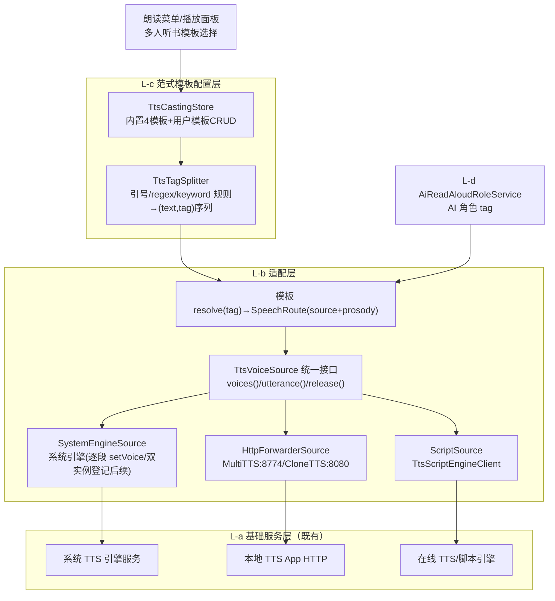
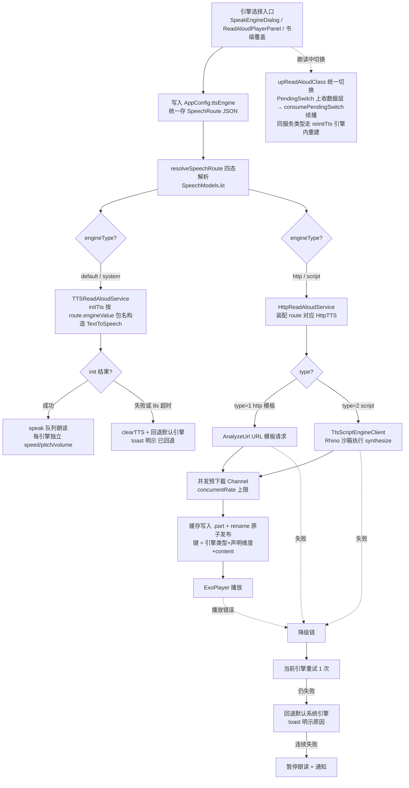
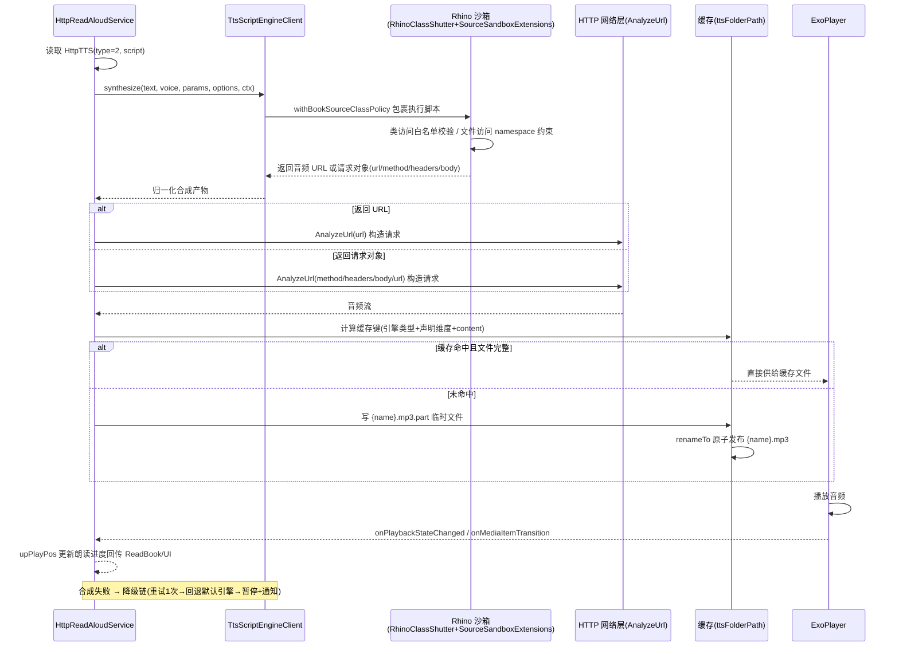

# design.md — TTS 朗读引擎统一优化（定稿 v1.3）

> 版本：v1.3（定稿）｜ 更新时间：2026-09-08 ｜ 输入：`temp/tts-design-brief.md`（设计简报，含根因证据）+ NG 参考源码（项目根相对路径 `temp/forks-analysis/legado-ng/`，temp/ 不入库）+ 本仓源码核实
>
> 目标：修复"朗读引擎切换完全不生效"Bug；统一引擎路由架构；新增脚本引擎协议（带沙箱）；内置 MultiTTS/CloneTTS/在线服务引擎模板库；落地多角色分层与选角模板层；规避 NG/C 版已知缺点（无 DROP 迁移、无硬编码代理端点、脚本强制沙箱、不做上帝文件）。

---

## 0. 阅读指南（实施 AI 必读）

**阅读顺序**：本文 → 同目录 `spec.md` 对应 R 条款（R4/R8/R9/R10/R11 等验收锚点）→ 同目录 `tasks.md` 对应任务。实施时逐条对照本文契约与行号证据，不得凭经验臆测。

### 0.1 术语表（全文统一用词，禁止混用）

| 术语 | 定义 |
|------|------|
| SpeechRoute | 引擎选择唯一协议的结构化路由模型（engineType/engineValue/参数字段），所有读方统一经解析函数取路由（见 3.1） |
| resolveSpeechRoute | `SpeechModels.kt` 新增的纯字符串同步 fast-path 路由解析函数（四态判定，不查库）（见 3.1） |
| 引擎模板 | 存于 httpTTS 表、`type=2` 的 JS 脚本模板（引擎模板[type=2 JS]，内含 options()/voices()/synthesize() 三函数），由 TtsScriptEngineClient 沙箱执行；内置 4 个：multitts_forwarder.js / clonetts.js / openai_compat.js / edge_proxy_template.js（见 3.4） |
| 选角模板（casting 模板） | `TtsCastingTemplate` 范式模板：rules 按 tag 分段文本并映射声源+韵律，存于 ttsCastingTemplates 表；内置 4 个（见 3.5） |
| 范式模板配置层 | AD-09 四层架构的 L-c 层，承载物即选角模板（声明式 JSON+幂等导入导出） |
| tag 分段五元组 | 选角模板分段产物契约 `(text, tag, paragraphIndex, offsetInParagraph, length)`：段落单元不变、tag 段为段内 sub-utterance（见 3.5.2②） |
| 同通道约束 | 选角模板 rules 内全部声源 `engineType` 必须一致（同一通道），跨通道组合拒绝保存/导入并明示（见 3.5.6①） |
| TtsVoiceSource | 适配层统一声源接口（voices()/utterance()/release()），三类实现：SystemEngineSource / HttpForwarderSource / ScriptSource（见 3.5.3） |
| UtteranceResult | 声源产物 sealed：`SpeakSubmitted`（系统引擎 speak 提交）/ `AudioFile` / `AudioStream`（HTTP 类合成产物）（见 3.5.3） |
| PendingSwitch | 续播意图记录（wasPlaying/pageIndex/startPos）上收数据层（`ReadAloud` 静态记录，`consumePendingSwitch()` 消费）（见 3.2） |
| reInitTts | 同服务类型切换时不下发 STOP、改发的引擎内重建 IntentAction（见 3.2） |
| 降级链 | AD-08 三段式：当前引擎重试 1 次 → 回退默认引擎+toast 明示 → 连续失败暂停朗读+通知 |

### 0.2 数字速查卡

| 数字 | 含义 |
|------|------|
| 8s | init 超时看门狗（AD-03）；voices() 拉取超时取同级时长 |
| 10s | 脚本三函数 `withTimeout(10s)` 硬超时（AD-04，Rhino 协作式取消之外的最后防线） |
| 8774 : 8080 | MultiTTS `localhost:8774 /forward`；CloneTTS `127.0.0.1:8080 /api/tts`（用户本地 App 端口，功能预期，非硬编码第三方端点） |
| v109→110 | 数据库迁移一档：httpTTS 增列 + ttsCastingTemplates 同版建表（AD-04 / 3.5.1） |
| 同通道约束 | 选角模板跨通道组合拒绝保存/导入（3.5.6①） |
| 期1 / 期2 | 多角色拆期：期1=选角模板层+单实例逐段 setVoice（验收口径=零 AI 零 httpTTS 双声可听感）；期2=HTTP/script 按段换源+书级覆盖+AI 链接入+双实例（3.5.6②） |

---

## 1. 背景与根因

### 1.1 Bug 根因：写读分裂（"朗读引擎切换完全不生效"）

- **写读分裂是本 Bug 的直接根因**：`SpeakEngineDialog.selectRoute`（`ui/book/read/config/SpeakEngineDialog.kt:171-187`）写入 `AppConfig.ttsEngine = SpeechRoute.toJson()`（新格式 JSON），而 `TTSReadAloudService.initTts`（`service/TTSReadAloudService.kt:50-61`）仍按 `GSON.fromJsonObject<SelectItem<String>>(ReadAloud.ttsEngine).getOrNull()?.value` 解析——SpeechRoute JSON 中没有 `value` 字段，`.value` 恒为 null，最终 `TextToSpeech(this, this)`（L56）永远落到系统默认引擎。
- **HTTP 路由坏死**：`ReadAloud.getReadAloudClass`（`model/ReadAloud.kt:29-41`）用 `StringUtils.isNumeric(ttsEngine)`（L34）判断是否为 httpTTS id，SpeechRoute JSON 恒为非数字 → `HttpReadAloudService` 永不生效。
- **附带债务**：`ReadAloud.kt:35` 在 `runBlocking(IO)` 中主线程查库；`ReadAloud.httpTTS`（L27）可变单例残留旧值；`SpeechModels.kt:98-141` 的 `fromTtsEngineValue` 已存在 legacy 三态兼容语义但无人统一调用。

### 1.2 三版本对比结论

- **本仓缺口**：无脚本引擎能力（httpTTS 仅支持 URL 模板合成）；无内置模板（`SpeakEngineViewModel.importDefault`（SpeakEngineViewModel.kt:17-21）仅支持 `DefaultData.importDefaultHttpTTS()`）；多角色硬门槛=必须配 AI 模型（AiReadAloudRoleService.kt:420-421），`routeForCue` 服务侧零消费、`setVoice`/`getVoices` 零使用。
- **NG/C 共同缺点（本设计硬性规避四项）**：DROP TABLE 迁移丢用户数据、硬编码第三方代理端点且默认启用、脚本无沙箱声明、上帝文件（NG 1971 行 / C 75KB Service）。规避落点：ALTER 增列+同版建表（AD-04）、内置引擎模板端点留空+默认停用（AD-06）、脚本强制沙箱（3.3）、casting 包四类分职责+单文件超 500 行须拆（3.5）。逐条吸收/更优解矩阵见 §5 对标治理。
- **多角色真相（AD-09 Context 浓缩）**：NG/C 分镜说话人归因 100% LLM、AI 未配=整段单声兜底；无内置选角模板；角色声源硬性限 SCRIPT 引擎；tts-server-android 已验证"范式模板层"成熟形态。本设计以"内置选角模板默认启用+零 AI 双声"为核心架构超越（详见 3.5 与 AD-09）。

---

## 2. 总体架构（四层模型，AD-09）

手机端 TTS 服务=基础服务层，本软件提供**适配层**，适配层之上构建**范式模板配置层**，AI 多角色既有链经同一适配层消费：



四层职责一句话：

- **L-a 基础服务层**（既有，零改动）：系统 TTS 引擎（引擎级/音色级 API21+，串行）｜本地 TTS App HTTP（MultiTTS :8774 provider+音色级 / CloneTTS :8080 voice UUID 级）｜在线引擎（httpTTS/script）；所有通道本质串行，多角色=句级轮换。
- **L-b 适配层**（本期 AD-04/05/06 交付+统一接口）：三类声源统一抽象 `TtsVoiceSource`——引擎级（系统）/ provider 音色级（MultiTTS）/ HTTP 参数级（CloneTTS），统一"音色枚举+按句换声"。
- **L-c 范式模板配置层**（本期新增核心）：选角模板声明式 JSON——内置选角模板默认启用（类比高亮规则体系）+自定义扩展+JSON 导入导出分享。
- **L-d AI 多角色**（既有 L2 链，本期修复消费）：AI 分镜产出角色 tag 经同一选角模板层消费，未命中走兜底链。

---

## 3. 子系统实现设计

### 3.1 引擎路由单源化

**目标**

`SpeechRoute` 成为引擎选择唯一协议：所有读方（`ReadAloud` / `TTSReadAloudService` / 书级覆盖）统一经同一个解析函数拿到结构化路由，不再各自猜测原始字符串格式。根因证据见 §1.1。

**实现要点**

1. `help/readaloud/speech/SpeechModels.kt` 新增 `resolveSpeechRoute(raw: String?): SpeechRoute`，**纯字符串同步 fast-path 解析，不查库**（类分派只需格式识别，无任何 DB 访问），四态判定：
   - **① 新格式 SpeechRoute JSON**：JSON 含 `engineType` 等特征键 → `SpeechRoute.fromJson(raw)` 直读 `engineType`/`engineValue`；
   - **② 双嵌套 legacy（存量用户）**：SpeechRoute JSON 且 `engineType=system` 且 `engineValue` 本身为 JSON（旧"SelectItem 嵌套进 engineValue"补丁产物）→ 解包内层 SelectItem 的 value 作包名；
   - **③ legacy SelectItem JSON**：含 `title`/`value` 键 → 取 `optString("value")` 作包名（**禁止照抄 `fromTtsEngineValue`（SpeechModels.kt:126-131）现状行为——其把整段 raw JSON 当 engineValue，是遗留地雷而非兼容目标**）；
   - **④ 纯数字**：映射为 `engineType=http`、`engineValue=<id>`（兼容存量 httpTTS 选择数据，不丢用户配置）；空白 → `engineType=default`（系统默认引擎）；
   - 解析失败兜底：坏 JSON（解析抛错）/ 合法 JSON 但 `engineType` 未知 → 回退 `default` 路由并按 AD-08 明示"引擎配置无效已回退"，禁止静默失效。
   `fromTtsEngineValue` 保留为 `@Deprecated` legacy 读兼容（其另两处消费方 `ReadAloudConfigDialog.kt:229`/`SpeechRouteSanitizer` 波及盘点见 AD-05），legacy 判定逻辑不重复实现。
2. `ReadAloud.kt` 改造（**全同步，类签名与调用方零变更**）：
   - `getReadAloudClass()`（L29-41）改为按 `resolveSpeechRoute(ttsEngine).engineType` 分派：`system|default` → `TTSReadAloudService`；`http`（及 `script`，同走 http 服务）→ `HttpReadAloudService`。分派为纯字符串判断不查库，**14 处同步 `aloudClass` 消费点（ReadAloud.kt:54/95/111/128/137/150/160/168/176/189/197/205/213/223）与 4 个调用方（MediaButtonReceiver.kt:109、ReadBookActivity.kt:4176、ReadAloudPlayerPanel.kt:1052、SourceLoginJsExtensions.kt:96）零改动**。修复 HTTP 路由 Bug。
   - 去 `runBlocking(IO)`（L35）的方式是**消除查库需求本身**：`httpTTS` 记录改由 `HttpReadAloudService` 内部按 `route.engineValue` 查库装配（现 `HttpReadAloudService.kt:155/239/447` 三处消费点改为服务内装配；记录缺失时明示报错，不静默回退），同步消解 `runBlocking` 与 `httpTTS` 可变单例残留两个问题。
   - `httpTTS` 单例副作用收敛：`ReadAloud.httpTTS` 可变字段取消跨组件共享，服务启动装配时在服务内部持有，避免残留旧引擎数据（现 `md5SpeakFileName` 的缓存键直接依赖它，见 `service/HttpReadAloudService.kt:447`）。
3. `SpeechVoiceCatalogRepository.systemGroups`（`help/readaloud/speech/SpeechVoiceCatalogRepository.kt:119-149`）删除"SelectItem JSON 嵌套进 engineValue"补丁（**两处**：L131 `GSON.toJson(SelectItem(title, value))` 引擎条目 + L165 `GSON.toJson(SelectItem("系统默认", ""))` 默认条目），改产出结构化 `SpeechRoute`（`engineType=system`、`engineValue=包名`）；`fromTtsEngineValue` 仅保留 legacy 读兼容，新数据不再产生 legacy 格式。**第三处 legacy 生产点** `SpeechVoiceGroupRepository.kt:177`（`SelectItem("系统默认","")`）一并纳入结构化改造（分组 key 存量条目等价性见 AD-05）。

### 3.2 系统 TTS 引擎服务（init / 超时 / 降级 / 切换语义）

**现状**

- `TTSReadAloudService.initTts`（`service/TTSReadAloudService.kt:50-61`）按 SelectItem 解析取包名（根因点，见 §1.1）；`onInit` 失败仅 toast（L80-82），无超时看门狗——第三方引擎 init 僵死时表现为"静默失效"（archive 原版同病）。
- `clearTTS`+`initTts` 已有 `@Synchronized` 重建链（L63-71、speak ERROR 自愈 L119-124），保留。
- 语速全局单值：`upSpeechRate`（L168-178）只读 `AppConfig.ttsFlowSys` / `AppConfig.ttsSpeechRate`，无每引擎独立参数。
- 切换语义分裂：`SpeakEngineDialog.notifyReadAloudEngineChanged`（`SpeakEngineDialog.kt:223-234`）只调 `ReadAloud.refreshReadAloudClass()`（`ReadAloud.kt:82-85`）重算 aloudClass，不 stop 服务；服务仅在 `onCreate` 执行 `initTts`（TTSReadAloudService.kt:36-43）→ 朗读中切换必然不生效。播放面板已有正确机制：`ReadAloudPlayerPanel.kt:476-498` 的 `pendingTtsEngineSwitch` 在收到 STOP 事件后自动续播（记录 wasPlaying/pageIndex/startPos）。

**目标**

initTts 按 `resolveSpeechRoute` 的 `engineValue`（引擎包名）构造 `TextToSpeech`；init 全程有超时兜底与明示降级；每引擎独立语速/音调/音量；所有切换入口语义统一，续播意图**上收数据层**：朗读中切换 = 先重算（同步）→ stop → 重启/引擎内重建 → 自动续播；未运行时切换 = 仅重算。

**实现要点**

*init 与降级*：

1. `initTts` 改为：`val route = SpeechRoute.resolveSpeechRoute(ReadAloud.ttsEngine)`；`route.engineType in (system, default)` 时按 `engineValue`（包名，空白=默认引擎）构造 `TextToSpeech(this, this, engine)` / `TextToSpeech(this, this)`。
2. **init 超时看门狗**：主线程 `Handler` 起约 8s 定时，`onInit` 到达后撤销；超时未回调 → `clearTTS()` → 回退默认引擎重建 + toast 明示"引擎 X 初始化失败已回退默认"（回调竞态用主线程 Handler 收敛，`onInit` / 看门狗 / `clearTTS` 均在主线程判定 `textToSpeech` 实例一致性后再动作）。
3. `onInit` 失败（L80-82）同样走"回退默认引擎 + toast 明示"，禁止静默失效。
4. `@Synchronized clearTTS()+initTts()` 重建链保留（供 speak ERROR 自愈与引擎内重建复用，AD-02）。
5. **每引擎独立参数**：`upSpeechRate`（L168-178）扩展为按 route 维度读取独立参数（语速/音调/音量），参数存储沿用 `AppConfig` PreferKey 机制（如 `ttsSpeechRate` 扩展 route 级键或新增 `PreferKey`，见 7.File Changes 中 AppConfig 行），应用顺序：`setSpeechRate` / `setPitch` / 音量经引擎能力或播放链处理；`AppConfig.ttsFlowSys` 跟随系统语义保留。

*切换单一语义*：

6. **续播意图上收数据层**：`ReadAloud.upReadAloudClass()`（L43-46）作为唯一"切换语义"入口，在 `BaseReadAloudService.isRun` 为真时捕获 `PendingSwitch(wasPlaying=isPlay(), pageIndex, startPos)` 存入 `ReadAloud` 静态记录；播放面板 `onAloudState` 的 STOP 分支改从 `ReadAloud.consumePendingSwitch()` 取续播意图（**替换面板本地字段 `switchingTtsEngine`/`pendingTtsEngineSwitch`**，ReadAloudPlayerPanel.kt:384-385/482-498/1041-1051）。设置界面（`SpeakEngineDialog.notifyReadAloudEngineChanged`，L223-234）改为服务运行中走 `upReadAloudClass()` 后**零额外改动即获续播**，且天然覆盖所有切换入口（含后续新增入口）。`refreshReadAloudClass()`（L82-85）收敛为仅"未运行时重算"。
7. **分支定义**：
   - 新旧路由同为 `TTSReadAloudService` 且服务运行中 → **不下发 STOP**，改发新增 `reInitTts` IntentAction（参照 `upTtsSpeechRate` 先例 ReadAloud.kt:203-209 / BaseReadAloudService.kt:244），服务内 `@Synchronized clearTTS()+initTts()` 引擎内重建；
   - 跨类型（system ↔ http/script）→ stop → 重算（同步解析已无耗时）→ 重启。
8. **竞态对策**：`upReadAloudClass` **先重算（同步）后 stop**——消除"STOP 事件触发面板 play 读旧 aloudClass"的竞态窗口（STOP 后续播读到的一定是新路由）。**stop 旧类引用陷阱**：stop 必须使用**重算前捕获的旧 aloudClass 局部引用**发 Intent（重算后 `ReadAloud.aloudClass` 字段已变，再用字段取值会把 stop/reInitTts 发给新类）。

### 3.3 脚本引擎协议（TtsScriptEngineClient）

**现状**

- 本仓无脚本引擎能力（见 §1.2）；httpTTS 仅支持 URL 模板合成（`service/HttpReadAloudService.kt` 合成链）。
- NG 参考实现：`temp/forks-analysis/legado-ng/app/src/main/java/io/legado/app/help/tts/TtsScriptEngineClient.kt`（object，options LRU 缓存 L27-37、`callOptionsFunction` 拼接脚本调用 L94-119、`synthesize` 调用 L248-256、返回 url 校验 L503）。
- NG/C 版脚本均无沙箱声明（简报 §2.2 缺点），本仓 P0 已落地书源脚本沙箱基建，必须复用。

**目标**

`HttpTTS` 实体扩展 `type=2` 标识脚本引擎；`HttpReadAloudService` 识别后走新增的 `TtsScriptEngineClient` 执行 JS 合成；强制沙箱；合成产物（URL 或请求对象）映射回现有 `AnalyzeUrl` 请求链，复用全部预下载/缓存/ExoPlayer 基建。

**实现要点**

1. **协议契约**（**本项目自定义契约，借鉴 NG 概念，NG 无 `@capabilities` 字面量**，文档/注释不得声称"对齐 NG 字段"）：
   - 脚本头注：`@name` / `@schema` / `@capabilities` / `@defaultSpeed`（`@capabilities` 声明支持维度，未声明维度不进缓存键，见 3.6）；`voices()` 兼容多参调用（无参/带 ctx 均可）；
   - 三函数：`options()` 返回参数定义数组；`voices()` 返回音色目录；`synthesize(text, voice, params, options, ctx)` 返回音频 URL 或 HTTP 请求对象。本期仅支持 HTTP 轮询型；SSE/WS 流式登记后续增强，不阻塞本期（type=2 接入点收口见实现要点 4）。
2. **实体扩展**：`data/entities/HttpTTS.kt` 新增 `type: Int = 1`（1=http 模板默认，2=script）、`script: String = ""` 两列（ALTER TABLE 增列安全迁移，见 AD-04；已核实 `AppDatabase.kt:126` 当前 `version = 109`，且全库无 `@DatabaseView` 引用 httpTTS，增列无视图连锁风险）。**候选过滤（消费侧强制）**：以 `httpTTSDao.all` 为候选池的消费点——AI 聊天语音（AiChatSpeechPlayer.kt:346-347）、多角色朗读（AiReadAloudRoleService.kt:2507/2876）、SpeechVoiceAssigner（SpeechModels.kt:272-273）——统一过滤 `type==1`，type=2 脚本引擎不进入 AI 语音/多角色候选（本期过滤，type=2 支持登记后续）。
3. **客户端**：新增 `help/readaloud/script/TtsScriptEngineClient.kt`（object，参照 NG 结构但按本仓惯例改造：`Coroutine.async` / `kotlin.runCatching` / `NoStackTraceException` / `AppLog.put`）：
   - Rhino 执行 `options()`/`voices()`/`synthesize()`（拼接 IIFE 调用、JSON 序列化返回，参照 NG TtsScriptEngineClient.kt:94-119）；**三函数执行统一包 `withTimeout(10s)`**——Rhino 指令观察器仅协作式取消（RhinoScriptEngine.kt:327,340-344），防不住 `while(true)` 死循环，10s 硬超时为最后防线；**体积限额**：synthesized URL≤8KB、请求体≤256KB、脚本源码≤512KB、voices 目录超限截断并明示；
   - **Rhino 作用域装配（攻击面收敛）**：不向脚本暴露 HttpTTS 对象（复核 `App.kt:465` `RhinoWrapFactory.register(HttpTTS)` 包装面是否收窄），脚本作用域仅获脱敏 `sourceLabel` 与白名单 JsExtensions 面；实施时在 TtsScriptEngineClient 头注维护"暴露面清单"（可访问对象/函数/常量逐项列明）；
   - **沙箱接入（强制）**——已核实本仓真实沙箱组件（`SourceSandboxExtensions` 文件沙箱）：
     - 类访问白名单：`com.script.rhino.RhinoClassShutter`（`modules/rhino/src/main/java/com/script/rhino/RhinoClassShutter.kt`，`classAccessObserver` L70、`withBookSourceClassPolicy(enabled, sourceLabel, block)` L80，L249-254 为 observer 拦截/放行回调点）；
     - **关键启用条件（已核实，勿踩坑）**：`BaseSource.withBookSourceClassPolicy { }`（`help/source/BaseSourceExtensions.kt:23`）内部为 `enabled = this is BookSource`——HttpTTS 只实现 `BaseSource`（HttpTTS.kt:39）而非 BookSource，直接复用该包装对 HttpTTS **不会启用**类策略。TtsScriptEngineClient 必须显式调用底层入口 `RhinoClassShutter.withBookSourceClassPolicy(enabled = true, sourceLabel = <脱敏 ns 短码>) { ... }`（sourceLabel 复用 `SourceSandboxExtensions.nsShortLabel` 脱敏），或经获准后扩展 BaseSourceExtensions 为 HttpTTS 场景增加启用分支；二选一在实施时定，验收以 R4"沙箱拦截"用例通过为准；
     - 文件访问沙箱：`SourceSandboxExtensions`（`help/source/SourceSandboxExtensions.kt:17` 起，internal object，`AppConfig.bookSourceFileSandbox` 开关 + `resolveBookSourceFile`/`requireContainedTree` 目录约束）与 `BookSourceStorageScope`（`help/source/BookSourceStorageScope.kt:12`，internal object，namespace 隔离），脚本文件读写一律经此收敛（两者为 app 模块 internal，TtsScriptEngineClient 位于同模块 `help/readaloud/script/` 可访问）。
   - `voices()` 结果写 `HttpTTS.speakersJson` 缓存（HttpTTS.kt:34 既有字段），复用 `SpeechVoiceCatalogParser.parseSpeakerGroups`（SpeechModels.kt:167）现音色目录机制，UI 零新增。**拉取时机与并发约束**：voices() 在引擎导入/选中后异步拉取（独立协程），与合成链互不阻塞（合成不等待目录）；拉取失败沿用 speakersJson 旧缓存并明示"未获取到音色"；拉取加超时（复用 Coroutine.timeout 惯例，约 8s 与 init 看门狗同级）；大目录（数百音色，如 238 音色集束）全量 JSON 存 speakersJson 字段（数十 KB 量级，DB 字段可承载），不做内存常驻大缓存。
4. **合成链接入点**：`HttpReadAloudService` 在获取合成请求处按 `httpTts.type == 2` 分流，**type=2 接入点统一收口在 `getSpeakStream`**（流式 `downloadAndPlayAudiosStream` 与非流式 `downloadAndPlayAudios` 两路径共用，HttpReadAloudService.kt:233-332；流式路径 loader 线程 runBlocking 内的脚本执行同样受 10s 超时保护）：`TtsScriptEngineClient.synthesize(...)` 产物 →
   - 返回 URL → 直接构造 `AnalyzeUrl(url)` 拉流；
   - 返回请求对象 → **仅承接 url/method/headers/body 四字段**（AnalyzeUrl.kt:244-298 原生支持）映射到现有 `AnalyzeUrl` 走统一请求链——method/headers/body 并非 AnalyzeUrl 构造参数，**注入机制**=序列化为 `url + "," + 选项JSON` 串（AnalyzeUrl.kt:276-292 的 URL 选项解析），headers 亦可经 headerMapF 承载，选项 JSON 走 GSONStrict 格式；NG 多出的 transport/audioExtract/responseType 等越界字段**拒绝导入并明示**（导入校验层拦截，不静默丢弃）；
   下游的并发预下载（`downloadAndPlayAudios` L149 / `preDownloadAudios` L207）、缓存（`md5SpeakFileName` L445）、ExoPlayer（L73）全部复用，不另起链路。

### 3.4 内置引擎模板库与导入

**现状**

- 本仓无内置引擎模板（见 §1.2）。
- 已核实的外部 TTS App 接口契约（简报 §2.3）：MultiTTS `localhost:8774 /forward`（speed/volume/pitch 为 MultiTTS 自身 0~100 参数域）+ `/voices` 目录；CloneTTS `127.0.0.1:8080 /api/tts`（speed 为 0.5~2.0 倍速语义）+ `/api/legado/all` 批量导出全部音色引擎集束。注意：本仓 speakSpeed 侧取值/换算与上述参数域不同域，映射关系见实现要点 1/2。

**目标**

新增 `app/src/main/assets/defaultData/tts/` 4 个引擎模板（type=2 JS 脚本）+ SpeakEngineDialog 导入入口，默认全部停用，无任何硬编码第三方端点。

**实现要点**

1. `multitts_forwarder.js`：type=2 脚本，`synthesize` 拼 `GET http://localhost:8774/forward?text=&voice=&speed=&volume=&pitch=`；**speed 参数域校准**：本仓 `speakSpeed = AppConfig.speechRatePlay + 5`（HttpReadAloudService.kt:93,357），**默认 10 非 5**；MultiTTS 0~100 参数域模板内按 `{{speakSpeed*5}}` 换算（默认 10 → speed 参数 50，假定 50=常态速度）。**真机校准判据：默认语速下 CloneTTS=1.0x / MultiTTS speed 参数=50**（tasks 3.5/3.6 以此为准）；`voices()` 解析 `/voices` 的 `{"data":{"catalog":{...}}}` 目录结构映射为音色组。
2. `clonetts.js`：type=2 脚本，`synthesize` 拼 `GET http://127.0.0.1:8080/api/tts?text=&voice=&speed=`；speed 换算 `{{speakSpeed/10.0}}` 并 clamp 到 [0.5, 2.0]（speakSpeed 域 5~50，默认 10 → 1.0 倍速；真机校准判据：默认语速下 CloneTTS=1.0x）；支持从 `/api/legado/all` 拉取批量导入。
3. `openai_compat.js`：OpenAI `/v1/audio/speech` 兼容 POST 请求体（model/voice/speed/response_format），端点/密钥由用户填写，覆盖主流在线服务自定义端点。
4. `edge_proxy_template.js`：Edge-TTS 代理模板，`@enabled false`、**端点留空由用户填**，不硬编码任何第三方 IP/域名（规避 NG/C 缺点）。
5. 导入入口：`SpeakEngineDialog` 新增"内置引擎模板"入口（逐个导入、启用需用户确认弹窗）；冲突策略借鉴 NG：`OVERWRITE`（按 id 覆盖）/ `KEEP_BOTH`（新 id 保留双份）。CloneTTS 一键导入：解析 `/api/legado/all` JSON 数组批量落 httpTTS 记录（走 `HttpTTS.fromJsonArray`，`data/entities/HttpTTS.kt:91-103`）。**模板加载机制**：参照 DefaultData + `assets/defaultData/httpTTS.json` 先例（help/DefaultData.kt:50-56,118-121），4 模板 JS 以 asset 目录枚举 + 头注解析呈现（模板名/说明/目标端点），导入时写入 httpTTS 表（type=2）。**参数/端点填写入口**：`HttpTtsEditDialog` 增补 script 编辑域（脚本内 CONFIG 区常量由用户编辑端点/密钥），edge 模板"端点留空"语义 = 用户编辑 script CONFIG 区；**本期不做 options() 参数化 UI（登记后续）**。
6. 引擎模板导入小弹窗（可选新增 `TtsTemplateImportDialog.kt`）：展示模板名/说明/目标端点，确认后写入。

### 3.5 多角色分层与选角模板层（AD-09 实现蓝图）

> 对应 AD-09 v1.2。本章给出四层的类设计、存储方案、数据流、集成点与 UI 形态，作为 tasks 2.11-2.13 的实施蓝图。四层架构总图（mermaid）见 §2。

#### 3.5.1 数据模型与存储

| 项 | 设计 |
|----|------|
| 实体 | `TtsCastingTemplate`（Room，`@Parcelize`，字段全默认值）：`id`(String,templateId 主键)、`name`、`builtin`(Boolean)、`enabled`(Boolean)、`order`(Int)、`rulesJson`(String,规则数组序列化)、`fallbackSourceJson`(String)、`lastUpdateTime` |
| 规则模型（rulesJson 内） | `[{tag:"narration"\|"dialogue"\|"<角色名>", match:{type:"builtin_quote"\|"regex"\|"keyword", pattern:String?}, sourceJson:String(SpeechRoute), prosody:{rate:Float,pitch:Float,volume:Float}（volume 0=跟随全局）}]` |
| rulesJson 版本 | 增 `schemaVersion` 字段（导入/解析按版本分派，向前兼容升级锚点） |
| 规则容错 | 单条规则 `sourceJson` 解析失败=**仅该规则失效并明示**（该段路由落 fallbackSource/默认引擎），不整模板作废 |
| AI 角色 tag 约定 | AI 分镜角色 tag 统一 `ai:` 前缀；保留字 `narration`/`dialogue` 拒绝用户自定义占用（保存/导入校验拒绝并明示） |
| Dao | `TtsCastingTemplateDao`：`getEnabled()`、`all()`、`get(id)`、`insert`/`update`/`delete` |
| migration | **并入 v110 同版**（与 httpTTS 增列同一 migration）：`CREATE TABLE ttsCastingTemplates ...`，不另占版本号；database-migration-safety R2（runCatching+AppLog 包裹）适用 |
| 内置模板 | `assets/defaultData/tts/castingTemplates.json`，经 DefaultData 既有 assets 加载链导入（DefaultData.kt:50 先例），幂等键=templateId（builtin 记录不可被用户模板覆盖，导入冲突跳过+计数） |
| 备份 | `BackupController.kt`（已有 HighlightRule 导出先例）增 castingTemplates 导出/恢复，幂等同键覆盖 |

内置 4 选角模板定义（默认 enabled，除④外）：

| templateId | name | 规则 | 声源 |
|-----------|------|------|------|
| `builtin_dual_voice` | 旁白/对白双声 | builtin_quote（引号内=dialogue，外=narration） | narration=当前引擎默认音；dialogue=同引擎第二音色（getVoices 可用）或提示用户选择 |
| `builtin_male_female` | 男女对读 | builtin_quote + 对白内性别启发式（男/女关键词词库） | 双声源各配 |
| `builtin_multitts_passthrough` | MultiTTS 对话透传 | 不分段（整段单 tag） | 当前系统引擎（MultiTTS），App 内自行分角色 |
| `builtin_mono` | 单声（关闭多人） | 不分段 | 当前引擎 |

**source 哨兵与裁决序（唯一口径）**：

- **`engineType=current` 哨兵**：规则 `sourceJson` 支持 `engineType=current` 哨兵值，语义=绑定"当前生效路由"（书级引擎覆盖存在时解析为书级引擎，否则解析为全局 ttsEngine 路由）。内置模板 narration="当前引擎默认音"一律用此表达，**用户换引擎后自动跟随，禁钉死旧声源**。
- **唯一裁决序**：书级模板覆盖 > 全局模板；模板内 source（含 `current` 哨兵解析）> AD-02 书级引擎覆盖（书级引擎仅作 `current` 哨兵的解析目标与单声模板的引擎来源，不参与模板规则的逐段覆盖）。

#### 3.5.2 分段与播放消费数据流

1. **分段挂点**：`BaseReadAloudService.newReadAloud`（BaseReadAloudService.kt:260-303）构建 contentList 之后，若多人模式启用→`TtsTagSplitter.split(content)` 按激活模板规则产出有序 `(text, tag)` 序列（段内再切，保持段落边界）；禁用或模板=单声→原 contentList 直通（零开销路径）。**正则语义**：规则按数组顺序**首命中生效**（order 优先级）；同段多规则命中区间互斥、先到先得；regex 规则 Pattern **构造时预编译校验**（非法正则导入即拒，防用户正则卡 IO 主链）；单测边界用例清单——中英文引号集（“”双引号/‘’单引号/「」直角引号）显式枚举、嵌套引号=外层优先、跨段未闭合=段内闭合。
2. **消费时序与分段契约**（系统声源，期1）：
   - ① **取消整章预入队**：多人模式启用时 speak 循环改为**逐段 onDone 驱动**（或 API21+ `speak(text, Bundle, utteranceId)` per-utterance params 携带 voice/prosody），`setVoice` 在 speak 调用时刻生效；
   - ② **分段契约**：Splitter 输出 `(text, tag, paragraphIndex, offsetInParagraph, length)` 五元组，服务侧**保持原 contentList 段落单元不变**，tag 段为段内 sub-utterance——readAloudNumber/onRangeStart/upTtsProgress/续播 substring 等进度算术按段元数据折算，段落级进度链零改动（**进度账为精确字符账，禁按比例折算**）；pause 静音项仅 paragraphIndex 变更时插入；**onStop 状态机**：UtteranceProgressListener 除 onDone/onError 外**必须覆写 onStop**——段中途 stop/seek/prev/next 时 onDone 不触发，onDone/onStop/onError 三路收同一"段游标原子推进闸"（游标推进前校验 utteranceId 与 generation，防旧段回调推进新游标）；
   - ③ **setVoice 支持判定**：**复用异步缓存快照预判（play 链不直连 getVoices——异步 API 直连会产生跨线程竞态）**，快照空集或不含目标音色→直接降级 + 运行期 onError 兜底（二次防线；不依赖非客户端可观察 API 作判定依据）；
   - ④ **双实例降级登记后续**：本期单实例逐段 setVoice 已覆盖内置模板主场景；跨引擎双实例（含 reInitTts 双份 clearTTS/游标重置）登记后续；
   - ⑤ **零第二声源终态明示**：仅默认引擎单音色时 dialogue=旁白同音（实际单声）+ 首次 toast 明示；"提示用户选择"=可另选任意声源或放弃，不阻塞播放。
   - ⑥ **casting 状态三场景清理**：onDestroy / stopForBookSwitch / 看门狗触发三类终态路径，casting 游标/段表/声源缓存统一 reset（防复用残留段元数据跨章/跨书串扰）；
3. **HTTP 声源按段换源（如实评级：中改，约 3-4 天）**：MultiTTS/CloneTTS/script 类 source→`downloadAndPlayAudios`/`downloadAndPlayAudiosStream` 两路径**每段合成携带段级 HttpTTS/voice**（`getSpeakStream`/`createDataSourceFactory` 已按 httpTts 入参，改造可控）；`Channel<Downloader>` 天然兼容段级源、无需改架构；`md5SpeakFileName` 签名扩声源维度（R8 改造后含 voice）；**段级失败处理改逐段 try/catch + 回退 fallbackSource**（现失败一律 `pauseReadAloud`，需改暂停语义）；`preDownloadAudios(Stream)` 预下载需同套 splitter 切分。
4. **进度回传**：tag 段进度按段元数据（paragraphIndex/offsetInParagraph/length）**精确字符账**折算回原段落坐标，`ALOUD_STATE`/进度事件链零改动。
5. **切换×多人模式**：3.2 切换单一语义同样适用多人模式——服务重建后按激活模板重 resolve 全部段（`engineType=current` 哨兵跟随新引擎自动换声），PendingSwitch 段元数据折算续播位置；同引擎模板切换按 3.5.1 裁决序即时重 resolve。

#### 3.5.3 适配层接口（TtsVoiceSource）

```kotlin
interface TtsVoiceSource {
    suspend fun voices(): List<TtsVoiceRef>   // 音色枚举（引擎级实现可为空表→按引擎级降级）
    suspend fun utterance(text: String, voice: TtsVoiceRef?, prosody: Prosody): UtteranceResult
    fun release()
}

/** 产物 sealed：系统/HTTP 两类声源统一承接（两条消费路径映射见下表） */
sealed interface UtteranceResult {
    /** 系统引擎：内部 speak() 提交（utteranceId 标识），挂起等待 onDone/onError 完成信号 */
    data class SpeakSubmitted(val utteranceId: String, val completeSignal: UtteranceCompleteSignal) : UtteranceResult
    /** HTTP 合成产物：缓存文件 */
    data class AudioFile(val file: File) : UtteranceResult
    /** HTTP 合成产物：流式 DataSource 工厂 */
    data class AudioStream(val factory: DataSource.Factory) : UtteranceResult
}
```

`TtsVoiceRef(id/name/gender/来源)`（来源=引擎级/provider 音色级/HTTP 参数级）；`Prosody` 增 volume：`Prosody(rate, pitch, volume)`（与 AD-07 缓存键 voice+speed+volume+pitch 四维对齐）。

**两消费路径映射表**：

| 实现 | UtteranceResult | 消费路径 |
|------|----------------|---------|
| `SystemEngineSource`（包裹 TextToSpeech 实例，setVoice/setPitch/setSpeechRate） | `SpeakSubmitted` | TTSReadAloudService speak 循环（多人模式逐段 onDone 驱动，见 3.5.2②） |
| `HttpForwarderSource`（MultiTTS/CloneTTS HTTP，复用 AnalyzeUrl 模板渲染与缓存）/ `ScriptSource`（委托 TtsScriptEngineClient.synthesize） | `AudioFile` / `AudioStream` | ExoPlayer 播放链（HttpReadAloudService 既有合成链，按段换源见 3.5.2③） |
| （参数映射） | — | prosody（rate/pitch/volume）→ 系统声源映射 setSpeechRate/setPitch/音量链；HTTP 声源映射 synth 的 params/options（MultiTTS/CloneTTS 参数域换算见 3.4），volume 0=跟随全局的维度不下发 |

`sourceJson` 即 SpeechRoute 结构化承载（engineValue+voice+prosody），与既有 SpeechRoute 消费链互转。

#### 3.5.4 UI 设计

| 界面 | 形态 | 交互 |
|------|------|------|
| 入口 | 朗读菜单"多人听书"项 → 模板选择列表 | **与高亮规则选择同构**（列表+单选激活+管理入口）；播放面板场景模式闸位（DisplayMode.Scene）联动显示当前模板名 |
| 模板管理页 | 新页（GlassTopAppBar+列表骨架 S2）：内置模板只读卡片+用户模板卡片 | 内置：查看/复制为自定义；自定义：编辑/删除/导入导出 |
| 模板编辑 | 表单：名称+规则行列表（每行=tag 选择[旁白/对白/角色名]+match 类型[引号/正则/关键词]+表达式）+每 tag 声源选择（复用 SpeechVoiceRoutePicker）+韵律滑条+fallbackSource | 保存即时生效；未保存拦截沿用既有编辑页组件族 |
| 导入导出 | JSON 文件/剪贴板；幂等键 templateId；builtin 冲突跳过+计数明示 | 对齐 tts-server 用户分享习惯 |

#### 3.5.5 集成点与边界汇总

| 集成点 | 处理 |
|--------|------|
| SpeechRouteSanitizer | 扩展扫描模板 rulesJson/fallbackSourceJson 引用的 httpTTS 记录，记录删除时置空该规则 source 并明示（复用既有清理链） |
| 缓存键 | HTTP 声源按段合成走 R8 扩展键（含 voice/prosody 声明维度），无新增键逻辑 |
| 降级 | 声源失败→段级回退 fallbackSource→默认引擎→暂停通知（AD-08 链原样复用）；**降级熔断**：失败计数按"声源+章"聚合，连续 3 段失败→熔断该声源至章末/引擎切换（后续段直接走 fallbackSource，不再重试原声源），fallbackSource 生效窗口=熔断期内；音色枚举不全（国产引擎）→引擎级降级+首次明示 |
| 性能 | 系统引擎串行=句级轮换间隙（Tradeoff 已声明）；HTTP 声源无此问题；内置单声模板=零开销直通 |
| resolve 优先级 | **六级 resolve 链（全文唯一口径，3.7 同引）：BookCharacter 显式绑定（BookCharacter.speechRouteJson）> cast_role（每书角色绑定）> 选角模板规则 > 性别兜底 > narrator（旁白）> 默认**；AI 分镜缓存仅存 tag 不存 route（边界声明，route 一律 resolve 时现算）；模板层仅作用书内朗读，AI 聊天语音（AiChatSpeechPlayer）不受影响；MediaSession 元数据保持章级不变（一句话登记） |

#### 3.5.6 本期边界与拆期

1. **同通道约束**：模板保存/导入时校验 rules 内全部 `source.engineType` 一致（同一通道），跨通道组合**拒绝保存/导入并明示**。**同通道本质披露**：约束的本质=同一消费路径（HTTP 播放链），script 与 http 同属该链；未来解除 type==1 过滤时**按消费路径而非 engineType 判通道**；跨通道混排（如系统声源经 `synthesizeToFile` 落文件统一走 HTTP 播放链）登记后续（5.2-B"最大架构超越"行以此为限定）。
2. **拆期**：
   - **期1**：2.11 模板层（模型/内置选角模板/分段规则）+ 单实例逐段 setVoice（3.5.2②）+ 播放面板多人听书入口（tasks 2.13 期1 部分）；内置选角模板先上 `builtin_dual_voice`/`builtin_mono`；**期1 验收口径=零 AI 零 httpTTS 双声可听感**。
   - **期2**：HTTP/script 声源按段换源（3.5.2③）+ 书级选角模板覆盖 + AI 链接入（L-d 消费修复）+ 双实例（如做）。
3. **HttpReadAloudService 按段换源如实评级为中改（约 3-4 天）**，非"复用零改动"（改造面详见 3.5.2③）。

### 3.6 并发与缓存键

**现状**

- 缓存键 `md5SpeakFileName`（`service/HttpReadAloudService.kt:445-448`）= 章标题 md5 + `url-|-speechRate-|-content`——只含 URL 与语速，缺 voice/pitch/volume/引擎类型维度：同引擎不同音色、不同引擎同 URL 之间存在串音/串参数风险。
- 缓存写 `createSpeakFile`（L494-504）直接 `outputStream` 写目标 `.mp3`，非原子，并发/中断可留下损坏文件被命中。
- 并发预下载已有 Channel 基建（L149/L207），`HttpTTS.concurrentRate`（HttpTTS.kt:23）已有每源并发声明能力。

**目标**

缓存键按"引擎类型+能力声明维度"扩展；缓存写原子化；脚本引擎默认并发上限。

**实现要点**

1. **缓存键扩展公式**：`md5(章节标题) + "_" + md5(引擎类型(engineType:engineValue) + "-|-" + voice + "-|-" + speed + "-|-" + volume + "-|-" + pitch + "-|-" + content)`；其中 voice/speed/volume/pitch 各维度**仅当引擎 `@capabilities` 声明该维度时才拼入**（未声明维度不进缓存键，防止能力协商污染；http 模板型引擎按实际参与 URL 的参数视为已声明）。
2. **`.part` 原子写**：`createSpeakFile`（L494-504）改为写 `{name}.mp3.part` 临时文件，完整落盘后 `renameTo` 原子发布；命中缓存前校验目标文件存在且非损坏（保留 L486 `hasSpeakFile`）。
3. **引擎级并发上限**：沿用 `concurrentRate` 基建；脚本引擎（type=2）未声明时默认并发 2（避免第三方本地 App 过载），用户可在脚本 `options()` 中声明覆盖。
4. 保留现有 Channel 并发预下载结构不改架构（规避 NG 上帝文件问题，改动收敛在 HttpReadAloudService 内）。

**缓存/预合成子系统定型项**（对 NG/C 同名子系统逐文件深挖后提炼的"本期不定型、未来必返工"契约清单，未来补 C 式批量预合成/缓存管理零重构的前提；tasks 2.6/2.8/2.11/2.12 实施时逐条对照）：

1. 缓存 key 算法**纯函数化+KEY_VERSION 参与哈希**，收敛单一入口（反面教材：NG 把 chapterTitle/scenario 混进 key→换源即失配）；2. key 维度（engineKey/speedKey/voiceKey）与引擎实际生效参数**同源解析**（单点函数，播放端与未来批量端禁止各算一套）；3. **单元切分独立成纯函数**（排版+过滤→有序文本序列，不内联在播放 Service）；4. 目录结构定型：书目录/章节 stem（与正文缓存文件主名同源，禁用 title/bookUrl 原文）/单元 hash 文件名+按章删除钩子（BookHelp.delChapterCache 同步删 TTS 子目录）；5. 写缓存提交收敛为**单一原子函数**（temp+rename+has() 幂等），为未来租约门控（commitIfLeaseActive）留唯一插桩点；6. 合成函数签名**纯化且进度无关**（synthesize(book, chapter, text, engineParams)→File，不读 nowSpeak/播放状态）；7. `.part` 在途标记+清理 preserveInProgress 约定；8. key 全输入可枚举可持久化（禁含运行时句柄）——归档/跨设备迁移前提；9. 每引擎合成能力接口（cacheSynthesizer/audioCacheKey）与 engineKey 命名规则本期定型。

### 3.7 AI 分镜选角预留契约

**AI 分镜/选角子系统定型项**（对 NG/C 同名子系统逐文件深挖后提炼，未来接 NG/C 式 LLM 分镜零迁移的前提；tasks 2.11/2.12 实施时逐条对照）：

1. **roleType 枚举一套词汇**：narrator/dialogue_male/dialogue_female 本期使用+预留 character/cast_role/thought 扩展位，与 NG/C 绑定 TargetType 5 枚举同构，AI 输出/tag 分段/绑定表禁自造第二套；2. **分段产物接口对齐 StoryboardSegment 最小核**（type/paragraphIndex/start/end/speakerName），段落坐标系与朗读段落对齐、start/end 为段内偏移（AI 版=同结构追加字段不改骨架）；3. 分镜缓存 key=书+章+内容 MD5+**源标识（本期填 `template:<版本>` 占位未来 providerId/modelId）**+cacheVersion 字段，未来接 AI 只换源标识不迁移；4. 角色绑定复用 NG/C 实体同构（BookTtsCastRole/BookTtsVoiceBinding，PK workKey+targetType+targetId，bindingMode MANUAL 永不被自动覆盖+autoConfidence/证据签名列位本期可空预留）；5. 开关三层定型：全局 gate（播放入口最早短路）+每书 autoCreateRoles/autoAssignVoices 分离键（bookTtsAuto* 前缀）+引擎能力门控（不支持报错禁静默）；6. 路由契约顺序本期定型为六级 resolve 链（character→cast_role→选角模板规则→性别→narrator→默认，与 3.5.5 同一口径），模板段与 AI 段喂同一路由函数；7. NG 独有增强（Contribution 逐章证据表/三层 identity/expressive 缓存/场景音色覆盖/INHERIT 绑定/emotionStyleMapJson）登记后续不阻塞本期。

**缺口披露**（NG/C 已做、本期完全不做，防"以为有"）：临时角色收编闭环（黑名单/并归 mergeCastRoleIds/同章去重）、别名系统 identityLinks、pending 不选音规则、2 号 AI 选音全链（confidence≥0.7+候选校验）、LLM 输出严格校验体系（根键白名单/textLeakKeys 正文泄漏扫描/unitId 齐全性）、分块/二分重试、发音人 10s TTL 短缓存、NG 场景音色第三开关。

### 3.8 引擎管理预留契约

**引擎管理/播放器子系统定型项**（对 NG/C 同名子系统逐文件深挖后提炼，未来补完整管理页/播放器增强零迁移的前提）：

1. 引擎 JSON schema **双命名兼容**（@SerializedName snake/camel alternate）+ option_values/disabled_voice_ids/built_in/capabilities 字段本期进模板格式；2. **存储三分法不可破**：引擎定义=Pref JSON、音色目录=DB 实体、运行时参数+每音色参数=DB runtime 实体——播放参数禁写进引擎定义；3. id 冲突语义复用统一 Resolver（@uuid 即 id、KEEP_BOTH 副本 `{id}_{ms}`+重写 @uuid/@name、系统引擎禁覆盖、内置默认豁免），禁自写简化版；4. 每音色参数持久化键结构 `voiceParamsJson={"voiceId":{speed_ratio,volume_gain,pitch_ratio}}`+sortedMap+**neutral 删键="跟随引擎"语义**；5. 音色目录缓存契约（实体结构+replaceForEngine 全量替换+脚本/optionValues 变更即清缓存判定）；6. 试听接口签名（key(engine,voice,style)+debounce+token 防竞态+临时文件落盘）；7. @capabilities 门控字段透传（决定合成参数是否下发）。

**缺口披露**：内置引擎静默升级合并（NG @version+特征串判定）、首用角色默认绑定、系统引擎枚举集成、快照门防串页、音色禁用/批量启停、voiceCounts 聚合、maxConcurrency 门控 UI、`script:` 前缀兼容层。

---

## 4. 架构决策（AD-01~09）

### AD-01: 引擎路由单源化（SpeechRoute 唯一协议 + legacy 四态兼容）
- **Version**: v1.0
- **UpdateTime**: 2026-09-06
- **Context**: 引擎选择数据存在四种历史格式并存：新 SpeechRoute JSON（`SpeechModels.kt:58-71` toJson）、双嵌套 legacy（SpeechRoute JSON 且 `engineType=system` 且 `engineValue` 内嵌 SelectItem JSON，`SpeechVoiceCatalogRepository.kt:131` 旧补丁产出）、legacy SelectItem JSON（`SpeechVoiceGroupRepository.kt:177` 仍在产出）、纯数字 httpTTS id。读方各自猜测格式导致写读分裂：`TTSReadAloudService.initTts`（TTSReadAloudService.kt:53）按 SelectItem 解析 SpeechRoute JSON 恒得 null → 永远默认引擎；`ReadAloud.getReadAloudClass`（ReadAloud.kt:34）`isNumeric` 判定 SpeechRoute JSON 恒 false → HTTP 引擎永不生效。
- **Concern**: 多格式多读方各自解析，任一新格式落地时所有读方必须同步改造，漏改即静默失效（本 Bug 根因）。
- **Decision**: SpeechRoute 成为引擎选择唯一协议。`SpeechModels.kt` 新增 `resolveSpeechRoute(raw): SpeechRoute` **纯字符串同步 fast-path 解析（不查库）**，四态判定（① 新 JSON 直读 engineType/engineValue / ② 双嵌套解包内层 value / ③ SelectItem JSON 取 `optString("value")` 作包名 / ④ 纯数字映射 http id；空白→default）；所有读方（ReadAloud/TTSReadAloudService/书级覆盖）统一经它取路由；类分派同步完成，**14 处 aloudClass 同步消费点与 4 个调用方零改动**；httpTTS 记录由 `HttpReadAloudService` 服务内按 `route.engineValue` 查库装配；`SpeechVoiceCatalogRepository`/`SpeechVoiceGroupRepository` 新数据只产结构化 SpeechRoute。
- **Goal**: 修复切换不生效与 HTTP 引擎失效两个 Bug；后续新增引擎类型只需扩展 route 枚举与单点解析，读方零改动。
- **Tradeoff**: 保留 legacy 四态兼容分支使解析函数永久携带历史格式判断逻辑（约 40 行）；不做一次性数据迁移清洗（避免触碰用户配置风险），legacy 分支长期共存。
- **Status**: Accepted
- **Superseded-by**: 无
- **ChangeLog**: [2026-09-06 初版]

### AD-02: 切换即时生效语义（统一 upReadAloudClass）
- **Version**: v1.0
- **UpdateTime**: 2026-09-06
- **Context**: 现状切换入口语义分裂：`SpeakEngineDialog.notifyReadAloudEngineChanged`（SpeakEngineDialog.kt:223-234）只调 `refreshReadAloudClass`（ReadAloud.kt:82-85）重算不停服务；服务 initTts 仅在 onCreate 执行（TTSReadAloudService.kt:36-43）；播放面板已有正确的 `pendingTtsEngineSwitch` 续播机制（ReadAloudPlayerPanel.kt:476-498）。
- **Concern**: 朗读中切换引擎必然不生效（服务不重建不换引擎），用户感知为"功能坏了"。
- **Decision**: `upReadAloudClass()` 为唯一切换语义入口，**续播意图上收数据层**：服务运行中切换先捕获 `PendingSwitch(wasPlaying/pageIndex/startPos)` 存 `ReadAloud` 静态记录，播放面板 STOP 分支改从 `ReadAloud.consumePendingSwitch()` 取（替换面板本地 `switchingTtsEngine`/`pendingTtsEngineSwitch` 字段，设置界面零改动即获续播）；**分支定义**——新旧路由同为 TTSReadAloudService 且服务运行中不下发 STOP，改发新增 `reInitTts` IntentAction 服务内 `@Synchronized clearTTS()+initTts()` 引擎内重建，跨类型才 stop→重算→重启；**竞态对策**——先重算（同步）后 stop，消除"STOP 事件触发 play 读旧 aloudClass"窗口，且 stop 发 Intent 必须使用**重算前捕获的旧 aloudClass 局部引用**（重算后字段已变会发给新类，见 3.2 要点 8）；`refreshReadAloudClass` 收敛为仅未运行时使用。
- **Goal**: 任意入口切换引擎即时生效且续播无感；切换语义单一可推理。
- **Tradeoff**: 跨服务类型切换（system↔http）必须整服务重建，当前段落进度重置到段首（复用 PendingSwitch 记录 pageIndex/startPos 缓解，不做章内精确续播）；跨服务类型重建致定时关闭倒计时重置（BaseReadAloudService.kt:164-182 onCreate 重读定时配置）为已知行为。
- **Status**: Accepted
- **Superseded-by**: 无
- **ChangeLog**: [2026-09-06 初版]

### AD-03: TTS init 超时与降级明示
- **Version**: v1.0
- **UpdateTime**: 2026-09-06
- **Context**: `TTSReadAloudService.initTts`（TTSReadAloudService.kt:50-61）无超时保护，`onInit` 失败仅 toast（L80-82）后无任何回退动作。第三方系统 TTS 引擎 init 僵死时表现为永久静默失效（archive 原版同病，简报 §2.2）。
- **Concern**: init 僵死或失败时用户无感知、无恢复路径，误以为是应用损坏。
- **Decision**: initTts 增加主线程 Handler 超时看门狗（约 8s）；超时或 onInit 失败统一执行 clearTTS → 回退默认引擎重建 + toast 明示"引擎 X 初始化失败已回退默认"；onInit/看门狗/clearTTS 回调竞态用主线程 Handler 收敛。**补充约束**：① 终止条件——回退目标已是默认引擎时不再重建（防"回退→init 失败→再回退"死循环），直接暂停朗读 + 通知终态；② 看门狗 Handler 在 `onDestroy`/`stopSelf` 时 `removeCallbacks`，并以实例代际判定防护迟到回调与新实例误杀；③ 回退后的默认引擎初始化**单次不挂看门狗**（失败仅 toast + 停止朗读，不级联回退）。
- **Goal**: 引擎初始化永远有兜底结果；失败原因对用户明示。
- **Tradeoff**: 8s 看门狗对极慢引擎（低配机大模型 TTS）可能误杀触发回退（时长取保守值，回退后用户可再切回）；主线程 Handler 收敛放弃更细粒度的锁方案（复杂度不匹配收益）。
- **Status**: Accepted
- **Superseded-by**: 无
- **ChangeLog**: [2026-09-06 初版]

### AD-04: 脚本引擎协议与 HttpTTS 实体扩展（type+script 增列迁移）
- **Version**: v1.0
- **UpdateTime**: 2026-09-06
- **Context**: NG 版脚本引擎协议成熟（@name/@schema 头注 + options()/voices()/synthesize() 概念，本项目 @capabilities 为自定义扩展、NG 无该字面量，参考项目根相对路径 temp/forks-analysis/legado-ng/.../TtsScriptEngineClient.kt:94-119、248-256），但 NG 的 DB 迁移采用 DROP TABLE httpTTS 重建，丢用户存量数据（简报 §2.2 明确缺点）。本仓 `AppDatabase.kt:126` 当前 version=109，已核实全库无 `@DatabaseView` 引用 httpTTS，`data/entities/HttpTTS.kt` 为既有实体（HttpTTS.kt:15-39）。
- **Concern**: 需要承载脚本引擎（JS 源码 + 类型标识），又不能重蹈 NG DROP TABLE 丢数据覆辙。
- **Decision**: 扩展 HttpTTS 实体新增 `type: Int = 1`（1=http 模板，2=script）、`script: String = ""` 两列，ALTER TABLE 增列增量迁移（version 109→110），不 DROP 不重建；脚本契约为**本项目自定义契约**（借鉴 NG 概念，NG 无 @capabilities 字面量；头注 @name/@schema/@capabilities/@defaultSpeed + 三函数，本期仅 HTTP 轮询型）；新增 `help/readaloud/script/TtsScriptEngineClient.kt` 执行，路由复用 HttpReadAloudService 合成链。**执行与边界约束**：三函数执行统一包 `withTimeout(10s)`（Rhino 指令观察器仅协作式取消，防不住 `while(true)`）；体积限额 synthesized URL≤8KB/请求体≤256KB/脚本源码≤512KB/voices 目录超限截断并明示；synthesize 请求对象仅承接 url/method/headers/body 四字段（AnalyzeUrl.kt:244-298 原生支持），NG 多出的 transport/audioExtract/responseType 等越界字段拒绝导入并明示；type=2 接入点统一收口 `getSpeakStream`（流式/非流式两路径共用，HttpReadAloudService.kt:233-332）；以 `httpTTSDao.all` 为候选池的消费点（AI 聊天语音/多角色/SpeechVoiceAssigner）统一过滤 `type==1`。
- **Goal**: 脚本引擎能力落地且存量 httpTTS 数据零丢失；迁移覆盖安装可验证。
- **Tradeoff**: HttpTTS 实体字段语义混载（http 模板与脚本共用一张表，type 区分）——接受混载而不新建独立 scriptTTS 表：新表需数据搬迁与双 DAO 双 UI 适配，且迁移失败风险高于增列；另 SSE/WS 流式合成本期不支持（登记后续）。
- **安全边界与残余风险（如实声明）**：脚本仅能产出合成请求（URL/请求对象），HTTP 由宿主 `AnalyzeUrl` 统一发起；脚本本体经 `RhinoClassShutter` 类白名单无 Java 反射/类逃逸能力，文件访问经 `SourceSandboxExtensions`/`BookSourceStorageScope` 收敛。**Rhino 作用域装配（攻击面收敛）**：不向脚本暴露 HttpTTS 对象（复核 App.kt:465 `RhinoWrapFactory.register(HttpTTS)` 包装面），脚本仅获脱敏 sourceLabel 与白名单 JsExtensions 面，实施时输出暴露面清单。**残余风险**：脚本产出的合成 URL 可指向任意地址（含本机/内网端口，即本地服务探测），该能力与用户自配 type=1 httpTTS URL 模板同级，非脚本协议新增攻击面；缓解 = 模板默认停用 + 导入逐个确认（AD-06），不做合成 URL 白名单（登记可选增强）。本机端口语义说明：MultiTTS/CloneTTS 模板指向 localhost:8774/:8080 属功能预期，与恶意探测同通道但意图与来源可控（均为用户显式导入）。
- **Status**: Accepted
- **Superseded-by**: 无
- **ChangeLog**: [2026-09-06 初版]

### AD-05: 系统引擎增强（应用内直选 + 每引擎独立参数）
- **Version**: v1.0
- **UpdateTime**: 2026-09-06
- **Context**: C 版优点：PackageManager/TextToSpeech.engines 枚举系统引擎生成结构化条目 + `TextToSpeech(ctx, cb, enginePackage)` 直选（本仓 systemGroups 已枚举但产出 legacy 格式，SpeechVoiceCatalogRepository.kt:119-149）。本仓现状：语速全局单值（TTSReadAloudService.kt:168-178），`runBlocking(IO)` 主线程查库（ReadAloud.kt:35），sysEngines 死代码 lazy 构造临时 TextToSpeech（SpeakEngineViewModel.kt:10-15）。**legacy 格式生产/消费全景**：生产点共三处——SpeechVoiceCatalogRepository.kt:131（引擎条目）、:165（默认条目）、SpeechVoiceGroupRepository.kt:177（`SelectItem("系统默认","")`）；`fromTtsEngineValue` 另有 2 消费方 ReadAloudConfigDialog.kt:229 与 SpeechRouteSanitizer.kt（:60/71/118/121/130/134/140/161），legacy 语义变更需波及盘点。
- **Concern**: 系统引擎选择数据格式不结构化；参数全局共享无法按引擎区分；主线程阻塞与死代码并存。
- **Decision**: systemGroups 与 SpeechVoiceGroupRepository 三处生产点全部产出结构化 SpeechRoute（engineValue=包名，直选）；分组条目 key 含 engineValue（SpeechVoiceGroupRepository.kt:44/187/191），system engineValue 由 raw JSON 变包名后的**存量条目等价性**：升级后首次加载按新格式重建 key，旧分组条目失效重建，用户无感；`fromTtsEngineValue` 2 处消费方（ReadAloudConfigDialog/SpeechRouteSanitizer）按新语义适配；每引擎语速/音调/音量独立配置（PreferKey 机制扩展 route 级键，SpeechRoute 扩展参数字段承载，新键组登记 allPreferenceKeys 见 tasks 2.10）；`runBlocking` 消除（路由解析不查库，httpTTS 装配收敛 HttpReadAloudService 服务内，见 3.1）；删除 sysEngines 死代码。另：HttpTtsEditViewModel.kt:50 保存后的 `refreshReadAloudClass` 改为服务运行中走 `upReadAloudClass` 语义（与 AD-02 对齐）。
- **Goal**: 系统引擎应用内直选即生效；不同引擎参数互不干扰；消除主线程查库与死代码。
- **Tradeoff**: 每引擎独立参数引入 route 级 PreferKey 数量增长（每引擎 3 键）；不做参数导入导出（本期范围外）。
- **Status**: Accepted
- **Superseded-by**: 无
- **ChangeLog**: [2026-09-06 初版]

### AD-06: 内置引擎模板库（默认停用 + 无硬编码端点）
- **Version**: v1.0
- **UpdateTime**: 2026-09-06
- **Context**: MultiTTS/CloneTTS 均提供本地 HTTP 转发接口（简报 §2.3 已核实：MultiTTS :8774 /forward /voices；CloneTTS :8080 /api/tts、/api/legado/all 官方批量导出）；NG/C 均内置 Edge 代理且硬编码第三方 IP 默认启用（两版共同缺点）。
- **Concern**: 用户接入主流在线服务/本地 TTS App 配置门槛高；直接内置可用代理端点有合规与可用性风险。
- **Decision**: 新增 `assets/defaultData/tts/` 4 引擎模板（multitts_forwarder.js / clonetts.js / openai_compat.js / edge_proxy_template.js）；全部默认停用，启用需用户逐个确认导入；edge 模板端点留空由用户填写；CloneTTS 支持 /api/legado/all 批量导入；导入冲突策略 OVERWRITE/KEEP_BOTH。**speed 换算**：`speakSpeed = AppConfig.speechRatePlay + 5`（HttpReadAloudService.kt:93,357），默认 10——CloneTTS 倍速域 `{{speakSpeed/10.0}}`（默认 10→1.0）、MultiTTS 0~100 域 `{{speakSpeed*5}}`（默认 10→50）；真机校准判据：默认语速下 CloneTTS=1.0x/MultiTTS speed 参数=50。**模板加载机制**：参照 DefaultData+assets/defaultData/httpTTS.json 先例（help/DefaultData.kt:50-56,118-121），asset 目录枚举+头注解析呈现，导入写入 httpTTS 表（type=2）。**参数/端点填写入口**：HttpTtsEditDialog 增补 script 编辑域（CONFIG 区常量由用户编辑），本期不做 options() 参数化 UI（登记后续）。
- **Goal**: MultiTTS/CloneTTS/主流在线服务开箱即配；零硬编码第三方端点。
- **Tradeoff**: 模板默认停用增加一步用户操作（换取合规与安全）；本地 App 端口冲突/未启动场景由失败降级链（AD-08）兜底，不做端口探测。
- **隐私提示**：启用 MultiTTS/CloneTTS/在线服务模板即意味着朗读文本将发送至对应端点（本地 App 或用户自填第三方服务）；导入确认弹窗（3.4 要点 6）须明示目标端点与"朗读文本将发送至该端点"提示，用户知情后启用。
- **Status**: Accepted
- **Superseded-by**: 无
- **ChangeLog**: [2026-09-06 初版]

### AD-07: 并发与缓存键增强（能力声明维度 + 原子写）
- **Version**: v1.0
- **UpdateTime**: 2026-09-06
- **Context**: 现缓存键仅含 `url-|-speechRate-|-content`（HttpReadAloudService.kt:445-448），缺 voice/pitch/volume/引擎类型维度；缓存写直接写目标文件（L494-504）非原子；并发预下载已有 Channel 基建与 concurrentRate 声明（HttpTTS.kt:23）。NG 的能力契约（未声明维度不进缓存键）与 .part 原子写为成熟参考。
- **Concern**: 同引擎不同音色/参数命中同一缓存文件造成串音串参数；中断写盘留下损坏缓存被命中。
- **Decision**: 缓存键扩展为 `引擎类型+voice+speed+volume+pitch+content`（完整公式纯函数化+KEY_VERSION 参与哈希，见 §3.6 缓存定型项），且 voice/pitch/volume 维度仅当引擎 `@capabilities` 声明时才拼入（未声明不进键）；缓存写 `.part` 临时文件 + rename 原子发布；引擎级并发上限沿用 concurrentRate 基建，脚本引擎默认 2。
- **Goal**: 缓存正确性（不串音不串参数）与写盘原子性；脚本引擎默认并发保护。
- **Tradeoff**: 缓存键变宽导致旧缓存全部失配（一次性全量重合成，旧文件靠既有 removeCacheFile 生命周期清理）；未声明维度不进键意味着参数在该引擎下不生效时缓存仍命中（这是能力契约的正交语义，非缺陷）。**旧缓存失配处置**：缓存为可再生数据，不做迁移不清空；旧文件保留原地、由既有生命周期清理逐步回收，不集中删除；代价为升级后首次播放每段需重新合成（一次性流量峰值，属预期，非缺陷），长章场景用户可感知首播稍慢。
- **Status**: Accepted
- **Superseded-by**: 无
- **ChangeLog**: [2026-09-06 初版]

### AD-08: 失败降级链与明示
- **Version**: v1.0
- **UpdateTime**: 2026-09-06
- **Context**: 本仓现状失败处理分散且静默：TTS onError 仅 nextParagraph 跳过（TTSReadAloudService.kt:247-253）、speak ERROR 仅重建（L119-124）；C 版优点为失败明示（unavailableReason/回退通知）；AD-03 已覆盖 init 阶段降级。
- **Concern**: 合成/引擎运行期失败静默跳段或卡死，用户无法得知引擎已不可用。
- **Decision**: 统一运行期降级链：当前引擎重试 1 次 → 回退默认系统引擎并 toast 明示原因 → 连续失败暂停朗读并通知；路由解析失败明示"引擎配置无效已回退"，禁止静默失效。init 阶段降级由 AD-03 承担，本条覆盖合成/播放阶段。
- **Goal**: 任何失败路径都有兜底与用户明示；不静默跳段不静默卡死。
- **Tradeoff**: 重试 1 次对瞬时故障之外的持续故障多耗约一个段落时长（次数取小值避免雪崩）；回退默认引擎可能改变用户听感（明示后由用户自行切回）。
- **Status**: Accepted
- **Superseded-by**: 无
- **ChangeLog**: [2026-09-06 初版]

### AD-09: 多角色 TTS 分层架构——基础服务层/适配层/范式模板配置层
- **Version**: v1.2
- **UpdateTime**: 2026-09-08
- **Context**: 用户架构指令（类比高亮规则体系：内置 12 规则默认开启+高级自定义）：手机端 TTS 服务=基础服务层，本软件提供**适配层**，适配层之上构建**范式模板配置层**（内置模板默认可用+自定义扩展）。两路深挖实锤：①**NG/C 真相**：分镜说话人归因 100% LLM（NG AiTtsStoryboardHelper.kt:652 requireModel 首行、C :164 同构），AI 未配=整段单声兜底；无内置选角模板，兜底="旁白/对白男/对白女"全局三件套（C AiMultiVoiceConfig.kt:19-26）+每书 AUTO 绑定；声源硬性限 SCRIPT 引擎（NG Coordinator:1434），系统 TTS 不能作角色声源；播放侧逐段 route→fallbackRoutes→合成（NG HttpReadAloudService.kt:1015-1029）。②**生态先例**：tts-server-android 已验证"范式模板层"成熟形态——内置中文双引号识别旁白/对白+JS 规则产出 tag 分段流+tag→声源映射表（含韵律 rate）+声明式 JSON 配置导入导出分享；MultiTTS App 内自带"合成对话"+角色管理（文本/语言/角色三匹配）+声音池；CloneTTS 让渡多角色给宿主（多 voice UUID+/api/legado/all）；系统 TTS 框架合成全局串行（TextToSpeechService 单线程）→多角色=句级轮换而非并行。③本仓缺口：routeForCue 服务侧零消费、setVoice/getVoices 零使用、多角色硬门槛=必须配 AI 模型（AiReadAloudRoleService.kt:420-421）。
- **Concern**: NG/C 的多角色 = "AI 模型+脚本引擎"双重门槛下的全自动，小白（无 AI、只用系统引擎/本地 TTS App）完全无路径；且无模板概念——每本书/每个角色都要从头绑定，无"开箱即用的多人听书范式"。
- **Decision**: 四层架构，本期交付前三层：
  - **L-a 基础服务层（既有，零改动）**：系统 TTS 引擎（引擎级/音色级 API21+，串行）｜本地 TTS App HTTP（MultiTTS :8774 provider+音色级/CloneTTS :8080 voice UUID 级）｜在线引擎（httpTTS/script）。统一约束：所有通道本质串行，多角色=句级轮换。
  - **L-b 适配层（本期 AD-04/05/06 交付，本 AD 补统一接口）**：三类声源统一抽象 `TtsVoiceSource`——引擎级（系统，音色枚举尽力而为：getVoices 异步+缓存，国产引擎枚举不全按引擎级降级）、provider/音色级（MultiTTS /voices）、HTTP 参数级（CloneTTS voice UUID）；统一"音色枚举+按句换声"接口（句级轮换实现：引擎支持 per-utterance voice 则 setVoice，否则降级引擎默认音并明示）；type==1 过滤维持（R10）。
  - **L-c 范式模板配置层（本期新增核心）**：声明式选角模板 JSON（借鉴 tts-server 范式）：`{templateId, name, builtin, rules:[{tag: narration|dialogue|角色名, match:{type: builtin_quote|regex|keyword, pattern}, source: SpeechRoute(engine+voice), prosody:{rate,pitch,volume}}], fallbackSource}`。**内置选角模板默认启用**（类比 12 高亮规则）：①"旁白/对白双声"（内置引号规则：引号内=对白、引号外=旁白，声源=系统引擎×2 或单引擎双音色，零配置零 AI）②"男女对读"（对白按性别启发式分派双声源）③"MultiTTS 对话透传"（MultiTTS 作系统引擎时透传整段文本，由其 App 内"合成对话/角色管理"自行分角色——适配层不挡路）④"单声（关闭）"。**自定义扩展**：高级用户可新建/编辑选角模板（规则+声源映射+韵律）、JSON 导入导出分享（幂等导入，格式对齐 tts-server 习惯降低迁移成本）。入口=朗读菜单"多人听书"选角模板选择（与高亮规则选择同构交互）。
  - **L-d AI 多角色（既有 L2 链，本期修复消费）**：AI 分镜产出角色 tag → **同一选角模板层消费**（AI 角色名 tag 命中模板规则则用其声源，否则走 NG/C 式兜底链：角色绑定→性别兜底→旁白→默认）；routeForCue 接入播放链修复历史"路由仅 UI 展示"缺陷。
  - 小白路径：内置选角模板①默认启用 → 播放面板开"多人听书"即得旁白/对白双声，零 AI 零 httpTTS 零绑定。
- **Goal**: 小白 1 步开启多人听书（内置选角模板默认生效）；爱折腾用户获得规则级自定义与 JSON 分享；AI 用户复用同一选角模板层获得人名级多角色；三层各自独立演进。
- **Tradeoff**: 本地引号规则仅旁白/对白二分（人名级归因必须 LLM，NG/C 已证）；系统引擎串行=句级轮换有切换间隙；选角模板 JSON 增加一层配置模型（含内置选角模板的版本维护成本）；MultiTTS 透传模式下音色体验取决于其 App 配置（超出本软件控制，明示）。
- **Status**: Accepted
- **Superseded-by**: 无
- **ChangeLog**: [2026-09-08 v1.0 AutoCaster 即时检测方案] → [2026-09-08 v1.2 用户裁决重写：AutoCaster 单点方案废止，改为 基础服务层/适配层/范式模板配置层 分层架构+内置选角模板默认启用+自定义扩展（对齐 tts-server 范式与高亮规则体系类比）]

---

## 5. 对标治理

> 方法：对 NG/C 的 TTS 子系统做**逐文件全量能力面枚举**（NG help/tts 22 文件+服务 3+assets 7+UI 12；C help/tts 24 文件+assets 5+UI 6），与本设计 AD-01~09 逐项 diff。处置分四档：✅本期已覆盖 / 🔶期2（AD-09 拆期）/ 📋登记后续（架构已预留，后续零重构补）/ ⛔明确不做（理由）。对标矩阵作为 tasks 2.11-2.13 之外的完整性验收依据（防"说不上来的遗漏"）。

### 5.1 NG/C 优点吸收矩阵

（左=源设计，右=本设计落点，全部已融入 3.5/AD 正文）

| 源优点（NG/C） | 本设计吸收落点 |
|---------------|---------------|
| NG 逐段 route→fallbackRoutes 多级兜底（HttpReadAloudService.kt:1015-1029） | 3.5.2 消费时序 + L-d 兜底链（角色绑定→性别→旁白→默认）+ AD-08 降级链三段式 |
| NG 双层并发调度（全局上限+引擎配额，乱序合成按序交付） | AD-07：本仓 Channel 并发预下载+引擎级 concurrentRate；HTTP 声源按段合成交付顺序由既有播放队列保证（3.5.2③） |
| NG 能力契约（@capabilities 未声明维度不进缓存键） | AD-07/R8 缓存键 capabilities 声明维度 |
| NG 原子缓存写（.part+rename+ensureActive 清理） | AD-07 原子发布条款 |
| NG 每音色回放参数（speed/volume/pitch per voice） | 3.5.1 规则模型 prosody{rate,pitch,volume} per tag |
| NG 导入冲突策略 OVERWRITE/KEEP_BOTH | AD-06 引擎模板导入 + 3.5.1 选角模板幂等导入（builtin 跳过+计数） |
| NG 媒体项代际身份编码（generation 防串） | 3.5.2④ tag 段继承段落进度+PendingSwitch 代际；handoff 登记后续时沿用代际键 |
| C 系统引擎应用内直选（system_engine_\<pkg\>） | AD-05 系统引擎直选+每引擎独立参数 |
| C 失败明示不静默（unavailableReason） | AD-08 全链明示（回退/降级/声源不足均 toast） |
| C 保留 HttpTTS 实体兼容（不 DROP） | AD-04 ALTER 增列+同版建表，零丢数据 |
| C 每书 AUTO/MANUAL 绑定 | L-d AI 链保留 AUTO 收编；模板层另加"全局模板默认"先于每书绑定（超越点，见 5.2-B） |
| tts-server tag→声源映射+JSON 分享范式 | L-c 范式模板层整体形态（声明式 JSON+幂等导入导出） |

### 5.2 NG/C 缺点更优解矩阵

| 源缺点 | 本设计更优解 |
|--------|-------------|
| 分镜归因 100% LLM，AI 未配=整段单声（NG/C 共同） | L-c 内置"旁白/对白双声"引号规则模板：**零 AI 得到双声**（人名级才需 LLM，且失败=单声继续不暂停朗读，NG 的失败暂停不采纳） |
| 声源硬限 SCRIPT，系统 TTS 不能作角色声源（NG Coordinator:1434） | TtsVoiceSource 三类统一抽象：**系统引擎/本地 App/在线皆可作角色声源**（对 NG/C 的最大架构超越；限定在**同通道约束内**成立——见 3.5.6①，跨通道混排登记后续） |
| 无内置选角模板，每书从头绑定 | 内置 4 选角模板默认启用（高亮规则范式），开箱即用 |
| NG DROP TABLE 丢用户数据 | ALTER 增列+同版建表，零迁移丢失 |
| 上帝文件（NG 1971 行/C 75KB Service） | casting 包四类分职责（每类单一职责）+ UI 独立 Screen；实施红线：单文件超 500 行须拆 |
| 硬编码第三方代理 IP 且默认启用 | 内置引擎模板零硬编码端点；引擎模板默认停用 |
| 脚本无沙箱声明（C） | P0 沙箱强制（RhinoClassShutter 显式启用+SourceSandboxExtensions） |
| 多角色无运行时回退（整链绑定） | 内置 `builtin_mono` 模板一键回单声；迁移回退开关列（W3 前置条款） |
| NG 三源状态同步（DB/Pref/内存快照）防御注释密集 | 模板单一权威源=Room（TtsCastingStore 唯一读写口），内存只读快照随 UI 生命周期，禁止第三写点 |
| NG 热路径 checkNotNull 直接抛异常 | resolve 失败回退 default 路由+明示（AD-01/AD-08） |
| NG 场景级音色微调（scene.voiceAssignments）复杂度高 | 取舍：仅 per-tag prosody（模板级），不做场景级；登记为模板 rules 的后续扩展位 |
| C 与上游分歧大同步成本高 | 本设计全部落在既有 SpeechRoute/HttpTTS/SpeechRouteSanitizer 既有链上，无平行体系 |

### 5.3 用户设想架构的优化空间（三项）

1. **选角模板作用域分层**：只有全局选角模板不够（书内角色相对固定，如单女主书）——增加**书级模板覆盖**：全局默认模板+可按书覆盖选择（与书级引擎覆盖 R9 同构）。本期实现书级选择（书级 config 存模板 id），模板规则本身仍全局共享（避免 NG 每书实体膨胀）。
2. **导入声源存在性校验**：分享选角模板在目标设备可能缺声源（如导出方有 CloneTTS 本机没有）——导入时校验 rules 内声源可达性，缺失项**标记"待绑定"而非静默生效**，用户补绑后启用（防止导入即坏）。
3. **路由命中可观测性**：每段 tag→source→结果打 AppLog 节流日志（putDebugWithTag 统一 tag），小白反馈"声音不对"时可凭日志定位是规则未命中/声源失败/降级——明示原则在多角色链的延伸。

（1/3 已入 R11 验收 6 与 tasks 2.12/2.13；3 为实施期日志规范，写入 tasks 2.12。）

### 5.4 用户可感知能力对标（21 项）

| 能力（NG/C 实证） | 处置 | 说明 |
|------------------|------|------|
| 批量预合成整本/选章+后台缓存服务+暂停重试（C TtsCacheService/ChapterDialog；NG 预合成流水线） | 📋登记后续 | **架构已预留**：合成管线（splitter→source→缓存键）与播放解耦，后续补任务调度/前台服务/选章 UI 零重构；本期不做防 scope 爆炸 |
| 缓存管理（空间统计/清理/zip 导出/随书归档，C TtsCacheManager/Archive） | 📋登记后续 | 既有 removeCacheFile 生命周期清理兜底；缓存键/目录结构本期定型即预留 |
| **音色试听**（NG PreviewController 防抖） | 🔶期2 | 选音色不能试听是选型硬伤；实现=单段 utterance 调用（TtsVoiceSource 已支持），低成本纳入期2（R11 验收 7） |
| 引擎/发音人管理页（启停/排序/强制刷新目录，NG ConfigScreen/C ManageActivity） | 🔶部分期2 | 本期 SpeakEngineDialog 增强（2.8）+选角模板管理页（2.13）；排序/批量启停登记后续 |
| 语速双轨（合成速度 vs 本地播放倍速分离，NG TtsSpeedPolicy 0.5-5x） | 📋登记后续+语义标注 | 本期 AD-05 每引擎 speed 明确语义=合成参数；本地播放倍速分离登记后续（防混用返工的关键标注） |
| SoundTouch 本地变速 | ⛔明确不做 | 保留 Sonic；高倍速伪声问题登记 |
| SSE/WS 流式合成 | ⛔明确不做 | 登记后续（Out of Scope 既有） |
| **WAV 截断检测+重写**（NG 尾窗 RMS 判截断 3 次重写） | 📋登记后续 | HTTP 合成静音尾段真实坑；本期登记+试听/播放异常反馈路径兜底 |
| 静默段跳读+对白引号剥离（NG TtsSynthesisText） | ✅本期补入 | 2.12 增：对白段剥离引号字符（不读出）+纯静默段跳过 |
| prosody 限幅（NG PlaybackAdjustmentPolicy coerceIn） | ✅本期补入 | 2.12 增 rate/pitch/volume clamp |
| 朗读定时/通知栏/线控/焦点 | ✅存量已有 | BaseReadAloudService 既有，零改动 |
| 引擎配置项表单（text/password/select/boolean/randomNumber 防风控） | 🔶期2 | AD-04 options() 已承载模型；randomNumber 防风控登记期2 模板配置项 |
| AI 分镜批量后台分析+分镜缓存管理页（C BatchAnalyzer/CacheDialog） | 📋登记后续 | L-d AI 链既有能力延伸，本期仅修路由消费 |
| 每书三自动化开关（自动建角色/自动选音/场景换音） | 📋登记后续 | L-d 既有链保留；本期选角模板层兜底已提供零配置替代 |
| 旁白/对白男/女全局兜底三件套（C AiMultiVoiceConfig） | ✅被选角模板层取代 | 内置选角模板+规则行即同能力且更灵活 |
| 场景级音色微调（NG scene.voiceAssignments） | ⛔明确不做 | 复杂度高；rules 扩展位登记 |
| 缓存随书导出（TXT-ZIP） | 📋登记后续 | 依赖预合成 |
| 播放管线模式开关（stream/wav/realtime cache，C 三偏好） | ⛔明确不做 | 本期单管线（既有+script 接入），模式开关待流式落地再议 |
| 语种/性别音色筛选（NG VoiceFilterSupport） | 🔶期2 | 试听同批：SpeechVoiceRoutePicker 增筛选 |
| 书源音频引擎统一路由（C SOURCE_AUDIO_ENGINE_ID） | ⛔明确不做 | 本仓书源音频走独立链，不在 TTS 层合并 |
| CookieJar 可选启用（脚本声明） | ✅本期已覆盖 | AD-04 script 契约（BaseSource 基建继承） |

### 5.5 健壮性机制对标（12 项）

| 机制（NG/C 实证） | 处置 |
|------------------|------|
| 代际令牌（mediaId 内嵌 generation） | ✅AD-02 PendingSwitch+3.5.2④ 段继承；2.12 增 tag 段生产令牌 isCurrent 校验（防换书/跳转竞态） |
| 原子写（.part+rename） | ✅AD-07 |
| 能力协商注册表（版本+依赖闭包） | ✅AD-07 简化版（声明维度进缓存键） |
| 并发配额（全局+引擎 maxConcurrency 上夹取） | ✅AD-07 |
| 五级兜底链+fallbackUsed 标记 | ✅AD-08/3.5.5 |
| 导入冲突 ASK/OVERWRITE/KEEP_BOTH | ✅AD-06/选角模板导入 |
| 排序快照防复活（mergeLatest ID 集合校验） | 📋登记后续（随引擎排序） |
| 音色失效回落 activeVoice | ✅3.5.5 降级链 |
| 幂等重试（已合成单元命中跳过） | 📋登记后续（随预合成） |
| 任务租约/双重提交防护 | 📋登记后续（随预合成） |
| 失败重试次数夹取（retry 0-3） | ✅AD-08 重试 1 次 |
| 独立日志模块（[TTS缓存] 前缀） | ✅5.3 第 3 项路由命中节流日志（putDebugWithTag 统一 tag） |

**对标结论**：对标后确认 5 个"本期遗漏即返工"项中，3 个（音色试听/引号剥离+静默跳过/prosody 限幅）低成本纳入本期（期2/2.12），2 个（批量预合成/缓存管理）为**架构已预留的登记后续**——合成管线与播放解耦 + 缓存键/目录本期定型，后续补管理面零重构。

### 5.6 朗读基座与配置面扩展对标

**E-1 基座健壮性（NG 领先 3 项硬护城河，与 2.12 逐段驱动重构同批移植）**：
1. `playbackStateOwner` 单实例仲裁——服务重建后旧实例回调不覆盖新实例（NG BaseReadAloudService.kt:95/232-251）；2. `actualPlaybackConfirmed` 真实播放确认——isPlay 不再误报准备中为播放（:98-112）；3. `tryReusePreparedPlayback`/旧请求终止——复用已准备播放+终止过期请求（:264-345）。三项与 2.12"逐段 onDone 驱动"属同文件同批重构（BaseReadAloudService/TTSReadAloudService），**纳入 2.12 范围一次改完防二次返工**。

**E-1 中价值登记后续**：preparationStage 准备阶段状态机/TtsRouteWarning 告警链/跳过章名朗读/缓冲进度事件/upTtsProgress 先同步 durChapterPos/阅听模式协调/额外 3 个 action/引擎 V2 按引擎记忆参数。

**E-2 播放 UI 面（本仓多处独有优势，无需抄 NG）**：本仓已有字符级进度 seek、Scene 场景模式、AI 多角色面板、响度管理、悬浮胶囊、定时三模式、段间停顿——均为 NG 无；NG 独有全屏播放页+3 种动态背景+跨页面迷你播放器=**形态互补非替代**，登记后续（与 Compose 播放页演进合并决策）。

**E-3 配置面与系统引擎源**：
1. **系统引擎音色枚举：本仓独有超越**——NG/C 三侧均无 getVoices（NG 固定 SYSTEM_DEFAULT_ID、C 无），本期 AD-05 音色级枚举为全生态首创能力；
2. 引擎级 runtimeParams（NG speed/volume/pitch per engine+能力门控）：已被 AD-05 覆盖；
3. 引擎 JSON 导入（NG importEngineText）：本期 AD-06/2.8 覆盖；**引擎导出（分享 js/剪贴板）期2 补**（对齐 2.13 选角模板导出）；
4. 配置项补缺（中价值登记后续）：mediaButtonOnExit 退出后媒体键生效、readAloudByMediaButton 线控触发朗读（键已存在仅缺 UI）、readAloudScrollFollowTimeout 跟读滚动超时、封面轮播/面板个性化（C 族）；
5. 同级短板（两侧均无，登记）：蓝牙 ACL 断连监听（现仅 BECOMING_NOISY）、服务 onTimeout 自恢复。

### 5.7 本仓 TTS 能力面全量自盘——回归保护清单（11 项）

> 方法：对**本仓自身**做同款枚举（朗读相关文件全集+AppConfig 键全集+服务 action 全集），交叉设计文档后得到"本仓已有但设计未提及未保护"清单——这些在实施时最易被误伤。

| # | 本仓存量（证据） | 风险 | 保护措施（落 tasks 2.12/3.8） |
|---|----------------|------|------------------------------|
| C1 | BGM 全家桶（AiReadAloudBgmService/Track/Group/AssignmentCache+BGM/音效音量双键，AppConfig.kt:1265-1277） | 文档零提及；路由/装配改造可能破坏 BgmAssignmentCache | 纳入 3.8 回归用例；BgmAssignmentCache 键不随缓存键改造联动 |
| C2 | 预处理规则+试运行（ReadAloudRolePreprocessor/SoundEffectPreprocessor/PreprocessRuleConfig+ReadAloudConfigDialog 试运行） | ReadAloudConfigDialog 属波及面 | 2.9 波及面补回归 |
| C3 | token 用量统计链（AiReadAloudUsageRecorder/UsageRecord Activity） | 对标矩阵原无此项 | L-d AI 链接入不动 token 链；3.8 补验证 |
| C4 | 悬浮球样式三键+双宿主（AppConfig.kt:2456-2474） | 3.5.4 面板/场景闸位改造易碰 | 2.13 UI 改造避开悬浮球链路；3.8 补回归 |
| C5 | 响度学习键稳定性（ReadAloudSpeakerLoudnessManager learnedGain） | AD-01 服务内装配/AD-07 缓存键扩展可能改变 loudness key 输入维度→学习统计失配 | **2.12 实施时评估 loudness key 输入不变性**；3.8 补响度回归 |
| C6 | readAloudByPage 分页朗读分支（BaseReadAloudService.kt:269/369-401） | 3.5.2② 进度契约未提分页特判，逐段驱动可能破坏分页 | **2.12 分段契约补分页特判分支**；3.8 补分页朗读回归 |
| C7 | Cue/Planner 计划体系（ReadAloudSpeechPlanner/Cue/ProgressState） | 3.5.2 分段契约与既有 cue 体系双轨分段/坐标冲突 | 3.5.2② 已定"段落单元不变"，2.12 实施时声明 tag 段与 cue 坐标映射关系 |
| C8 | 每场景 AI 模型四键+备用+18s 超时+线程 clamp（AppConfig.kt:646-685/1151-1161） | AD-05 扩 route 级 PreferKey 易漏迁移/撞名 | 2.10 新键组避开既有键命名空间；登记 allPreferenceKeys 时全量核对 |
| C9 | 双缓存实体（AiReadAloudRoleCache/BgmAssignmentCache）与 3.7 未来分镜缓存共存 | 未声明迁移策略 | 3.7 已定源标识占位；本期声明"两缓存实体共存不动" |
| C10 | 段间停顿 ttsParagraphPauseMs（AppConfig.kt:2986） | 逐段 onDone 驱动重构后插入位置未定义 | 3.5.2② 补：pause 静音项+ttsParagraphPauseMs 段间停顿均在逐段驱动循环插入 |
| C11 | 外部广播 action（upTtsSpeechRate/upTtsProgress，IntentAction.kt:17-18） | AD-02 新增 reInitTts 需盘点既有外部广播语义兼容 | 2.2 实施时核对 IntentAction 全集不破坏外部调用 |

### 5.8 产品/生态基准（商业听书+社区格式+API 前沿）

1. **商业产品基准 5 条**（番茄/微信听书/喜马拉雅/懒人，来源见调研）：①入口 ≤3 步固定播放页一级按钮（本仓 1 步，已超越）②AI 多角色朗读免费是行业底线③能力按书灰度，无标降级"旁白+对白双声"（与本期选角模板层语义一致）④切换无感=句间停顿压缩到自然气口 200-400ms（本仓 ttsParagraphPauseMs 可配即达标）⑤音色"开关+默认阵容"即可，逐角色换声是增值项（与内置选角模板设计一致）。
2. **tts-server JSON schema 兼容要点**（事实社区标准，源码已核实）：顶层 `{group,list}` 多态 `#type` 判别；speechRule{target/isStandby(备用)/tag/tagData/configId}；AudioParams 0=跟随全局；**导入 ignoreUnknownKeys 容错**——本设计选角模板 JSON 采纳：prosody 0=跟随全局语义+导入 ignoreUnknownKeys 容错+fallbackSource 即 isStandby 等价。
3. **@Voice Aloud 借鉴**：对话声源"一键互换"按钮+注释可见调试模式——登记后续（互换=模板规则内 source 对调快捷操作）。
4. **Android API 前沿确认**：voice **不在** per-utterance Bundle 官方支持列表（仅 stream/volume/pan）→"单实例逐句 setVoice"为官方主路线（本设计选择正确）；setVoice 返回 ERROR 需回退默认（已入 3.5.2②）；多实例官方未背书（强化"双实例登记后续"决策）；playSilentUtterance 为句间停顿垫片官方做法。

---

## 6. Data Flow（数据流）

### 图1：引擎选择 → 路由解析 → 服务分派 → 失败降级链（flowchart）



**关键分支说明**

- **路由解析四态**（图1 C 节点）：`resolveSpeechRoute(raw)` **纯字符串同步 fast-path 解析（不查库）**，依次判定——① 新 SpeechRoute JSON 直读 engineType/engineValue；② SpeechRoute JSON 且 `engineType=system` 且 `engineValue` 本身为 JSON（双嵌套，存量用户）→ 解包内层 value 作包名；③ legacy SelectItem JSON → 取 `optString("value")` 作包名；④ 纯数字 → legacy httpTTS id，映射 `http` 路由；空白 → `default`。存量用户数据经 ②③④ 无损兼容，新数据只产 ① 格式。
- **降级链三步**（图1 K 节点）：运行期失败先重试 1 次 → 回退默认系统引擎并 toast 明示原因 → 连续失败暂停朗读并通知；init 阶段由看门狗（H1 节点）承担同等降级，路由解析失败明示"引擎配置无效已回退"，全程禁止静默失效。

### 图2：脚本引擎合成时序（sequenceDiagram）



**关键分支说明**

- **synthesize 产物双形态**：脚本可返回纯 URL（直接 `AnalyzeUrl(url)`）或完整请求对象（method/headers/body 映射进 `AnalyzeUrl`），两者汇入同一条既有请求链，下游预下载/缓存/播放零差异。
- **沙箱边界**：脚本在 Rhino 执行期间被 `withBookSourceClassPolicy`（BaseSourceExtensions.kt:23）包裹，类访问受 `RhinoClassShutter` 白名单约束并上报 `classAccessObserver`；文件读写受 `SourceSandboxExtensions`/`BookSourceStorageScope` namespace 约束，越界即拒绝。
- **进度回传**：ExoPlayer 播放状态经 `upPlayPos`（HttpReadAloudService.kt:543）回传 ReadBook 与 UI，与 http 模板链路一致。

---

## 7. File Changes（文件变更）

| 文件 | 变更类型 | 变更摘要 |
|------|---------|---------|
| `app/src/main/java/io/legado/app/model/ReadAloud.kt` | 修改 | 路由解析重构：ttsEngine 经 resolveSpeechRoute 纯同步分派（不查库，14 处 aloudClass 同步消费点与 4 个调用方零改动）；去 runBlocking（httpTTS 装配收敛 HttpReadAloudService 内）；upReadAloudClass 统一切换语义（PendingSwitch 上收数据层 + reInitTts 分支 + 先重算后 stop） |
| `app/src/main/java/io/legado/app/service/TTSReadAloudService.kt` | 修改 | initTts 按 route.engineValue 构造 TextToSpeech；8s 超时看门狗；onInit 失败回退默认引擎+toast 明示；每引擎独立 speed/pitch/volume 应用；新增 reInitTts IntentAction 处理；看门狗 onDestroy/stopSelf removeCallbacks + 实例代际判定 + 回退终止条件 + 回退单次不挂看门狗；**AD-09 多人模式：单实例逐段 setVoice（多人模式逐段 onDone 驱动，3.5.2②），双实例登记后续；服务侧按段路由消费 + 段级失败回退 fallbackSource** |
| `app/src/main/java/io/legado/app/service/HttpReadAloudService.kt` | 修改 | 服务内按 route.engineValue 查库装配 httpTTS（L155/239/447 三点，缺失明示报错）；type=2 识别走 TtsScriptEngineClient 并收口 getSpeakStream（流式/非流式共用）；缓存键扩展（引擎类型+能力声明维度）；.part+rename 原子写；脚本引擎并发上限默认 2；**AD-09 按段声源装配+段级回退暂停语义+预下载段元数据（中改 3-4 天，期2，见 3.5.2③）** |
| `app/src/main/java/io/legado/app/help/readaloud/speech/SpeechModels.kt` | 修改 | 新增 resolveSpeechRoute 四态解析（新格式/双嵌套 legacy/SelectItem/纯数字 id，纯同步不查库）；SpeechRoute 扩展引擎参数字段；SpeechVoiceAssigner 消费点候选过滤 type==1 |
| `app/src/main/java/io/legado/app/help/readaloud/speech/SpeechVoiceCatalogRepository.kt` | 修改 | systemGroups 产出结构化 SpeechRoute（删除 SelectItem JSON 嵌套补丁，L131/L165）；fromTtsEngineValue 仅保留 legacy 读兼容 |
| `app/src/main/java/io/legado/app/help/readaloud/speech/SpeechVoiceGroupRepository.kt` | 修改 | 第三处 SelectItem 生产点（:177）结构化改造；分组 key 含 engineValue（:44/187/191）的存量条目等价性处理 |
| `app/src/main/java/io/legado/app/ui/book/read/config/ReadAloudConfigDialog.kt` | 修改 | fromTtsEngineValue 消费适配（:229，legacy 语义变更波及）；新 PreferKey 登记 allPreferenceKeys 键组（:149-166） |
| `app/src/main/java/io/legado/app/help/source/SpeechRouteSanitizer.kt` | 修改 | fromTtsEngineValue legacy 语义变更波及盘点与适配（:60/71/118/121/130/134/140/161）；type=2 记录失效清理行为核实 |
| `app/src/main/java/io/legado/app/ui/main/ai/AiChatSpeechPlayer.kt` | 修改 | 候选过滤 type==1（:346-347，type=2 不进 AI 聊天语音候选） |
| `app/src/main/java/io/legado/app/help/ai/AiReadAloudRoleService.kt` | 修改 | 候选过滤 type==1（:2507/2876，type=2 不进多角色候选） |
| `app/src/main/java/io/legado/app/ui/book/read/config/HttpTtsEditDialog.kt` | 修改 | 增补 script 编辑域（CONFIG 区端点/密钥常量由用户编辑） |
| `app/src/main/java/io/legado/app/ui/book/read/config/HttpTtsEditViewModel.kt` | 修改 | 保存后 refreshReadAloudClass 改为服务运行中走 upReadAloudClass 语义（:50） |
| `app/src/main/java/io/legado/app/data/HttpTTSDao.kt` | 无需修改 | 实体增列带默认值，现有查询（含 all 候选查询）无影响；type==1 过滤在调用侧完成 |
| `app/src/main/java/io/legado/app/ui/book/read/config/SpeakEngineDialog.kt` | 修改 | 新增"内置引擎模板"导入入口与冲突策略（OVERWRITE/KEEP_BOTH）；notifyReadAloudEngineChanged 修正为朗读中走 upReadAloudClass |
| `app/src/main/java/io/legado/app/ui/book/read/config/SpeakEngineViewModel.kt` | 修改 | 删除 sysEngines 死代码（L10-15 lazy 临时 TextToSpeech）；新增引擎模板导入/CloneTTS 批量导入逻辑 |
| `app/src/main/java/io/legado/app/ui/book/read/config/SpeechVoiceRoutePicker.kt` | 修改 | 适配结构化 system 路由与脚本引擎条目展示 |
| `app/src/main/java/io/legado/app/ui/book/read/ReadAloudPlayerPanel.kt` | 修改 | selectTtsEngine 统一走 upReadAloudClass 语义；onAloudState STOP 分支改从 `ReadAloud.consumePendingSwitch()` 取续播意图（替换本地 switchingTtsEngine/pendingTtsEngineSwitch 字段，L384-385/482-498/1041-1051） |
| `app/src/main/java/io/legado/app/data/entities/HttpTTS.kt` | 修改 | 新增 `type: Int = 1`、`script: String = ""` 两列；equal() 比对补 type/script 字段；fromJsonDoc 补新列解析 + 缺字段逐条容错；fromJson 系列解析扩展 |
| `app/src/main/java/io/legado/app/data/AppDatabase.kt` + migration | 修改 | **数据库迁移**：version 109→110，`ALTER TABLE httpTTS ADD COLUMN type INTEGER NOT NULL DEFAULT 1` + `ADD COLUMN script TEXT NOT NULL DEFAULT ''` + **`CREATE TABLE ttsCastingTemplates`（AD-09 选角模板表，同版建表）**；不 DROP 不重建；覆盖安装真机验证必须通过（含存量 httpTTS 数据完整性核对） |
| `app/src/main/java/io/legado/app/help/config/AppConfig.kt` | 修改（如需） | 每引擎独立语速/音调/音量的 route 级 PreferKey 存取封装 |
| `app/src/main/java/io/legado/app/help/readaloud/casting/TtsCastingModel.kt`（含 CastingRuleSet 规则集类） | 新增（AD-09） | 选角模板层：声明式选角模板模型（tag 分段规则×声源映射×韵律）+JSON 序列化/幂等导入导出；**模型类避让 Room 实体同名：模板模型=TtsCastingModel、规则集=CastingRuleSet** |
| `app/src/main/java/io/legado/app/help/readaloud/casting/TtsCastingStore.kt` | 新增（AD-09） | 内置 4 选角模板默认启用+用户选角模板 CRUD+备份链路登记 |
| `app/src/main/java/io/legado/app/help/readaloud/casting/TtsTagSplitter.kt` | 新增（AD-09） | 分段规则执行：内置引号规则（对白/旁白二分）+regex/keyword |
| `app/src/main/java/io/legado/app/help/readaloud/casting/TtsVoiceSource.kt` | 新增（AD-09） | 适配层统一声源抽象：引擎级/provider 音色级/HTTP 参数级 + 音色枚举与按句换声统一接口 |
| `app/src/main/java/io/legado/app/data/entities/TtsCastingTemplate.kt` + `data/dao/TtsCastingTemplateDao.kt` | 新增（AD-09） | 选角模板 Room 实体（id/name/builtin/enabled/order/rulesJson/fallbackSourceJson/lastUpdateTime，字段全默认值）+ Dao（getEnabled/all/get/insert/update/delete） |
| `app/src/main/assets/defaultData/tts/castingTemplates.json` | 新增（AD-09） | 内置 4 选角模板定义（DefaultData assets 链导入，幂等键 templateId） |
| `app/src/main/java/io/legado/app/ui/book/read/config/TtsCastingTemplateScreen.kt`（含编辑表单） | 新增（AD-09） | 选角模板管理页（内置只读+复制为自定义）+编辑表单（规则行+SpeechVoiceRoutePicker 声源选择+韵律滑条）+JSON 导入导出 |
| `app/src/main/java/io/legado/app/help/readaloud/speech/SpeechVoiceCatalogRepository.kt`（音色级扩展，见上方修改行） | 修改 | 引擎 init 后异步 getVoices 音色级枚举（缓存 speakersJson 同机制；临时实例清理遵循 R10） |
| `app/src/main/java/io/legado/app/help/readaloud/script/TtsScriptEngineClient.kt` | 新增 | 脚本引擎客户端：Rhino 执行 options()/voices()/synthesize()（三函数 withTimeout(10s) + 体积限额，不暴露 HttpTTS 对象、维护暴露面清单）；强制沙箱接入（RhinoClassShutter 显式启用类策略（HttpTTS 非 BookSource，见 3.3）+ SourceSandboxExtensions/BookSourceStorageScope）；voices() 结果写 speakersJson 缓存（in-flight 去重 + 同步更新 lastUpdateTime） |
| `app/src/main/assets/defaultData/tts/multitts_forwarder.js` | 新增 | MultiTTS 转发引擎模板：:8774 /forward（speed 按 {{speakSpeed*5}} 换算、volume/pitch 按 MultiTTS 参数域换算，真机校准判据：默认语速下 speed 参数=50）+ /voices 目录映射 |
| `app/src/main/assets/defaultData/tts/clonetts.js` | 新增 | CloneTTS 引擎模板：:8080 /api/tts，speed 换算 {{speakSpeed/10.0}} clamp 0.5~2.0（默认 10→1.0）；支持 /api/legado/all 批量导入解析 |
| `app/src/main/assets/defaultData/tts/openai_compat.js` | 新增 | OpenAI /v1/audio/speech 兼容请求体引擎模板（端点/密钥用户填写） |
| `app/src/main/assets/defaultData/tts/edge_proxy_template.js` | 新增 | Edge-TTS 代理引擎模板：@enabled false、端点留空由用户填写，零硬编码第三方端点 |
| `app/src/main/java/io/legado/app/ui/book/read/config/TtsTemplateImportDialog.kt` | 新增（可选） | 内置引擎模板导入确认小弹窗（展示模板名/说明/目标端点，确认后写入） |
| `app/src/main/res/values/strings.xml` | 修改 | 新增降级明示/模板导入相关文案（引擎初始化失败已回退、模板导入确认等） |
| `app/src/main/assets/updateLog.md` | 修改 | 按 version-delivery-sync 规范在编译前基于 git diff 追加本变更用户可见条目 |
| `docs/INDEX.md` / `docs/project-flow/task-navigation.md` | 修改 | 朗读模块文档锚点同步（朗读引擎路由/脚本引擎/模板库） |

> 数据库迁移约束（database-migration-safety.md）：仅 ALTER TABLE 增列、带默认值、version 递增一档；实施前已核实无 `@DatabaseView` 引用 httpTTS；覆盖安装场景必须真机验证旧数据可读、schema 导出更新。
