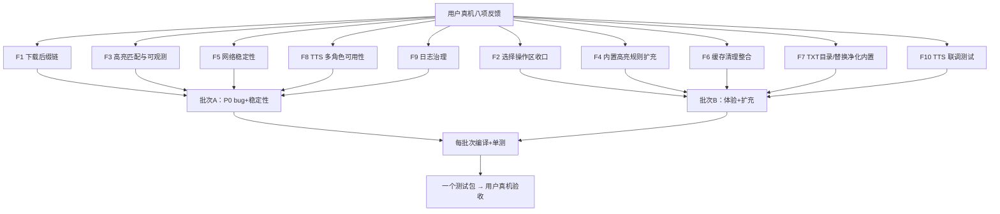
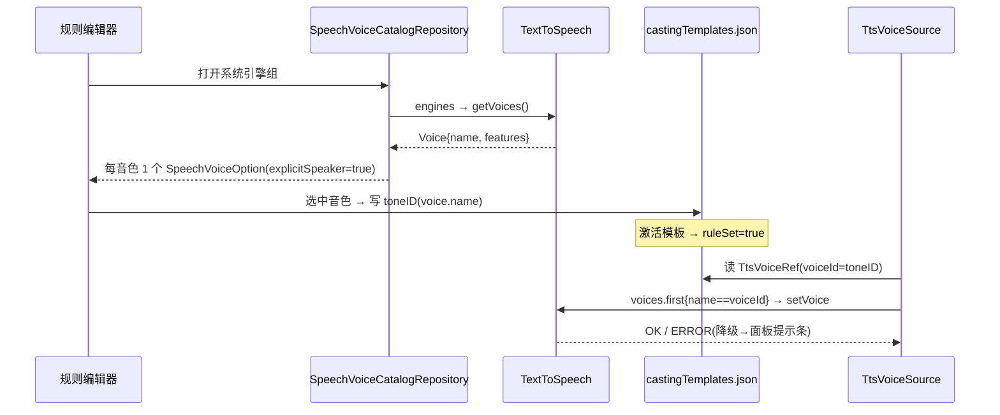
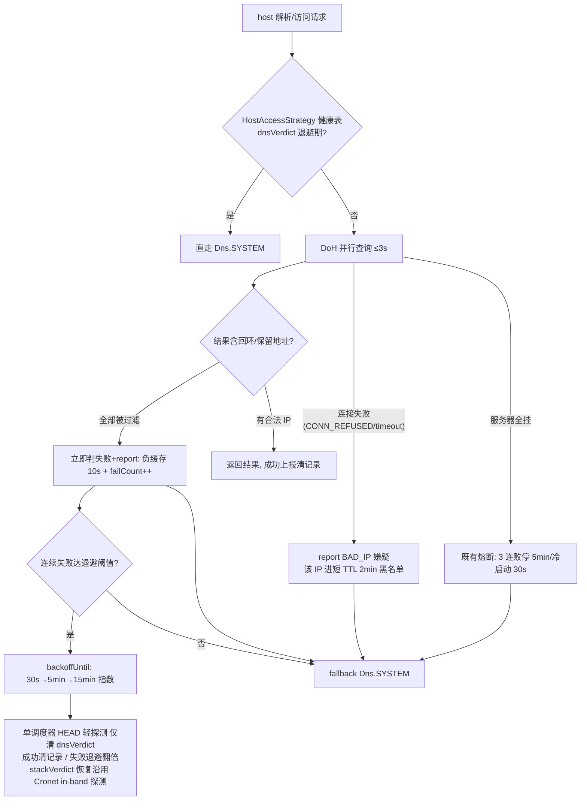
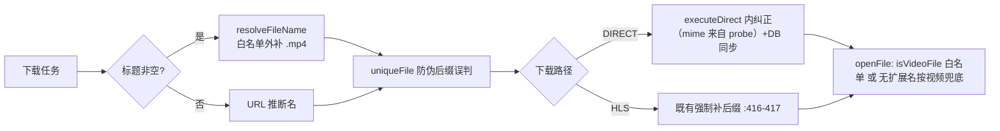

# 批次F 设计文档（real-device-bugfix-0911）

> 事实源：同目录 `BRIEF.md`（八项真机问题根因实证）。本文档不引入 BRIEF 之外的事实；`文件:行号` 均沿用 BRIEF 实证结论。
> 铁律约束：Room v110 冻结（本批**不新增实体表**，内置导入一律复用现有表）；同文件 Edit 串行；TtsTrace/AppLog 正式诊断日志保留。

## 0 阅读指南

### 0.1 术语表

| 术语 | 含义 |
|---|---|
| DIRECT 直链 | DownloadService 非 HLS 的单文件下载路径（executeDirect :394-408） |
| resolveFileName | DownloadService 生成下载目标文件名的函数（:660-671） |
| DoH / DohDns | DNS over HTTPS 解析器（help/http/DohDns.kt），失败永远兜底 Dns.SYSTEM |
| 负缓存 | DoH 失败域名的短 TTL 拒答缓存（10s，DohDns.kt:104） |
| failUrl 黑名单 | OkHttpStreamFetcher 的 URL 失败 LruCache（容量 200，无 TTL，:61） |
| HostAccessStrategy | host 级访问健康表单例（help/http/HostAccessStrategy.kt，v1.1 新增），统一记账三栈三通道判定/退避/选路 |
| HostRecord | 健康表记录结构：stackVerdict{CRONET_OK/BAD,OKHTTP_OK/BAD}+dnsVerdict{DOH_OK/QUERY_FAIL/BAD_IP/SYS_OK}+失败计数+指数退避 |
| MERGE 愈合 | 内置规则刷新策略：只追加缺失 id；pattern 与内置相同→内置覆盖，用户改过→保留（HighlightRuleStore.kt:322,431-443） |
| 版本旗标 | `isLastVersion(n, key)` SP 机制（LocalConfig.kt:62-76），升级后触发一次内置导入 |
| toneID / voiceId | 选角模板中的音色标识；命中链终点是 `TextToSpeech.setVoice(voice)` 按 `voice.name` 匹配（TtsVoiceSource.kt:161-177） |
| ruleSet | 选角模板激活状态，TTSReadAloudService 逐段路径判定唯一依据（:256-271） |
| 批次A/B | A=F1/F3/F5(v1.1)/F8/F9(日志治理)；B=F2/F4/F6/F7/F10(TTS 联调测试)；一个测试包验收 |

### 0.2 批次速查表

| 编号 | 主题 | 优先级 | 批次 | 核心交付 | ADR |
|---|---|---|---|---|---|
| F1 | 视频下载后缀链 | P0 | A | 命名补后缀+Content-Type 纠正+播放兜底+伪后缀防护 | AD-01 |
| F2 | 底部选择条收口 | P1 | B | 移除 Compose 常驻条，批量操作单入口 | AD-02 |
| F3 | 高亮匹配与可观测 | P0 | A | 对话正则放宽+元字符提示+诊断日志补全 | AD-03 |
| F4 | 内置高亮规则扩充 | P2 | B | highlightRuleVersion 旗标+MERGE+规则扩充 | AD-04 |
| F5 | 网络稳定性（v1.1 HostAccessStrategy） | P0 | A | 两阶段收编：阶段1=DNS 层接入+失败上报+坏 IP 短 TTL 黑名单（本批）；阶段2=Cronet per-host 状态字段迁移（登记后续）+单调度器 DNS 探测+failUrl TTL 并入 | AD-10 |
| F6 | 缓存清理整合 | P2 | B | 其它设置双入口删除，WebView 数据迁缓存管理 | AD-06 |
| F7 | TXT 目录/替换净化/字典 | P2 | B | txtTocRuleVersion 3→4（26→30）+ReplaceRule 内置导入链（0→12） | AD-04 同机制 |
| F8 | TTS 多角色可用性 | P0 | A | 系统引擎音色枚举链+静默降级可视化 | AD-07/AD-08 |
| F9 | 日志治理 | P1 | A | AppLog putThrottled/putSampled+噪音源逐项处置+规范三条款增补 | AD-11 |
| F10 | TTS 联调测试 | P1 | B | l2_verify_tts_engine.py+模拟器环境+覆盖度矩阵（约 80% 功能面） | — |

## 1 背景与根因总览

| 反馈 | 根因一句话（详见 BRIEF） | 修复域 |
|---|---|---|
| F1 无后缀不可播 | resolveFileName 标题非空不补扩展名；DIRECT 无 Content-Type 纠正；isVideoFile 按后缀白名单 | 下载 |
| F2 操作区重叠 | Compose 常驻底部条（AppManagementScaffold:286-345）+旧 View SelectActionBar 双栈疑点 | 管理页 UI |
| F3 长对话不命中 | 内置正则 `{1,120}`+`[^”\n]` 双重限制；isRegex=false/非法正则静默零命中无提示 | 高亮 |
| F4 规则只有 12 条 | 硬编码 12 条且无版本旗标，新增 id 推不到老用户 | 高亮 |
| F5 图片时好时坏 | 根因=DNS 解析失败（DoH 回环污染分支/failUrl 无 TTL），非解密；另 MemoryPressure 洪水 | 网络/日志 |
| F6 清理重复 | 其它设置删 book_cache+cacheDir 与缓存管理重复且无播放中保护 | 设置 |
| F7 替换净化 0 条 | TXT 目录 26 条但替换净化无内置导入链 | 内置数据 |
| F8 多角色单声 | 7 断点：入口语义混淆/模板声源全 `current`+toneID 空/目录不列音色/静默降级等 | TTS |

## 2 总体架构



## 3 子系统实现设计

### 3.1 F1 视频下载后缀链

**改动文件**：`DownloadService.kt`（:660-671 resolveFileName、:673-686 uniqueFile、:394-408 executeDirect 后缀纠正挂钩、:416-417 HLS 已有强制后缀不动）、`ChunkDownloader.kt`（:111-125 probe()，扩展 ChunkResult 带 mime 字段）、`DownloadManageActivity.kt`（:225 isVideoFile/openFile 兜底）、`DownloadManageScreen.kt`（:80 DOWNLOAD_VIDEO_EXTS 复用）、`HlsDownloader.kt`（ts→mp4 封装异常保护）。

**关键伪代码**：

```kotlin
// ① DownloadService.resolveFileName：命名时补全（非空标题分支）
fun resolveFileName(title, url, videoHint): String {
    val base = title.ifBlank { inferFromUrl(url) }        // 标题空仍走 URL 推断（原逻辑）
    val hasRealExt = DOWNLOAD_VIDEO_EXTS + 其他白名单.any { base.endsWith(".$it") }
    // 伪后缀防护：uniqueFile(:673-686) 会把 "xx.4K" 的点当扩展名 → 白名单外一律视为无后缀
    return when { hasRealExt -> base; videoHint -> "$base.mp4"; else -> base }
}
// ② Content-Type 纠正：mime 唯一可靠取点=ChunkDownloader.probe()（:111-125，ChunkResult 扩展 mime 字段）；
//    纠正动作放 DownloadService.executeDirect（:394-408）内；rename 后必须同步三处口径：
//    DB downloadRecords localPath/fileName + 通知栏文案 + openFile IntentType（防"文件丢失"误报）
fun correctExtInExecuteDirect(file: File, mime: String?) {
    val ext = MIME_TO_EXT[mime?.substringBefore(';')?.lowercase()] ?: return  // 白名单内才纠正
    if (!file.name.endsWith(".$ext")) {
        val renamed = runCatching { file.renameTo(uniqueSibling(file, ext)) }.getOrDefault(false)
        if (renamed) { updateDownloadRecordPath(); refreshNotificationAndIntentType() }
    }
}
// ③ DownloadManageActivity.openFile：存量无扩展名文件兜底（默认按视频处理）
fun isVideoFile(f: File) = f.name.hasExt(DOWNLOAD_VIDEO_EXTS)
        || (f.name.hasNoExt() && f.length() > 0)      // 文件头嗅探本期不做（简化说明）
```

**边界条件**：标题为空→原 URL 推断路径不变；MIME 非视频白名单→不纠正（防把 zip 改成 mp4）；rename 目标已存在→uniqueSibling 加序号；rename 成功后必须同步 DB downloadRecords localPath/fileName 与通知栏/IntentType 口径（防"文件丢失"误报）；HLS 路径已有补后缀逻辑不动；MPEG4Writer UBSan 崩溃（平台库缺陷）→应用侧仅做封装异常保护+阅读状态保存，根治登记后续。

**（实施排查结论 2026-09-11）**：
- 崩溃点=HlsDownloader TsToMp4Remuxer.remux（HlsDownloader.kt:362-539）写循环 `info.set(0,size,pts,key)`（:477）的 pts=extractor.sampleTime+shift（:469-474）异常值，触发平台 MPEG4Writer 32 位乘法溢出 UBSan abort（Java try-catch 拦不住）。
- 规避定稿=写入前 PTS 钳制（pts<0 或 >90_000_000_000µs 时停止本轨回退 ts）+TsFallback 分支补删半成品 mp4 残留；ts 先行落库防线已存在（DownloadService.kt:443-459）不丢产物；不引入新封装库。

### 3.2 F2 选择操作区收口

**改动文件**：`AppManagementScaffold.kt`（:286-345 移除 `AppManagementSelectionBottomBar` 常驻条，:307 选择计数保留）、`BookSourceActivity.kt`（:277-278 接线）、`RssSourceActivity.kt`（:185-186 接线）；复核 `activity_book_source.xml:30` / `activity_rss_source.xml:30` 的旧 View `SelectActionBar` 双栈（`SelectActionBar.kt:57-60` 整类不删，其他 4 页仍引用）。

**设计**：

1. 删除 Compose 常驻底部条；"已选 x/y" 计数迁移到多选态顶栏。
2. 长按进入多选后，唯一批量入口=顶栏 MoreVert 溢出菜单：全选/反选 + 原 `SelectionMoreMenu` 13 项批量操作（启用/停用/加组/置顶/校验/导出/删除）原样并入，不丢入口。
3. 实施期真机复核双栈：若旧 View 条在这两页与用户所见"重叠"相关，顺带移除这两处 XML 引用（仅这两页，不动类）。

**边界条件**：选中数=0→顶栏不显示批量入口；单选态长按→进入多选的路径保持不变；13 项操作回调签名不变（只换挂载位置，降低回归面）。

**（实施排查结论 2026-09-11）**：
- 旧 View SelectActionBar 两页布局有声明但 initComposeContent 已 removeView 摘除（BookSourceActivity.kt:178-184/RssSourceActivity.kt:102-108），无双重显示，用户所见重叠=Compose 底部条常驻本身。
- 收口方案定稿=多选态顶栏 MoreVert：BookSourceActivity.kt:218 menuActions 改 lambda——selectedUrls 非空时返回 pageMenuActions()+bottomActions 全量映射，RssSourceActivity.kt:137 同构；bottomActions 只留删除主项。
- topActions 恒渲染不受 selectedCount 影响（AppManagementScaffold.kt:115-123），provider 点击时求值可动态返回菜单。
- **实施修订（范围收窄）**：AppManagementSelectionBottomBar 为管理族共用组件（字典/TXT目录/替换净化等 6+ 页在用），全族移除=变更放大且用户仅反馈书源/订阅源两页——**组件与其余页面行为不变**；仅 ①Scaffold 增加渲染条件（bottomActions 空且无全选回调时不渲染底栏）②两页调用点停传 bottomActions/onSelectAll/onInvertSelection ③选择计数并入顶栏标题（选中态 title="已选 N 项"）。

### 3.3 F3 高亮匹配与可观测

**改动文件**：`HighlightRuleStore.kt`（:172 对话正则放宽）、`HighlightRuleMatcher.kt`（:45 isRegex 分支提示、:64 matchLiteral、:83-84 非法正则诊断、:91 超时、:94 find 语义不动）、`ReadBook.kt`（:395-416 生效链已即时，仅核对不动）。

**关键伪代码**：

```kotlin
// ① 内置对话正则放宽：仅限长 {1,120}→{1,400}；保留 \n 排除（首版不跨段，防省略后引号吞段误标）
pattern = "“[^”\n]{1,400}”|\"[^\"\n]{1,400}\"|「[^」\n]{1,400}」|『[^』\n]{1,400}』"
// 边界：HighlightTextBuilder.kt:33 段末插 \n，\n 排除确保命中不跨段；超长（>400）与跨段对话命中登记后续
// ② isRegex=false 且内容含正则元字符（^$.*+?()[]{}|\）→ 保存/匹配时提示"疑似正则未开启开关"
// ③ 非法正则跳过处（:83-84）补 AppLog.HighlightStyle：ruleId/isRegex/跳过原因/命中计数
// ④ 演进覆盖机制（P0-A1）：现役 120 对话正则登记进 legacyBuiltinPatterns（:460-473）；
//    normalizeRules 增加"用户 pattern 等于 legacy 登记值 → 允许 builtin 新版覆盖"分支；
//    配套单测：存量 120 用户升级后应得 400
```

**边界条件**：{1,400} 上限保留（ReDoS 预算）；`\n` 排除保留=首版不跨段（防省略后引号吞段误标），超长（>400）与跨段对话命中登记后续；超时保护 3000ms 不动（:91），长章多命中可截断属可观测行为；匹配器 find 语义不动（用户正则写法本就正确）；"长度上限"规则级配置仅评估、本期可不做；规则级开关与 4 开 8 关逻辑不变。

### 3.4 F4+F7 内置规则扩充与版本旗标推送机制

**改动文件**：`HighlightRuleStore.kt`（:167-306 内置清单扩充、:431-443 shouldRefreshBuiltin、:460-473 legacyBuiltinPatterns 复用、:322 用户改动保留）、`LocalConfig.kt`（:62-76 新增 `highlightRuleVersion`、`needUpReplaceRule`；:65-66 txtTocRuleVersion 3→4）、`DefaultData.kt`（:27-50 upVersion 导入）、`App.kt`（:178 启动链）、`app/src/main/assets/defaultData/txtTocRule.json`（追加 6 条）、新建替换净化内置 JSON（经 DefaultData 导入链）。

**机制设计（MERGE 推送）**：

```kotlin
// LocalConfig（对齐 isLastVersion 模式，per-key 独立计数）
val needUpHighlightRule get() = !isLastVersion(1, "highlightRuleVersion")
val needUpReplaceRule  get() = !isLastVersion(1, "replaceRuleVersion")
val needUpTxtTocRule   get() = !isLastVersion(4, "txtTocRuleVersion")   // 3→4
// 启动时旗标命中 → restoreDefaults(MERGE)：
//   只追加缺失 id（Insert IGNORE 或等价，新负 id）；禁止 deleteDefault+全量重插（会重置老用户开关状态）；
//   pattern 与 legacyBuiltinPatterns 相同 → 内置覆盖；用户改过的条目保留（:322 既有语义）。
//   高亮旗标触发时传"本次新增 id 的 delta 清单"（SP 链无删除墓碑，禁全量 defaults）；
//   新增规则 id 同步扩 builtinIds/legacyBuiltinPatterns（否则新 id 无愈合保护）。
// ReplaceRule 内置导入：复用现有 replaceRule 表（Room v110 冻结，禁止新增实体表），
//   导入前核实 ReplaceRule 实体字段与 DefaultData 既有导入模式，内置负 id 约定一致。
```

**规则清单**：F4 高亮自 12 条扩至 24 条（新增 12 条：调研 16 条候选选优+跨段变体默认关——同源 fork 调研确认无更多现成规则可抄，走社区候选+自研路径；候选：说话人标签对话、分段引文、破折号对白行、系统面板文本、卷标题行、心理关键词宽版、诗词题头、金额宽版、时间宽版、网址邮箱灰显等）；F7 TXT 目录 26→30（+4 条：MD3 独有 2 条直接采纳——中文顶格标题默认关/数字可选分隔符默认开，社区候选选优 2 条——双编号轻小说/英文序词/韩式番外/井号标题中选优）；替换净化 0→12 条（全源空白自建：章末推广块/推广文本/HTML 残留/script 块/错字修正/章节格式统一/引流整行删等）。字典不扩（调研确认本仓 5 条已最高档，明确不做）。

**默认开关策略**：确定性/修复性默认开（错字修正、HTML 清理、TXT 目录增量）；泛化易误伤默认关（泛化关键词整行删、广告角标）；对齐现 4 开 8 关逻辑。

**边界条件**：老用户首次升级→旗标命中一次性 MERGE；已手动删过内置条目→按负 id 追加新条目、不复活用户删除项（沿用现 deleteDefault 语义）；SP 存储（高亮）与 Room 导入（TXT/替换）两条链独立版本旗标，互不影响。

**（实施排查结论 2026-09-11，F7 替换净化导入链）**：
- ReplaceRule 主键 autoGenerate 仅 id==0 时自增、负 id 可原样插入（ReplaceRule.kt:25-26）；ReplaceRuleDao 无 IGNORE 变体，需新增 insertIfAbsent（@Insert(onConflict=IGNORE)）。
- 新文件 assets/defaultData/replaceRules.json（负 id -1 起）；导入链=DefaultData 新增 replaceRules lazy+importDefaultReplaceRules（幂等追加，先例 TtsCastingStore.kt:230-260）+LocalConfig.needUpReplaceRules=isLastVersion(2,"needUpReplaceRules")+upVersion 分支。
- 旗标按版本一次性触发，用户删除负 id 规则后本版本不回灌，与只追加语义自洽。

### 3.5 F5 网络稳定性（v1.1 HostAccessStrategy 单源化设计）

**v1.1 升级动机（用户检查点 1 意见③）**：原"分散修补"方案（DoH 回环过滤/per-host 自适应/failUrl TTL）各自记账，三栈（Cronet/OkHttp/图片加载）三解析通道（DoH/系统 DNS）状态割裂（真实收编字段：certErrorCache CronetInterceptor.kt:98/degradedForSession :30/lastFailedHostHint :81-88/failUrl OkHttpStreamFetcher.kt:61+DohDns negativeCache 分散四处；P1-F2 实证修正，原稿 systemOnlyUntil 不存在）；**坏 IP 无记忆=日志实锤第一痛点**（坏 IP 命中前消耗完整 60s callTimeout 超时循环浪费）；Cronet 全局降级误伤健康 host（降级-恢复震荡根因）。故升级为系统性 HostAccessStrategy 方案。

**改动文件**：新增 `help/http/HostAccessStrategy.kt`；改 `DohDns.kt`（lookup 接入选路+IP 黑名单过滤）、`CronetInterceptor.kt`（错误分类处失败上报；per-host 状态字段迁移委托属阶段2）、`HttpHelper.kt`（接线）、OkHttp 现有异常拦截器（失败上报挂接补全景）。

**收编口径两阶段（P1-F3 红队复审修正）**：阶段1（本批交付）=DNS 层接入（DohDns.lookup 选路+健康表）+Cronet/OkHttp 错误分类处失败上报+坏 IP 短 TTL 黑名单——低风险高收益，直接消除"坏 IP 无记忆"第一痛点；阶段2（登记后续，独立立项）=CronetInterceptor per-host 迁移——牵连入口全局门移除+RECOVERY_PROBE_INTERVAL 4 处+in-band 探测重构，≈重写规模，单行任务无法承载；阶段2 收编仅状态字段不改拦截流程结构。

**实施序（变更放大控制）**：三步落地——①HostAccessStrategy 纯函数+单测→②DohDns lookup 选路接线→③Cronet/OkHttp 两处上报挂接，每步独立编译复验。

**核心结构**：

```kotlin
// help/http/HostAccessStrategy.kt：object 单例，host 键健康表 ConcurrentHashMap 上限 400 兜底，LRU+退避优先保留策略防高熵站点记忆丢失
object HostAccessStrategy {
    data class HostRecord(
        val stackVerdict: Set<StackVerdict>,   // CRONET_OK/BAD, OKHTTP_OK/BAD（阶段1 仅记录不上报选路，无消费者；结构与选路随阶段2 启用）
        val dnsVerdict: DnsVerdict,            // DOH_OK/QUERY_FAIL/BAD_IP/SYS_OK
        val failCount: Int,                    // 失败计数（新增 per-host failCount，全新行为，BRIEF F5②落地；与既有 globalFailCount 全局熔断独立记账）
        val backoffUntil: Long                 // 指数退避 30s→5min→15min
    )
    // P2-F6 并发模型：弃 LruCache；可变字段（failCount/backoffUntil）经 table.compute() 原子读改写，防并发退避丢失更新
    private val table = ConcurrentHashMap<String, HostRecord>()   // 健康表上限 400 兜底（LRU 淘汰+退避期条目优先保留，P2-F7）
    private val badIps = ConcurrentHashMap<String, Long>()      // 坏 IP 短 TTL 黑名单（2min）：键=host+IP 对（防共享 CDN 段投毒）+上限 50 兜底（LRU 淘汰+未过期条目优先保留，与健康表统一策略）+主动清扫过期
    fun pickChannel(host: String): Channel   // 前置选路：健康表查询（阶段1 仅消费 dnsVerdict，stackVerdict 选路随阶段2 启用）
    fun report(host, stack, verdict, badIp?) // 失败/成功上报（状态迁移打点）
    fun probe(host)                          // HEAD 轻探测（单调度器调用；仅清 dnsVerdict——DNS 层验证）
}
// P2-F7 fail-open 铁律：pickChannel/report/probe 全路径 try-catch，任何异常返回默认通道
// （Cronet 开关原语义+系统 DNS），禁止健康表故障熔断全 App 网络；
// plainImportClient/videoStreamClient 请求不上报健康表（防导入链污染信誉）
```

**前置选路（消除震荡根因；阶段1 仅 DNS 层）**：
- DohDns.lookup 开头查 dnsVerdict：处于退避期的 host 直接走系统 DNS（阶段1 交付）
- CronetInterceptor 的 certErrorCache/degradedForSession/lastFailedHostHint 检查改查健康表：healthy host 不被全局降级误伤（阶段2 登记后续——per-host 迁移牵连入口全局门移除，独立立项）

**失败上报（阶段1 交付）**：
- CronetInterceptor 错误分类处调 report()：CONN_REFUSED/timeout 上报 DOH_BAD_IP 嫌疑+该 IP 进短 TTL（2min）黑名单（键=host+IP 对，上限 50 兜底+主动清扫，LRU 淘汰+未过期条目优先保留与健康表统一策略）
- OkHttp 侧失败上报挂现有异常拦截器，补全景记账；plainImportClient/videoStreamClient 导入/视频流链路不上报（防导入链污染信誉）

**后台探测（单调度器收编；P1-F4 探测栈归属修正）**：单调度器 HEAD 轻探测仅定义=清 dnsVerdict（DNS 层验证，收编 DohDns preheat）：成功清记录恢复优选、失败退避翻倍；stackVerdict 恢复沿用现 Cronet in-band 探测（CronetInterceptor.kt:37-48 真实请求探测）不动——HEAD 走 OkHttp 无法证明 Cronet 可用，防"探测栈错位"（Cronet half-open 归一重构属阶段2）。

**既有语义并入（保留不丢）**：
- per-host 自适应：新增 per-host failCount（全新行为，BRIEF F5②落地，非既有字段并入）——仅真实 DoH 查询失败递增（负缓存命中/熔断期旁路不计）、网络切换清空；判定边界：与既有 globalFailCount 全局熔断（DohDns.kt:117）独立记账，回环判败分支（DohDns.kt:219-224）只计 per-host 不计全局
- failUrl TTL+指数退避（OkHttpStreamFetcher.kt:61）：LruCache 容量 200 不变，值包装时间戳，连续失败 TTL 5min→10min→20min 封顶，过期可重试
- DoH 回环/保留地址立即判败：DohDns.kt:214-224 现状已实现，本期复核+统计上报（AppLog）；不用 isSiteLocalAddress 大范围过滤（防误杀内网源域名）

**附属项**：TTS 音频下载失败静默替代补用户可见提示（对齐"不静默吞错误"）；"图片绘制缓存"设置项说明文案澄清作用域（只作用正文位图缓存，与封面无关，不改行为）。MemoryPressure 日志降频移交 3.8（F9 日志治理）。

**边界条件**：DoH 全挂→既有熔断（3 连败停 5min/冷启动 30s）与 system 兜底语义不变；阶段1 不触碰 CronetInterceptor 既有状态字段（只新增失败上报，无双源问题）；阶段2 一次性迁移删旧字段（certErrorCache:98/degradedForSession:30/lastFailedHostHint:81-88）+DohDns negativeCache 并入不留双源；网络切换清空健康表；Cronet 拦截流程结构不改（Out-of-Scope 口径：阶段2 收编仅状态字段不改拦截流程结构）；探测请求必须旁路健康表选路——探测用专用轻量 client（直连 DoH 服务器查询验证，不经过 pickChannel/DohDns.lookup 健康表检查），防止"探测经系统DNS成功→误判 DNS 层恢复→清退避→真实请求走 DoH 再失败"自证循环。

**风险**：热路径锁（ConcurrentHashMap+compute() 原子读改写，选路仅一次哈希查表）；误拉黑好 IP（黑名单键=host+IP 对防共享 CDN 段投毒，2min 短 TTL+上限 50+主动清扫+探测自愈兜底）；健康表自身故障（fail-open 铁律：全路径 try-catch 回落默认通道，禁止熔断全 App 网络）；迁移期双源不一致（阶段2 一次性迁移删旧字段不留双源）。

**实施决策（2026-09-11，与上文"negativeCache 并入"口径的差异说明）**：阶段1 保留 DohDns negativeCache（10s 细粒度防重试）**不并入**健康表，两层叠加（负缓存 10s 短窗 + 健康表 30s+ 退避长窗）——合并会把负缓存 TTL 从 10s 拉长到 30s 并牵连 clearNegativeCache/CronetInterceptor NAME_NOT_RESOLVED 联动链，回归风险大于收益；negativeCache 正式并入顺延至阶段2 迁移（届时连同 clearNegativeCache 语义一并收编）。OkHttp 侧上报仅记 ConnectException（读超时属服务端慢不误报），Cronet 侧 ERR_CONNECTION_TIMED_OUT 上报。

### 3.6 F6 缓存清理整合

**改动文件**：`OtherConfigFragment.kt`（:447-452 删"清除缓存/清除 WebView 数据"两入口）、`ConfigViewModel.kt`（:31-38 废弃函数清理、:40-47 WebView 清理逻辑迁移）、`CacheManageViewModel.kt`（:29-57 三分项→四分项、:64-77 播放中保护复用）。

**设计**：缓存管理新增第 4 分项"WebView 数据"，复用 ConfigViewModel 迁出的清理实现；保留"删除后延迟 3s 强制重启"提示语义；播放中保护（:64-77）按分项独立判定，WebView 分项亦适用（exoplayer 外部缓存分项为缓存管理独有，保持）。其它设置页仅删入口，不新增替代文案以外内容。实施前盘点 cacheDir 一级子目录归属（HLS 分片等未被分项覆盖的残留并入视频分项或补兜底说明）。

**边界条件**：清理执行中重复点击→沿用既有防抖；重启提示文案照搬原语义；ConfigViewModel 废弃函数删除后编译期验证无残留引用。

**（实施盘点结论 2026-09-11，任务 4.6）**：cacheDir 一级子目录仅 httpTTS（已被缓存管理音频分项覆盖），HLS 分片位于下载目录 m3u8/ 子目录（属下载产物非缓存）——删除其它设置入口无清理缺口。

### 3.7 F8 TTS 多角色可用性（核心：系统引擎音色枚举链）

**改动文件**：`SpeechVoiceCatalogRepository.kt`（:119-149 systemGroups 接 getVoices 枚举音色并 suspend 异步化；:151-170 assignableRoutes 相应扩展）、`TtsCastingEditorScreen.kt`（:86-89 remember 同步调用改异步消费）、`TtsVoiceSource.kt`（:161-177 setVoice 命中链已存在，不动）、`castingTemplates.json`（内置 4 模板 toneID 可配置化）、`ReadAloudConfigDialog.kt`（:499-506 开关正名；:99 静默设计改面板提示）、`TTSReadAloudService.kt`（:256-271 模板状态可见、:400-406 门禁 toast、:398 resolveSourceForTag 不动）。

**音色枚举异步化（P1-ANR）**：现 systemGroups 在 Composable remember{} 主线程同步调用（TtsCastingEditorScreen.kt:86-89），而音色枚举需等待各引擎 onInit——必须改 suspend + 协程异步枚举 + 结果缓存，调用方 produceState 消费；三态处理：引擎未就绪→提示重试、就绪但空集→明示"该引擎无可枚举音色"、正常→枚举音色（禁止静默回落）。

**音色枚举命中链（时序）**：



现状断点→修复映射：①入口"多角色"开关=AI 分镜功能（:499-506）→改名"AI 分镜选角"+描述区分，模板激活状态在朗读设置直接可见；②内置 4 模板声源全 `current` 哨兵+toneID 全空→目录可选具体 voice 写 toneID，命中链末端 applyVoice 已按 name 匹配（:163-172），上游补值即通；③编辑器每引擎仅 1 option、toneID 恒空（:119-148）→getVoices 枚举真实音色，CloneTTS 注册的系统 voices 即可被直选；④脚本声源死路（:400-406）→门禁 toast+文案明示，深度支持登记后续；⑤全链降级只写 AppLog（:99）→模板激活但 voiceId 未命中/全部 narration 时面板提示条"去绑定音色"；⑥≥5 步无引导→模板管理页首次引导文案；⑦resolveSourceForTag 未传 characterId（:398）→登记后续，本期不动。

对话切分命中率：日志实锤 33 段 32 段 narration——内置模板对白规则扩充（引号+说话人标签模式，与 3.3 正则放宽口径联动）；面板显示 narration/dialogue 切分统计辅助诊断。

**边界条件**：getVoices 空集/引擎不支持→明示"该引擎无可枚举音色"（禁止静默回落单 option）；引擎未就绪→提示重试（异步枚举前提，见音色枚举异步化）；voiceId 失效（引擎卸载/更名）→沿用既有降级"引擎默认音+首次明示"（:164-176）并升级为面板提示；toneID 写入走既有模板持久化通道；单测覆盖音色枚举映射/目录产出/toneID 写入链纯函数部分。

### 3.8 F9 日志治理（AppLog 双机制+噪音源逐项处置，检查点 1 意见②）

**改动文件**：`AppLog.kt`（新增 putThrottled/putSampled 双机制；节流状态 Map 加 LRU 上限清理——P2-F8）、`MemoryPressure.kt`（源头=:57/:62 skip 高频打点降频，:112 出口同步改压力级别跃迁打点——勿只改出口）、`App.kt`+`OtherConfigFragment.kt`（EventLogger 双 enableLogger 开关统一单源）、LiveEventBus/CryptoScope/预连接/MIUI SettingTrigger 各打点文件（以实施期 Grep 实际为准）、`docs/project-rules/logging_rules.md`（三条款增补——**规范文件修订属实施任务**，本设计只定要点）。

**AppLog 双机制**：

```kotlin
// 节流：同 key 60s 时间窗去重；窗口结束时输出末条并合并"(累计N次)"
fun putThrottled(tag: String, key: String, msg: String, level: Level)
// 采样：每 n 条输出 1 条汇总（含被采样计数）
fun putSampled(tag: String, key: String, msg: String, n: Int)
```

**分级语义表（新增/改造日志必须对号入座）**：

| 级别 | 语义 |
|---|---|
| E | 用户可感知失败 |
| W | 降级兜底发生 |
| I | 仅状态迁移 |
| D | 过程细节 |

**实施要点（P2-F8/F9 红队复审补充）**：①putThrottled 节流状态 Map 必须 LRU 上限清理（防 key 无界增长内存泄漏）；②诊断 tag 白名单豁免按"调用类名 tag"对齐 putEntry stackTrace[3] 机制（白名单匹配调用方类名，防漏配/错配）；③MemoryPressure 治理源头=:57/:62 skip 高频打点（:112 是出口，勿只改出口）；④LiveEventBus 打点=本仓 EventLogger（App.kt:479-494）可治理，但 App.kt:176 与 OtherConfigFragment.kt:203 双 enableLogger 开关需统一为单源（防互相覆盖）。

**噪音源处置表（真机日志实锤量化，37 分片 37119 行口径）**：

| 噪音源 | 现状（条/会话） | 处置 | 目标 |
|---|---|---|---|
| MemoryPressure | 5521（15% 洪水，每 3 秒主线程 I+E 双条） | 源头 :57/:62 skip 高频打点降频（:112 出口同步改跃迁打点，勿只改出口），移出轮询高频路径 | <10 |
| LiveEventBus | 3039 | 降 DEBUG 或删除（打点=本仓 EventLogger App.kt:479-494；App.kt:176 与 OtherConfigFragment.kt:203 双 enableLogger 开关统一单源） | 数量级下降 |
| CryptoScope | 1211 | 采样 1/50 或仅 miss 打点 | 数量级下降 |
| 预连接 | 740 | 按批次汇总 | 数量级下降 |
| MIUI SettingTrigger | 少量反复 | 首条+计数合并 | 数量级下降 |
| PageDebug | — | 降 putDebug+采样（诊断保留降频） | 降频不删除 |

**logging_rules.md 增补三条款**（实施任务）：①周期性日志禁令（禁止固定间隔无状态日志直接打点）②级别语义表（E/W/I/D）③putThrottled/putSampled 使用指南（收编各处自建频控）。

**铁律**：TtsTrace 等正式诊断日志白名单保留，只降频不删除（AGENTS.md 诊断日志保留铁律；测试包日志是 AI 获取真机异常分析的生命线）。

### 3.9 F10 TTS 功能级联调测试设计（检查点 1 意见④）

**环境层（模拟器）**：
- MEmu `adb install` CloneTTS APK（**官方 GitHub Releases 渠道** sipeter/CloneTTS）→ `settings put secure tts_default_synth` 设默认引擎 + `settings put secure tts_default_lang`/`tts_default_country`/`tts_default_variant` 三键（P1-F5 环境补全）→ **CloneTTS 首启需手动初始化（模型下载/授权）一次** → `dumpsys texttospeech` 确认注册成功
- 风险：CloneTTS 0.7.0 NPU 路径依赖骁龙旗舰，模拟器 x86 可能 RTF>1 → 先跑引擎内置 benchmark，失败则降级**系统 TTS 接口模式**验证功能链
- MultiTTS 无官方渠道，默认不装，留真机用户路径（L3）

**自动化层（ai_tests）**：

| 层级 | 载体 | 覆盖 |
|---|---|---|
| L2-a 引擎音色 | 新建 `ai_tests/scripts/l2_verify_tts_engine.py` | dumpsys texttospeech+UI 节点+TtsTrace 断言：引擎枚举/音色枚举/模板绑定（**P0-F1 断言依据更正**：引擎/音色枚举路径现无 TtsTrace 埋点，前置=2.23 枚举路径补埋点后断言才成立） |
| L2-b 朗读推进 | 同脚本扩展 | 本地书免网络场景+TtsTrace 全链断言（模板激活→切分→合成推进） |
| L2-c HTTP 服务型 | 后续扩展 | CloneTTS 本地端口+HttpReadAloudService 路径 |

**覆盖度矩阵**：

| 覆盖项 | 单测 | 模拟器 L2 | 真机 L3（用户） |
|---|---|---|---|
| 引擎枚举/音色枚举映射 | ✓ | ✓ | ✓ |
| 模板绑定/toneID 写入链 | ✓ | ✓ | ✓ |
| 朗读推进/多角色功能面 | — | ✓ | ✓（听感） |
| 降级预案（P1-F5） | — | CloneTTS 未注册系统 voices 时走 HTTP 通道模式+L2-c 验证 | — |
| 后台保活/功耗 | — | — | ✓ |
| 覆盖面 | 纯函数 | **约 80% 功能面（含降级路径）** | 听感/保活/功耗 |

**L3 真机仅用户**：听感/后台保活/功耗（AI 不可替代项）。

## 4 ADR 决策

```yaml
- ID: AD-01
  Title: 下载后缀补全——命名时补全 + 完成后 Content-Type 纠正双保险
  Version: 1.0 | UpdateTime: 2026-09-11
  Context: resolveFileName 标题非空不补后缀；DIRECT 全程无 Content-Type 纠正；isVideoFile 按后缀白名单判定
  Concern: 无后缀文件软件内不可播；"xx.4K" 伪后缀被 uniqueFile 误判为扩展名
  Decision: 命名时视频类下载对白名单外标题补 .mp4 + 完成后按响应 Content-Type 纠正（mime 唯一可靠取点=ChunkDownloader.probe() 扩展 ChunkResult 字段，动作放 executeDirect 内，rename 后同步 DB/通知栏/IntentType 三处口径）；openFile 对存量无扩展名文件按视频兜底
  Goal: 下载完成即可播、存量文件可用、伪后缀不误判
  Tradeoff: 非 mp4 直链可能先命名 .mp4 再纠正（一次 rename）；文件头嗅探本期不做
  Status: Accepted | Superseded-by: 无 | ChangeLog: 2026-09-11 首次定稿
- ID: AD-02
  Title: 移除 Compose 常驻底部选择条，批量操作收口到多选态顶栏单入口
  Version: 1.0 | UpdateTime: 2026-09-11
  Context: 底部条与长按多选入口重叠；旧 View SelectActionBar 其他 4 页仍引用
  Concern: 13 项批量操作入口不能丢；双栈疑似重叠来源需真机复核
  Decision: 删常驻条；长按进入多选后顶栏 MoreVert 承载全选/反选+13 项操作；旧 View 类不删，仅两页 XML 引用实施期复核处理
  Goal: 单一入口、无重叠、操作全可达
  Tradeoff: 批量操作从"常驻可见"变"多选态两步可达"
  Status: Accepted | Superseded-by: 无 | ChangeLog: 2026-09-11 首次定稿
- ID: AD-03
  Title: 内置对话正则放宽口径——限长 400 + 保留 \n 排除（首版不跨段），防 ReDoS
  Version: 1.0 | UpdateTime: 2026-09-11
  Context: {1,120} 与 [^”\n] 双重限制致长对话/跨段对话不命中；匹配器 find 语义无问题
  Concern: 无限长正则有 ReDoS 风险；移除 \n 排除会使省略后引号的对话吞段误标
  Decision: 上限 120→400、保留 \n 排除（首版不跨段，跨段支持登记后续）；保留限长与 3000ms 超时；isRegex=false 含元字符时保存/匹配双提示；非法正则跳过补诊断日志；演进覆盖机制：现役 120 对话正则登记 legacyBuiltinPatterns，normalizeRules 增加"用户 pattern 等于 legacy 登记值时允许 builtin 新版覆盖"分支（存量 120 用户升级后应得 400）
  Goal: 单段长对话（≤400 字符）确定命中、编辑不生效有可感知反馈
  Tradeoff: 超长（>400）与跨段对话仍不命中（登记后续）；"长度上限"规则级配置本期仅评估
  Status: Accepted | Superseded-by: 无 | ChangeLog: 2026-09-11 首次定稿
- ID: AD-04
  Title: 内置规则版本旗标 MERGE 机制（highlightRuleVersion/replaceRuleVersion/txtToc v3→4）
  Version: 1.0 | UpdateTime: 2026-09-11
  Context: 高亮无版本旗标，新增第 13+ 条推不到老用户；替换净化 0 条无导入链
  Concern: 不新增实体表（Room v110 冻结）；用户改动与删除项不能被覆盖/复活
  Decision: 对齐 LocalConfig.isLastVersion 模式新增旗标触发 restoreDefaults(MERGE)：只追加缺失负 id（Insert IGNORE 或等价，禁 deleteDefault+全量重插防重置老用户开关状态）、同 pattern 内置覆盖、用户改过保留；高亮旗标传新增 id delta 清单（SP 链无删除墓碑）；新增规则 id 同步扩 builtinIds/legacyBuiltinPatterns；ReplaceRule 复用现有表
  Goal: 老用户升级即见新规则，且不影响既有个性化
  Tradeoff: 高亮继续 SP 存储、替换走 Room 导入，两链并存（与现状一致）
  Status: Accepted | Superseded-by: 无 | ChangeLog: 2026-09-11 首次定稿
- ID: AD-05
  Title: DoH 坏地址快速回退 + per-host 自适应 + failUrl TTL
  Version: 1.0 | UpdateTime: 2026-09-11
  Context: 回环/保留地址污染分支已消耗请求至 callTimeout 60s；单主机 175 次解析失败重复消耗；failUrl 一次瞬时失败→同 URL 秒失败至 LRU 淘汰
  Concern: 不重写 Cronet 降级恢复机制（已有自愈，明确不做）
  Decision: 回环/保留判败现状已实现（DohDns.kt:214-224），本期增量=复核+统计上报，不用 isSiteLocalAddress 大范围过滤（防误杀内网源域名）；单主机连续失败 3 次→临时直走系统 DNS（5min TTL 恢复；per-host failCount 为新增字段（全新行为，BRIEF F5②落地），仅真实 DoH 查询失败递增、网络切换清空；判定边界=回环判败分支（DohDns.kt:219-224）只计 per-host 不计既有 globalFailCount 全局熔断（DohDns.kt:117））；failUrl TTL 指数退避 5min→10min→20min 封顶，容量不变
  Goal: 图片加载 DNS 失败面收敛、瞬时失败不长时间惩罚
  Tradeoff: 回退窗口内放弃 DoH 收益（正收益场景：污染/故障期）
  Status: Accepted | Superseded-by: AD-10 | ChangeLog: 2026-09-11 首次定稿；同日 v1.1 升级为 HostAccessStrategy 单源化方案（检查点 1 意见③），分散修补语义并入 AD-10
- ID: AD-06
  Title: WebView 清理迁移至缓存管理，其它设置双入口删除
  Version: 1.0 | UpdateTime: 2026-09-11
  Context: 其它设置"清除缓存"与缓存管理 100% 重复且无播放中保护；WebView 数据只在其它设置有
  Concern: 迁移后"删除后需重启"语义必须保留
  Decision: 删其它设置两入口；缓存管理新增第 4 分项承载 WebView 清理；ConfigViewModel 废弃函数清理
  Goal: 清理单一路径、受播放中保护、语义无回退
  Tradeoff: 其它设置少一个快捷入口（用户需进缓存管理）
  Status: Accepted | Superseded-by: 无 | ChangeLog: 2026-09-11 首次定稿
- ID: AD-07
  Title: 系统引擎音色枚举作为多角色"真的多声音"核心通路
  Version: 1.0 | UpdateTime: 2026-09-11
  Context: 内置模板 toneID 全空→setVoice 永不命中；编辑器只列引擎不列音色；CloneTTS 音色无处绑定
  Concern: 逐段合成链与 setVoice 命中链已存在，缺的是上游目录与 toneID 值
  Decision: systemGroups 接 TextToSpeech.getVoices() 枚举真实音色（每音色一 option、explicitSpeaker=true），编辑器可选→写 toneID→applyVoice 按 name 命中 setVoice；脚本/HTTP 声源逐段限制仅明示（深度支持登记后续）
  Goal: 多角色绑定 CloneTTS/系统音色后真双声
  Tradeoff: 依赖引擎 getVoices 质量；AI characterId 透传依赖段落坐标系验证，登记后续
  Status: Accepted | Superseded-by: 无 | ChangeLog: 2026-09-11 首次定稿
- ID: AD-08
  Title: TTS 静默降级改面板可见提示 + 朗读入口语义正名
  Version: 1.0 | UpdateTime: 2026-09-11
  Context: 全链降级只写 AppLog（静默设计）；"多角色"开关与选角路由解耦；TTS 音频下载失败静默无声音频替代
  Concern: 不能静默吞错误；提示不得刷屏
  Decision: 模板激活但 voiceId 未命中/全部 narration 时面板提示条引导"去绑定音色"；开关改名"AI 分镜选角"并区分描述；音频下载失败补用户可见提示；面板显示 narration/dialogue 切分统计
  Goal: 用户可感知降级原因与下一步动作
  Tradeoff: 首次提示用一次性去重（沿用 degradedNotified 模式），信息密度略增
  Status: Accepted | Superseded-by: 无 | ChangeLog: 2026-09-11 首次定稿
- ID: AD-09
  Title: 内置选角模板编辑语义——用户修改保存时强制克隆为自定义模板
  Version: 1.0 | UpdateTime: 2026-09-11
  Context: 用户对 builtin 模板的原地修改（toneID 绑定等）会在模板 JSON 演进时被 importBuiltinTemplates 全字段比对刷新（TtsCastingStore.kt:243-271）REPLACE 整个 builtin 模板静默洗掉，形成"绑定-丢失-重绑"死循环
  Concern: builtin 模板刷新语义（REPLACE）与用户绑定状态天然冲突；不能阻断模板演进推送
  Decision: 用户对 builtin 模板修改保存时强制克隆为自定义模板（新 id，builtin=false）并激活克隆，builtin 原件保持只读
  Goal: 用户绑定状态永不静默丢失；模板演进与用户个性化解耦
  Tradeoff: 用户修改后与 builtin 原件脱钩，不跟随内置模板演进（可重新从 builtin 克隆）
  Status: Accepted | Superseded-by: 无 | ChangeLog: 2026-09-11 首次定稿
- ID: AD-10
  Title: HostAccessStrategy 收编不重写——host 健康表单源化统一记账（v1.2 两阶段收编）
  Version: 1.2 | UpdateTime: 2026-09-11
  Context: 三栈（Cronet/OkHttp/图片加载）三解析通道（DoH/系统 DNS）各自记账割裂（真实收编字段：certErrorCache CronetInterceptor.kt:98/degradedForSession :30/lastFailedHostHint :81-88/failUrl OkHttpStreamFetcher.kt:61+DohDns negativeCache；P1-F2 实证修正）；坏 IP 无记忆=日志实锤第一痛点（60s 超时循环浪费）；Cronet 全局降级误伤健康 host 致降级-恢复震荡
  Concern: 不重写 Cronet 机制（保留既有自愈语义）；热路径不能加锁；误拉黑好 IP 不可接受；健康表自身故障不得阻断网络
  Decision: 分两阶段收编。阶段1（本批交付）=新增 help/http/HostAccessStrategy.kt（object 单例，host 键 ConcurrentHashMap 健康表上限 400 兜底（LRU 淘汰+退避期条目优先保留），可变字段 compute() 原子读改写）：记录 stackVerdict{CRONET_OK/BAD,OKHTTP_OK/BAD}+dnsVerdict{DOH_OK/QUERY_FAIL/BAD_IP/SYS_OK}+失败计数+指数退避 30s→5min→15min；DNS 层接入（DohDns.lookup 查 dnsVerdict 退避期直走系统 DNS）+Cronet/OkHttp 错误分类处失败上报+CONN_REFUSED/timeout 上报 BAD_IP 嫌疑进短 TTL(2min) 黑名单（键=host+IP 对防共享 CDN 段投毒，上限 50 兜底+主动清扫，LRU 淘汰+未过期条目优先保留与健康表统一策略）；单调度器 HEAD 探测仅清 dnsVerdict（DNS 层验证，收编 DohDns preheat）；探测请求旁路健康表选路（专用轻量 client 直连 DoH 服务器查询验证，不经过 pickChannel/DohDns.lookup 健康表检查，防"探测经系统DNS成功→误判 DNS 层恢复→清退避→真实请求走 DoH 再失败"自证循环）；fail-open 铁律（pickChannel/report/probe 全路径 try-catch，异常回落默认通道，禁熔断全 App 网络）；plainImport/videoStream 链不上报；per-host 自适应与 failUrl TTL 语义并入。阶段2（登记后续，独立立项）=CronetInterceptor per-host 迁移（certErrorCache/degradedForSession/lastFailedHostHint+DohDns negativeCache 并入，healthy host 不被全局降级误伤；牵连入口全局门移除+RECOVERY_PROBE_INTERVAL 4 处+in-band 探测重构，≈重写规模），收编仅状态字段不改拦截流程结构
  Goal: 任一站点至少一条通路可用；坏 IP 有记忆不再超时循环；健康 host 不被全局降级误伤（阶段2）；健康表故障不熔断网络（fail-open）
  Tradeoff: 热路径一次哈希查表开销（ConcurrentHashMap+compute() 原子读改写规避锁）；黑名单误杀风险由键=host+IP 对+2min 短 TTL+上限 50+探测自愈兜底；阶段2 收编仅状态字段不改拦截流程结构（Cronet 拦截流程结构本期与阶段2 均不动）
  Status: Accepted | Superseded-by: 无 | ChangeLog: 2026-09-11 v1.0 分散修补（AD-05）→ v1.1 收编单源化（检查点 1 意见③），AD-05 并入本决策 → v1.2 增量红队复审修正（迁移清单实证/两阶段收编口径/探测栈归属/fail-open/并发模型 compute()）
- ID: AD-11
  Title: 日志治理体系化——AppLog 双机制收编+级别语义纪律+周期禁令
  Version: 1.0 | UpdateTime: 2026-09-11
  Context: 真机日志 15% 为 MemoryPressure 洪水（5521 条/会话），LiveEventBus 3039/CryptoScope 1211/预连接 740 各处自建频控口径不一
  Concern: 不能为降噪牺牲诊断链（TtsTrace 等是 AI 真机异常分析的生命线）
  Decision: AppLog 新增 putThrottled（同 key 60s 去重+末条合并累计）与 putSampled（每 n 条汇总 1 条）双机制收编各处自建频控；新增日志对号 E/W/I/D 分级语义表；周期性日志禁令；噪音源逐项处置（MemoryPressure 跃迁打点/LiveEventBus 降 DEBUG/CryptoScope 采样 1/50/预连接批次汇总）；诊断 tag 白名单豁免只降频不删除；logging_rules.md 三条款增补（实施任务）
  Goal: 同场景导出日志噪音占比显著下降且诊断链完整
  Tradeoff: 极端场景合并可能吞掉个别明细（诊断 tag 白名单豁免兜底）
  Status: Accepted | Superseded-by: 无 | ChangeLog: 2026-09-11 首次定稿（检查点 1 意见②）
```

## 5 Data Flow

**修复后 host 访问决策流（v1.1 HostAccessStrategy）**：



**F1 下载命名与纠正流**：



## 6 File Changes 表

| 文件 | 位置锚点 | 变更 | 批次 |
|---|---|---|---|
| DownloadService.kt | :660-671 / :673-686 / :394-408 | resolveFileName 补后缀+伪后缀防护+executeDirect 内后缀纠正与 DB/通知栏/IntentType 同步 | A |
| ChunkDownloader.kt | :111-125 | probe() 扩展 ChunkResult 带 mime 字段（mime 唯一可靠取点） | A |
| DownloadManageActivity.kt | :225 | isVideoFile/openFile 无扩展名兜底 | A |
| DownloadManageScreen.kt | :80 | DOWNLOAD_VIDEO_EXTS 复用（白名单来源） | A |
| HlsDownloader.kt | ts→mp4 封装段 | 封装异常保护+阅读状态保存 | A |
| HighlightRuleStore.kt | :172 / :167-306 / :322 / :431-443 / :460-473 | 正则放宽+规则扩充+MERGE 旗标接线（A 批 commit1/B 批 commit2 分离提交） | A/B |
| HighlightRuleMatcher.kt | :45 / :64 / :83-84 / :91 | 元字符提示+诊断日志（find/超时不动） | A |
| HighlightRuleEditDialog.kt | :365-390 | isRegex 元字符保存/匹配双提示 | A |
| TtsCastingEditorScreen.kt | :86-89 | remember 同步调用改异步枚举消费（produceState） | A |
| strings.xml（图片绘制缓存项） | 说明文案 | 作用域澄清：只作用正文位图缓存、不影响封面加载 | A |
| ReadBook.kt | :395-416 | 仅核对生效链（不动） | A |
| LocalConfig.kt | :62-76 | highlightRuleVersion/needUpReplaceRule/txtToc 3→4 | B |
| DefaultData.kt + App.kt | :27-50 / :178 | 导入链接入（txtToc 追加/ReplaceRule 内置 JSON） | B |
| assets/defaultData/txtTocRule.json | 追加段 | 6 条新负 id | B |
| AppManagementScaffold.kt | :286-345 / :307 | 删常驻条，计数与批量入口迁移顶栏 | B |
| BookSourceActivity.kt / RssSourceActivity.kt | :277-278 / :185-186 | 接线调整 | B |
| activity_book_source.xml / activity_rss_source.xml | :30 | 旧 View 条双栈复核（条件性移除） | B |
| HostAccessStrategy.kt（新增） | help/http/ | host 健康表单例：ConcurrentHashMap 上限 400+compute() 原子读改写+pickChannel/report/probe+指数退避 30s→5min→15min+fail-open 全路径 try-catch+坏 IP 黑名单（键=host+IP 对、2min TTL、上限 50+主动清扫）；plainImport/videoStream 链不上报 | A |
| DohDns.kt | lookup 开头/:214-224/:240-258 | 接入选路（dnsVerdict 退避期直走系统 DNS）+IP 黑名单过滤+失败统计上报 | A |
| CronetInterceptor.kt | 错误分类处 / :98 / :30 / :81-88 | 错误分类处失败上报（阶段1）；certErrorCache/degradedForSession/lastFailedHostHint per-host 迁移委托健康表（阶段2 登记后续，不改拦截流程） | A |
| HttpHelper.kt | 接线处 | HostAccessStrategy 接线 | A |
| OkHttp 异常拦截器 | 现有异常拦截器 | 失败上报挂接补全景记账（plainImportClient/videoStreamClient 除外） | A |
| OkHttpStreamFetcher.kt | :61 / :174-179 / :244-249 | failUrl TTL 指数退避 5min→10min→20min（并入健康表体系） | A |
| AppLog.kt | 机制区 | putThrottled/putSampled 双机制 | A |
| MemoryPressure.kt | :57/:62/:112 | 源头 skip 高频打点降频（:57/:62）+:112 出口改压力级别跃迁打点（5521→<10/会话；勿只改出口） | A |
| LiveEventBus/CryptoScope/预连接/SettingTrigger 打点文件 | 以实施期 Grep 实际为准 | 噪音源逐项治理（降 DEBUG/采样 1/50/批次汇总/首条+计数合并）；LiveEventBus=App.kt EventLogger:479-494+App.kt:176/OtherConfigFragment.kt:203 enableLogger 统一单源 | A |
| OtherConfigFragment.kt | :447-452 | 删两入口 | B |
| ConfigViewModel.kt | :31-38 / :40-47 | 废弃清理+WebView 逻辑迁移 | B |
| CacheManageViewModel.kt | :29-57 / :64-77 | 第 4 分项+保护复用 | B |
| SpeechVoiceCatalogRepository.kt | :119-149 / :151-170 | getVoices 音色枚举 | A |
| castingTemplates.json | 模板声源段 | toneID 可配置化 | A |
| ReadAloudConfigDialog.kt | :99 / :499-506 | 开关正名+面板提示条+切分统计 | A |
| TTSReadAloudService.kt | :256-271 / :400-406 | 模板状态可见+门禁 toast（:398 不动） | A |
| ai_tests/scripts/l2_verify_tts_engine.py（新增） | ai_tests/scripts/ | TTS L2 联调：引擎枚举/音色枚举/模板绑定断言+朗读推进 TtsTrace 全链断言 | B |

## 7 风险与登记后续

| 风险 | 应对 |
|---|---|
| MPEG4Writer 平台库 UBSan 崩溃无法根治 | 应用侧封装异常保护+阅读状态保存；登记平台缺陷 |
| F2 双栈"重叠"真实来源待真机确认 | 实施期真机复核两页 XML 引用，按复核结果条件性移除 |
| 对话正则限长放宽（首版不跨段）改变命中边界 | 单测确定性/性能（ReDoS 预算）+演进覆盖单测（存量 120→400）+真机长对话用例验证 |
| ReplaceRule 内置导入与用户自建规则冲突 | 负 id 隔离+MERGE 只追加；导入前核实实体与既有导入模式 |
| getVoices 引擎质量参差 | 空集明示"该引擎无可枚举音色"（禁止静默回落）；失效音色走既有降级+面板提示 |
| HostAccessStrategy 健康表迁移风险（热路径锁/误拉黑好 IP/双源不一致/健康表故障） | ConcurrentHashMap+compute() 原子读改写规避锁；黑名单键=host+IP 对+2min 短 TTL+上限 50+主动清扫+探测自愈兜底；fail-open 全路径 try-catch 回落默认通道（禁熔断全 App 网络）；阶段2 一次性迁移删旧字段不留双源 |
| F9 治理可能吞掉个别诊断明细 | 诊断 tag 白名单豁免（TtsTrace 等只降频不删除）+治理前后日志量对比验证 |
| CloneTTS 模拟器 x86 可能 RTF>1（NPU 依赖骁龙旗舰） | 先跑内置 benchmark，失败降级系统 TTS 接口模式验证 |
| 单文件多 agent 并发改动 | 同文件 Edit 串行；每批次编译+单测复验 |

**登记后续（明确不做）**：CronetInterceptor per-host 迁移（阶段2：certErrorCache/degradedForSession/lastFailedHostHint 收编+DohDns negativeCache 并入+入口全局门移除+RECOVERY_PROBE_INTERVAL 4 处+in-band 探测重构，≈重写规模，独立立项；收编仅状态字段不改拦截流程结构）；脚本/HTTP 声源进逐段 multiRole 合成链；DoH 上游可配置化；字典规则扩充；MPEG4Writer 根治；AI 角色绑定链 characterId 透传；高亮跨段对话支持（本期以跨段变体规则默认关形式部分覆盖）；高亮"长度上限"规则级配置评估结论输出；Cronet 降级-恢复机制观察结论输出；待复测项（视频嗅探 `window.__videoUrls__` 解析失败、BufferSpeed SLOW×245）不实锤不修。
