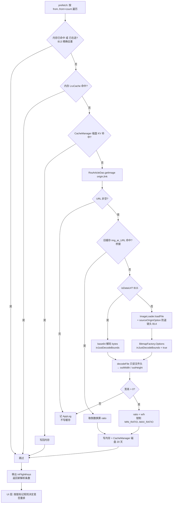
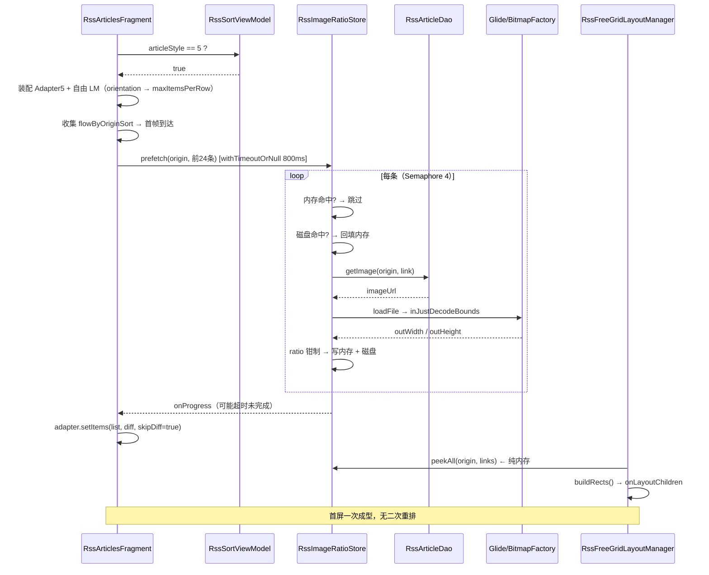
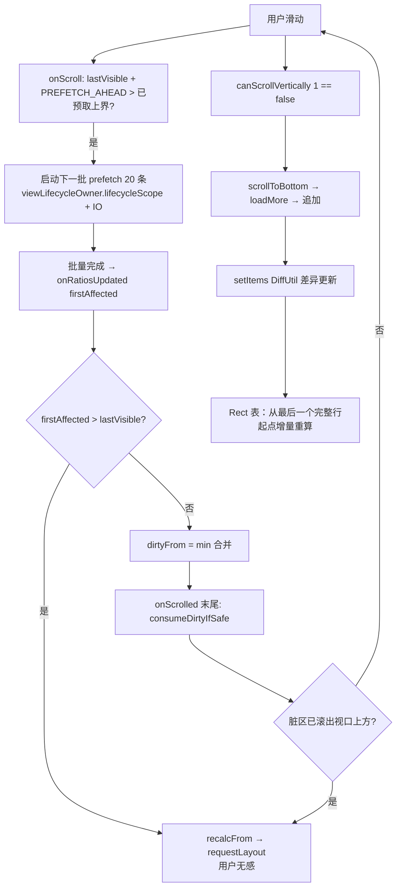
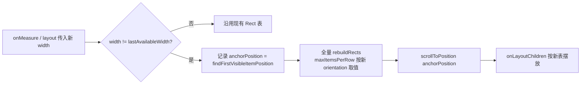

# 订阅源「自由」布局 — 技术设计（design.md）

> 状态：🔄 设计中（红队 6 轮已过、两项裁决已定稿，待检查点 1 审核）
> 前置：spec.md（Delta Spec）｜关联：`rss-image-load-optimization`（Glide 缓存与采样基础设施）

## Technical Approach

### 分层结构

```
┌──────────────────────────────────────────────────────────────┐
│  RssArticlesFragment（编排层）                                 │
│   · articleStyle=5 装配 LM + Adapter5                          │
│   · 首屏 gating（预取前 N 条再 setItems）                       │
│   · 滚动预取窗口驱动 + 预加载触发分支                            │
└────────────┬─────────────────────────────────┬───────────────┘
             │                                 │
┌────────────▼──────────────┐   ┌──────────────▼───────────────┐
│ RssFreeGridLayoutManager  │   │  RssImageRatioStore          │
│  · onLayoutChildren       │◄──┤  · peek(origin, link) 同步    │
│  · scrollVerticallyBy     │   │  · prefetch() IO 批量          │
│  · 滚动位置保存/恢复       │   │  · 三级缓存 + 源级中位数        │
└────────────┬──────────────┘   └──────────────┬───────────────┘
             │                                 │
┌────────────▼──────────────┐   ┌──────────────▼───────────────┐
│ FreeGridSizeCalculator    │   │ CacheManager（磁盘 KV）        │
│  · 一次 O(n) 算出 Rect 表  │   │ ImageLoader → BitmapFactory  │
│  · 增量重算 / 脏标记区间   │   │   .inJustDecodeBounds        │
└───────────────────────────┘   └──────────────────────────────┘
```

**核心分层原则**：`FreeGridSizeCalculator` 是**纯函数层**（无 Android 依赖，可 JVM 单测），`LayoutManager` 是**薄适配层**（只按 Rect 表摆 View），`RatioStore` 是**数据供应层**（唯一接触 I/O 的地方，且只在 IO 线程）。三者解耦，任一可单独替换。

### 算法一：分行 + 行内宽度分配

**输入**：`ratios: FloatArray`（= w/h，已钳制到 `[MIN_RATIO, MAX_RATIO]`）、`availableWidth: Int`、`spacing: Int`、`targetRowHeight: Int`。

**术语定义（全文统一，避免歧义）**：

| 符号 | 定义 |
|------|------|
| `availableWidth` | `recyclerView.width - paddingLeft - paddingRight`（**不含** item 间距）。Fragment 侧设 `setPadding(4,0,4,0)`，故竖屏下 `availableWidth = 屏幕宽 - 8dp` |
| `spacing` | 行内相邻图片之间的水平间距、以及行与行之间的垂直间距，同值 |
| `usableWidth(sumRatio, k)` | 行内 k 张图时能分给「图片总宽度」的像素 = `(availableWidth - (k-1) * spacing) / sumRatio`；`k <= 0` 或 `sumRatio <= 0` 时返回 `Int.MAX_VALUE` 兜底（防止除零与负间距参与运算） |
| 行高 `rowHeight` | `usableWidth(本行 ratio 之和, 本行张数) + TEXT_BLOCK_HEIGHT`。**注意：宽度分配只用「图片区高度」，文字块高度是行高的加数，不参与比例分配** |
| `TEXT_BLOCK_HEIGHT` (`T`) | 文字块固定高 = **46sp**，权威值定义在 `res/values/dimens.xml` 的 `rss_free_text_block_height`（AD-08 定稿方案 B：标题 13sp×1 行 + 时间 11sp×1 行 + 内边距 11dp）。**回退路径**：若实测密度不足，可改走方案 A 并把 `T` 置 0 |
| `targetRowHeight` | `TARGET_ROW_HEIGHT_RATIO × 屏幕宽`，语义为**目标图片区高度**（不含 `T`） |

**文字块与算法的兼容性（关键结论）**：因为行高统一 ⇒ 图片区高度 `H_img = rowHeight - T` 也统一 ⇒ 每张宽度 `= H_img × ratio_i` ⇒ 行内宽度和仍严格等于 `availableWidth`。**加入固定高度的文字块不破坏「整行撑满」性质**，算法只需在最终行高上加一个常数。反之，若文字块高度不固定（如 `maxLines` 随内容变化、或宽格子显示窄格子隐藏），该性质立即失效——故 spec 明确排除方案 C（自适应显隐）。

> 注意：行内间距由 `usableWidth()` 内部扣除，**不通过 `ItemDecoration` 实现** —— 在自定义 LayoutManager 下 item 的 left/right 由 Rect 表直接决定，若再挂 `ItemDecoration` 会造成 insets 双重计算。`RecyclerAdapter.onAttachedToRecyclerView` 仅对 `GridLayoutManager` 设 spanSizeLookup，不受影响。

**输出**：`IntArray` 扁平存储的矩形表 —— 每 item 占 4 个 int：`[left, top, right, bottom]`，长度 `4 × itemCount`。

```kotlin
// 伪码：贪心装填 + 目标行高逼近
fun buildRects(ratios, availableWidth, spacing, targetRowHeight): IntArray

  var i = 0                      // 当前 item
  var y = 0                      // 当前行顶部
  while (i < n):
      rowStart = i
      sumRatio = 0f
      heightIfStop = 0f

      // 1) 尽量装，直到行高逼近最优
      while (i < n):
          nextRatio = ratios[i]
          newSum = sumRatio + nextRatio
          // 可用宽度去掉 N 个间距；N = 本行图片数
          wIfStop     = usableWidth(sumRatio,      i - rowStart)
          wIfTakeOne  = usableWidth(newSum,        i - rowStart + 1)
          if (wIfStop   <= targetRowHeight) break          // 已达标，收行
          if (wIfTakeOne < targetRowHeight * SHRINK_TOLERANCE)
                                          break          // 再装行高会过矮，收行
          if (i - rowStart + 1 >= maxItemsPerRow) break     // 张数封顶
          sumRatio = newSum
          i++

      // 2) 修正：若“收行”比“再装一张”更接近目标行高，则少装一张
      if (i - rowStart >= 2 && i > rowStart + 1):
          hWith    = usableWidth(ratios[rowStart..<i] 求和, i - rowStart)
          hWithout = usableWidth(ratios[rowStart..<i-1] 求和, i - rowStart - 1)
          if (abs(hWithout - targetRowHeight) < abs(hWith - targetRowHeight)):
              i--            // 回退一张

      // 3) 计算真实行高（+ 文字块固定高）
      rowCount = i - rowStart
      imageHeight = if (isLastPartialRow) min(usableWidth(sumRatio, rowCount), targetRowHeight)
                    else                  usableWidth(sumRatio, rowCount)
      rowHeight = imageHeight + TEXT_BLOCK_HEIGHT        // 46sp（方案 B）；回退方案 A 时置 0

      // 4) 分配行内每张宽度：只用 imageHeight，文字块高度不参与
      var x = 0
      for (j in rowStart until i):
          w = (imageHeight * ratios[j]).roundToInt()
          if (j == i - 1) w = availableWidth - x        // 末位补偿 → 行宽误差恒为 0
          rects[4j]   = x
          rects[4j+1] = y
          rects[4j+2] = x + w
          rects[4j+3] = y + rowHeight                   // 含文字块的整格矩形
          x += w + spacing
      y += rowHeight + spacing
      if (rowCount == 0) break        // 死循环保护

  return rects
```

**约束常量**（权威定义位置：`FreeGridSizeCalculator` companion object —— 因 `RssImageRatioStore` 也需用钳制区间，放在纯函数层可被两侧共享，避免环形依赖。每个常量必须带注释说明取值依据）：

| 常量 | 值 | 定义位置 | 含义 / 取值依据 |
|------|-----|---------|----------------|
| `MIN_RATIO` / `MAX_RATIO` | 0.9f / 2.2f | Calculator | 极端比例钳制区间（AD-09 已裁决策略 X）。**2026-09-11 收紧**（真机用户反馈"第一排 2 个第二排 4 个"行数跳变观感差）：旧值 `[0.4, 3.0]` 允许窄竖图 4 张/行与横图 2 张/行并存，收紧到 `[0.9, 2.2]` 后每行收敛到 2-3 张；窄竖图/全景图由 `CENTER_CROP` 裁边（B4）。**回退路径**：若实测裁切过激可放宽上限至 `2.5`，或改走策略 Y |
| `TEXT_BLOCK_HEIGHT` | 46sp | **dimens.xml** | 文字块固定高（AD-08 已裁决方案 B）。权威定义在 `res/values/dimens.xml` 的 `rss_free_text_block_height`，XML 与 Kotlin 共用同一资源；**必须为常量，禁止随内容变化**（见术语表兼容性结论）。实测构成：标题 13sp ×1 行 + 时间 11sp ×1 行 + 内边距 11dp |
| `MIN_ROW_HEIGHT` / `MAX_ROW_HEIGHT` | 120dp / 260dp | Calculator | **保留但当前不启用**：仅策略 Y 生效。策略 Y 已评估未采用（AD-09），分支说明保留以便回退 |
| `DEFAULT_RATIO` | 1.33f | Calculator | 全局兜底比例（4:3）。依据：RSS 文章配图最常见的横构图比例 |
| `MAX_ITEMS_PORTRAIT` / `MAX_ITEMS_LANDSCAPE` | 4 / 6 | Calculator | 单行张数上限（R3）。依据：竖屏 4 张时单图 ≈ 屏宽 22%，再小则缩略图无辨识度 |
| `SHRINK_TOLERANCE` | 0.55f | Calculator | 再加一张后行高低于 `目标 × 0.55` 即收行（R3） |
| `TARGET_ROW_HEIGHT_RATIO` | 0.42f | Calculator | 目标行高 = 该比例 × 屏幕宽。**实测校准值**（360px 宽 / 间距 4px / 文字块 46px / 比例钳制 [0.9, 2.2]，2026-09-11 随钳制收紧同步）：4:3 横图 2 张/行 134px、16:9 宽图 2 张/行 100px、1:1 方图 2 张/行 178px、3:4 竖图（钳到 0.9）3 张/行 130px、混合 2 张/行（偶有 3）100–178px。不取 0.33 是因实测该值下混合行高仅约 98px，缩略图辨识度不足 |
| `SPACING_DP` | 4dp | LayoutManager | 间距。依据：与 `articleStyle=4`（三列）`setPadding(4,0,4,0)` 的视觉口径保持一致 |
| `PREFETCH_FIRST_SCREEN` | 24 | Fragment | 首屏 gating 预取条数（AD-05） |
| `FIRST_SCREEN_TIMEOUT_MS` | 800L | Fragment | 首屏 gating 等待上限（AD-05） |
| `PREFETCH_AHEAD` | 20 | Fragment | 滚动预取前瞻条数（R4 滚动预取场景） |

> 为什么用「目标行高逼近」而不是「固定行高 H 逐行缩放」？用户给的原始算法（固定 H → 算 scale → 得 realH）会导致行高随该行图片数量剧烈波动（3 张水平图一行可能只有 100px）。Google 相册 / Flickr 的实际算法是**让每行行高都尽量贴近一个目标值**，即上面的双分支判定 + 回退修正。这是对本需求原始描述的一处**算法升级**。

### 算法二：尺寸供给与回填

```kotlin
object RssImageRatioStore {
    // L1：内存（跨 Adapter/LM 复用）
    private val memory = LruCache<String, Float>(1024)
    // 源级样本，用于估算兜底（median）
    private val sourceSamples = HashMap<String, ArrayDeque<Float>>()
    // 正在解析中的键集合：滚动反复触发时精确去重 —— spec B13（见实施校准 #3）
    private val inFlightKeys: MutableSet<String> = Collections.newSetFromMap(HashMap())

    const val KEY_PREFIX = "rss_ar_v1_"          // 磁盘键前缀
    private const val SAVE_TIME_SECONDS = 60 * 60 * 24 * 20   // 20 天，与 Adapter3 对齐
    private const val PREFETCH_CONCURRENCY = 4

    /** 布局路径唯一入口：纯内存读，O(1)，零 I/O —— 满足 spec B10 */
    fun peek(origin: String, link: String): Float =
        memory[keyOf(origin, link)] ?: medianOf(origin)   // 未命中 → 源级中位数

    fun peekAll(origin: String, links: List<String>): FloatArray

    /**
     * 预取：必须在 IO 线程调用。
     * @param from 起始下标；已命中内存或已在途的条目会被逐条跳过（B13）
     * @param count 本次预取条数
     * @return 本次实际新解析出的条目数（0 表示全部命中，调用方无需重排）
     */
    suspend fun prefetch(
        context: Context, origin: String, articles: List<RssArticle>, from: Int, count: Int
    ): Int
}
```

> **契约铁律**：`peek()` / `peekAll()` 只允许读内存 `LruCache` 与源级样本表；**严禁**触碰 `CacheManager`（其 `getFloat()` 内部是 `runBlocking(IO) { cacheDao.get }`，在主线程调用会直接卡顿甚至 ANR）与任何图片解码。磁盘与解码只在 `prefetch()` 内、IO 线程上发生。

`prefetch` 单条流程（`Semaphore(PREFETCH_CONCURRENCY)` 限并发，`coroutineScope` + 标准协程，不引入项目未知的扩展函数）：



**关键实现约束**：

| 约束 | 说明 | 对应 spec |
|------|------|----------|
| 防盗链头 | 网络路径必须 `RequestOptions().set(OkHttpModelLoader.sourceOriginOption, origin)`，与列表展示完全一致；缺头会 403 → 永久落回估算值 | B14 / R4 Scenario |
| base64 分支 | `isDataUrl()` 时直接 base64 解码为 `ByteArray` 交给 `inJustDecodeBounds`，不落盘（复用既有 `LegadoDataUrlLoader` 同族能力） | B15 |
| 失败不写缓存 | 解码失败/宽高为 0 时**只记日志不写缓存**，保证下次进入可重试；否则一次偶发失败会被缓存 20 天 | R4 Scenario |
| 去重 | 以缓存键维护 `inFlightKeys` 集合：已在内存或已在途的条目逐条跳过，不重复查库/下载 | B13 |
| 源级样本 | 每次成功解析后把 ratio 推入该源样本队列（上限 32 条，FIFO），`medianOf(origin)` 取中位数作为估算值 | B3 |
| 并发安全 | `memory`（LruCache 内部同步）、`inFlightKeys`（`Collections.newSetFromMap(HashMap)`）、`sourceSamples`（访问持锁）均为线程安全结构；写回内存可在任意线程 | B11 |

**三级缓存键设计**（关键决策）：

| 层 | 键 | 为什么 |
|----|----|--------|
| 内存 / 磁盘 | `rss_ar_v1_{origin}@{link}` | **布局时唯一可同步获得的稳定标识**。`image` URL 需异步查库（RSS 主查询为规避 CursorWindow 2MB 不 select image 列），无法用于同步布局路径 |
| 桥接读 | `img_ar_{imageUrl}` | Adapter3（瀑布流）历史缓存，值是 **height/width**（需取倒数换算为 w/h）；命中即复用，避免重复下载解码 |

### Rect 表缓存与失效条件

`FreeGridSizeCalculator` 的计算结果必须在 LayoutManager 内缓存，**禁止每次 `onLayoutChildren` 重算**：

| 状态 | 说明 |
|------|------|
| `rects: IntArray` | 扁平存储的矩形表，长度 `4 × itemCount` |
| `rectsValid: Boolean` | `false` 时下次布局前必须先 `buildRects()` |
| `lastAvailableWidth / lastItemCount / lastOrientation` | 失效判定依据 |

**失效（置 `rectsValid = false`）的三个触发条件**：

1. `onItemsChanged`（数据增删/整体替换）—— 顺带处理分页追加的增量优化：若为**纯尾部追加**（旧 itemCount 不变、仅末尾新增），则只调用 `recalcFrom(最后一个完整行的起始 position)`，跳过早段重算（B7）
2. `availableWidth` 变化（旋转 / 分屏 / 折叠屏）—— 同时按新 `orientation` 重取 `MAX_ITEMS_*`，并在重算前记录 `anchorPosition = findFirstVisibleItemPosition()`，重算后 `scrollToPosition(anchorPosition)` 恢复视觉位置（B6）
3. ratio 修订（`onRatiosUpdated` / `consumeDirtyIfSafe` 消费脏标记）—— 走 `recalcFrom(affectedFrom)`

> `recalcFrom(p)` 的语义：从 p 所属行的**起点**开始重算到末尾（不能从 p 本身开始，否则会把 p 所在行的行内分配打断）。已由 tasks 2.2.4 单测锁定「增量结果必须与全量结果逐字节一致」。

### 滚动实现要点

| 要点 | 做法 | 理由 |
|------|------|------|
| 偏移量累计 | 持有 `mScrollOffset`（当前滚动偏移，相对 Rect 表原点），`scrollVerticallyBy` 先 `offsetChildrenVertical(-dy)`，再更新 `mScrollOffset` 并根据可见区间 `fill()` | 与 `LinearLayoutManager` 同款机制；`computeVerticalScrollOffset` 直接返回 `mScrollOffset` |
| `fill()` 缓冲 | 上下各多填充 1 屏高度 | 避免 `scrollVerticallyBy` 返回 0 导致滑动卡顿（RecyclerView 的「consume 不足即停止」行为） |
| 子 View 摆放 | 用 `layoutDecoratedWithMargins(child, l, t, r, b)`，`t = rectTop - mScrollOffset` | 复用 RecyclerView 的 decoration/cursor 处理逻辑 |
| `generateDefaultLayoutParams` | 返回 `LayoutParams(MATCH_PARENT, WRAP_CONTENT)`（**仅声明用**，实际尺寸由 `measureChild` 传入 Rect 宽高决定） | 自定义 LM 必须返回非 null，否则 `onCreateViewHolder` 抛异常 |
| 子 View 测量 | `measureChildWithMargins(child, 0, 0)` 前先把 `child.layoutParams.width/height` 设为该 Rect 的宽高 | 让 `WRAP_CONTENT` 的 ImageView 也能被精确赋值 |
| `computeVerticalScrollRange` | 返回 Rect 表总高度 | 供 SwipeRefreshLayout 等协作组件换算滚动比例 |

### 回填与重排策略（抗抖动的核心）

```kotlin
// LayoutManager 侧状态
private var dirtyFrom = -1        // 待重算起点 position，-1 = 干净
private var lastAvailableWidth = 0

// RatioStore 批量完成回调（主线程）
fun onRatiosUpdated(affectedFrom: Int) {
    if (affectedFrom > lastVisibleItemPosition()) {
        recalcFrom(affectedFrom)              // 屏幕下方 → 立即重算，用户无感
        requestLayout()
    } else {
        dirtyFrom = minOf(dirtyFrom.takeIf { it >= 0 } ?: Int.MAX_VALUE, affectedFrom)
    }
}

// 滚动时消化脏标记：一旦脏区整体滚出视口上方，才真正重算
private fun consumeDirtyIfSafe() {
    if (dirtyFrom >= 0 && dirtyFrom < findLastVisibleItemPosition()) return  // 仍可见，继续等
    if (dirtyFrom >= 0) { recalcFrom(dirtyFrom); dirtyFrom = -1; requestLayout() }
}
```

**首屏 gating**（Fragment 层，仅 `articleStyle == 5` 生效）：

```kotlin
// initData() 中，替换原来的“先 setItems 再 delay(200)”

// 关键：预取任务必须挂在 viewLifecycleOwner.lifecycleScope（独立 Job），
// 而不是被 withTimeoutOrNull 直接包裹 —— 后者超时会「取消」被包裹的挂起调用，
// 导致剩余 ratio 永远拿不到（除非用户重新进入页面）。这里只等待、不取消。
val preloadJob = viewLifecycleOwner.lifecycleScope.launch(IO) {
    ratioStore.prefetch(origin, list, from = 0, count = PREFETCH_FIRST_SCREEN)
}
withTimeoutOrNull(FIRST_SCREEN_TIMEOUT_MS) { preloadJob.join() }   // 超时仅放弃等待
firstLoad = false

adapter.setItems(list, diffCallback, true)
// preloadJob 若仍未完成，其后续结果通过 onRatiosUpdated() 走脏标记路径补正
```

> 只有**首次进入**做 gating。后续分页/刷新走正常路径 + 脏标记机制，不阻塞。
> `preloadJob` 由 `lifecycleScope` 托管：`onDestroyView` 时随生命周期自动取消（对应 spec B11 / B12）。

## Architecture Decisions

### AD-01: 自定义 LayoutManager + 预计算 Rect 表，而非行合并
- **Version**: v1.0
- **UpdateTime**: 2026-09-11
- **Context**: 需求为等行高流式自由网格。候选实现有「自定义 LM」与「Adapter 内行合并（item = 一行）」两条主流路线；本项目 RSS 列表大量依赖 position 语义（播放器列表传参、两处 `lastPlayedArticleLink → indexOfFirst → scrollToPosition` 位置记忆、`DiffUtil.ItemCallback<RssArticle>`、`getActualItemCount()` 分页判断）。
- **Concern**: 行合并方案虽然让 `LinearLayoutManager` 承担全部滚动/回收/footer 复杂度，但会把 Adapter 数据从 `List<RssArticle>` 变成 `List<Row>`，**侵入上述 5 处现有逻辑**，且分页追加时行重排需自行维护，回归面反而更大。
- **Decision**: 自研 `RssFreeGridLayoutManager`，以 `FreeGridSizeCalculator` 预计算 Rect 表把复杂度压平；`RatioStore` 独立供应尺寸。
- **Goal**: 数据结构零侵入、position 语义不变、单图回收粒度、性能上限最高。
- **Tradeoff**: 需自行实现约 350–450 行 LayoutManager（滚动、回收、脚部、状态保存）。接受该成本，换取现有联动逻辑零改动。
- **Status**: Accepted
- **Superseded-by**: 无
- **ChangeLog**: v1.0 初版

### AD-02: 三级 ratio 缓存以 `origin@link` 为键，桥接 `img_ar_{imageUrl}` 旧缓存
- **Version**: v1.0
- **UpdateTime**: 2026-09-11
- **Context**: `RssArticlesAdapter3`（瀑布流）已有 `img_ar_{url} → height/width` 的 LruCache + `CacheManager` 缓存（TTL 20 天）。但自由布局必须在**布局前**知道整段 ratio 序列，而 `image` URL 需异步单行查库（`flowByOriginSort` 不 select image 列）。
- **Concern**: 若沿用 imageUrl 为键，自由布局将无法在同步路径取值；若不复用旧缓存，同一批图会被解码两次。
- **Decision**: 新键 `rss_ar_v1_{origin}@{link}`（可用于同步布局路径）；预取时先探测 `img_ar_{imageUrl}`，命中则取倒数（Adapter3 存的是 **h/w**）换算复用。
- **Goal**: 布局路径零 I/O；跨布局不重复解码。
- **Tradeoff**: 短期存在两套缓存键（同一图两份数据，各 4 字节 Float，可忽略）；Adapter3 若后续下线需清理桥接分支。
- **Status**: Accepted
- **Superseded-by**: 无
- **ChangeLog**: v1.0 初版

### AD-03: 布局框比例 + `CENTER_CROP`，而非 `FIT_CENTER`
- **Version**: v1.0
- **UpdateTime**: 2026-09-11
- **Context**: 用户避坑清单第 2 条主张「必须 `FIT_CENTER` 完整展示原图，`CENTER_CROP` 会裁剪」。
- **Concern**: 该主张建立在「布局框比例 = 图片真实比例」的理想假设上。实际存在两类偏差：① ratio 来自缓存或钳制，与真实值有差；② 整数像素取整导致 `layoutWidth / layoutHeight` 与 `ratio_j` 不完全相等。此时 `FIT_CENTER` 会在布局框内留出**空白边**，而「不留无效空白」是本需求的明确目标。
- **Decision**: `CENTER_CROP`。偏差通常 1–2px，裁边不可感知；而 `FIT_CENTER` 的空白即使只有 1px，在密集网格中会形成可见的白色网格线。
- **Goal**: 视觉无留白、无变形感（偏差 < 0.5%）。
- **Tradeoff**: 极端比例图（被钳制到 2.2/0.9 的，2026-09-11 收紧后普通竖图/全景图也会轻微裁边）会裁掉较多边角内容。已由 R2 Scenario 显式定义为期望行为；点击进入图库可看完整原图。
- **Status**: Accepted
- **Superseded-by**: 无
- **ChangeLog**: v1.0 初版（对用户原始方案的**技术修正**）

### AD-04: 不做 DB schema 迁移，复用 `CacheManager` KV
- **Version**: v1.0
- **UpdateTime**: 2026-09-11
- **Context**: 用户建议「数据库保存 width/height」以解决布局抖动。但 `RssArticle` 是 `primaryKeys = ["origin","link","sort"]` 的多主键表，新增列需 Room 迁移 + schema 文件更新 + 覆盖率安装验证；且 width/height 属**纯缓存派生数据**（图片换了就失效），不具备业务实体语义。
- **Concern**: 迁移成本与风险不对等；`CacheManager` 已提供带 TTL 的 KV 存储（`cacheDao`），语义完全匹配。
- **Decision**: 零 schema 变更，ratio 落 `CacheManager`（键 `rss_ar_v1_...`，TTL 20 天）。
- **Goal**: 规避 `database-migration-safety` 规范的全套风控流程，且天然带过期淘汰。
- **Tradeoff**: KV 读取为 `runBlocking` 查库 —— 因此**严禁在布局路径使用**（spec B10），只在 IO 线程预取时调用。
- **Status**: Accepted
- **Superseded-by**: 无
- **ChangeLog**: v1.0 初版

### AD-05: 首屏 gating + 脏标记延迟重排
- **Version**: v1.0
- **UpdateTime**: 2026-09-11
- **Context**: 冷启动时 ratio 三级缓存全空，若立即按估算值布局，图片解码完成后必然重排 —— 用户能直接看到网格跳动。
- **Concern**: 「首次加载被感知的抖动」是此类布局最常见的差评来源；但无限期等待会拖慢首屏。
- **Decision**: 双策略组合 —— ① 首屏（仅首次）先预取前 24 条，最多等 `800ms`，超时以估算值一次成型；② 运行期 ratio 真值仅在「影响点位于当前可见区下方」时立即重排，位于可见区内则记 `dirtyFrom`，待滚出视口上方后消费。
- **Goal**: 用户视线范围内的内容永不自行跳动。
- **Tradeoff**: 冷启动首屏最多慢 800ms；个别行的比例会短暂使用估算值（视觉上仍保持网格整齐，只是该行行高略偏）。
- **Status**: Accepted
- **Superseded-by**: 无
- **ChangeLog**: v1.0 初版

### AD-06: 否决引入 greedo-layout，仅移植算法思路
- **Version**: v1.0
- **UpdateTime**: 2026-09-11
- **Context**: 500px/greedo-layout-for-android 是同类需求的头部开源实现（MIT，1.6k★），纯 Java，提供 `GreedoLayoutManager` + `SizeCalculatorDelegate` + `GreedoSpacingItemDecoration`。
- **Concern**: ① 其 Maven 仓库托管在 `https://github.com/.../raw/master/releases/`，而本项目 `GRADLE_USER_HOME=F:\gh`，墙内/离线构建脆弱；② 最后更新 2022-06（`v1.5.3`），无维护；③ **不支持 footer 独占行** —— 本列表的 `LoadMoreView` 会被当作图片摆进行内；④ 不支持 ratio 动态回填/脏标记；⑤ 其仓库 commit 记录中仍在修「last row not filled」类问题。
- **Decision**: 不引入依赖。参照其「预计算 Rect 表 + 薄 LayoutManager」架构，用 Kotlin 自研，并在源码注释标注算法来源（MIT 兼容，仅借鉴思路不复制代码）。
- **Goal**: 零构建风险 + 可完全掌控 footer/回填/间距等本项目定制点。
- **Tradeoff**: 承担实现工作量（AD-01 的 Tradeoff）。**改造 greedo 的成本 ≈ 自研**，故自研更优。
- **Status**: Accepted
- **Superseded-by**: 无
- **ChangeLog**: v1.0 初版

### AD-07: 不改动 0–4 分支任何代码
- **Version**: v1.0
- **UpdateTime**: 2026-09-11
- **Context**: 新增布局最安全的做法是把改动限制在「新增分支」，但 `RssArticlesFragment` 中 `articleStyle` 的判定散落于 adapter 选择、layoutManager 选择、`isGridLayout` 三处。
- **Concern**: 若把 `isGridLayout` 从 `== 2` 改成 `in 2..5` 之类，可能影响 3/4 分支的占位策略（3 号瀑布流当前不显示占位）。
- **Decision**: 改动**只增不改**：三处判定各加 `5 ->` 分支；`isGridLayout` 改为 `articleStyle == 2 || articleStyle == 5`（布尔或，语义明确且不触碰 3/4）。
- **Goal**: 0–4 行为 100% 保持，回归风险隔离在新分支内。
- **Tradeoff**: 判定表达式略冗余（可接受，可读性优先）。
- **Status**: Accepted
- **Superseded-by**: 无
- **ChangeLog**: v1.0 初版

### AD-08: item 保留标题与时间（文字块固定高），不做纯图
- **Version**: v1.0
- **UpdateTime**: 2026-09-11
- **Context**: 初版设计曾决定「自由布局不显示标题/时间文字」，理由是会破坏比例与观感。但逐文件读取五种样式后确认：**`item_rss_article.xml` / `_1` / `_2` / `_3` / `_4` 无一种为纯图**，全部为「图上文下」（style 0 为左右），统一带标题 + 时间。
- **Concern**: 若自由布局做成纯图，将在同一列表页的样式切换中出现视觉语言断裂——用户点「切换布局」时会感到进入了另一个产品，而非同一列表的另一种排布。同时，缺少标题会让用户无法判断是否已读内容之外的信息。
- **Decision**: 保留标题 + 时间，采用**方案 B（图下固定文字块）**：图片区在上（`CardView` 圆角 + `centerCrop`），下方 1 行标题 + 1 行时间，`TEXT_BLOCK_HEIGHT = 46sp`（取自 `dimens.xml`，同一配置下为常量；`maxLines=1` + 固定内边距，禁止随内容变化）。明确排除方案 C（行内自适应显隐）。
- **Goal**: 与既有 5 种样式视觉语言一致；同时因 `T` 为常量，不破坏「行高统一 + 整行撑满」的算法性质。
- **Tradeoff**: 一屏图片数减少约 25–30%（方案 A 无此代价，但窄格子文字不可读已于裁决中否决）。
- **Status**: Accepted（2026-09-11 用户裁决：方案 B）
- **Superseded-by**: 无
- **ChangeLog**: v1.0 初版推翻初稿「纯图」决定 → 同日用户裁决定为方案 B

### AD-09: 极端比例图采用钳制裁边（策略 X）
- **Version**: v1.0
- **UpdateTime**: 2026-09-11
- **Context**: 初版设计选择「ratio 钳制到 `[0.4, 3.0]` + `CENTER_CROP` 裁边」，以换取行高恒定与整行撑满。对照发现：**瀑布布局（style 3）是不裁图的**（图片高 = 列宽 ÷ 原比例，完整显示）→ 该策略会让自由布局成为全列表**唯一会裁图的样式**。
- **Concern**: 图片订阅源的核心诉求是看图，全景图 / 长条图被裁掉两端是可直接被感知的内容损失。
- **Decision**: 采用**策略 X（钳制 + 裁边）**。ratio 钳制到 `MIN_RATIO..MAX_RATIO = [0.4, 3.0]`，超出部分由 `CENTER_CROP` 裁掉。行高恒定、整行永远撑满得到保留。策略 Y（保真 + 独占行留白）记录为已评估未采用方案。
- **Goal**: 保住「每行撑满 + 行高统一」这一特性核心不变式；用有界的裁剪换取整屏观感一致。
- **Tradeoff**: 比例 5:1 的全景图在钳制到 3.0 后损失约 40% 宽度；ratio < 0.4 的长条图同理损失高度。**接受理由**：真实 RSS 配图绝大多数落在 0.5–2.0 区间，超出 `[0.4, 3.0]` 属少数；且点击进入图库仍可查看完整原图。
- **兜底预案**: `MIN_RATIO` / `MAX_RATIO` 为单点常量，若实测裁切过于激进，可放宽上限至 `4.0` 或改走策略 Y（计算器两处分支，切换成本极低）。**该回退路径已保留在设计中，不删除策略 Y 的分支说明。**
- **Status**: Accepted（2026-09-11 用户裁决：策略 X）
- **Superseded-by**: 无
- **ChangeLog**: v1.0 初版（自曝初稿取舍缺陷）→ 同日用户裁决定为策略 X → **同日 v1.1 收紧钳制区间 `[0.4, 3.0]` → `[0.9, 2.2]`**（用户真机反馈"第一排 2 个第二排 4 个"行数跳变观感差：旧区间允许窄竖图 4 张/行与横图 2 张/行并存，收紧后每行收敛 2-3 张，窄图/全景由 CENTER_CROP 轻微裁边；单测 typicalSources/ratioClamping 已同步）

## Data Flow

### 进入自由布局列表（首次）



### 滚动与分页追加



### 宽度变化（旋转 / 分屏）



## 实施校准（Implementation Notes）

> 实施于 2026-09-11。以下 5 处与设计初稿不同，均为实施中发现的更优/更稳做法，已回写代码注释与本表。
> 原则：**设计意图不变，实现手段按实测调整**；凡调整必在此留痕，避免文档与代码漂移。

| # | 设计初稿 | 实施做法 | 理由 |
|---|---------|---------|------|
| 1 | `TEXT_BLOCK_HEIGHT_DP = 46` 定义在 `FreeGridSizeCalculator` | 权威值改为 `res/values/dimens.xml` 的 `rss_free_text_block_height`（**46sp**），XML 与 Kotlin 读取同一资源 | ①消除「XML 写 46dp、Kotlin 写 46」的双份数值漂移；②单位用 **sp** 使其随系统字号缩放，大字号下文字块同步变高、标题不被裁切（同一配置下仍是常量，不破坏行高统一） |
| 2 | 已读态「图上叠加半透明遮罩」 | 改为 `imageView.alpha = 0.55f` 降亮 + 标题次要色 | 视觉等价但省掉一个覆盖层 View 与一个遮罩颜色资源；alpha 不参与测量，对 LayoutManager 的矩形表零影响 |
| 3 | `prefetchedUpperBound`（单调递增已预取上界）去重 | 改为 `inFlightKeys` 集合（**已在内存 / 已在途** 精确去重） | 上界方案在批次被取消时会把该区间标记为「已预取」造成**永久跳过**；精确去重无此风险，且重复触发天然幂等 |
| 4 | B7：分页纯尾部追加走 `recalcFrom(末行起点)` 增量 | 结构变化（增删）统一走全量重算 | 千级数据下增量与全量的耗时差在毫秒内，收益不足以抵消「判断是否纯尾部追加」的复杂度与出错风险。`recalcFrom` 的增量能力保留给 ratio 回填路径（收效明显处）。若后续实测万级数据卡顿，再按 B7 补分支 |
| 5 | 视频角标（未指定资源） | 自绘矢量 `ic_rss_free_video_badge.xml`（半透明黑圆底 + 白色播放三角） | 避免为角标新增颜色资源；半透明中性遮罩属 `color.md` §五「主题体系外」豁免类别（媒体画布上的内容标识） |

**验证方式**：`FreeGridSizeCalculatorTest` 锁定算法不变式；`RssFreeGridLayoutManager` 提供 `debugContentHeight()` / `debugRect()` / `debugRows()` 供真机走查输出诊断数据。

## File Changes

| 文件 | 类型 | 变更内容 |
|------|------|---------|
| `app/src/main/java/io/legado/app/ui/rss/article/free/FreeGridSizeCalculator.kt` | 新增 | 纯 Kotlin 预计算器：`buildRects()` 全量、`recalcFrom()` 增量、**约束常量权威定义处**（见常量表）；**无 Android 依赖**，可 JVM 单测 |
| `app/src/main/java/io/legado/app/ui/rss/article/free/RssFreeGridLayoutManager.kt` | 新增 | 薄 LayoutManager：`onLayoutChildren` / `scrollVerticallyBy` / `canScrollVertically` / `computeVerticalScrollOffset`+`Extent`+`Range` / `scrollToPosition` / `onSaveInstanceState`+`onRestoreInstanceState` / `consumeDirtyIfSafe` / footer 独占行 / 宽度变化检测 / Rect 表缓存与失效 / `generateDefaultLayoutParams` / `supportsPredictiveItemAnimations` 不覆写（保持无动画） |
| `app/src/main/java/io/legado/app/help/image/RssImageRatioStore.kt` | 新增 | 三级 ratio 缓存（内存 LruCache + CacheManager + 异步解码）、源级中位数、`inFlightKeys` 精确去重、`prefetch(from, count)` 限并发批量、`img_ar_` 桥接、base64 分支、防盗链头注入。**归入 `help/image/`，与既有 `ImageUrlCache.kt` 同族**（`help/rss/` 目录不存在，已核实） |
| `app/src/main/java/io/legado/app/ui/rss/article/RssArticlesAdapter5.kt` | 新增 | 自由布局 Adapter：绑定图片（`CENTER_CROP`）、标题/时间文字块、**已读态用图片 alpha 降亮**（见实施校准 #2）、视频角标、`contentDescription` 取标题、tag 防复用错位 |
| `app/src/main/res/layout/item_rss_article_free.xml` | 新增 | **动态高度容器沿用瀑布流的 `CardView(cardCornerRadius=12dp, clipToOutline, cardElevation=0dp)` 方案**（因格子高度动态，`FilletImageView` 需固定尺寸）；内含图片区 `ImageView(centerCrop, layout_weight=1)` + 图下固定文字块（标题 `maxLines=1` + 时间 `maxLines=1`，高 = `@dimen/rss_free_text_block_height`）+ 右上角视频角标 |
| `app/src/test/java/io/legado/app/ui/rss/article/free/FreeGridSizeCalculatorTest.kt` | 新增 | JVM 单测：行宽严格撑满 / 增量==全量 / footer 独占行 / 极端 ratio 不 hang / 末行左对齐。**测试目录结构与既有 `app/src/test/java/io/legado/app/...` 一致**（已核实） |
| `app/src/main/res/values/arrays.xml` | 修改 | `layout_type` 追加 `<item>自由</item>`（第 6 项，index=5） |
| `app/src/main/res/values/dimens.xml` | 修改 | 新增 `rss_free_text_block_height` = **46sp**（文字块高权威源，用 sp 以随字号缩放） |
| `app/src/main/res/drawable/ic_rss_free_video_badge.xml` | 新增 | 视频角标矢量图（半透明黑圆底 + 白色播放三角），自包含避免新增颜色资源 |
| `app/src/main/assets/updateLog.md` | 修改 | 按版本交付同步规范追加条目 |
| `app/src/main/java/io/legado/app/ui/rss/article/RssArticlesFragment.kt` | 修改 | ① adapter `when` 增 `5 -> RssArticlesAdapter5(...)`；② layoutManager `when` 增 `5` 分支（装配自由 LM + padding 4dp + `itemAnimator = null`）；③ `isGridLayout` 改 `== 2 \|\| == 5`；④ `initData()` 首屏 gating；⑤ 滚动预取窗口；⑥ 预加载触发分支增自由 LM 判断；⑦ `onDestroyView` 取消预取协程 |
| `app/src/main/res/values/strings.xml` + `values-zh/strings.xml` | **不改** | 「自由」作为 `layout_type` 数组项，沿用现有「列表/单列/双列/瀑布/三列」做法：`arrays.xml` 单文件内置中文，既有 5 项均无 `values-zh` 变体。**不新增 string 资源**，避免与既有口径分裂 |
| `app/src/main/java/io/legado/app/ui/rss/article/RssSortViewModel.kt` | 修改 | `switchLayout()`：`it.articleStyle < 4` → `< 5` |
| `docs/INDEX.md` | 修改 | 登记本 spec |

## 关键技术风险与对策

| 风险 | 触发条件 | 对策 |
|------|---------|------|
| 主线程阻塞（`CacheManager.getFloat` 内部 `runBlocking`） | 若误在 `peek()` 中查磁盘 | `peek()` 契约写死「只读内存 LruCache + 源级中位数」，代码注释标注禁止事项；磁盘只在 `prefetch()`（IO 线程）访问 |
| 预取任务被超时取消，剩余 ratio 永远拿不到 | 用 `withTimeoutOrNull { prefetch(...) }` 直接包裹挂起调用 | 预取挂在独立的 `lifecycleScope` Job 上，gating 只 `join()` 等待（详见「首屏 gating」代码块注释） |
| 尺寸探测 403 → 永久落回估算值 | 请求缺少防盗链头 | `prefetch` 网络路径强制注入 `OkHttpModelLoader.sourceOriginOption`，与列表展示同源（B14） |
| 一次失败被缓存 20 天，永不重试 | 解码失败仍写缓存 | 失败路径**只记 AppLog 不写缓存**（R4 Scenario） |
| 滚动中重复预取 / 并发任务叠加 | 每次 `onScrolled` 都判越界 | `inFlightKeys` 精确去重（B13，见实施校准 #3） |
| 每次布局都全量重算 Rect 表 | 未做结果缓存 | `rectsValid` + 三失效条件（数据变化 / 宽度变化 / ratio 修订）；纯尾部追加走 `recalcFrom(末行起点)` 增量 |
| 死循环 / 行数爆炸 | `sumRatio == 0`、`ratios` 全 0、`rowCount == 0` | `rowCount == 0` 时 break；`usableWidth()` 对 `k <= 0` 或 `sumRatio <= 0` 返回 `Int.MAX_VALUE` 兜底；ratio 入缓存前强制钳制到 `[0.4, 3.0]`，杜绝 0 与负值 |
| 回收错位（旧图出现在新位置） | 复用 ViewHolder 时异步加载未校验 | 沿用现有 `holder.itemView.tag = item.link` 机制，回调前校验 tag（与 `BaseRssArticlesAdapter.loadArticleImage` 同款） |
| footer 被当图片参与分行 | Rect 计算时未区分 viewType | 预计算器入参增加 `viewTypes: IntArray`；遇到 footer（`viewType >= TYPE_FOOTER_VIEW`）强制空一行、给全宽、高度取 `measuredHeight`（或保守值 48dp，下一帧实测后重算） |
| 滚动位置丢失 | 返回列表时 `scrollToPosition` 落在行中间 | `findFirstVisibleItemPosition` 返回该行最左 item 的 position（语义与其他 LM 一致）；`onSaveInstanceState` 保存首可见 position + 偏移 |
| DiffUtil 动画错位 | 自定义 LM 未实现预测动画 | `itemAnimator = null`（与现有 3 号瀑布流一致） |
| 首屏 gating 反而变慢 | 网络差、24 条全未命中 | `withTimeoutOrNull(FIRST_SCREEN_TIMEOUT_MS)` 硬上限；超时立即 setItems，剩余由脏标记机制补 |

## 验证方式

| 级别 | 验证内容 | 判据 |
|------|---------|------|
| L1 | 编译通过 | `./gradlew :app:compileAppDebugKotlin` 零错误（flavor 仅 `app`，任务必须带 `App` 前缀） |
| L1 | 单元测试 | `./gradlew testAppDebugUnitTest`（按项目 AGENTS.md 口径）；`FreeGridSizeCalculatorTest` 全绿 |
| L2 | 真机功能（测试包 `io.legado.miss.app.debug`） | 自由布局渲染正常；行宽误差 0px；**常规比例图**无裁剪变形（对比原图）；**极端比例图按裁决策略表现**（策略 X 裁边 / 策略 Y 留白）；标题与时间正常显示且不撑高格子；footer 独占行；滚动到第 500 项不卡顿 |
| L2 | 抗抖动 | 冷启动首屏无可见跳动；滚动中无行高突变 |
| L3 | 边界场景 | 旋转/分屏宽度自适应且位置不丢；空列表/全无图源/极端比例源/防盗链源/base64 图源正常；快速切标签页无错位；返回列表位置记忆正确（播放器/图库两条链路） |
| L3 | 回归 | 0–4 五种布局行为与改动前一致（拍照对比） |
| 工具 | AI 端到端 | 必须用 `ai_tests\venv\Scripts\python.exe`；`python ai_tests/run_e2e.py --tc all` |
| 工具 | 打包安装 | `ai_tests/scripts/quick_build_install.py`（编译成功保留 daemon，失败自动清场） |
