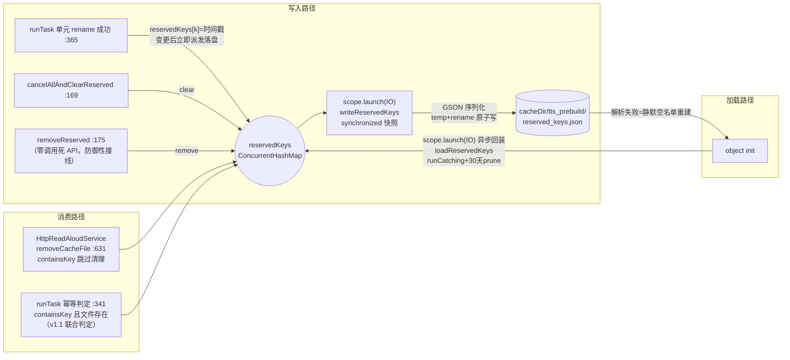
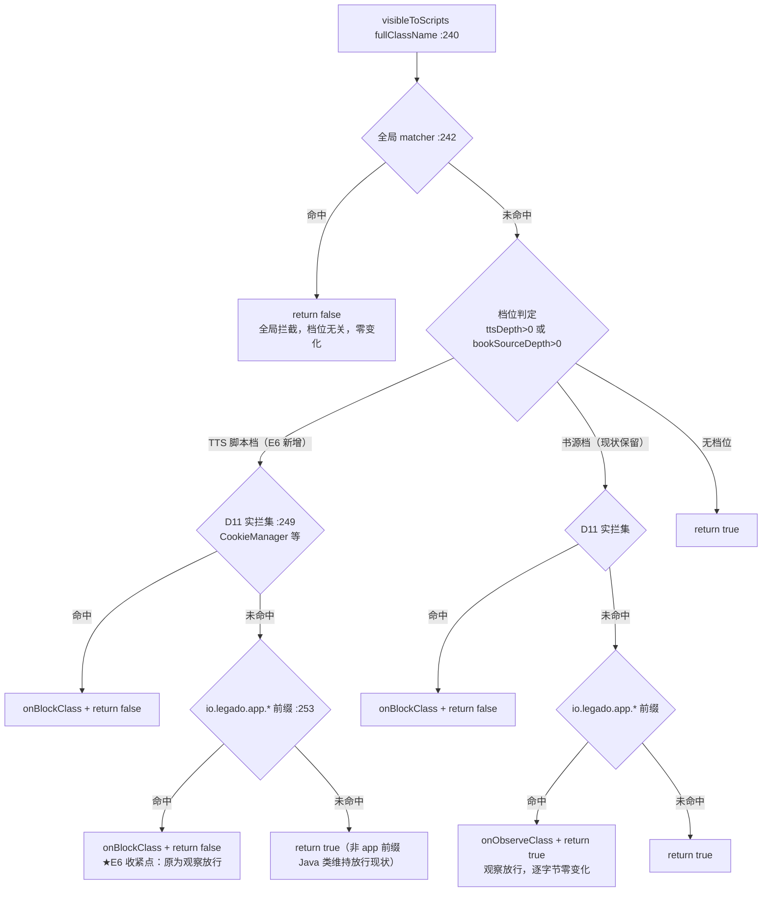

# design.md — TTS 批次E 加固（tts-batch-e-hardening）

> 版本：v1.1 ｜ 更新时间：2026-09-10 ｜ 输入：`code-review-20260910.md` 批次E 六项 + 本仓源码逐点核实（行号以批次A-D 修复推送 5a10b01 后工作树为准）+ 红队两路审查 32 条发现裁决修正（§8 记录）
> 上游契约：`optimize-tts-engine-phase2/design.md`（§3.7 键单源/保留名单、AD-13 Room v110 冻结、AD-04 脚本沙箱）——本文为其增量加固层，不推翻任何上游定型项。

## 0. 阅读指南（实施 AI 必读）

**阅读顺序**：本文 §2（总体架构与两张图）→ §3.1-3.6（逐项详设）→ §4（AD-E-01~06 决策依据）→ §5（异常矩阵，实现时逐条对照）→ 同目录 spec.md（R1-R8 场景）→ tasks.md。实施时逐条对照本文与源码行号，**禁止凭经验臆测**；与上游表述冲突处，以上游键单源契约（§3.7.1）与 Room v110 冻结为最高优先，本文均为增量。

### 0.1 术语表（全文统一用词）

| 术语 | 语义 |
|------|------|
| AI 预热（E1） | 起播点 fire-and-forget 预调 `ensurePlayableCache`，将 AI 角色分配结果提前写入 aiReadAloudRoleCache 表 |
| 名单落盘（E2） | `TtsPrebuildManager.reservedKeys`（预合成保留名单）持久化到 cacheDir 单 JSON 文件 |
| 模板备份/恢复（E3） | 选角模板（ttsCastingTemplates 表）进 App 备份三通道 |
| 首装链（E4） | `DefaultData.upVersion()` 版本门控驱动的内置资产导入链 |
| 键因子三件套（E5） | engineKey/speedKey/voiceKey 三个缓存键输入因子的获取与字符串化 |
| TTS 脚本档（E6） | RhinoClassShutter 为 TTS 第三方脚本单独设定的类访问档位（app 前缀实拦） |
| D11 实拦集 | `bookSourceProtectedClassNames`（CookieManager/CookieSyncManager），两档内命中即拒 |
| fire-and-forget | 发起后不等待结果的独立协程作业，成败只留日志 |

### 0.2 数字速查卡

| 数字 | 含义 |
|------|------|
| 6 项 | 批次E：E1（P0）/E2（P1）/E3、E4、E6（P2）/E5（P3） |
| :397 | E1 挂点：`BaseReadAloudService.newReadAloud` 内 `paragraphStartPos = pos` 之后 |
| :411 | `AiReadAloudRoleService.ensureCache`（E1 预热直调入口，短路链 :417-424；其外层等待封装 ensurePlayableCache :377 预热不经过） |
| :182-183 | `Coroutine.executeInternal` 取消守卫：CancellationException 在 error 回调前重抛（E1 取消安全零成本的关键既成事实） |
| 0ms | E2 登记落盘延迟（v1.1 推翻 v1.0 防抖，登记后立即同步落盘，防名单-文件脱节假阳性） |
| 30 天 | E2 回装时 prune 超龄名单条目的阈值 |
| v110 | Room 版本冻结，E2 禁 Room 走 cacheDir JSON |
| v3 | `TtsCacheKeys.KEY_VERSION` 冻结，E5 纯收编不改哈希输入 |
| 1 | `LocalConfig.isLastVersion(1, "ttsCastingTemplatesVersion")` 起始版本号（首参为 per-key 独立计数器，已核实非全局序号） |
| 512KB / 10s | TTS 脚本既有体积限额/超时，E6 不改（仅收紧类访问面） |

## 1. 背景

批次A-D 修复（5a10b01）后，全量审查报告 63 条中剩余批次E 六项经用户裁决立即实施。六项彼此独立、可并行实施，但共享两个上游约束：**键单源契约**（E5 收编后仍是唯一权威源）与 **v110 冻结**（E2 被迫选 cacheDir JSON 载体）。三项探索期存疑本轮已核实定型：

1. `TtsCastingStore.invalidateSnapshot()` 为 **public**（TtsCastingStore.kt:134），E3 恢复后直调即可，无需新增暴露入口。
2. `TtsCastingTemplateDao.insert` 为 **REPLACE**（TtsCastingTemplateDao.kt:30-31），恢复天然幂等。
3. `LocalConfig.isLastVersion` 首参是 **per-key 独立计数器**（httpTtsVersion=6、rssSourceVersion=7、txtTocRuleVersion=3 各自独立递增），新键 `ttsCastingTemplatesVersion` 从 1 起步，后续 assets 内容修订时 +1 触发重导。

另核实两处对设计有决定性影响的既成事实：`Coroutine` 封装已有取消守卫（help/coroutine/Coroutine.kt:182-183，取消异常不进 onError），E1 取消放行零成本、但 RUNNING 行残留需在 rethrow 前显式清理（§3.1 第 2 点，v1.1 增补）；预合成产物目录与播放端同口径为 `cacheDir/httpTTS`（TtsPrebuildManager.kt:456-457），该目录被 `removeCacheFile` 清扫循环遍历，**名单 JSON 必须放独立子目录**，否则自身会被清理策略驱逐。

## 2. 总体架构

六项均为存量组件上的增量接线，无新组件族。两条核心数据流：

**E2 名单落盘数据流**（写入/加载/消费三路径汇于同一内存 Map）：



**E6 沙箱判定链分档图**（前置 matcher 段与书源档段零变化，新增 TTS 档分支）：



两档并存时 deny 取并集：D11 集对两档同拒；app 前缀只要任一档为 TTS 即拒（TTS 档优先判定）。无档位上下文（其他脚本引擎路径）行为完全不变。

## 3. 子系统设计

### 3.1 E1：AI 预热接线（P0-5）

**现状**：`ensureCache`（AiReadAloudRoleService.kt:411，suspend，返回 EnsureResult）自带完整短路链（AI 开关→模型配置→baseUrl→空书→空章→空段落→DB 缓存命中跳过），未命中才走 `requestBatchedUnitAssignments`（:1350）LLM 网络分配。**预热直调 ensureCache（v1.1 修正，推翻 v1.0 经 `ensurePlayableCache` 的入口选择）**：外层封装 `ensurePlayableCache`（:377）的 repeat(3)+waitForRunningCache(120s/次) 等待语义面向"消费前确保可播"，对 fire-and-forget 是负资产——预热被取消后 DB RUNNING 行 5min 内残留，下次预热 :579-582 命中 RUNNING 空等→最长 6min 空转；`ensureCache` 对 RUNNING 状态即返回不等待，天然幂等。

**改动文件**：`service/BaseReadAloudService.kt`、`help/ai/AiReadAloudRoleService.kt`（取消清理 API+keepAlive 分档，v1.1 增）、`help/ai/AiReadAloudRoleState.kt`（STAGE_PREHEAT 常量，v1.1 增）。

**设计**：

1. 新增实例字段与方法（挂点 ：397 `paragraphStartPos = pos` 之后、:398 `launch(Main)` 之前）：

```kotlin
/** E1 AI 预热作业句柄：章节切换时替换取消，防旧章预热空耗 */
private var preheatJob: Coroutine<*>? = null

private fun preheatAiRoleCache(book: Book?, textChapter: TextChapter?, paragraphs: List<String>) {
    preheatJob?.cancel()
    preheatJob = Coroutine.async {
        try {
            // v1.1：直调 ensureCache（非 ensurePlayableCache 等待封装），对 RUNNING 即返回不等待
            val result = AiReadAloudRoleService.ensureCache(
                book, textChapter, paragraphs, AiReadAloudRoleState.STAGE_PREHEAT
            )
            logPreheatResult(result)   // 见第 4 点：INFO 预热完成 / INFO SKIPPED 短路原因 / WARN FAILED
        } catch (e: CancellationException) {
            // v1.1 取消残留清理：rethrow 前清掉本次可能已写入的 RUNNING 行（见第 2 点）
            AiReadAloudRoleService.cancelRunningCacheRow(book, textChapter)
            throw e
        }
    }.onError {
        // 预热失败静默（起播链自身兜底不变），仅 TtsTrace 留痕
        AppLog.putDebugWithTag(AppLog.TAG_TTS_TRACE, "AI 预热失败：${it.message}", level = AppLog.Level.WARN)
    }
}
```

调用点：`preheatAiRoleCache(ReadBook.book, textChapter, contentList)`。`book` 来源用 `ReadBook.book` 全局权威源（newReadAloud 作用域内无独立 book 局部量，textChapter/contentList 均取自 ReadBook，同源保证一致性）。EnsureResult 字段名与清理 API 签名实施时逐点核对（tasks 2.1/2.21）。

2. **取消残留清理（v1.1 新增）**：预热 block 内 `catch (CancellationException)`——rethrow 前若本次 ensureCache 已写入 RUNNING 行（进入网络分配段后即可能落库），调用服务侧单条清理，防 RUNNING 行 5min 残留污染缓存表。实施时核实 AiReadAloudRoleService 是否有现成单条清理 API；无则补 `cancelRunningCacheRow(bookUrl, chapterIndex)` 最小实现（DB 查 RUNNING 行写终态 CANCELLED，tasks 2.21）。catch 范围仅限 CancellationException 且必须 rethrow——**禁止** `runCatching` 包裹整体（铁律：runCatching 吞取消；Coroutine 守卫 :182-183 放行取消的语义不变）。

3. **前台保活抑制（v1.1 新增）**：ensureCache 内部 `AiTaskKeepAlive.retain`（:658-662）→notifyService 会拉起前台服务刷新通知，违背预热静默契约。方案：retain 调用点按 stage/来源分档——`stage == STAGE_PREHEAT` 时跳过 retain；需在 AiReadAloudRoleState 增 `STAGE_PREHEAT` 常量并核实 retain 调用链可拿到 stage（拿不到则将 stage 作为参数下传至 retain 调用点，tasks 2.22）。

4. **EnsureResult 消费（v1.1 新增）**：预热 block 消费 ensureCache 返回值，按 status 写 TtsTrace 日志——INFO 预热完成 / INFO SKIPPED（附短路原因，便于区分 AI 关闭与缓存命中）/ WARN FAILED（实施时核对 EnsureResult 字段口径，tasks 2.1 验证标准）。

5. **幂等与语义（v1.1 修正）**：预热结果只进 AI 缓存 DB；**现状播放链无 ensurePlayableCache 调用（全工程零调用方），预热是缓存表唯一写入方**，播放侧消费链单独立项（spec Out of Scope 明示）——v1.0"起播链到达朗读段时的既有 ensurePlayableCache 调用路径"为矛盾表述，已删除。`stage` 固定传 `STAGE_PREHEAT`（预热专属档，供 keepAlive 分档区分消费场景）。

**边界**：AI 关闭→首个短路即返（零网络）；`contentList` 为空→:431 短路；textChapter 未完成→:365-368 已 return，预热不会发起（挂点在守卫之后，天然只在可朗读章触发）。

### 3.2 E2：保留名单落盘（P1-3）

**改动文件**：`help/readaloud/prebuild/TtsPrebuildManager.kt`（唯一）。

**新增成员**（object 内）：

```kotlin
private const val RESERVED_FILE_NAME = "reserved_keys.json"
private const val RESERVED_MAX_AGE_MS = 30L * 24 * 60 * 60 * 1000
private val reservedFile: File by lazy {
    File(File(appCtx.cacheDir, "tts_prebuild").apply { mkdirs() }, RESERVED_FILE_NAME)
}
private val reservedSaveLock = Any()

init {
    // v1.1（R2-4）：init 可能由主线程首访触发，回装走 scope.launch(IO) 异步执行；
    // 回装完成前内存名单为空=行为与现状一致（现状本就无名单，无回归面）
    scope.launch(IO) { loadReservedKeys() }
}
```

**loadReservedKeys()**（scope.launch(IO) 异步调用）：
- `runCatching` 包裹整体；文件不存在直接返回；GSON 反序列化 `Map<String, Long>`（TypeToken，禁 fromJsonObject 假设包装结构）。
- 回装前 prune：`value >= now - RESERVED_MAX_AGE_MS` 的条目才入 Map（名单语义=活跃产物保护，超龄条目对应的 mp3 已大概率被时长策略清理）。
- 失败：AppLog 留痕 + 空名单继续（重建由后续保存覆盖）。

**writeReservedKeys()**（名单变更点直接派发，v1.1 推翻 v1.0 防抖方案）：
- 触发点：:365 登记后、:175 `removeReserved` 后、:169 `cancelAllAndClearReserved` 清空后——三处变更完成即 `scope.launch(IO) { writeReservedKeys() }`（无 delay 合并窗口；reservedSaveLock 串行保序，锁内快照 `reservedKeys.toMap()` 取最新状态，后发写覆盖先发写最终一致）。
- 写入体：GSON 序列化 → **temp+rename 原子写**（复用 HttpReadAloudService.createSpeakFile :604-623 同款模式，失败回退 copyTo(overwrite)），写失败仅 AppLog 留痕。
- 取消防抖理由（红队 R3-1/R5-1）：防抖窗口是"内存名单已更新但文件未落盘"的脱节面，与 runTask 幂等假阳性叠加放大（见下）；单文件小（数千条目几百 KB 上限），登记频率=合成完成频率（每单元一次 rename 本身伴随文件 IO），直写不构成新瓶颈。

**runTask 幂等判定联合化（v1.1 新增，:341）**：
- 原判定 `reservedKeys.containsKey(...)` 改为 `reservedKeys.containsKey(...) && hasTargetFile(...)` 联合判定（目标文件实际存在性检查）：名单在但文件被外部删除（系统清理/用户手动删）时重新合成，防"名单命中→跳过合成→播放时文件缺失"的 DONE 虚报。
- `hasTargetFile` 按产物目录实际路径（cacheDir/httpTTS 同口径，:456-457）实现，实施时核对 :341 上下文的文件名口径。

**边界**：写入 IO 全在既有 `scope`（IO，:66）；`reservedKeys` 消费侧 `removeCacheFile`（:631）只读 containsKey 零改动，`runTask`（:341）仅增文件存在性联合判定，与直写互不阻塞；`tts_prebuild/` 独立于 `cacheDir/httpTTS`，清扫循环（:630-650）触达不到。

### 3.3 E3：选角模板备份/恢复（F-1）

**改动文件**：`help/storage/Backup.kt`（导出）、`help/storage/Restore.kt`（恢复）、`help/storage/BackupSelectorConfig.kt`（选择项注册，v1.1 增），全通道生效（WebDav/云存储/本地均汇入 `Restore.restoreLocked`，汇入点已核实：AppWebDav.kt:124-131、AppCloudStorage.kt:98、BackupConfigFragment.kt:108）。

**BackupSelectorConfig.kt**（v1.1 修正：不经 backupFileNames）：

> 红队核验（R1-01）：`Backup.backupFileNames`（Backup.kt:103-131）实测全工程无消费方（死列表）；备份主链选择集走 `BackupSelectorConfig.getSelectedFileNames()`（Backup.kt:429），选择 UI 数据源走 `BackupSelectorConfig.allItems`（BackupSelectorConfig.kt:25-55）。**backupFileNames 死列表不接入**（避免无效改动）。

1. `allItems` 在 httpTTS 项（:41）后追加：`BackupItem("ttsCastingTemplates", "ttsCastingTemplates.json", "选角模板", "数据库")`（数据类字段 key/fileName/title/group 已核实 BackupSelectorConfig.kt:18-23；插入位置与分组值实施时按同域核对）。

**Backup.kt**（导出分支，:472-474 httpTTS 块后同构）：

```kotlin
if (selectedFiles.contains("ttsCastingTemplates.json")) {
    writeListToJson(appDb.ttsCastingTemplateDao.all, "ttsCastingTemplates.json", backupPath)
}
```

`selectedFiles` 即备份主链选择集（`getSelectedFileNames()` 产出）；`dao.all()` 存在（TtsCastingTemplateDao.kt:21-22，`TtsCastingStore.all()` :35 即走它）。

**Restore.kt**（:163-165 httpTTS 块后同构，v1.1 增异常隔离）：

```kotlin
try {   // v1.1（R3-3）：单文件异常隔离，catch Exception 显式排除 CancellationException（对齐 runCatching 吞取消铁律）
    fileToListT<TtsCastingTemplate>(path, "ttsCastingTemplates.json")?.let {
        withContext(IO) { appDb.ttsCastingTemplateDao.insert(*it.toTypedArray()) }
        TtsCastingStore.invalidateSnapshot()   // public（TtsCastingStore.kt:134），直调
    }
} catch (e: Exception) {
    if (e is CancellationException) throw e
    AppLog.put("恢复选角模板失败：${e.message}")   // 单文件损坏不中断 restoreLocked 后续项
}
```

**异常隔离语义（v1.1，R3-3）**：模板恢复分支独立 try/catch——单文件损坏/解析异常只 AppLog 留痕跳过本项，**不中断 restoreLocked 后续文件恢复**（对齐既有恢复链稳健性）；红队建议的 runCatching 落地为 try/catch(Exception)+取消重抛，规避 runCatching 吞取消铁律（恢复链可被用户取消）。

**语义**：Dao insert=REPLACE（:30-31）→ 同 id 幂等覆盖、异 id 追加、**不删除**设备已有记录（与 httpTTS 同模式）；恢复后快照失效保证下一次 `resolveActiveRuleSet` 重读 Room；`config.xml` 已含 `ttsCastingActiveId` 与书级覆盖键的备份，激活 id 悬空由 `resolveActiveTemplateId`→null 兜底（单声模式），无悬空崩溃面。

**web 端明示**：api/controller/BackupController.kt:271-274 独立 stage* 实现，本期不同步（spec 主题 C2）；经 web 备份的包不含模板文件，App 恢复侧 `fileToListT` 对缺失文件静默跳过。

### 3.4 E4：内置模板首装链 + 升级刷新（F-2/E4b）

**改动文件**：`help/config/LocalConfig.kt`、`help/DefaultData.kt`、`help/readaloud/casting/TtsCastingStore.kt`。

**LocalConfig.kt**（:61-62 needUpHttpTTS 后追加，注释注明 per-key 计数器语义）：

```kotlin
val needUpTtsCastingTemplates: Boolean
    get() = !isLastVersion(1, "ttsCastingTemplatesVersion")
```

**DefaultData.kt**：
1. `upVersion()`（:26-45） Coroutine.async 块内追加：

```kotlin
if (LocalConfig.needUpTtsCastingTemplates) {
    importDefaultTtsCastingTemplates()
}
```

2. 新增导入函数（对齐 importDefaultHttpTTS :107-112 的 runBlocking(IO) 风格；assets 路径与 TTSReadAloudService.onCreate :92 现值逐字一致）：

```kotlin
fun importDefaultTtsCastingTemplates() {
    runBlocking(IO) {
        val json = String(
            appCtx.assets.open("defaultData${File.separator}tts${File.separator}castingTemplates.json")
                .readBytes()
        )
        TtsCastingStore.importBuiltinTemplates(json)
    }
}
```

**TtsCastingStore.importBuiltinTemplates 覆盖增强（E4b，v1.1 比对字段扩为全字段）**：改造 :243-247 幂等分支——

```kotlin
val existing = appDb.ttsCastingTemplateDao.get(template.id)
if (existing != null) {
    // E4b：内置模板内容随版本刷新（builtin 对用户只读，覆盖零损失）；自定义记录维持 skip 保护
    // v1.1（R3-6）：全字段比对（rulesJson/fallbackSourceJson/name/enabled/sortOrder，
    //   实体字段集 TtsCastingTemplate.kt:17-23），防非规则字段演进不刷新
    if (existing.builtin && (existing.rulesJson != template.rulesJson ||
                existing.fallbackSourceJson != template.fallbackSourceJson ||
                existing.name != template.name ||
                existing.enabled != template.enabled ||
                existing.sortOrder != template.sortOrder)) {
        appDb.ttsCastingTemplateDao.insert(template)   // REPLACE 覆盖
        imported++
    } else {
        skipped++
    }
    continue
}
```

返回值保持 `Pair<Int,Int>`（覆盖计入 imported）；`imported > 0` 时既有 `invalidateSnapshot()`（:254）已联动。

**兜底保留与门控语义（v1.1 修正）**：`TTSReadAloudService.onCreate`（:87-98）现有调用原样保留，与 upVersion 门控构成双保险：**同版本覆盖安装**（prefs 保留，isLastVersion 已记录）不触发 upVersion→onCreate 兜底导入；**卸载重装**（prefs 清空，versionCode=0）必触发 upVersion。另注（R2-7）：`isLastVersion` 为"检查即写"语义（LocalConfig.kt:100-107，读取时即更新计数器）——upVersion 分支若因 assets 异常导入失败，门控已被消耗，下次启动不再自动重导，由 onCreate 兜底兜住（幂等无害）。

### 3.5 E5：键因子三件套收编（方向①）

**改动文件**：`help/readaloud/prebuild/TtsCacheKeys.kt`、`service/HttpReadAloudService.kt`、`help/readaloud/prebuild/TtsPrebuildManager.kt`、`app/src/test/.../TtsCacheKeysTest.kt`。

**TtsCacheKeys 新增门面**（底座 `ttsSpeakFileName` :19-33 与 `KEY_VERSION="v3"` :17 冻结不动）：

```kotlin
/** 键因子三件套归一门面（E5）：两端调用点只传显式因子，字符串化与 md5 组装单源 */
fun speakFileName(
    engineId: Long?,
    speechRate: Int,
    voiceId: String,
    chapterIndex: Int,
    chapterTitle: String,
    unitText: String
): String = ttsSpeakFileName(
    engineKey = engineId?.toString().orEmpty(),
    speedKey = speechRate.toString(),
    voiceKey = voiceId,
    chapterIndex = chapterIndex,
    chapterTitle = chapterTitle,
    unitText = unitText
)
```

**播放端** `HttpReadAloudService.md5SpeakFileName`（:534-552）改走门面：`engineId = currentHttpTts?.id`、`speechRate = speechRate`（:96，speechRatePlay+5）、`voiceId = ReadAloud.currentRoute.toneID`；保留 `chapterTitle = textChapter?.title` 并加注释锚点——**title 已是 displayTitle 口径**（ReadBook.kt:1331 经 getDisplayTitle 生成），此处不得自行再解析。

**批量端** `TtsPrebuildManager`（:296-303）改走门面：`engineId = task.httpTts?.id`、`speechRate = task.speechRate`（快照）、`voiceId = task.voiceKey`（快照）；:264-268 的 displayTitle 内联解析抽为私有帮助函数（留本类，TtsCacheKeys 保持仅依赖 MD5Utils 的纯函数属性）：

```kotlin
/** 批量端章节标题键因子解析（与播放端同口径锚点：播放端 textChapter.title 即此结果） */
private fun resolveChapterTitle(
    book: Book, bookChapter: BookChapter, processor: ContentProcessor
): String = bookChapter.getDisplayTitle(
    processor.getTitleReplaceRules(),
    book.getUseReplaceRule(),
    replaceBook = book.toReplaceBook()
)
```

**产出不变证明义务**：两端在（同引擎， 同语速， 同音色， 同章， 同标题， 同文本）输入下，门面输出与原内联拼接逐字节一致（engineKey 均为 id.toString()、speedKey 均为 Int.toString()、voiceKey 直传）；`TtsCacheKeysTest` 增补三件套断言锁定。

**PrebuildTask.engineKey 字段处置（v1.1，R4-04）**：批量端键组装改走门面后，`PrebuildTask.engineKey`（enqueue :121 登记）唯一消费点已消失——enqueue 改传 `task.httpTts?.id`（engineId 因子直接可得），随后删除 `engineKey` 字段（含构造参数），避免双通道死字段残留。

### 3.6 E6：Rhino 沙箱 TTS 脚本档（方向⑤）

**改动文件**：`modules/rhino/src/main/java/com/script/rhino/RhinoClassShutter.kt`、`app/.../help/readaloud/script/TtsScriptEngineClient.kt`。modules/rhino 独立 module 不依赖 app 层，回调经既有 `ClassAccessObserver`（:64-70，app 启动注册）。

**RhinoClassShutter 改动**：

1. 新增 TTS 档深度 ThreadLocal 与包裹函数（复用 label 位——TTS 求值不嵌套书源求值，即便误嵌套，deny 并集语义仍正确）：

```kotlin
// E6 TTS 脚本档：宿主 App 类前缀从观察放行升级实拦（内置 4 模板纯 JS 审计零命中，无回归面）
private val ttsScriptPolicyDepth = ThreadLocal<Int>()
private fun ttsScriptDepth(): Int = ttsScriptPolicyDepth.get() ?: 0

fun <T> withTtsScriptClassPolicy(enabled: Boolean, sourceLabel: String?, block: () -> T): T {
    if (!enabled) return block()
    val depth = ttsScriptDepth() + 1
    ttsScriptPolicyDepth.set(depth)
    val previousLabel = bookSourceLabel.get()
    if (!sourceLabel.isNullOrEmpty()) bookSourceLabel.set(sourceLabel)
    try {
        return block()
    } finally {
        if (depth <= 1) ttsScriptPolicyDepth.remove() else ttsScriptPolicyDepth.set(depth - 1)
        bookSourceLabel.set(previousLabel)
    }
}
```

2. `visibleToScripts(fullClassName)`（:240-259）档位段重写（前置 matcher 段 ：242 与 D11 实拦集语义保持）：

```kotlin
override fun visibleToScripts(fullClassName: String): Boolean {
    if (protectedClassNamesMatcher.match(fullClassName)) return false          // 零变化
    val inTts = ttsScriptDepth() > 0
    val inBookSource = policyDepth() > 0
    if (inTts || inBookSource) {
        if (fullClassName in bookSourceProtectedClassNames) {                  // D11：两档同拦
            classAccessObserver?.onBlockClass(fullClassName, currentBookSourceLabel())
            return false
        }
        if (fullClassName.startsWith(APP_CLASS_PREFIX)) {
            if (inTts) {                                                       // ★E6 收紧点
                classAccessObserver?.onBlockClass(fullClassName, currentBookSourceLabel())
                return false
            }
            classAccessObserver?.onObserveClass(fullClassName, currentBookSourceLabel())
            return true                                                        // 书源档观察放行，零变化
        }
    }
    return true
}
```

书源档路径与原 :248-257 行为等价（D11 实拦→app 前缀观察放行→默认放行）；TTS 档差异仅在 app 前缀分支。**实施后需逐行对照原分支确认零行为漂移**。

**TtsScriptEngineClient**：`evalFunction` :115 `withBookSourceClassPolicy(enabled = true, ...)` 切换为 `withTtsScriptClassPolicy(enabled = true, sourceLabel = sourceLabel)`（:113 既有注释同步更新为 TTS 档函数名，tasks 2.19）；超时/体积限额/协议（synthesize 返回请求对象、网络由宿主代理）全部不动。

**TtsScriptEngineClient 头注契约（v1.1，R5-3）**：该文件头注增补——**禁止向 bindings 注入 Java 对象**：RhinoWrapFactory 的 visibleToScripts 重载（:56/:68）不经档位判定链，注入对象会绕过 TTS 档拦截直接暴露其类成员，TTS 档拦截对注入对象不生效。

**禁改锚（v1.1，R5-5）**：禁改 `RhinoScriptEngine.evalSuspend`（:128）——ThreadLocal 跨挂起恢复残留为已知问题，但泄漏方向只会令 deny 并集更严（depth 残留只增不减），修复收益低于回归风险；如未来 modules/rhino 升级触及此处需重审。

**回归保护**：书源链全部调用点（help/source/withBookSourceClassPolicy 体系）零触碰；`TtsClassShutterPolicyTest`（JVM，String 重载判定链无 Android 依赖路径，protectedClasses/matcher 均 lazy）锁定四象限：TTS 档 app 前缀=false / 书源档 app 前缀=true / 两档 CookieManager=false / 无档 java.lang.String=true。

## 4. 架构决策记录（AD-E-01~06）

> Y-Statement 模板。编号本期独立（AD-E-01~06），不与上游 AD-01~15 混编。

### AD-E-01 预热采用 fire-and-forget 独立作业+替换制

| 字段 | 内容 |
|------|------|
| Version / UpdateTime | 1.1 / 2026-09-10 |
| Context | `ensureCache`（经 :1350 LLM 网络分配）秒级耗时；起播主链不可阻塞；章节切换高频 |
| Concern | 预热挂点选在哪、旧预热如何失效、取消异常如何不误报 |
| Decision | `newReadAloud` :397 后 `Coroutine.async{}.onError{}` 独立作业**直调 `ensureCache`**（v1.1 修正，不经 ensurePlayableCache 等待封装）；实例级 `preheatJob` 章节切换替换取消；取消 rethrow 前清理本次 RUNNING 行；预热路径 stage=STAGE_PREHEAT 跳过 keepAlive retain；EnsureResult 按 status 留痕，失败仅 AppLog |
| Goal | AI 开启时朗读推进到段前缓存已就绪；AI 关闭零开销（短路链 :417-424）；预热全程静默（不拉起前台服务） |
| Tradeoff | 预热失败无用户反馈（换起播零阻塞+实现最简）；取消残留需显式清理（直调 ensureCache 消除 6min 空转，代价为服务侧补最小清理 API）；预热的 DB 写与起播链读并发由 Room 单写连接保证 |
| Status | ✅ 定稿 |
| Superseded-by | — |
| ChangeLog | v1.0 初稿；v1.1 红队修正（R2-2+R3-9 入口改直调 ensureCache+取消残留清理、R2-1 keepAlive 分档抑制、R2-9 EnsureResult 按 status 留痕） |

### AD-E-02 名单落盘走 cacheDir 独立子目录 JSON+立即同步落盘

| 字段 | 内容 |
|------|------|
| Version / UpdateTime | 1.1 / 2026-09-10 |
| Context | Room v110 冻结禁新表；项目先例 cacheDir 单 JSON（ThemePackageManager/EpubCoreDiskCache）；登记点每单元一次高频；产物目录 cacheDir/httpTTS 被清扫循环遍历；runTask :341 幂等判定原按名单 containsKey，存在名单-文件脱节假阳性面 |
| Concern | 持久化载体、写入时机、名单与实际文件一致性、文件自身不被清理误删 |
| Decision | `cacheDir/tts_prebuild/reserved_keys.json`（Map&lt;String,Long&gt; GSON）；登记/移除/清空全部变更后立即派发 IO 直写（v1.1 推翻 v1.0 防抖）；temp+rename 原子写；init 异步回装（scope.launch(IO)，v1.1）+30 天 prune；runTask :341 幂等判定改 containsKey 且文件存在联合判定（v1.1） |
| Goal | 进程重启后名单自动回装，预合成资产不被 >10min 驱逐；文件自身免疫清理循环；DONE 不虚报（文件缺失自动重合成） |
| Tradeoff | 高频登记逐次直写（单文件小，登记频率=合成完成频率，不构成新瓶颈）；异步回装完成前名单为空（与现状行为一致）；写中途进程死亡由 temp+rename 原子性兜底 |
| Status | ✅ 定稿 |
| Superseded-by | — |
| ChangeLog | v1.0 初稿；v1.1 红队修正（R3-1+R5-1 写时机取消防抖+runTask 联合判定防 DONE 虚报、R2-4 回装改异步、R1-04 删书孤儿产物场景登记） |

### AD-E-03 模板备份追加式 REPLACE+web 端本期不同步

| 字段 | 内容 |
|------|------|
| Version / UpdateTime | 1.1 / 2026-09-10 |
| Context | httpTTS 备份同构位现成；Dao insert=REPLACE；invalidateSnapshot public；web BackupController 独立实现不走 backupFileNames；v1.1 核验：`Backup.backupFileNames`（:103-131）为全工程无消费方死列表，备份主链选择集实际走 `BackupSelectorConfig.getSelectedFileNames()`（Backup.kt:429）/选择 UI 走 `allItems`（BackupSelectorConfig.kt:25-55） |
| Concern | 恢复幂等性、快照一致性、选择项注册位、双端范围 |
| Decision | **BackupSelectorConfig.allItems 追加模板项**（backupFileNames 死列表不接入，v1.1 修正）+导出+恢复三分支；恢复分支 try/catch 异常隔离（单文件损坏不中断后续项，v1.1）；恢复后 invalidateSnapshot 直调；不删除已有记录；web 端明示不做 |
| Goal | 三通道备份/恢复回环可用，恢复即热生效 |
| Tradeoff | web 端发起的备份不含模板（恢复侧静默跳过无报错面）；旧备份会按 id 覆盖设备端同 id 较新模板（与 httpTTS 同语义） |
| Status | ✅ 定稿（web 同步留待 web 端模板管理需求出现） |
| Superseded-by | — |
| ChangeLog | v1.0 初稿；v1.1 红队修正（R1-01 注册位改 BackupSelectorConfig.allItems、R3-3 恢复异常隔离） |

### AD-E-04 首装链旗标接入+builtin 内容变更才覆盖

| 字段 | 内容 |
|------|------|
| Version / UpdateTime | 1.1 / 2026-09-10 |
| Context | 导入现挂 TTSReadAloudService.onCreate，首启未朗读前管理页空列表；isLastVersion 首参为 per-key 计数器（已核实）且为"检查即写"语义（LocalConfig.kt:100-107）；builtin 记录对用户只读 |
| Concern | 首装时点、升级刷新机制、用户数据保护 |
| Decision | `needUpTtsCastingTemplates`（版本 1 起步）+upVersion 分支+importBuiltinTemplates 增强为"existing.builtin==true 且全字段（rulesJson/fallbackSourceJson/name/enabled/sortOrder，实体字段集 TtsCastingTemplate.kt:17-23）有差异才 REPLACE"（v1.1 扩字段）；onCreate 兜底保留 |
| Goal | 首启即见内置模板；模板规则修正可随版本到达；自定义记录永不覆盖 |
| Tradeoff | 同版本覆盖安装（prefs 保留）不触发 upVersion；卸载重装（versionCode=0）必触发；onCreate 兜底双保险（v1.1 修正表述）；assets 导入失败后门控被消耗（isLastVersion 检查即写），靠 onCreate 兜底；内容比对为逐字节而非语义等价（保守安全） |
| Status | ✅ 定稿 |
| Superseded-by | — |
| ChangeLog | v1.0 初稿；v1.1 红队修正（R1-03 门控三态表述修正、R2-7 isLastVersion 检查即写注记、R3-6 比对字段扩为全字段） |

### AD-E-05 键因子收编为 TtsCacheKeys 门面+底座冻结

| 字段 | 内容 |
|------|------|
| Version / UpdateTime | 1.1 / 2026-09-10 |
| Context | 两调用点因子来源不同（运行时 vs 任务快照）但字符串化规则必须逐字节一致；KEY_VERSION v3 现行；TtsCacheKeys 须保持零实体依赖 |
| Concern | 收编形态、产出一致性、依赖隔离 |
| Decision | `speakFileName(engineId, speechRate, voiceId, ...)` 门面收字符串化；`ttsSpeakFileName` 底座不动；resolveChapterTitle 留 TtsPrebuildManager；单测锁定逐字节一致 |
| Goal | 三件套获取/字符串化单源；存量缓存命中率零变化 |
| Tradeoff | 门面+底座双签名并存（单文件内可控）；批量端 `PrebuildTask.engineKey` 快照字段删除（enqueue :121 改传 task.httpTts?.id，唯一消费点已消失，v1.1） |
| Status | ✅ 定稿 |
| Superseded-by | — |
| ChangeLog | v1.0 初稿；v1.1 红队修正（R4-04 engineKey 死字段删除路径定案） |

### AD-E-06 TTS 脚本档独立包裹函数+app 前缀实拦

| 字段 | 内容 |
|------|------|
| Version / UpdateTime | 1.1 / 2026-09-10 |
| Context | 书源档对 io.legado.app.* 观察放行=第三方脚本可触达宿主单例；内置 4 模板审计零命中（纯 JS）；脚本协议网络由宿主代理；modules/rhino 不依赖 app 层 |
| Concern | 档位隔离、书源档零回归、回调通路 |
| Decision | 独立 `withTtsScriptClassPolicy`（ThreadLocal 深度+复用 label）；判定链 TTS 档 app 前缀→onBlockClass+false，书源档分支逐字节保留；TtsScriptEngineClient 切档+头注契约"禁向 bindings 注入 Java 对象"（RhinoWrapFactory 重载不经档位链，v1.1）；禁改 evalSuspend 注释锚（v1.1） |
| Goal | 第三方 TTS 脚本访问宿主 `io.legado.app.*` 类被实拦；非 app 前缀 Java 类（URLEncoder/org.json 等 matcher 外）维持放行现状（v1.1 修正 v1.0"收缩至 JS 基础能力+JSON"的过强表述）；书源 JS 行为零变化 |
| Tradeoff | 生态内若出现依赖宿主 app 类的第三方脚本将失败（onError 明示可诊断）；app 前缀全拦无白名单（审计零命中支撑，免维护成本）；RhinoWrapFactory 注入通道为档位链盲区，以头注契约约束（v1.1） |
| Status | ✅ 定稿 |
| Superseded-by | — |
| ChangeLog | v1.0 初稿；v1.1 红队修正（R2-6 拦截范围措辞收敛、R5-3 bindings 注入头注契约、R5-5 evalSuspend 禁改锚） |

## 5. 边界与异常矩阵

### E1 AI 预热

| 场景 | 行为 |
|------|------|
| 空值：book/textChapter 为 null、paragraphs 空 | ensureCache :425-433 短路返回 SKIPPED，预热作业正常结束（TtsTrace INFO 短路原因） |
| 取消：章节切换 preheatJob.cancel | Coroutine :182-183 守卫重抛取消，不进 onError；预热 block catch CancellationException 于 rethrow 前清理本次已写入的 RUNNING 行（终态 CANCELLED，tasks 2.21） |
| 失败：网络/限流/解析 | ensureCache 返回 FAILED EnsureResult→TtsTrace WARN 留痕（或 onError 兜底），静默；同章重起播自然重试 |
| 并发：预热与起播链同时 ensureCache | DB 唯一缓存键（roleKey）幂等；ensureCache 对 RUNNING 状态即返回不等待（waitForRunningCache 等待语义仅存于预热不经过的 ensurePlayableCache 外层） |
| 前台保活：预热触发 retain/notifyService | stage=STAGE_PREHEAT 时 retain 调用点分档跳过（:658-662），不拉起前台服务刷新通知（静默契约，tasks 2.22） |
| AI 关闭 | :417 首短路，零网络零写库，作业毫秒级结束 |

### E2 名单落盘

| 场景 | 行为 |
|------|------|
| 空值：JSON 不存在/空文件 | load 直接返回空名单；首次保存时 mkdirs+创建 |
| 损坏：JSON 截断/非法 | runCatching 捕获→AppLog 留痕→空名单重建，后续保存覆盖坏文件 |
| 并发：登记（worker 线程）与清空（主线程）同时 | reservedKeys 为 ConcurrentHashMap；writeReservedKeys synchronized 快照 toMap，无并发修改异常 |
| 直写中途进程死亡 | temp+rename 原子写保证旧文件完整；最多丢最后一次登记，对应单元重启后重新合成，无资产损失 |
| 回装竞态：启动即清理，异步回装未完成 | 回装 scope.launch(IO)（v1.1）；完成前名单为空=与现状行为一致，不会误保护（清理照常执行） |
| 跨章海量条目 | 回装 30 天 prune；单文件条目量≈产物量（数千级），JSON 体积几百 KB 上限 |
| 名单与实际文件脱节（文件被系统清理/手动删） | runTask :341 containsKey 且文件存在联合判定（v1.1）→文件缺失时重新合成，DONE 不虚报；removeCacheFile 侧 containsKey 命中跳过清理无副作用，条目超龄后 prune 自愈 |
| 删书后名单残留 | 孤儿产物保护期延长至 30 天 prune（与上游 P2-5 删书清理缺失叠加，登记后续专项，v1.1） |

### E3 模板备份/恢复

| 场景 | 行为 |
|------|------|
| 空值：备份包无此文件（旧版本备份/web 端备份） | fileToListT 返回 null，静默跳过，零报错 |
| 恢复冲突：同 id 已存在 | REPLACE 覆盖（Dao :30-31），不重复不残留 |
| 恢复后激活 id 悬空 | resolveActiveTemplateId 兜底 null→单声模式；setActiveTemplateId 重选即恢复 |
| 损坏：JSON 非法/字段缺失 | fileToListT 解析容错返回 null；无效记录由 import 校验链口径隔离（恢复链不做 pattern 重校验，与 httpTTS 同信任级别） |
| 并发：恢复期间朗读进行中 | insert 事务短；invalidateSnapshot 后下一次 resolve 重读，活跃朗读段不中断 |

### E4 首装链

| 场景 | 行为 |
|------|------|
| 空值：assets 文件缺失/非法 JSON | importBuiltinTemplates runCatching（:233）→AppLog 留痕，imported=0 |
| 升级：内容未变 | 逐字节比对相等→skipped，零写库 |
| 升级：内容变更 | builtin=true 记录 REPLACE 刷新+invalidateSnapshot；builtin=false（用户自建撞 id）维持 skip 保护 |
| 并发：upVersion 导入与 onCreate 兜底导入竞态 | 双方幂等（get→skip/内容比对），双写不产生重复记录 |
| 首次启动时序 | upVersion 在 App 启动链执行，早于用户进入管理页；onCreate 兜底覆盖朗读先行场景 |

### E5 键因子收编

| 场景 | 行为 |
|------|------|
| 空值：engineId=null（引擎对象缺失） | 门面 orEmpty() 与原 `currentHttpTts?.id?.toString().orEmpty()`（:538）逐字节一致 |
| 空值：voiceId 空（哨兵未解析） | 原样入键（与现状一致），维度缺失语义不变 |
| 回归：产出漂移 | TtsCacheKeysTest 三件套断言+同输入双端一致性断言，CI 拦截 |
| 并发：批量端任务快照与运行时引擎切换 | 批量端继续用任务快照值（task.httpTts?.id/task.speechRate/task.voiceKey），快照语义不变 |

### E6 TTS 脚本档

| 场景 | 行为 |
|------|------|
| 空值：sourceLabel 空/observer 未注册 | label 不覆盖保留旧值；observer 为 null 时静默跳过回调（拦截判定不受影响） |
| 取消：withTimeout 超时打断脚本 | finally 恢复 depth/label（:92-99 同款模式），ThreadLocal 无残留 |
| 嵌套：TTS 档内再入书源档（理论场景） | deny 取并集（inTts 优先判定），label 非空才覆盖+finally 恢复，语义安全 |
| 失败：脚本因拦截抛异常 | 走 evalFunction 既有异常路径→调用方 onError 明示（NoStackTraceException 体系） |
| 回归：书源档行为漂移 | TtsClassShutterPolicyTest 四象限断言+书源 JS 真机回归脚本 |

## 6. File Changes 清单

| # | 文件 | E 项 | 改动量 | 变更摘要 |
|---|------|------|--------|----------|
| 1 | app/src/main/java/io/legado/app/service/BaseReadAloudService.kt | E1 | +~20 行 | preheatJob 字段+preheatAiRoleCache 方法（直调 ensureCache+EnsureResult 按 status 日志+取消残留清理调用）+:397 挂点调用 |
| 2 | app/src/main/java/io/legado/app/help/readaloud/prebuild/TtsPrebuildManager.kt | E2 | +~65 行 | init 异步回装（scope.launch(IO)）/变更点立即派发直写/原子写/prune/runTask :341 联合判定+:365、:175 联动 |
| 3 | app/src/main/java/io/legado/app/help/storage/Backup.kt | E3 | +~5 行 | 导出分支（writeListToJson；backupFileNames 死列表不接入，v1.1） |
| 4 | app/src/main/java/io/legado/app/help/storage/Restore.kt | E3 | +~6 行 | 恢复分支（try/catch 异常隔离，v1.1）+invalidateSnapshot |
| 5 | app/src/main/java/io/legado/app/help/config/LocalConfig.kt | E4 | +~4 行 | needUpTtsCastingTemplates 旗标 |
| 6 | app/src/main/java/io/legado/app/help/DefaultData.kt | E4 | +~15 行 | upVersion 分支+importDefaultTtsCastingTemplates |
| 7 | app/src/main/java/io/legado/app/help/readaloud/casting/TtsCastingStore.kt | E4 | ~+12/-4 行 | importBuiltinTemplates 覆盖增强（E4b） |
| 8 | app/src/main/java/io/legado/app/help/readaloud/prebuild/TtsCacheKeys.kt | E5 | +~20 行 | speakFileName 门面 |
| 9 | app/src/main/java/io/legado/app/service/HttpReadAloudService.kt | E5 | ~+6/-9 行 | md5SpeakFileName 改走门面+注释锚点 |
| 10 | app/src/main/java/io/legado/app/help/readaloud/prebuild/TtsPrebuildManager.kt | E5 | ~+12/-9 行 | 键组装走门面+resolveChapterTitle 抽取+PrebuildTask.engineKey 字段删除（enqueue :121 改传 task.httpTts?.id，v1.1）（与 #2 同文件） |
| 11 | modules/rhino/src/main/java/com/script/rhino/RhinoClassShutter.kt | E6 | +~30/-8 行 | withTtsScriptClassPolicy+判定链档位段重写 |
| 12 | app/src/main/java/io/legado/app/help/readaloud/script/TtsScriptEngineClient.kt | E6 | ~3 行 | evalFunction :115 切档+:113 注释同步+头注契约"禁向 bindings 注入 Java 对象"（v1.1） |
| 13 | app/src/test/java/io/legado/app/help/readaloud/prebuild/TtsCacheKeysTest.kt | E5 | +~30 行 | 三件套门面断言（既有文件扩充） |
| 14 | app/src/test/java/com/script/rhino/TtsClassShutterPolicyTest.kt | E6 | 新建 ~70 行 | 判定链四象限 JVM 断言 |
| 15 | app/src/main/assets/updateLog.md | 交付 | +6 条 | 六项逐条追加（编译前完成，强制规则 1） |
| 16 | app/src/main/java/io/legado/app/help/ai/AiReadAloudRoleService.kt | E1 | +~15 行 | cancelRunningCacheRow 最小实现（RUNNING→CANCELLED，若无现成单条清理 API）+retain 调用点 STAGE_PREHEAT 分档跳过（v1.1） |
| 17 | app/src/main/java/io/legado/app/help/ai/AiReadAloudRoleState.kt | E1 | +1 行 | STAGE_PREHEAT 常量（v1.1） |
| 18 | app/src/main/java/io/legado/app/help/storage/BackupSelectorConfig.kt | E3 | +1 行 | allItems 追加选角模板 BackupItem（backupFileNames 死列表不接入，v1.1） |

> 注：#2 与 #10 为同一文件两阶段改动（E2 先行、E5 随后或并行不冲突）；#16-#18 为 v1.1 红队修正新增行；不触碰 `app/schemas/`（Room v110 冻结）与书源沙箱调用点（E6 书源档零变化）。

## 8. 红队审查记录（v1.1 新增）

> 红队两路审查共 32 条发现，主代理逐条裁决：下表 24 条编号条目落盘为本版修正（合并为 21 项处置），其余为不涉文档变更的观察项（维持现状/已由既有机制覆盖）。修正明细见本文标注"v1.1"字样处与 tasks.md 对应任务。

| 轮次 | 视角 | 发现数 | 关键修正 |
|------|------|--------|----------|
| R1 | 代码实况核验（死代码/消费链/门控语义） | 5（R1-01~05） | E3 注册位改走 BackupSelectorConfig.allItems（backupFileNames 确认为全工程无消费方死列表，不接入）；E1 删除"起播链既有 ensurePlayableCache 调用路径"矛盾表述（现状播放链无调用，预热是唯一写入方，播放侧消费链单独立项）；E4 门控三态表述修正（覆盖装不触发/卸载重装必触发/onCreate 双保险）；E2 矩阵补删书孤儿产物场景；removeReserved 死 API 注记（与 R2-3 合并处置） |
| R2 | 并发与取消安全 | 8（R2-1~7,9） | E1 入口改直调 ensureCache（ensurePlayableCache 等待封装对 fire-and-forget 是负资产：取消后 RUNNING 行 5min 残留→下次最长 6min 空转）+取消 rethrow 前 RUNNING 行清理+keepAlive retain 按 stage 分档抑制+EnsureResult 按 status 留痕；E2 写时机取消防抖改立即同步落盘+回装改 scope.launch(IO) 异步；removeReserved 落盘联动定性为防御性接线（零调用死 API）；isLastVersion"检查即写"消耗注记；E6 拦截范围措辞收敛 |
| R3 | 幂等与容错 | 4（R3-1/3/6/9） | E2 runTask :341 幂等判定改"名单 containsKey 且文件存在"联合判定（防名单-文件脱节 DONE 虚报，与 R5-1 合并处置）；E3 恢复分支增 try/catch 异常隔离（单文件损坏不中断 restoreLocked 后续项）；E4b 比对字段扩为全字段（rulesJson/fallbackSourceJson/name/enabled/sortOrder）；R3-9 并入 E1 取消残留处置 |
| R4 | 文档质量与锚点校准 | 4（R4-01~04） | AD 编号全文统一 AD-E-01~06（§0 阅读指南/§4 标题）；三处行号修正（LocalConfig :61-62、TTSReadAloudService.onCreate :87-98 含 assets :92、ensureCache 短路 :425-433）；tasks 2.19 增 TtsScriptEngineClient:113 注释同步项；PrebuildTask.engineKey 死字段删除路径定案（enqueue :121 改传 task.httpTts?.id） |
| R5 | 沙箱纵深防御 | 3（R5-1/3/5） | R5-1 并入 E2 联合判定处置；TtsScriptEngineClient 增头注契约"禁止向 bindings 注入 Java 对象"（RhinoWrapFactory visibleToScripts 重载 :56/:68 不经档位判定链）；增禁改 RhinoScriptEngine.evalSuspend 注释锚（:128 ThreadLocal 跨挂起残留只会令 deny 并集更严） |
